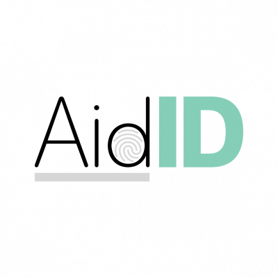

## Contents

* [1 ¿Qué es AidID?](#.C2.BFQu.C3.A9_es_AidID.3F)
  + [1.1 Ejemplo de uso](#Ejemplo_de_uso)
* [2 Arquitectura](#Arquitectura)
* [3 Tecnologías desarrolladas](#Tecnolog.C3.ADas_desarrolladas)
  + [3.1 AidID - HTTP API](#AidID_-_HTTP_API)
  + [3.2 AidUI - HTTP web application](#AidUI_-_HTTP_web_application)
  + [3.3 AidAM - Account Manager](#AidAM_-_Account_Manager)
  + [3.4 AidDD - Fingerprint deduplicator](#AidDD_-_Fingerprint_deduplicator)
  + [3.5 AidPE - Prometheus metrics exporter](#AidPE_-_Prometheus_metrics_exporter)
  + [3.6 AidHW - Biometric identifier reader](#AidHW_-_Biometric_identifier_reader)
* [4 Coste operacional](#Coste_operacional)
  + [4.1 Coste de infraestructura](#Coste_de_infraestructura)
  + [4.2 Coste de mantenimiento](#Coste_de_mantenimiento)
* [5 Resultados](#Resultados)

# ¿Qué es AidID?[[edit](/pti/index.php?title=Categor%C3%ADa:AidID&veaction=edit&section=1 "Edit section: ¿Qué es AidID?") | [edit source](/pti/index.php?title=Categor%C3%ADa:AidID&action=edit&section=1 "Edit section: ¿Qué es AidID?")]

Es un sistema que enlaza la información médica básica de un usuario con uno o más identificadores biométricos suyos. Hemos implementado la identificación biométrica mediante huella dactilar.

Se accede a AidID mediante una plataforma web para facilitar el acceso ya sea desde un ordenador portátil, una tablet o un móvil. Desde el equipo de AidID siempre hemos pensado en la casuística de la ambulancia, por lo tanto debe ser lo suficientemente accesible para que desde una puedas conectarte y recibir los datos médicos.

AidID en su esencia es un sistema accesible, seguro y a prueba de fallos donde alojar sus datos médicos, para que en caso de emergencia el personal sanitario cualificado pueda recibirlos a la mayor celeridad.

### Ejemplo de uso[[edit](/pti/index.php?title=Categor%C3%ADa:AidID&veaction=edit&section=2 "Edit section: Ejemplo de uso") | [edit source](/pti/index.php?title=Categor%C3%ADa:AidID&action=edit&section=2 "Edit section: Ejemplo de uso")]

A una víctima de un asalto se le priva de su cartera y de cualquier otro método de identificación. El equipo médico la recoge pero no la puede identificar. Debido a esto, los operadores de la ambulancia desconocen ciertos datos médicos de vital importancia durante los primeros minutos, hasta que a ésta se la identifica en el hospital (grupo sanguíneo, alergias, medicación crónica...). Aquí es donde entra AidID para proporcionar los datos de manera rápida y sencilla; lo único que tiene que hacer el equipo sanitario es escanear la huella de la víctima y, si ésta tiene sus datos en nuestra aplicación, automáticamente se les proporciona a los sanitarios. De esta manera se consigue una atención totalmente dedicada y eficaz.

# Arquitectura[[edit](/pti/index.php?title=Categor%C3%ADa:AidID&veaction=edit&section=3 "Edit section: Arquitectura") | [edit source](/pti/index.php?title=Categor%C3%ADa:AidID&action=edit&section=3 "Edit section: Arquitectura")]

La arquitectura está dividida en microservicios.

El motivo por el cual es así, es con la finalidad de facilitar dos cosas: el desarrollo, ya que este pasa a ser más sencillo porque los encargados de un microservicio no afectan al resto; y la operación, ya que podemos escalar selectivamente aquellos microservicios más sobrecargados sin desperdiciar recursos en otros con menos carga.

Esto presenta una serie de retos, como que debemos autenticar y encriptar el tráfico entre microservicios para garantizar los requisitos de seguridad.

La siguiente imagen es el diagrama de nuestro proyecto en AWS:

# Tecnologías desarrolladas[[edit](/pti/index.php?title=Categor%C3%ADa:AidID&veaction=edit&section=4 "Edit section: Tecnologías desarrolladas") | [edit source](/pti/index.php?title=Categor%C3%ADa:AidID&action=edit&section=4 "Edit section: Tecnologías desarrolladas")]

## AidID - HTTP API[[edit](/pti/index.php?title=Categor%C3%ADa:AidID&veaction=edit&section=5 "Edit section: AidID - HTTP API") | [edit source](/pti/index.php?title=Categor%C3%ADa:AidID&action=edit&section=5 "Edit section: AidID - HTTP API")]

AidID es la API principal de acceso a AidID. Se trata de una API RESTful que normalmente se utiliza mediante AidUI, que es la interfaz web. Implementa una interfaz REST a la base de datos y al resto de microservicios.

Todas las acciones que nuestros usuarios (del tipo que sean) realizan sobre AidID, pasan por esta API, directa o indirectamente. Para usos que requieren un cierto nivel de estado (lo cual va en contra del principio stateless de REST), las llamadas a la API se hacen desde AidUI, y es AidUI el que se encarga de gestionar dicho estado. Es por este motivo que algunas de llamadas a AidID se hacen de forma indirecta. El resto de llamadas a AidID se hacen directamente desde el navegador del usuario.

Está escrita en Python y utiliza, entre otros el módulo de Flask para ofrecer una interfaz HTTP con enrutado RESTful.

## AidUI - HTTP web application[[edit](/pti/index.php?title=Categor%C3%ADa:AidID&veaction=edit&section=6 "Edit section: AidUI - HTTP web application") | [edit source](/pti/index.php?title=Categor%C3%ADa:AidID&action=edit&section=6 "Edit section: AidUI - HTTP web application")]

AidUI es la interfaz web de nuestro proyecto. Su función es permitir a los usuarios interactuar con el sistema de una manera sencilla e intuitiva.

## AidAM - Account Manager[[edit](/pti/index.php?title=Categor%C3%ADa:AidID&veaction=edit&section=7 "Edit section: AidAM - Account Manager") | [edit source](/pti/index.php?title=Categor%C3%ADa:AidID&action=edit&section=7 "Edit section: AidAM - Account Manager")]

La tarea del Account Manager es, cuando un usuario quiere eliminar su cuenta, borrar toda traza de su paso por AidID, garantizando así la protección de sus datos.

Con el fin de establecer la comunicación entre AidID y AidAM usamos una cola en AWS Simple Queue Service. En este caso AidID envía un mensaje que contiene la cuenta a eliminar, y los consumidores (instancias de AidAM que se encargan de consumir mensajes de dicha cola) lo leen y eliminan la cuenta inmediatamente, así como sus datos asociados.

AidAM también hace uso de AWS Simple Email Service, un servicio que nos permite utilizar un servidor SMTP preconfigurado para enviar correos a nuestros usuarios. Cabe destacar que por defecto una cuenta de AWS no tiene permiso para enviar correos electrónicos a usuarios de cualquier dominio, es necesario levantar un caso con AWS Support y solicitar salir del SES sandbox, para enviar mensajes a otros dominios (como gmail.com o outlook.com).

Actualmente el rol de AidAM se limita a eliminar las cuentas de cualquier tipo de usuario. De cara a futuras versiones de AidAM se le otorgaría el control total de la gestión de cambios en las cuentas de usuario, de cualquier tipo, para así centralizar la gestión de cuentas en un solo punto y hacer más sencilla la gestión de esa parte de la API.

## AidDD - Fingerprint deduplicator[[edit](/pti/index.php?title=Categor%C3%ADa:AidID&veaction=edit&section=8 "Edit section: AidDD - Fingerprint deduplicator") | [edit source](/pti/index.php?title=Categor%C3%ADa:AidID&action=edit&section=8 "Edit section: AidDD - Fingerprint deduplicator")]

AidDD, el DeDuplicator, es uno de los microservicios más importantes ya que garantiza la seguridad del uso de nuestra aplicación.

La función principal de este, es actuar cuando se agrega un nuevo identificador biométrico, se asegura de que no existe ningún identificador similar, evitando así una lectura equivocada de datos de vital importancia, ya que en nuestro caso de uso, un error de integridad en los datos médicos de un paciente (grupo sanguíneo erróneo o una lista de alergias equívoca) podría causar graves complicaciones en un paciente que ya se encuentra en un estado grave.

Funciona de tal manera que, la carga de trabajo la introduce AidID, en el momento que se crea un nuevo identificador, a una cola en AWS SQS, y por otro lado los consumidores de AidDD se encargan de desduplicarlo. En el caso de que el identificador se detecte como duplicado, se elimina inmediatamente de Cassandra y se notifica al propietario mediante un correo (con AWS SES) informándole de que se ha eliminado su identificador y el motivo del suceso.

## AidPE - Prometheus metrics exporter[[edit](/pti/index.php?title=Categor%C3%ADa:AidID&veaction=edit&section=9 "Edit section: AidPE - Prometheus metrics exporter") | [edit source](/pti/index.php?title=Categor%C3%ADa:AidID&action=edit&section=9 "Edit section: AidPE - Prometheus metrics exporter")]

Aid Prometheus Exporter (AidPE), se encarga de mostrar las métricas distribuidas de los diversos microservicios.

En el stack de Prometheus, es éste quien se encarga de ir a los endpoints de métricas de los microservicios a preguntar el estado actual de éstos. Sin embargo, en nuestro caso, todos los microservicios son escalables y, por lo general, tenemos más de una instancia de un mismo microservicio simultáneamente, por una cuestión de redundancia. Esto implica que debemos agregar las métricas de todas las réplicas de algún modo y leerlas desde ese centro agregado. De eso se encargan Redis y AidPE.

Las distintas réplicas de los microservicios guardan sus métricas distribuidas en Redis, y AidPE se encarga de traducir el formato de métricas en Redis al formato de Prometheus.

Por ejemplo, si tenemos una métrica de “número de huellas desduplicadas”, pero tenemos más de una réplica de AidDD, si Prometheus va a una réplica, es posible que encuentre una fracción del total de huellas desduplicadas. Sin embargo, si ese número se guarda en Redis, y todas las réplicas incrementan ese número en Redis, cuando posteriormente Prometheus lea esa métrica con AidPE, verá el total de huellas desduplicadas por todas las réplicas.

## AidHW - Biometric identifier reader[[edit](/pti/index.php?title=Categor%C3%ADa:AidID&veaction=edit&section=10 "Edit section: AidHW - Biometric identifier reader") | [edit source](/pti/index.php?title=Categor%C3%ADa:AidID&action=edit&section=10 "Edit section: AidHW - Biometric identifier reader")]

AidHW se encarga de leer la huella dactilar mediante un lector de huellas digitales, con dicha huella crea un imagen .bmp y la guarda en un carpeta donde hay un servicio FTP funcionando que se ofrece al exterior.

La realidad de AidHW es que falta configurar el detector de huellas para que lo detecte, ya que no hemos podido acceder a dicho lector debido a la situación particular de confinamiento. Está programado para que mediante la librería PyFingerPrint lea de una entrada USB la huella dactilar y la guarde en un archivo .bmp.

Todo esto se ejecuta en una Raspberry Pi, en concreto una 3 Model B, con SenseHat, un hardware añadido que contiene, entre otros, un joystick que sirve para darle órdenes para leer la huella. Además dicha Raspberry Pi se le ha configurado un servicio de FTP, con necesidad de login y password, para poder acceder desde cualquier ordenador, smartphone o tablet, etc.

# Coste operacional[[edit](/pti/index.php?title=Categor%C3%ADa:AidID&veaction=edit&section=11 "Edit section: Coste operacional") | [edit source](/pti/index.php?title=Categor%C3%ADa:AidID&action=edit&section=11 "Edit section: Coste operacional")]

El coste de operaciones se resume al coste de la infraestructura y el coste de mantenerla.

## Coste de infraestructura[[edit](/pti/index.php?title=Categor%C3%ADa:AidID&veaction=edit&section=12 "Edit section: Coste de infraestructura") | [edit source](/pti/index.php?title=Categor%C3%ADa:AidID&action=edit&section=12 "Edit section: Coste de infraestructura")]

La infraestructura se encuentra toda alojada en Amazon Web Services.

Pese a ser un poco complejo calcular el coste total de operación en AWS, es notablemente más sencillo que si hacemos el cálculo para un centro de datos on-premises, con costes de amortización y otras complicaciones.

En el caso de AidID, el coste de infraestructura base, dados los recursos que se solicitan a Amazon y en la región de Frankfurt, sería de 5256.00$ anuales, asumiendo un caso sin usuarios.

Si el número de usuarios incrementa, la carga sobre la infraestructura provisionada incrementa, y si ésta lo hace por encima de la carga ofrecida por la infraestructura base, ésta escalará automáticamente para satisfacer la demanda, incrementando el coste.

Tampoco se cuenta el coste de almacenamiento de datos en Cassandra. Aproximando unos 3KiB por usuario (2 identificadores biométricos y 1KiB extra para el resto de datos que almacenamos acerca de éste), el coste del almacenamiento de Cassandra sería de 1$ por cada millón de usuarios.

El coste principal es el de las instancias EC2 de cómputo para los clusters de Kubernetes y Docker Swarm, que requieren un mínimo de 4GB de memoria para operar sin problemas.

Otros costes a tener en cuenta son los de AWS SQS y SES, éstos crecen naturalmente con la demanda, y su coste es mínimo. Además el uso que le da la aplicación es de aproximadamente unos 3 mensajes en SES y otros 3 en SQS por usuario, en cuyo caso el coste por usuario sería una fracción de céntimo negligible.

## Coste de mantenimiento[[edit](/pti/index.php?title=Categor%C3%ADa:AidID&veaction=edit&section=13 "Edit section: Coste de mantenimiento") | [edit source](/pti/index.php?title=Categor%C3%ADa:AidID&action=edit&section=13 "Edit section: Coste de mantenimiento")]

La infraestructura está orquestada de tal manera que es autogestionable, es decir, no es necesario que un operador esté constantemente mejorándola y arreglándola para que no deje de funcionar.

Esto se debe en parte al uso de Kubernetes y su naturaleza, y al nivel de automatización que permite AWS en todos sus servicios.

Ello permite que con un único operador en plantilla (y probablemente a tiempo parcial) se pueda gestionar la infraestructura de AidID sin problema, independientemente de que el número de usuarios sea diez o diez millones.

El sueldo bruto de dicho operador lo dejamos en el aire, depende de muchos factores y es difícil de estimar. Dicho esto, requeriría que el operador esté familiarizado con entornos de Kubernetes, Docker y Cassandra, así como herramientas de operación como Ansible y Terraform. El nivel de cualificación del operador no sería el mínimo.

# Resultados[[edit](/pti/index.php?title=Categor%C3%ADa:AidID&veaction=edit&section=14 "Edit section: Resultados") | [edit source](/pti/index.php?title=Categor%C3%ADa:AidID&action=edit&section=14 "Edit section: Resultados")]

El resultado final de este proyecto ha sido realizar una idea innovadora y que dicha solución se adapte a un problema real, al alcance de todo el mundo. Concretamente porque no se necesita nada especial, simplemente un identificador biométrico.

En nuestro proyecto AidID nos encargamos de enlazar los datos médicos de cada persona con su huella dactilar con la finalidad de que si alguien se encuentra en una situación grave a causa de un accidente o un hecho similar, podemos dotar al personal sanitario con toda la información necesaria para que pueda ayudar a la víctima de la forma más instantánea y precisa posible, facilitando así el tratamiento del paciente.

Somos conscientes de que crear un proyecto basado en ayudar a salvar vidas requiere una alta disponibilidad. Es por eso que hemos escogido una base de datos especializada en este requerimiento y así, que esté en sintonía con la infraestructura. Respecto ésta, nos hemos centrado mucho en dotarla con sistemas de seguridad para que nunca falle e incluso en el caso de que ésta fallara, tener un plan de contingencia eficaz.

Si AidID se pusiera en marcha de forma real, tenemos presente que la cantidad de usuarios y solicitudes seria muy alto, ya que está enfocado a nivel estatal. Teniendo en cuenta esta realidad, AidID es completamente capaz de escalar y soportar dicha demanda.

Hemos diseñado un plan de instalación sencillo en nuestro proyecto para que cualquier país que decida utilizar AidID pueda desplegarlo sin problema. Simplemente debería seguir la sección de despliegue de esta memoria.

Todas estas funcionalidades se muestran mediante la web. El hecho de la decisión de escoger una web en lugar de una aplicación viene dada por la exigencia de compatibilidad con cualquier sistema operativo. Esta tiene diversos apartados según el rol del usuario que la use. Hemos diseñado la web de tal manera que la usabilidad no sea compleja y informando al usuario en todo momento en caso de fallo.

Estamos muy satisfechos de los resultados obtenidos, ya que hemos creado un proyecto que supera las expectativas iniciales y hemos aprendido mucho realizándolo, que era el objetivo principal.