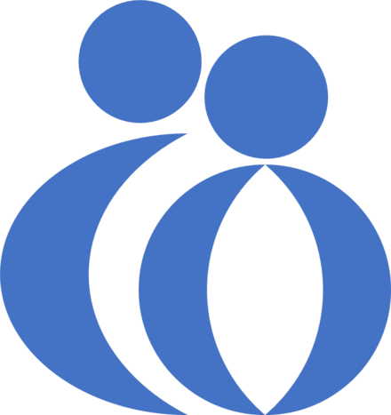
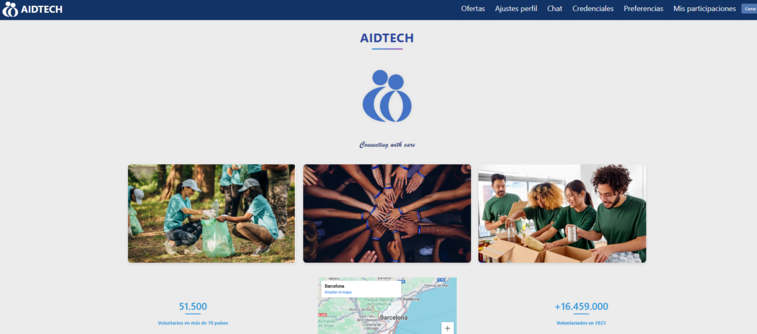

Logo

HomePage

# Introducción[[edit](/pti/index.php?title=Categor%C3%ADa:AidTech&veaction=edit&section=1 "Edit section: Introducción") | [edit source](/pti/index.php?title=Categor%C3%ADa:AidTech&action=edit&section=1 "Edit section: Introducción")]

Para nuestro proyecto de la asignatura de Proyecto de Tecnologías de la Información, decidimos desarrollar una aplicación web para conectar voluntarios con diferentes oportunidades de voluntariado.

## ¿Qué es AIDTECH?[[edit](/pti/index.php?title=Categor%C3%ADa:AidTech&veaction=edit&section=2 "Edit section: ¿Qué es AIDTECH?") | [edit source](/pti/index.php?title=Categor%C3%ADa:AidTech&action=edit&section=2 "Edit section: ¿Qué es AIDTECH?")]

Aidtech es una aplicación que permite a los usuarios aplicar a ofertas creadas por empresas participantes, los usuarios pueden customizar sus preferencias para mostrar aquellas en las que estén mas interesados y ver la ubicación de las ofertas en un mapa interactivo. Además, se integra un modelo de LLM para la asistencia de los usuarios y existe implementado un sistema de mensajes global para promover la comunicación entre los voluntarios y las entidades. Se dispone de un sistema de credenciales verificables para validar las certificaciones de los usuarios como cursos que hayan realizado y un sistema de CI/CD que actualiza los cambios de desarrollo hechos en la aplicación automáticamente.

# Infraestructura[[edit](/pti/index.php?title=Categor%C3%ADa:AidTech&veaction=edit&section=3 "Edit section: Infraestructura") | [edit source](/pti/index.php?title=Categor%C3%ADa:AidTech&action=edit&section=3 "Edit section: Infraestructura")]

La aplicación se encontraba hosteada en las Máquinas Virtuales de openNebula disponibles para el proyecto. Debido al sistema de CI/CD, los contenedores docker de la aplicación se encontraban dentro de una instancia de minikube, que utilizábamos para actualizar el contenido de la página con cambios en nuestro repositorio, se explica en más detalle en el apartado de implementación de CI/CD. Los tres contenedores son el frontend, y las apis de Backend y BD. Originalmente, queríamos que la BD funcionase localmente y se situase separada en su propia máquina virtual, pero finalmente por simplicidad la BD accede a una instancia de MongoDB Atlas en la nube.

Las máquinas virtuales equipadas con NAT se podían acceder desde internet, desde el link http://nattech.fib.upc.edu:40470/. El puerto 40470 se traduce al puerto 8080 de la VM, y mediante un proxy de nginx redirigimos el tráfico al puerto 30007 del cluster de kubernetes, para acceder a la página interna.

Arquitectura de la Aplicación

Externamente, en un ordenador actuando como servidor, hosteamos el chabot. Haciendo port forwarding por el router propio, para que se pueda resolver la petición del embed, mediante la dirección http://83.50.44.112:3001/api/embed, que contiene la IP del router y el puerto de AnythingLLM. Cada vez que la dirección pública se modifica por el ISP, hace falta cambiar el contenido del embed.