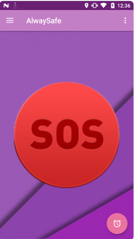
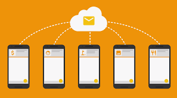

## Contents

* [1 Introducción](#Introducci.C3.B3n)
  + [1.1 ¿Como funciona?](#.C2.BFComo_funciona.3F)
* [2 Front-end](#Front-end)
* [3 Back-end](#Back-end)

# Introducción[[edit](/pti/index.php?title=Categor%C3%ADa:AlwaysSafe&veaction=edit&section=1 "Edit section: Introducción") | [edit source](/pti/index.php?title=Categor%C3%ADa:AlwaysSafe&action=edit&section=1 "Edit section: Introducción")]

AlwaySafe es una aplicación Android. Nuestro objetivo es crear una aplicación que sirva a la gente que está en peligro para encontrar ayuda rápida y para que la gente sepa que estas en peligro y la posición exacta.

## ¿Como funciona?[[edit](/pti/index.php?title=Categor%C3%ADa:AlwaysSafe&veaction=edit&section=2 "Edit section: ¿Como funciona?") | [edit source](/pti/index.php?title=Categor%C3%ADa:AlwaysSafe&action=edit&section=2 "Edit section: ¿Como funciona?")]

Cuando te encuentras en una situación de peligro sólo tienes que darle al botón que ves justo al encender la aplicación. Luego de pulsar el botón se envía una notificación a las personas cercanas. Esas personas pueden acceder a un mapa para ver donde te encuentras.
Además de esta funcionalidad también tiene un mapa dónde puedes ver todas las localizaciones dónde se ha pulsado el botón junto con el día y la hora. También tiene una alarma para programar un aviso a una hora determinada, si antes de esa hora no la desactivas, llegará un email a las persones que escogiste anteriormente además de una notificación a las personas cercanas de la última localización detectada.

# Front-end[[edit](/pti/index.php?title=Categor%C3%ADa:AlwaysSafe&veaction=edit&section=3 "Edit section: Front-end") | [edit source](/pti/index.php?title=Categor%C3%ADa:AlwaysSafe&action=edit&section=3 "Edit section: Front-end")]

Nuestro front-end se basa en una aplicación android con unas interfaces extremadamente sencillas, con el fin de que independientemente de tu vinculación con el mundo de la informática seas capaz de usarla. Está hecho con Android Studio y además se comunica con la api de Google Maps la cual nos permite saber la ubicación de las distintas personas.

# Back-end[[edit](/pti/index.php?title=Categor%C3%ADa:AlwaysSafe&veaction=edit&section=4 "Edit section: Back-end") | [edit source](/pti/index.php?title=Categor%C3%ADa:AlwaysSafe&action=edit&section=4 "Edit section: Back-end")]

Nuestro back-end está programado utilizando Javascript y Node.js. Tenemos una base de datos con Realtime Database de Firebase y todo el back-end está situado en los servidores de Google utilizando Cloud Functions. Ademas también enviamos notificaciones push usando el Firebase Cloud Messaging.

[File:Database.png](/pti/index.php?title=Special:Upload&wpDestFile=Database.png "File:Database.png")

