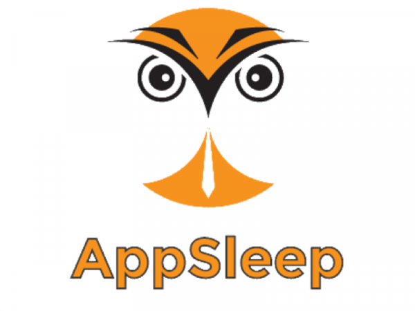
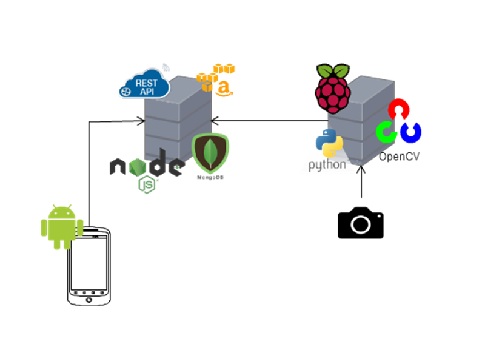
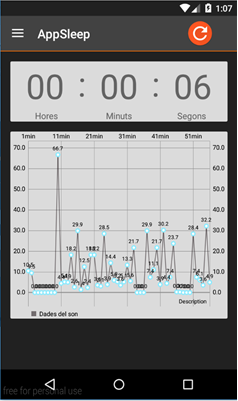
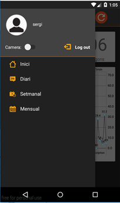
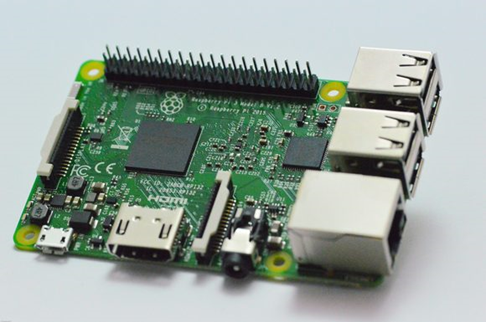
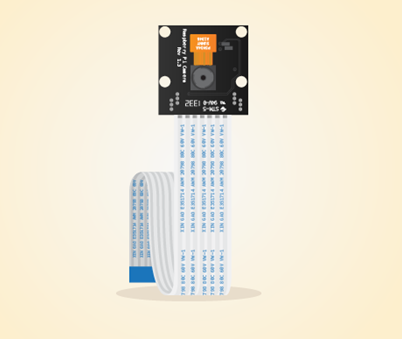

[](/pti/index.php/File:Appsleep.png)

# Projecte AppSleep[[edit](/pti/index.php?title=Categor%C3%ADa:AppSleep&veaction=edit&section=1 "Edit section: Projecte AppSleep") | [edit source](/pti/index.php?title=Categor%C3%ADa:AppSleep&action=edit&section=1 "Edit section: Projecte AppSleep")]

El projecte neix de la necessitat de monitoritzar el son i saber quantes hores dormim realment.

Dins d’un cicle de son cal destacar dos fases, les fases No REM i la fase REM.

Les fases de No REM són:

Fase 1: és la transició inical de vigília al son. Pot durar entre uns 30 segons o minuts.

Fase 2: el moment on l’activitat cerebral s’alenteix més. Dura aproximadament una hora.

Fase 3/4: és la fase del somni més profund. On el cos descansa més.

Fase REM: és quan somiem. Hi ha una desaparició del to muscular, però la resta de funcions corporals i vegetatives es tornen a activar.

Un cop detectada la fase REM, i sabent quan duren les altres etapes de mitjana, podem detectar en quina etapa és troba la persona mentre dorm. Per tant saber quant de temps ha estat la persona dormint profundament.

# Tecnologies[[edit](/pti/index.php?title=Categor%C3%ADa:AppSleep&veaction=edit&section=2 "Edit section: Tecnologies") | [edit source](/pti/index.php?title=Categor%C3%ADa:AppSleep&action=edit&section=2 "Edit section: Tecnologies")]

[](/pti/index.php/File:Estructurasleep.png)

El projecte és divideix en tres parts, la part de l'aplicació (android), la raspberry més la càmera i la part del servidor back-end.

L’esquema d’adalt mostra les connexions entre dispositius, afegint els llenguatges i llibreries utilitzats:

·Raspberry:

```
   -Bash: utilització d’scripts per automatitza el procés de gravació i detecció de moviment.
   -Python: gravació de la càmera.
   -PHP: per la configuració de les peticions GET/POST amb el servidor.
   -Llibreria OpenCV: encarregat de la detecció i anàlisi del moviment.

```

·Servidor Back-end:

```
   -Node.js: encarregat de gestionar les peticions dels clients i gestionar la base de dades.
   -MongoDB: base de dades externa als dispositiu.

```

·Android:

```
   -Java: llenguatge base.
   -XML: permet dissenyar les vistes de les aplicacions. 
   -En general, intervé en la creació de la interfície d’usuari.

```

# Screenshot[[edit](/pti/index.php?title=Categor%C3%ADa:AppSleep&veaction=edit&section=3 "Edit section: Screenshot") | [edit source](/pti/index.php?title=Categor%C3%ADa:AppSleep&action=edit&section=3 "Edit section: Screenshot")]

**APLICACIÓ ANDROID**

[](/pti/index.php/File:Screenshot1.png)

[](/pti/index.php/File:Screenshot2.png)

**HARDWARE**

[](/pti/index.php/File:Screenshot3.png)

[](/pti/index.php/File:Screenshot4.png)