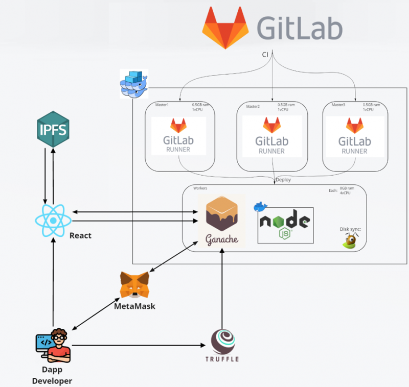

## Contents

* [1 Introducción](#Introducci.C3.B3n)
  + [1.1 Contexto del proyecto](#Contexto_del_proyecto)
  + [1.2 Punto de partida y aportación del Proyecto](#Punto_de_partida_y_aportaci.C3.B3n_del_Proyecto)
  + [1.3 Objetivos](#Objetivos)
  + [1.4 Resultados](#Resultados)
* [2 Infraestructura](#Infraestructura)
* [3 Tecnologías](#Tecnolog.C3.ADas)
  + [3.1 React](#React)
  + [3.2 Web3.js](#Web3.js)
  + [3.3 Truffle](#Truffle)
  + [3.4 Ganache](#Ganache)
  + [3.5 Metamask](#Metamask)
  + [3.6 IPFS](#IPFS)
  + [3.7 Node.js](#Node.js)
  + [3.8 Docker](#Docker)
  + [3.9 GitLab](#GitLab)
* [4 Futuro del proyecto](#Futuro_del_proyecto)
* [5 Repositorio](#Repositorio)

# Introducción[[edit](/pti/index.php?title=Categor%C3%ADa:Arte_sobre_blockchain&veaction=edit&section=1 "Edit section: Introducción") | [edit source](/pti/index.php?title=Categor%C3%ADa:Arte_sobre_blockchain&action=edit&section=1 "Edit section: Introducción")]

Hemos desarollado un museo online donde las obras de arte se convierten en NFT's gracias a un Smart Contract. El otro pilar de este proyecto ha sido crear una infraestructura para desarrollar apliaciones descentralizadas.

## Contexto del proyecto[[edit](/pti/index.php?title=Categor%C3%ADa:Arte_sobre_blockchain&veaction=edit&section=2 "Edit section: Contexto del proyecto") | [edit source](/pti/index.php?title=Categor%C3%ADa:Arte_sobre_blockchain&action=edit&section=2 "Edit section: Contexto del proyecto")]

Actualmente estamos en medio de una pandemia donde todo el mundo se ha tenido que confinar en casa y que el ocio ha sido obligado a cerrar por culpa de la COVID, y esto ha afectado sobretodo a los artistas que no han podido exponer sus obras en galerías, que no han podido dar conciertos, que no han podido mostrar su arte al mundo.
Por este motivo la idea de publicar arte en forma de NFT ha sido toda una tendencia durante estos últimos meses. Para muchos artistas publicar su arte online ha sido la única opción y haciéndolo en forma de NFT pueden estar seguros de que reciben el dinero que les corresponde y que nadie copia su obra ni la pública en otras webs apropiándose.
Nosotros nos centramos en pintores, fotógrafos, ilustristas y cualquier otro artista que haga arte visual. Hemos visto que la tendencia en este grupo ha sido crear sus nuevas colecciones en formato NFT y venderlas en aplicaciones online como opensea.io, rarible.com o superrare.co. Todas estas aplicaciones son mercados enfocados a la compraventa, donde se presentan los NFT por separado y la información de la obra, colección y el artista no están en la primera página, ya que son webs pensadas para ser como amazon o ebay. Es por esto que hay artistas que han creado su propio portal para vender sus obras en formato NFT.

## Punto de partida y aportación del Proyecto[[edit](/pti/index.php?title=Categor%C3%ADa:Arte_sobre_blockchain&veaction=edit&section=3 "Edit section: Punto de partida y aportación del Proyecto") | [edit source](/pti/index.php?title=Categor%C3%ADa:Arte_sobre_blockchain&action=edit&section=3 "Edit section: Punto de partida y aportación del Proyecto")]

Nosotros creemos que hacer un museo online donde los artistas puedan crear y exponer sus obras, que la gente pueda verlas y disfrutarlas solucionando varios de los problemas que hemos mencionado en este documento.
Primero permite que la gente pueda ir al museo sin salir de casa, lo que significa que ni una pandemia mundial puede privar a la gente del arte y que todo el mundo puede acceder a la misma web, permitiendo que los artistas lleguen a mucha más gente, de la que los conocería exponiendo sus obras en una galería. También permite a los artistas subir sus obras en formato NFT sin necesidad de saber programar, con todas las ventajas que tiene publicar sus obras en este formato. Pero la cosa más importante con la que nos diferenciamos de esos mercados online que actualmente se están usando és que damos importancia al autor de la obra, no lo vemos únicamente como un bien con el que especular, ya que en los otros portales las obras se exponen por separado y una vez vendidas el nuevo propietario puede decidir quitarlo de ese portal.
Nuestra web siempre mostrará el trabajo del autor junto a su colección incluso después de ser vendida, y si el nuevo propietario no quiere venderlo de nuevo no tiene porque hacerlo, pero no estará privando a todo el mundo de ese arte.
La otra gran aportación de este proyecto es comprobar la importancia de la figura DevOps en el desarrollo de aplicaciones basadas en blockchain y también la utilidad de una infraestructura común donde los desarrolladores puedan trabajar todos a la vez con una tecnología de naturaleza descentralizada.

## Objetivos[[edit](/pti/index.php?title=Categor%C3%ADa:Arte_sobre_blockchain&veaction=edit&section=4 "Edit section: Objetivos") | [edit source](/pti/index.php?title=Categor%C3%ADa:Arte_sobre_blockchain&action=edit&section=4 "Edit section: Objetivos")]

Con este trabajo queriamos crear una plataforma donde cualquier artista pudiera convertir sus obras de arte en NFT, darse a conocer y poder ganar dinero por su trabajo. También hemos creado una plataforma donde todos los programadores puedan desarollar a la vez usando una tecnología de naturaleza descentraizada, lo que nos hizo poner a prueva la necessidad de la figura del DevOps en este tipo de proyectos.

## Resultados[[edit](/pti/index.php?title=Categor%C3%ADa:Arte_sobre_blockchain&veaction=edit&section=5 "Edit section: Resultados") | [edit source](/pti/index.php?title=Categor%C3%ADa:Arte_sobre_blockchain&action=edit&section=5 "Edit section: Resultados")]

Estamos muy contentos de haver cumplido con todos nuestros objetivos, habiendo comprovado de primera mano que un DevOps es igual de importante que en cualquier otro proyecto y viendo que una vez la plataforma estuvo acabada el desarrollo de la web y el Smart Contract abanzaron mucho más ràpido. Así que podemos afirmar que aunque la tecnología blockchain sea descentralizada el desarrollo de aplicaciones que la usen se sigue aprovechando enormemente de un desarollo centralizado.
Hemos investigado sobre los NFT's y hemos descubierto que tienen un gran potencial y que actualmente hay muchos proyectos en desarollo que podrían cambiar nuestra sociedad.

# Infraestructura[[edit](/pti/index.php?title=Categor%C3%ADa:Arte_sobre_blockchain&veaction=edit&section=6 "Edit section: Infraestructura") | [edit source](/pti/index.php?title=Categor%C3%ADa:Arte_sobre_blockchain&action=edit&section=6 "Edit section: Infraestructura")]

En este esquema se puede ver como las diferentes tecnologías que hemos usado se comunican para funcionar correctamente.

Estructura del proyecto.

El desarrollador compila el smart contract usando truffle y lo migra a la blockchain de Ganache.
Gracias a metamask el usuario de la aplicación puede conectarse con la blockchain mediante Web3 y también le permite confirmar sus transacciones.
El usuario interactúa con la web hecha en react que sube el contenido multimedia a ipfs, recibe el hash que lo identifica, y lo guarda en Ganache al crear un NFT. A la vez que la web carga y muestra los NFT que hay guardados en la blockchain.
Gracias a Gitlab podemos guardar nuestro código de manera fácil y cómoda. Además usando sus gitlab-runners podemos desplegar el código en cualquier plataforma, en nuestro caso, una de Docker Swarm.
Docker Swarm nos permite mantener nuestros servicios dockerizados en diferentes máquinas manteniendo un estado de HA constante, ya que si un servidor o servicio se muere, se levanta automáticamente en otra maquina. A causa de esta última posibilidad usamos GlusterFS para tener pequeñas porciones de disco sincronizadas, manteniendo el estado de los datos en toda la plataforma

# Tecnologías[[edit](/pti/index.php?title=Categor%C3%ADa:Arte_sobre_blockchain&veaction=edit&section=7 "Edit section: Tecnologías") | [edit source](/pti/index.php?title=Categor%C3%ADa:Arte_sobre_blockchain&action=edit&section=7 "Edit section: Tecnologías")]

## React[[edit](/pti/index.php?title=Categor%C3%ADa:Arte_sobre_blockchain&veaction=edit&section=8 "Edit section: React") | [edit source](/pti/index.php?title=Categor%C3%ADa:Arte_sobre_blockchain&action=edit&section=8 "Edit section: React")]

Es una biblioteca Javascript de código abierto diseñada para crear interfaces de usuario con el objetivo de facilitar el desarrollo de aplicaciones en una sola página. Nos ha servido para crear nuestra página web. Hemos decidido usar esta librería por la facilidad que ofrece al usar la API javascript de web3.

## Web3.js[[edit](/pti/index.php?title=Categor%C3%ADa:Arte_sobre_blockchain&veaction=edit&section=9 "Edit section: Web3.js") | [edit source](/pti/index.php?title=Categor%C3%ADa:Arte_sobre_blockchain&action=edit&section=9 "Edit section: Web3.js")]

Es una API que le permite interactuar con un nodo ethereum local o remoto, necesaria para conectarse al smart contract.

## Truffle[[edit](/pti/index.php?title=Categor%C3%ADa:Arte_sobre_blockchain&veaction=edit&section=10 "Edit section: Truffle") | [edit source](/pti/index.php?title=Categor%C3%ADa:Arte_sobre_blockchain&action=edit&section=10 "Edit section: Truffle")]

Truffle es un conjunto de herramientas que permite a los desarrolladores crear aplicaciones sostenibles y profesionales en cualquier blockchain utilizando la Máquina Virtual Ethereum (EVM). EVM es el entorno que permite a los desarrolladores crear contratos inteligentes y aplicaciones inteligentes que la Blockchain de Ethereum puede entender.

## Ganache[[edit](/pti/index.php?title=Categor%C3%ADa:Arte_sobre_blockchain&veaction=edit&section=11 "Edit section: Ganache") | [edit source](/pti/index.php?title=Categor%C3%ADa:Arte_sobre_blockchain&action=edit&section=11 "Edit section: Ganache")]

Los smarts contracts en Ethereum son programas que se ejecutan en el contexto de transacciones dentro de la blockchain de Ethereum. Hacer dichas acciones en la red real, supone un coste económico elevado. Para ello, existe Ethereum Ganache, que forma parte de Truffle. Ganache permite recrear la blockchain en un entorno local para testear los smarts contracts, esto permite evitar los costes económicos de trabajar en la blockchain real, y permite un desarrollo seguro de los contratos.

## Metamask[[edit](/pti/index.php?title=Categor%C3%ADa:Arte_sobre_blockchain&veaction=edit&section=12 "Edit section: Metamask") | [edit source](/pti/index.php?title=Categor%C3%ADa:Arte_sobre_blockchain&action=edit&section=12 "Edit section: Metamask")]

Esta API permite que los sitios web soliciten las cuentas de Ethereum de los usuarios, lean datos de las blockchains a las que el usuario está conectado y permitir que el usuario firme mensajes y transacciones.
Tiene una extensión para navegadores que convierte el navegador web2.0 del usuario en un navegador web3.0 (le da la capacidad de interactuar con una blockchain).
También es una librería javascript que se integra junto a la librería Web3.js.

## IPFS[[edit](/pti/index.php?title=Categor%C3%ADa:Arte_sobre_blockchain&veaction=edit&section=13 "Edit section: IPFS") | [edit source](/pti/index.php?title=Categor%C3%ADa:Arte_sobre_blockchain&action=edit&section=13 "Edit section: IPFS")]

IPFS es un sistema distribuido para almacenar y acceder a archivos, sitios web, aplicaciones y datos.

## Node.js[[edit](/pti/index.php?title=Categor%C3%ADa:Arte_sobre_blockchain&veaction=edit&section=14 "Edit section: Node.js") | [edit source](/pti/index.php?title=Categor%C3%ADa:Arte_sobre_blockchain&action=edit&section=14 "Edit section: Node.js")]

Node.js es un entorno de ejecución de JavaScript back-end, multiplataforma y de código abierto que se ejecuta en el motor V8 y ejecuta código JavaScript fuera de un navegador web.

## Docker[[edit](/pti/index.php?title=Categor%C3%ADa:Arte_sobre_blockchain&veaction=edit&section=15 "Edit section: Docker") | [edit source](/pti/index.php?title=Categor%C3%ADa:Arte_sobre_blockchain&action=edit&section=15 "Edit section: Docker")]

Docker es un proyecto de código abierto capaz de automatizar el despliegue de aplicaciones dentro de contenedores de software, lo que nos proporciona una capa adicional de abstracción y automatización en el nivel de virtualización del sistema operativo.

## GitLab[[edit](/pti/index.php?title=Categor%C3%ADa:Arte_sobre_blockchain&veaction=edit&section=16 "Edit section: GitLab") | [edit source](/pti/index.php?title=Categor%C3%ADa:Arte_sobre_blockchain&action=edit&section=16 "Edit section: GitLab")]

Gitlab es un repositorio de código que además permite gestión de pipelines de deploy y CI/CD.

# Futuro del proyecto[[edit](/pti/index.php?title=Categor%C3%ADa:Arte_sobre_blockchain&veaction=edit&section=17 "Edit section: Futuro del proyecto") | [edit source](/pti/index.php?title=Categor%C3%ADa:Arte_sobre_blockchain&action=edit&section=17 "Edit section: Futuro del proyecto")]

Este proyecto no ha alcanzado su máximo nivel de desarollo, si hubiera más tiempo para trabajar en él, nos gustaría crear una nueva base de datos para mejorar la experiència de usuario, ya que el backend hecho en su totalidad en blockchain es lento. La web podría leer esta base de datos, subir los NFT al Smart Contract y crear un proceso en el servidor que vaya validando la nueva base de datos ya que esta sí sería hackeable.
Otro punto sería dockerizar la web y lanzarla desde gitlab con la plantilla de CI que ya tenemos preparada, pero no somos capaces de dockerizarla por falta de recursos en el servidor donde hemos montado la plataforma.
Una vez finalizado todo este proyecto, el último paso sería deployear el smart contract a la red de Etherum para ofrecer todas las funcionalidades que hemos desarrollado al público. Los artistas de distintas partes del mundo podrán empezar a exponer sus obras en nuestro portal, a la vez que los visitantes tendrán opción a disfrutar del arte y en algunos casos la posibilidad de comprarlo si el autor lo permite.

# Repositorio[[edit](/pti/index.php?title=Categor%C3%ADa:Arte_sobre_blockchain&veaction=edit&section=18 "Edit section: Repositorio") | [edit source](/pti/index.php?title=Categor%C3%ADa:Arte_sobre_blockchain&action=edit&section=18 "Edit section: Repositorio")]

Podeis ver el codigo del front-end + Smart Contract y todos los tests en: <https://github.com/albertcampana/PTI-NFT-Marketplace>
Si quereis más información la encontrareis en la memoria que hay en el github.