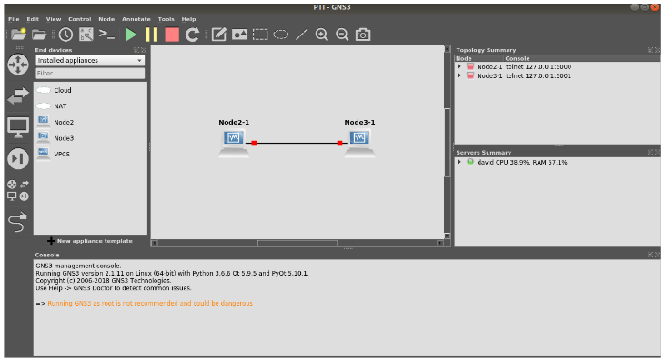
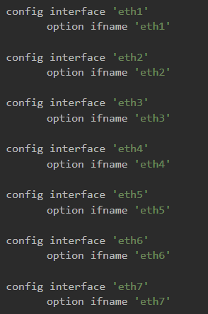
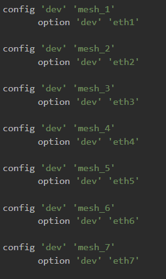

[](/pti/index.php/File:Logo_bmx7.png)

Estructura del proyecto.

## Contents

* [1 Introducció](#Introducci.C3.B3)
  + [1.1 ¿Què és BMX7?](#.C2.BFQu.C3.A8_.C3.A9s_BMX7.3F)
* [2 Tecnologies](#Tecnologies)
  + [2.1 GNS3](#GNS3)
  + [2.2 Docker](#Docker)
  + [2.3 Màquines Virtuals (Virtualbox)](#M.C3.A0quines_Virtuals_.28Virtualbox.29)
    - [2.3.1 Creació del disc dur virtual (NodeX.vdi) a partir de la imatge de OpenWRT](#Creaci.C3.B3_del_disc_dur_virtual_.28NodeX.vdi.29_a_partir_de_la_imatge_de_OpenWRT)
    - [2.3.2 Creació de la màquina a Virtualbox](#Creaci.C3.B3_de_la_m.C3.A0quina_a_Virtualbox)
    - [2.3.3 Instal·lació de packages necessaris](#Instal.C2.B7laci.C3.B3_de_packages_necessaris)
    - [2.3.4 Importació dins de GNS3](#Importaci.C3.B3_dins_de_GNS3)
    - [2.3.5 Configuració dins de GNS3](#Configuraci.C3.B3_dins_de_GNS3)
* [3 Anàlisi de dades](#An.C3.A0lisi_de_dades)
* [4 Conclusions](#Conclusions)

# Introducció[[edit](/pti/index.php?title=Categor%C3%ADa:BMX7&veaction=edit&section=1 "Edit section: Introducció") | [edit source](/pti/index.php?title=Categor%C3%ADa:BMX7&action=edit&section=1 "Edit section: Introducció")]

Històricament les zones rurals han sigut ignorades per les companyies de telecomunicacions. El poc interès per part d’aquestes companyies es deu a la poca rendibilitat que suposaria el nivell d’inversió necessari per portar connexió a internet en aquestes àrees. D’aquesta manera, la població que habita aquestes zones no disposava d’accés a internet, o l’accés era pobre i de baix rendiment. Per tal de cobrir aquesta necessitat van néixer organitzacions com Guifi.

Guifi és una organització impulsada des de la ciutadania, que com a objectiu té oferir accés a internet per a tothom, creant una xarxa oberta, lliure i neutral. En l’actualitat guifi compta amb més de 30.000 nodes actius, i es calcula que més de 50.000 persones reben servei a través de la xarxa que han impulsat.

Part de la xarxa de Guifi a Barcelona s’organitza per sectors, sent cada sector un barri de la ciutat. Alguns exemples son Sants, Sant Andreu o Vallcarca. A més, en cada barri els routers s’organitzen en xarxes mesh. Les xarxes mesh funcionen sense jerarquía i els nodes col·laboren entre ells per tal d’enrutar la informació de la forma més adient possible. Aquestes xarxes poden ser dinàmiques i la disponibilitat dels nodes que hi participen variable. Degut a la naturalesa oberta de la xarxa també pot ser que existeixin nodes malintencionats. Tots aquests factors van impulsar a la creació d’un protocol d’encaminament que pogués funcionar correctament en aquestes condicions.

## ¿Què és BMX7?[[edit](/pti/index.php?title=Categor%C3%ADa:BMX7&veaction=edit&section=2 "Edit section: ¿Què és BMX7?") | [edit source](/pti/index.php?title=Categor%C3%ADa:BMX7&action=edit&section=2 "Edit section: ¿Què és BMX7?")]

Actualment BMX6 és el protocol utilitzat per Guifi en les seves xarxes mesh, però existeix una versió actualitzada, que és BMX7. BMX7 té com a objectiu principal fer front a l’amenaça dels nodes malintencionats i proporcionar eines per a que l’administrador pugui definir preferències a l’hora de crear taules d’enrutament, així i com incloure millores de funcionament respecte BMX6.

L’objectiu d’aquest projecte consisteix en realitzar un estudi del funcionament, eficiència i rendiment del protocol BMX7.

# Tecnologies[[edit](/pti/index.php?title=Categor%C3%ADa:BMX7&veaction=edit&section=3 "Edit section: Tecnologies") | [edit source](/pti/index.php?title=Categor%C3%ADa:BMX7&action=edit&section=3 "Edit section: Tecnologies")]

## GNS3[[edit](/pti/index.php?title=Categor%C3%ADa:BMX7&veaction=edit&section=4 "Edit section: GNS3") | [edit source](/pti/index.php?title=Categor%C3%ADa:BMX7&action=edit&section=4 "Edit section: GNS3")]

En aquest projecte s’ha decidit utilitzar GNS3 com a simulador ja que té una interface bastant user-friendly i ens facilita la creació de les topologies que es vulguin estudiar. A més, té suport pels containers de Docker i les VM emprades.

[](/pti/index.php/File:Gns3.png)

## Docker[[edit](/pti/index.php?title=Categor%C3%ADa:BMX7&veaction=edit&section=5 "Edit section: Docker") | [edit source](/pti/index.php?title=Categor%C3%ADa:BMX7&action=edit&section=5 "Edit section: Docker")]

## Màquines Virtuals (Virtualbox)[[edit](/pti/index.php?title=Categor%C3%ADa:BMX7&veaction=edit&section=6 "Edit section: Màquines Virtuals (Virtualbox)") | [edit source](/pti/index.php?title=Categor%C3%ADa:BMX7&action=edit&section=6 "Edit section: Màquines Virtuals (Virtualbox)")]

Primerament es va intentar utilitzar una imatge del SO per a routers OpenWRT, el qual es té un filesystem molt semblant al d’un host Linux, modificada per nosaltres amb el package de BMX7 instal·lat.

Una vegada es tenia la imatge es va intentar importar dins del simulador com la resta de routers però no es va poder degut a que la versió soportada de OpenWRT no és la que es necessitava.
Per aquest fet i degut a que el simulador ho permet, s’ha decidit fer màquines virtuals amb Virtualbox de les imatges dels routers.

* Passos a seguir:

### Creació del disc dur virtual (NodeX.vdi) a partir de la imatge de OpenWRT[[edit](/pti/index.php?title=Categor%C3%ADa:BMX7&veaction=edit&section=7 "Edit section: Creació del disc dur virtual (NodeX.vdi) a partir de la imatge de OpenWRT") | [edit source](/pti/index.php?title=Categor%C3%ADa:BMX7&action=edit&section=7 "Edit section: Creació del disc dur virtual (NodeX.vdi) a partir de la imatge de OpenWRT")]

Aquesta tasca s’ha fet desde un Windows a partir de la imatge nativa de OpenWRT “openwrt-x86-generic-combined-ext4.img”. En concret amb la següent eina que ofereix virtualbox on NodeX és el nom del disc dur virtual que es vulgui tenir.

* "C:\Program Files\oracle\VirtualBox\VBoxManage" convertdd openwrt-x86-generic-combined-ext4.img NodeX.vdi

### Creació de la màquina a Virtualbox[[edit](/pti/index.php?title=Categor%C3%ADa:BMX7&veaction=edit&section=8 "Edit section: Creació de la màquina a Virtualbox") | [edit source](/pti/index.php?title=Categor%C3%ADa:BMX7&action=edit&section=8 "Edit section: Creació de la màquina a Virtualbox")]

S’ha de posar el nom que li donarem a la màquina i escollir tipus i versió de sistema operatiu, en el nostre cas Other Linux ja que OpenWRT està basat en Linux.
La quantitat de memòria està limitat per la que tinguem a la màquina os es faran les simulacions. Com nosaltres disposem de 8Gb i tenim ~25 màquines s’ha decidit 128MB per màquina.
Finalment s’ha de seleccionar el disc dur virtual creat prèviament.

### Instal·lació de packages necessaris[[edit](/pti/index.php?title=Categor%C3%ADa:BMX7&veaction=edit&section=9 "Edit section: Instal·lació de packages necessaris") | [edit source](/pti/index.php?title=Categor%C3%ADa:BMX7&action=edit&section=9 "Edit section: Instal·lació de packages necessaris")]

Dins del simulador no es té accés a internet per lo tant, si es vol instal·lar els packages necessaris pels nostres experiments s’ha de fer abans d’importar les màquines. Per això, s’ha de connectar el NAT a la màquina i arrencar-la des de Virtualbox.
La configuració per defecte de la interfície on es té el NAT té una IPv4 asignada de forma estática i, per tant, no es podrà accedir a internet. El que s’ha de fer és canviar el protocol d’assignació static per dhcp al /etc/config/network. D’aquesta manera ja es pot reiniciar el servei de xarxa perquè es pugui utilitzar el gestor de packages.

* Packages a instal·lar amb la comanda "opkg install nom-package":
  + bmx7
  + bmx7-uci-config
  + luci-app-bmx7
  + iperf3 (nomès als nodes que s'utilitzaran com a clinet/server)
  + bmx6 (pels nodes on es vulgui provar bmx6)

### Importació dins de GNS3[[edit](/pti/index.php?title=Categor%C3%ADa:BMX7&veaction=edit&section=10 "Edit section: Importació dins de GNS3") | [edit source](/pti/index.php?title=Categor%C3%ADa:BMX7&action=edit&section=10 "Edit section: Importació dins de GNS3")]

Edit -> Preferences -> Virtualbox VMs -> New   
En aquest punt s’obre una llista desplegable en la qual s’actualitzen totes les màquines que tenim creades i podem seleccionar la que es vulgui importar.
L’últim pas es donar a Finish i passar a configurar-la.

### Configuració dins de GNS3[[edit](/pti/index.php?title=Categor%C3%ADa:BMX7&veaction=edit&section=11 "Edit section: Configuració dins de GNS3") | [edit source](/pti/index.php?title=Categor%C3%ADa:BMX7&action=edit&section=11 "Edit section: Configuració dins de GNS3")]

Després, s’han d’editar alguns paràmetres: a la pestanya de “General settings” ajustar la RAM si és necessari; a la pestanya de “Network” incrementar el nombre d’Adapters (targetes de xarxa) i clicar al checkbox de “Allow GNS3 to use any configured VirtualBox adapter”.
Un cop ja s’han importat totes les màquines necessàries al simulador, apareixen a la part esquerra clicant sobre la icona amb forma de Host. Per utilitzar-les, només cal arrossegar-les i posteriorment es poden unir decidint en quina interfície de cada màquina anirà a parar aquest enllaç.
Després d’haver instal·lat els packages necessaris ja es poden canviar les configuracions dels fitxers networking i bmx7 del directori /etc/config.

```
           

```

El deamon es posa en marxa al fer el boot del sistema i per tant, no s’ha de fer res per arrencar-lo però és important haver configurat bé el fitxer anterior ja que és la configuració que agafarà.
Un cop ja es té configurada la xarxa i bmx7, es va veure que els nodes es veien mitjançant el protocol però no es tenia forwarding dels paquets. Aquest fet feia que, per exemple, no es pogués fer ping entre nodes. Com aquestes proves s’estan fent en un entorn local i, per tant és segur, es va decidir prescindir de les regles de firewall aplicades als paquets IPv6 per tal de facilitar aquesta tasca. Es fa descomentant la línea resaltada més abaix del fitxer /etc/config/firewall.

# Anàlisi de dades[[edit](/pti/index.php?title=Categor%C3%ADa:BMX7&veaction=edit&section=12 "Edit section: Anàlisi de dades") | [edit source](/pti/index.php?title=Categor%C3%ADa:BMX7&action=edit&section=12 "Edit section: Anàlisi de dades")]

# Conclusions[[edit](/pti/index.php?title=Categor%C3%ADa:BMX7&veaction=edit&section=13 "Edit section: Conclusions") | [edit source](/pti/index.php?title=Categor%C3%ADa:BMX7&action=edit&section=13 "Edit section: Conclusions")]

---

Memòria del projecte: [Media:Memoria\_BMX7.pdf](/pti/index.php?title=Special:Upload&wpDestFile=Memoria_BMX7.pdf "Memoria BMX7.pdf")