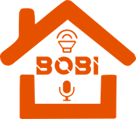
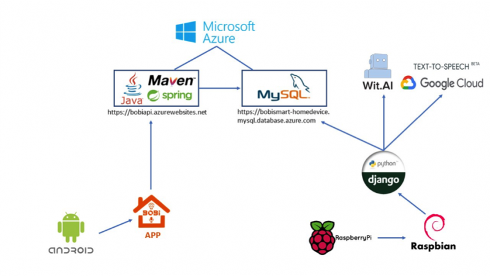

Logo de Bobi.

# ¿Qué es Bobi?[[edit](/pti/index.php?title=Categor%C3%ADa:BOBI_smart_home_device&veaction=edit&section=1 "Edit section: ¿Qué es Bobi?") | [edit source](/pti/index.php?title=Categor%C3%ADa:BOBI_smart_home_device&action=edit&section=1 "Edit section: ¿Qué es Bobi?")]

Bobi es un Smart Home Device con reconocimiento de voz y con interacción directa con el usuario.
Su función principal es recordarnos dónde hemos dejado objetos.

## ¿Cómo funciona Bobi ?[[edit](/pti/index.php?title=Categor%C3%ADa:BOBI_smart_home_device&veaction=edit&section=2 "Edit section: ¿Cómo funciona Bobi ?") | [edit source](/pti/index.php?title=Categor%C3%ADa:BOBI_smart_home_device&action=edit&section=2 "Edit section: ¿Cómo funciona Bobi ?")]

Bobi detecta comandos cuando se le habla con un formato determinado, al detectar que hemos dicho “Bobi” analizará la frase que viene a continuación.
Las funciones de Bobi vienen determinadas por una palabra clave a la que llamaremos “comando”.
Para indicar el final del comando tenemos que indicarlo de manera educada, pidiendo las cosas “por favor”.

Una vez hemos detectado una petición entera Bobi realizará una función u otra dependiendo del comando que hayamos usado:
Guardar un objeto en una localización determinada Ej. “Bobi guárdame el boli azul en el cajón superior, por favor”.
Recordar ubicación de un objeto Ej. “Bobi recuérdame dónde está el boli azul, por favor”.
Eliminar un objeto de una localización Ej. “Bobi bórrame el boli azul en el cajón superior, por favor”.

# Tecnologias[[edit](/pti/index.php?title=Categor%C3%ADa:BOBI_smart_home_device&veaction=edit&section=3 "Edit section: Tecnologias") | [edit source](/pti/index.php?title=Categor%C3%ADa:BOBI_smart_home_device&action=edit&section=3 "Edit section: Tecnologias")]

Esquema de tecnologias de Bobi.

Nuestro infraestructura consiste de distintos componentes.
En primer lugar tenemos una Raspberry que se encarga de interactuar al usuario.

La Raspberry se encarga de transformar los comandos de voz a texto usando la API de *wit.ai*, parsear el resultado y si se trata de un comando valido ejecutar dicho comando almacenando los resultados en la base de datos.

La base de datos está en un servidor de Microsoft Azure. Se trata de una base de datos de MySQL a la cual accedemos a partir de una REST API que también esta alojada en Microsoft Azure.

Para poder consultar los datos disponemos de una aplicación de android que además de poder consultar los datos nos permitirá añadir nuevos registros en la base de datos.