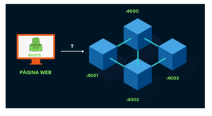
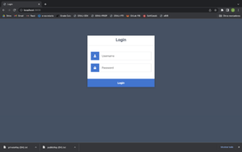

BVote - App to vote

Es un hecho que la *blockchain* ha llegado para quedarse. Nuestro objetivo con este proyecto es el de intentar acercar esta nueva tecnología a ámbitos cotidianos de la vida cuyo modo de afrontación tradicional parece inviolable. Creemos que la seguridad y el anonimato que la *blockchain* proporcionan abren todo un abanico de posibilidades en cuanto a atacar ciertos tipos de problemas desde un punto de vista tecnológico, beneficiándonos de la mejora de rendimiento que la tecnología suele traer consigo a la par que tranquilizando a todos aquellos a los que lo digital les genera cierta inquietud.

Fue así como se nos ocurrió desarrollar una aplicación de voto basada en la *blockchain*: un problema tradicional que puede ser optimizado enormemente. Nuestra aplicación busca reducir costes en logística, recursos humanos, materiales, … al mismo tiempo que ofrece un servicio rápido de recuento y tranquilidad al ciudadano en tanto en cuanto es muy difícil manipular resultados.

Cabe destacar que este proyecto siempre ha estado orientado a un ámbito educativo, como “proof of concept” por lo tanto hay puntos de la arquitectura del sistema, así como de funcionalidad de la aplicación que no únicamente pueden ser mejorados, sino que directamente no están implementados. Esto se ha ideado así desde el comienzo en el margen de nuestras posibilidades, y por lo tanto cualquier carencia en este sentido no se debe a un descuido por parte de los autores sino a una falta de relevancia en cuanto a la característica en cuestión se refiere a la hora de mostrar con claridad la finalidad del proyecto. Dicho esto, entremos a detallar Bvote.

## Contents

* [1 Abstract](#Abstract)
* [2 Descripción del proyecto](#Descripci.C3.B3n_del_proyecto)
* [3 Estructura del proyecto](#Estructura_del_proyecto)
* [4 Blockchain](#Blockchain)
* [5 Diseño de la blockchain](#Dise.C3.B1o_de_la_blockchain)
* [6 Diseño de la API blockchain](#Dise.C3.B1o_de_la_API_blockchain)
* [7 Recursos web](#Recursos_web)
* [8 Front end](#Front_end)
* [9 Back end](#Back_end)
* [10 Bases de datos](#Bases_de_datos)
* [11 Caso práctico. "LET'S VOTE!"](#Caso_pr.C3.A1ctico._.22LET.27S_VOTE.21.22)
* [12 Mejoras futuras](#Mejoras_futuras)
* [13 Conclusiones](#Conclusiones)
* [14 Bibliografia](#Bibliografia)

# Abstract[[edit](/pti/index.php?title=Categor%C3%ADa:BVOTE&veaction=edit&section=1 "Edit section: Abstract") | [edit source](/pti/index.php?title=Categor%C3%ADa:BVOTE&action=edit&section=1 "Edit section: Abstract")]

Mucho tiempo ha pasado desde la guerra de independencia de los Estados Unidos. Aquellos soldados que lucharon y murieron e inspiraron más tarde en ese mismo siglo lo que hoy día conocemos como un cambio de paradigma mundial, me refiero, claro está, a la Revolución Francesa, poco imaginaban que aquello que costó sangre, sudor y lágrimas importaría tan poco en la sociedad actual.

En recientes elecciones estamos observando una cada vez más pronunciada caída de la participación ciudadana. El interés por el panorama político mengua y es cierto que gran parte de este descenso en el entusiasmo del pueblo se debe a una larga sucesión de decepciones, pero hay otros motivos. “Si no voy a producir ningún cambio, para qué salir de casa”, se preguntan muchos. Y es aquí donde aparece Bvote, para que no tenga usted que salir de casa.

Bvote es una aplicación descentralizada de voto basada en la cadena de bloques “Blockchain” que promete una votación más cómoda, barata y, sobre todo, segura. Es este último punto en el que hemos querido hacer más énfasis entendiendo, creemos acertadamente, que es uno de los ámbitos críticos y que pueden suscitar más inquietud a la hora de aceptar este tipo de soluciones. Así pues, en Bvote hemos hecho de la seguridad un pilar central sobre el cual se sustenta la totalidad del proyecto. El anonimato de los votantes, la irrevocabilidad del voto y la no manipulación de los resultados es algo que se da por sentado en una democracia, pero que en pocas ocasiones se puede asegurar en su totalidad. Bvote puede prometer y promete que cumple al cien por cien estos principios, y a lo largo de este documento explicaremos cómo lo hace.

# Descripción del proyecto[[edit](/pti/index.php?title=Categor%C3%ADa:BVOTE&veaction=edit&section=2 "Edit section: Descripción del proyecto") | [edit source](/pti/index.php?title=Categor%C3%ADa:BVOTE&action=edit&section=2 "Edit section: Descripción del proyecto")]

Como se ha mencionado en secciones anteriores, Bvote es una aplicación de voto basada en la *blockchain*. En este apartado intentaremos explicar a rasgos generales los elementos que componen todo el sistema de Bvote y como el usuario puede introducir su voto en el sistema.

Principalmente podemos dividir Bvote en dos partes: el *frontend* y el *backend*.

En cuanto al *frontend* se refiere, disponemos de una web a través de la cual el usuario puede iniciar sesión (en base a unas credenciales que la administración habría inicializado previamente), seleccionar una de entre todas las elecciones a las que tiene acceso, generar su par de claves criptográficas (su identificación a los ojos de la *blockchain*), emitir un voto y visualizar el proceso y resultado de las elecciones.

En el *backend*, que es donde sucede la magia, tenemos nodos que corren la *blockchain* encargándose de validar transacciones (cada transacción es un voto), conformar bloques y apilarlos en la cadena. El *backend* también incluye las bases de datos (una para los usuarios y otra para cada elección en curso) y las APIs de *blockchain* y de web que permiten que todo el sistema esté intercomunicado.

# Estructura del proyecto[[edit](/pti/index.php?title=Categor%C3%ADa:BVOTE&veaction=edit&section=3 "Edit section: Estructura del proyecto") | [edit source](/pti/index.php?title=Categor%C3%ADa:BVOTE&action=edit&section=3 "Edit section: Estructura del proyecto")]

Arquitectura del proyecto - Nodos

Arquitectura del proyecto - General

La estructura del nuestro proyecto se puede dividir en 4 partes muy diferenciadas, sin las cuales BVote no sería lo mismo: arquitectura y diseño, blockchain, recursos web y bases de datos. En este apartado, lo veremos con más detalle.

Una parte muy importante de nuestro proyecto se basa en la arquitectura, y en cómo tiene que estar todo distribuido en los diferentes nodos...

El usuario interacciona con una página web, la cual se encontraría corriendo sobre un servidor. Esta se comunicaría con las diferentes bases de datos para poder verificar que las credenciales son correctas, a que elecciones puede participar, a que elecciones a votado...

Desde esta página web el usuario puede votar en las elecciones que tiene asignadas. Y es la página web la que se encarga de firmar el voto y enviárselo a la *blockchain* de forma segura. Conseguimos esta comunicación a partir de que la web conoce las diferentes direcciones de los nodos de la *blockchain*. Estas direcciones las utiliza para poder enviar de manera aleatoria el voto a uno de los nodos que está corriendo nuestro algoritmo.

Para nuestras pruebas hemos decidido usar una estructura de cuatro nodos, cada uno en un puerto de nuestro ordenador. Pero estos podrían ser fácilmente trasladados a diferentes ordenadores o servidores y que se comunicaran a través de las IP públicas.

Para que este diseño de varios nodos funcione, es necesario que estos nodos se comuniquen entre ellos. Para esto hemos hecho el */nodes/register*, que nos permite comunicar dos nodos de la *blockchain* a través de sus IP.

Una vez el votó está en la *blockchain*, se puede ver desde la página web la cadena de las diferentes transacciones de la votación. Además, también se pueden ver los resultados provisionales en ese momento de las elecciones. Esto se consigue a partir de la API de la *blockchain*, la cual nos permite extraer este tipo de información.

# Blockchain[[edit](/pti/index.php?title=Categor%C3%ADa:BVOTE&veaction=edit&section=4 "Edit section: Blockchain") | [edit source](/pti/index.php?title=Categor%C3%ADa:BVOTE&action=edit&section=4 "Edit section: Blockchain")]

Vamos a adentrarnos ahora en una explicación pormenorizada de cómo funciona la blockchain que hemos desarrollado para este proyecto.
Primeramente, es necesario entender, grosso modo, cómo funciona una blockchain. Una blockchain se compone de unidades con significado propio (bloques), enlazados entre sí gracias a un campo llamado “previous\_hash”, que hace referencia al bloque inmediatamente anterior. Estos bloques, aparte de metadatos indicando el momento en el que fueron creados, una prueba de trabajo (que ayuda a validar), su índice en la cadena… están compuestos por transacciones (el mínimo elemento con significado en una blockchain). Las transacciones indican cambios sucedidos en la cadena de bloques, lo que podría ser una transferencia de dinero en una blockchain de criptomonedas, o, en nuestro caso, un voto.

Los encargados de agrupar transacciones en bloques en una blockchain tradicional (ahora han surgido más métodos de validación) son conocidos como mineros, y se encargan de recolectar transacciones en un pool, validarlas, buscar una prueba de trabajo (algoritmo computacionalmente intensivo que asegura que no todo el mundo pueda incluir bloques en la blockchain) y finalmente retransmitir el bloque a lo largo y ancho de la red.
En nuestra blockchain particular a pequeña escala disponemos de 4 nodos que corren el algoritmo y se encargan de recibir las transacciones (votos), incluirlas en bloques e ir conformando la cadena. Los votantes son representados a través de public keys no relacionadas con su DNI en ningún punto de la arquitectura, y de la misma manera representamos a los partidos a los que se puede votar. Las funciones de las que disponemos para poder realizar todo el proceso de una elección son las siguientes:

- **initialize**: Se encarga de extraer de la base de dates el censo de votantes y los partidos a los que se puede votar.

- **getrecipient**: Devuelve la public key de un partido en base a su identificador.

- **mine**: Busca una prueba de trabajo válida y conforma un nuevo bloque.

- **register\_node**: Informa a la blockchain de la ip:puerto de uno de sus pares.

- **choose\_chain**: Elige la cadena más larga de entre todos los vecinos.

- **valid\_transaction**: Valida una transacción comprobando que el votante pueda votar, el partido exista, la firma del votante sea la correcta y no se haya repetido previamente.

- **valid\_block**: Valida un bloque comprobando que su prueba de trabajo sea válida, que no esté repetido y que las transacciones que contiene sean válidas.

- **repeated\_block**: Comprueba que un bloque no esté repetido ni en la cadena principal, ni en los huérfanos ni en los forks.

- **repeated\_transaction**: Comprueba si una transacción está repetida en el pool de transacciones.

- **valid\_chain**: Comprueba si una cadena es válida mirando que todos los bloques tengan como “previous\_hash” el hash de su antecesor y que las pruebas de trabajo sean válidas.

- **resolve\_conflicts**: Escoge como cadena principal la más larga de entre la cadena actual y todos los forks.

- **new\_block**: Crea un nuevo bloque y, si es válido lo une a la cadena principal, a la lista de huérfanos o a uno de los forks.

- **results**: Devuelve los resultados de unas elecciones.

- **spread\_block**: Retransmite un bloque a todos sus pares.

- **search\_in\_chain**: Busca el hash indicado por el campo "previous\_hash" de un bloque en la cadena indicada.

- **traverse\_orphans**: Comprueba si algún huérfano ha encontrado padre.

- **clean\_transactions**: Elimina las transacciones de un nuevo bloque del pool de transacciones si las hubiera.

- **clean\_senders**: Desautoriza a las public keys que ya han aparecido en un bloque para que no puedan votar de nuevo.

- **new\_transaction**: Añade una nueva transacción al pool de transacciones si esta no se ha repetido anteriormente y es válida. Si se alcanza el número de 10 transacciones en el pool se mina un nuevo bloque.

- **proof\_of\_work**: Busca una prueba de trabajo válida.

- **valid\_proof**: Indica si una prueba es válida. Lo es si el hash que forma unida a los metadatos de un bloque tiene 4 ceros al principio.

# Diseño de la blockchain[[edit](/pti/index.php?title=Categor%C3%ADa:BVOTE&veaction=edit&section=5 "Edit section: Diseño de la blockchain") | [edit source](/pti/index.php?title=Categor%C3%ADa:BVOTE&action=edit&section=5 "Edit section: Diseño de la blockchain")]

Como ya sabemos, nuestra blockchain corre sobre cuatro nodos conectados entre sí que pueden tratarse incluso de la misma máquina (discriminando por puerto). Cada uno de estos nodos necesita tener registrada la base de datos de la que extraer votantes y partidos, y este parámetro se le ha de indicar a cada nodo desde su propia inicialización.

Cuando llega una nueva transacción se elige aleatoriamente uno de los nodos mineros para recibirla. Cabe mencionar que, en nuestro modelo, a diferencia de otras blockchains, no se retransmite una transacción a los pares del nodo que la recibe hasta el minado del bloque. Esto nos permite dividir mejor la carga de trabajo ya que los nodos trabajan sobre bloques completamente distintos.

Para nosotros, la transacción es sinónimo de voto, y está compuesta por los siguientes elementos: “sender” (clave pública del votante que realiza la transacción), “recipient” (partido receptor del voto), “signature” (mensaje firmado con la clave privada del votante). Estos tres elementos son suficientes para identificar claramente la finalidad del voto, proporcionar anonimato al votante y eliminar la posibilidad de suplantación de identidad. La clave privada del votante nunca viaja por la red, por lo que a menos que el votante tenga su dispositivo comprometido, será imposible que un agente malicioso actúe en su nombre. Esto lo aseguramos con la firma. La completa disociación en cualquier base de datos de la clave pública de un votante para con su información personal nos permite asegurar ese anonimato que es tan importante para una democracia.

Para estructurar los bloques de manera adecuada, la blockchain cuenta con 3 elementos bien diferenciados: cadena principal (la cadena oficial que se supone cierta), lista de forks (lista de cadenas que son ramificaciones de la cadena principal y que podrían ser escogidas como principal en cualquier momento) y lista de huérfanos (lista donde guardamos todos aquellos bloques que llegan a un nodo pero que tienen un campo “previous\_hash” que indica un hash de un bloque que no encontramos en la cadena principal o en los forks). El tratamiento de ramificaciones permite evitar casos como el siguiente:

El último bloque en la cadena es de color amarillo, y dos nodos A y B empiezan a minar al mismo tiempo. Tanto el nodo A como el B producen dos bloques válidos (azul y rojo respectivamente) que indican como su bloque padre el bloque amarillo. Si el nodo C recibe primero el bloque azul y el nodo D recibe como primero el rojo, las cadenas empezarán a divergir, y es entonces cuando tendremos que esperar a que más nodos envíen bloques para poder discriminar cual es la cadena correcta. Si más nodos acaban referenciando al azul como predecesor, de forma orgánica este acabará siendo elegido como ramificación principal en todos los nodos en los que hubiera conflicto ya que se generará una cadena más larga a partir del azul.

En nuestro algoritmo se considera posible ramificación todas las cadenas divergentes que tienen como mínimo una longitud dos bloques menor a la cadena principal. Si en algún momento un fork llegara a ser más largo que la cadena principal, este pasaría a principal y la que anteriormente era considerada correcta pasará a ser considerada fork.
Finalmente, se ha de decir que cada representación de cadena, tanto la principal como las ramificaciones, mantiene actualizada una lista de “senders” que son las claves públicas de los votantes de la base de datos del censo que todavía no han votado en esa versión de la cadena.

# Diseño de la API blockchain[[edit](/pti/index.php?title=Categor%C3%ADa:BVOTE&veaction=edit&section=6 "Edit section: Diseño de la API blockchain") | [edit source](/pti/index.php?title=Categor%C3%ADa:BVOTE&action=edit&section=6 "Edit section: Diseño de la API blockchain")]

Para comunicarse con la blockchain se ofrecen los siguientes endpoints:

- /**results**: GET para obtener los resultados de unas elecciones.

- /**mine**: GET para pedir que se mine un nuevo bloque.

- /**transactions/new**: POST para enviar una nueva transacción a la blockchain.

- /**chain**: GET para obtener toda la cadena de bloques.

- /**nodes/register**: POST para indicarle a la blockchain la ip y el puerto de uno de sus pares.

- /**nodes/resolve**: GET para que se elija la cadena más larga de entre todos los nodos.

- **/nodes/list**: GET para obtener todos los pares registrados en este nodo.

- **/newblock**: POST para recibir un nuevo bloque (se llama desde la propia blockchain).

- **/validate**: GET para saber si la cadena es válida.

# Recursos web[[edit](/pti/index.php?title=Categor%C3%ADa:BVOTE&veaction=edit&section=7 "Edit section: Recursos web") | [edit source](/pti/index.php?title=Categor%C3%ADa:BVOTE&action=edit&section=7 "Edit section: Recursos web")]

En lo que a recursos web se refiere, podemos separarlo en dos grandes bloques. El primero es frontend, donde hablaremos de toda la parte visible y que el usuario puede interactuar, como la web, y el segundo bloque es backend, donde hay todas las llamadas a las bases de datos, blockchains, …

Si hablamos sobre como lo hemos implementado, todo el frontend está implementado con archivos ejs. Este lenguaje permite crear plantillas HTML dinámicas con JS, con lo cual, nos permitía un requerimiento clave, que era modificar los botones generados en HTML en función de parámetros del backend. Posteriormente, veremos más detalladamente el porqué de esta elección.
Además, para complementar el HTML que nos generaba el JS, le hemos añadido plantillas de CSS para que la web se viese más bonita.
En cuanto a backend, todo ha estado implementado en Node express. Este framework web de JS nos permitía hacer llamadas a las bases de datos, conectarnos a otras APIs, o devolver los datos a la parte web.

# Front end[[edit](/pti/index.php?title=Categor%C3%ADa:BVOTE&veaction=edit&section=8 "Edit section: Front end") | [edit source](/pti/index.php?title=Categor%C3%ADa:BVOTE&action=edit&section=8 "Edit section: Front end")]

Por lo que respecta al frontend, y tal y como hemos comentado, todos los archivos han sido implementados con ejs. Por aclarar esta elección, nosotros teníamos un requerimiento muy fuerte, este era que el usuario no pudiera ni votar ni ver las votaciones en las que él no formaba parte.

Este requerimiento necesitaba que los botones de votación de cada usuario variasen en función de sus votaciones, y si generábamos un HTML “simple” no lo podríamos lograr. Valoramos dos posibilidades, una era mediante AJAX, que nos permitía actualizar contenidos web sin necesidad de volver a cargar la página.

Y la otra opción (y la elegida) fue crear un HTML dinámico mediante lenguajes que lo soportaban. En esta opción había dos lenguajes populares, PUG o EJS. La diferencia entre ellos no era mucha a nivel tecnológico, pero sí a nivel sintáctico, ya que EJS se parece mucho más a HTML plano, de manera que nos quedamos con esta para facilitar la implementación del proyecto.

Estos archivos recibirían variables desde el backend con elecciones en las que podían votar, y el frontend se encargaría de generar los botones para que pudiesen votar solo en esas elecciones.
Aparte de este requerimiento, nos aparecía otro crítico en lo que respecta a seguridad, este era que las claves privadas no pueden viajar por la red, ya que, si alguien esnifaba por ella y conseguía robarla, podría falsificar su voto. Con lo cual era muy importante que la private key no viajara, y que esta solo se usara para firmar el voto, y una vez firmado, este sí que podía viajar por la red.

De tal manera que, para implementar la generación de llaves públicas y privadas, su recuperación cuando el usuario las inserta para votar, y la firma del voto, se ha usado la librería Subtle.Crypto.
En este panorama, donde necesitamos generar y firmar las claves públicas y privadas en client-side y necesitamos intercambiar información entre server-side y client-side, tenemos la siguiente estructura de archivos:

- login.ejs

- menú.ejs

- partidos.ejs

- results.ejs

- chain.ejs

# Back end[[edit](/pti/index.php?title=Categor%C3%ADa:BVOTE&veaction=edit&section=9 "Edit section: Back end") | [edit source](/pti/index.php?title=Categor%C3%ADa:BVOTE&action=edit&section=9 "Edit section: Back end")]

Una vez hablado de todo el frontend, ya podemos hablar del backend. Tal y como hemos mencionado anteriormente, todo el server-side ha sido programado en Express. Todos los endpoints que se han programado han sido hechos sobre un mismo documento al que le hemos llamado “login.js”. Este archivo contiene todos los diferentes endpoints que ha necesitado el frontend sobre datos que estaban contenidos a las bases de datos.
Además, la mayoría de estos endpoints se conectan con diferentes bases de datos en función de lo que se quiera conseguir, y varios de ellos se conectarán con la API de la blockchain para enviar peticiones.
Si vemos con más detalle los diferentes endpoints:
- /canIvote: Usamos este endpoint para verificar si el usuario puede votar o no. El frontend llama a esta función cuando un usuario clica a una entidad para poder votar, y valida si ya había un voto asociado a su cuenta.
Si miramos con un poco más de detalle la implementación, podemos ver que hace una consulta a la base de datos “usuaris”, al campo “hasVoted” que indica si ha votado o no. En caso de que no haya votado, se actualizará el campo consultado de la base de datos, le enviará un 200 al frontend, y se actualizará este mismo campo. En caso contrario, se le enviará un 400.

- **/partits**: Usamos este endpoint para retornar todos los partidos o entidades que hay en una votación. Para poder crear los botones dinámicos, necesitamos un endpoint que nos retorne una lista de todos los partidos que hay asociados para una votación en concreto. Esta función tiene ese objetivo, y lo hará consultando a la base de datos de la votación las entidades que se presentan. En este caso, es una consulta, con lo cual no tendremos que actualizar ningún tipo de campo en ninguna base de datos.

- **/sign**: Usamos este endpoint para votar. Desde el frontend, una vez el cliente haya firmado el voto con su clave privada, nos pasará al backend la firma, el voto y la propia clave pública. A partir de esto, nosotros nos conectaremos a cualquier puerto donde estén corriendo las blockchains y haremos una petición para inserir un nuevo voto.
Este nuevo voto esperará los mismos parámetros que se nos pasa desde el client-side, así que los inseriremos en un objeto JSON y haremos un POST hacia un puerto aleatorio. Por último, si el voto es insertado correctamente, se lo haremos saber al client-side.

- **/isGenerated:** Usamos este endpoint para consultar si al usuario que está en esa sesión, ya se le ha generado un par de claves públicas/privadas. Esta función solo hará una consulta a la base de datos “usuaris” sobre ese usuario donde buscará el campo isGenerated y mirará si tiene o no creadas sus claves. Si no se han generado, se enviará un 200 al frontend, en caso contrario le enviaremos un 400.

- **/updateDB**: Usamos este endpoint para actualizar dos campos de dos bases de datos diferentes, pero que significan que al usuario ya se le ha generado un par de claves pública/privada. Una vez se crean las claves desde client-side, se hará esta petición para enviar a la base de datos de claves públicas la que se ha generado, y actualizará la base de datos “usuaris” en el campo isGenerated, para reflejar que ya se han generado claves para este usuario en concreto. En caso de que lo haga todo correctamente, enviará un 200, en caso contrario enviará un 400.

- **/results**: Usamos este endpoint para coger los resultados de las votaciones en curso y pasárselo al client-side. Cuando el usuario quiera acceder a los resultados, y clique el botón de resultados, invocará esta función, donde se accederá a un puerto aleatorio de la blockchain y recibirá los datos de las elecciones. Cuando los reciba, los enviará a client-side junto a un 200.

- **/chain**: Usamos este endpoint para acceder a todas las transacciones de los diferentes bloques minados. Cuando el usuario clique en ver la blockchain de una votación, se invocará a esta función. Como todas las llamadas a la blockchain, accederá a un puerto aleatorio y se consultará la blockchain de aquella votación. Además, junto a la información se le devolverá un código 200.

- **/menú:** Usamos este endpoint para acceder al menú principal. Una vez el usuario accede con sus credenciales, se llamará a esta función que consulta en la base de datos “usuaris” las votaciones en las que él es partícipe Se llama a esta función para poder crear los diferentes botones que se crean en el menú principal con las diferentes votaciones.

- **/auth**: Usaremos este endpoint cuando el usuario quiera introducir sus credenciales. Una vez el usuario escribe sus datos, se validan con esta función. Esta, accede a la base de datos de “usuaris” y mira si coincide el DNI y la contraseña que el propio usuario ha introducido. Si es así, le redirige al menú principal, llamando a /menú. En caso contrario, le imprime un mensaje mostrando que usuario y/o contraseña incorrecta.

# Bases de datos[[edit](/pti/index.php?title=Categor%C3%ADa:BVOTE&veaction=edit&section=10 "Edit section: Bases de datos") | [edit source](/pti/index.php?title=Categor%C3%ADa:BVOTE&action=edit&section=10 "Edit section: Bases de datos")]

Con la finalidad de poder almacenar los datos de los votantes e información relativa a las elecciones, hemos implementado toda una estructura de bases de datos. Además, debido a que la creación de unas nuevas elecciones implica la creación de una nueva base de datos, hemos implementado un código que automatiza este proceso para que sea lo más ameno posible.

Así, por una parte, tendremos una base de datos “usuaris”, compuesta por una tabla que guardará el DNI y la contraseña de los votantes (también contiene otros campos que servirán para hacer validaciones). Por otra parte, tendremos la base de datos relativa a las elecciones. En ella encontraremos dos tablas; la primera, “sendersPK”, contendrá las claves públicas de los votantes mientras que la segunda, “recipientsPK”, contendrá los nombres de los candidatos, así como también sus claves públicas.

# Caso práctico. "LET'S VOTE!"[[edit](/pti/index.php?title=Categor%C3%ADa:BVOTE&veaction=edit&section=11 "Edit section: Caso práctico. \"LET'S VOTE!\"") | [edit source](/pti/index.php?title=Categor%C3%ADa:BVOTE&action=edit&section=11 "Edit section: Caso práctico. \"LET'S VOTE!\"")]

Login - Ilustración 26

Menu - Ilustración 27

Ahora vamos a simular un caso real de votación. Para ello, haremos una navegación por todas las vistas de la aplicación e interactuaremos con la misma.

En primer lugar, nos encontramos con el panel de Ilustración (Login), en el cual tendremos que proporcionar unas credenciales válidas.

Posteriormente, accederemos al menú principal de la aplicación . En él podremos encontrar tres bloques bien diferenciados. El primero nos mostrará las votaciones a las cuales podemos acceder y depositar nuestro voto. El segundo, nos proporciona una visualización de la cadena de bloques de las votaciones en el momento actual. Y por último el tercer bloque nos muestra los resultados actuales de las votaciones.

Accederemos primeramente al bloque de votaciones. En esta sección, encontraremos tantas entradas como votaciones pueda votar el votante. En esta ocasión, el usuario tiene disponibles 3 votaciones para poder votar (p1, p2 y p3).

Dentro de una votación - Ilustración 28

Una vez elijamos una votación, se producirán dos sucesos: por un lado, se descargarán en el equipo local del votante las claves (tanto la clave pública como la clave privada) relativas a la votación. Por otro lado, se mostrará la vista de la ilustración 28. En ella podremos ver los candidatos de las elecciones seleccionadas. Ahora bien, para poder ejercer el voto, se necesitarán importar las claves previamente descargadas. Por lo tanto, como podemos ver en la figura de abajo, en el primer “Seleccionar archivo” deberemos importar nuestra clave privada mientras que en el segundo “Seleccionar archivo” deberemos importar nuestra clave pública.

Votación correcta - Ilustración 29

Una vez importadas las claves, ya podremos votar. En este momento nos pueden aparecer dos tipos de mensajes. Si el voto se ha emitido de manera satisfactoria obtendremos el resultado de la ilustración 29. Un voto se deposita correctamente si las claves del usuario se han depositado y si este aún no ha votado en estas elecciones.  Si el primero de los requisitos no se cumple, en el menú de votaciones de la aplicación (Ilustración 29) aparecerá un mensaje diciendo “Ningún archivo seleccionado”. Si el usuario ya había votado anteriormente obtendremos como resultado un mensaje de error (Ilustración 30).

Error en la votación - 30

Blockchain de la votación - Ilustración 31

Retomando el menú de la figura 27, el segundo bloque nos permite inspeccionar la cadena de bloques de las votaciones que tenemos disponibles. Así, si decidimos consultar alguna obtendremos como resultado la vista de la figura 31. En esta podemos visualizar los campos típicos de una *blockchain*, como son el *previous hash*, el *timestamp* y los datos relativos a la emisión del voto (*Transaction*): la entidad a la que se ha votado (*Recipient*), la clave pública del votante (*Sender*) y la firma (*Signature*). Cada voto contendrá toda esta información.

Resultados de las votaciones - Ilustración 32

Ya por último, si queremos consultar cómo va el recuento de votos de alguna de las elecciones a las cuales tenemos acceso, tendremos que seleccionar una de las entradas del tercer bloque de la figura 27. La figura 32 nos muestra los resultados de unas elecciones. Podemos ver que el partido cuyo nombre es ‘4’ va en cabeza con 36 votos.

# Mejoras futuras[[edit](/pti/index.php?title=Categor%C3%ADa:BVOTE&veaction=edit&section=12 "Edit section: Mejoras futuras") | [edit source](/pti/index.php?title=Categor%C3%ADa:BVOTE&action=edit&section=12 "Edit section: Mejoras futuras")]

Una vez ya hemos finalizado el proyecto, y hemos recapacitado sobre todo lo que hemos podido hacer y lo que no, creemos que tenemos varias posibilidades de mejora en distintos ámbitos. Lo distinguiremos en tres segmentos separados: mejoras que nos han quedado por hacer, mejoras que hemos visto que aportarían valor al proyecto, y mejoras que se podrían hacer para poner en producción esta aplicación.

Si nos remitimos a nuestra planificación, hay varias funcionalidades que se han quedado en el tintero que creemos que podrían ser interesantes para dar más facilidades al usuario. Una de ellas, por ejemplo, es implementar la aplicación móvil. En la planificación inicial, teníamos destinado bastantes horas de trabajo a la aplicación móvil, pero por complicaciones en implementar la generación de claves privadas/públicas, las horas que teníamos que dedicarle a la aplicación, se las dedicamos a poder hacer segura la aplicación.

Con más tiempo, se podría haber implementado una aplicación nativa de Android o IOS, para que el usuario pudiera votar con facilidad. Según las horas que se quisieran dedicar, se podría crear una interfaz más sencilla adaptando la de la web, o una interfaz totalmente nueva adaptada al dispositivo móvil.

Otra de las ideas que nos han quedado encima de la mesa ha sido implementar la capa de seguridad extra que le daba la geolocalización. Como la aplicación, esta mejora también la queríamos implementar en una fase inicial, obligando al usuario añadir una localización de donde votar, así pues, si el usuario a la hora de votar, no está en esa ubicación, no se podría votar. Esta mejora, sería una capa más de seguridad para evitar que terceras personas pudieran votar por otras.

Si hablamos sobre mejoras que nos pueden dar valor, durante el proyecto nos han aparecido diferentes funcionalidades interesantes. La que creemos mas importante es crear un soporte de la aplicación para la Administración/Estado. Durante todo el proyecto, hemos estado hablando del votante, pero nunca del encargado de manejar las elecciones. Creemos que es de mucha utilidad dar al responsable de las votaciones unas herramientas simples para decidir cuándo empezar un sondeo, cuando finalizar las votaciones, cuando minar, …  Así pues, sería una mejora que creemos relevante mencionar.

Por último, en lo que respecta a mejoras importantes para la puesta en producción, creemos que, si tuviéramos que poner a punto nuestra aplicación para un caso real, tenemos varios aspectos a tener en cuenta.

El primero de ellos es el tráfico y la concurrencia. Un problema que tiene nuestra aplicación es en la propia arquitectura, donde cada vez que un nodo recibe una transacción, y se mina un bloque, este se retransmite. En nuestro caso de uso, eso no es un problema, ya que hay pocas transacciones, pero en unas elecciones reales donde hay muchísimas transacciones, es probable que el tráfico fuese un inconveniente. Una solución que pensamos pero que no implementamos, era modificar la arquitectura y crear un protocolo de retransmisión, como por ejemplo hace OSPF con la elección de DR y BDR para calmar el tráfico en la red.

Siguiendo con este hilo, es probable que tuviésemos que optimizar las bases de datos. Tal y como hemos planteado estas, no existe ningún problema de seguridad, ya que como hemos hablado anteriormente, no hay ninguna relación DNI/*publicKey,* ni se guarda ninguna clave privada. Aun así, sí creemos que, si las tuviésemos que escalar, tendríamos que meter índices, o algún tipo de optimización para poder hacer eficientes las diferentes consultas.

Por último, creemos que es necesario dar más accesibilidad a todo tipo de personas. Si buscamos que todas las personas puedan ejercer su derecho a voto, creemos que nuestra aplicación tiene que ser accesible para todo el mundo. Creemos que uno de los colectivos a los cuales nuestra aplicación les sería difícil es a las personas de la tercera edad. Uno de nuestros objetivos sería mejorar las diferentes instrucciones a la hora de votar, ya sea con propuestas del tipo: añadir un menú nuevo donde sea más sencilla la votación, añadir más texto en las descripciones de los pasos, …

Otro de los colectivos a los que nos gustaría acercarnos y dar más facilidades son las personas con discapacidad visual. Así pues, si quisiéramos producir nuestra aplicación para un caso real, tendríamos que mejorar ciertos aspectos de la página web para ofrecer esta accesibilidad de la que hablamos. Entre ellos, por ejemplo, modificar los colores, añadiendo mas contraste entre diferentes botones y fondo, o siendo más claro con algunas de las instrucciones a la hora de votar.

Con estas mejoras propuestas, no tenemos duda que nuestra aplicación sería un éxito, aunque siempre estaríamos dispuestos a recibir críticas constructivas para mejorar nuestras funcionalidades.

# Conclusiones[[edit](/pti/index.php?title=Categor%C3%ADa:BVOTE&veaction=edit&section=13 "Edit section: Conclusiones") | [edit source](/pti/index.php?title=Categor%C3%ADa:BVOTE&action=edit&section=13 "Edit section: Conclusiones")]

Para finalizar el proyecto, hemos extraído varias conclusiones que creemos útiles compartir en la memoria.

En primer lugar, creemos que nuestra aplicación ha sido un éxito en lo que se refiere seguridad y arquitectura. Durante los meses de planificación, tuvimos muchísimos debates sobre como ofrecer una aplicación segura, ya que nuestros datos son críticos. La solución que hemos creado, tanto en bases de datos, no mostrando la clave privada, ni la relación DNI/clave pública, y la generación de claves públicas y privadas ha sido satisfactoria.

A parte de la seguridad, también estamos muy contentos con nuestra *blockchain.* Obviamente, el reto al que nos enfrentábamos al crear nuestra solución de *blockchain* era muy grande, tanto en lo técnico como en lo didáctico, ya que teníamos pocas nociones sobre como realmente funciona una *blockchain* como Bitcoin o Ethereum. La creación de este proyecto, ha hecho madurar estos conocimientos, y los hemos podido trasladar a la implementación de una *blockchain* a la que, no solo era nueva, sino que había una característica importante y clave: los mineros no reciben ninguna recompensa.

Por último, en lo que se refiere a aspectos positivos, cabe recalcar que nos enfrentábamos a un reto que no esperábamos: el aprendizaje de varios lenguajes nuevos. Sí que éramos conscientes que nadie de los integrantes del grupo era experto en los lenguajes que hemos tocado durante el proyecto, pero “masterizar” estos lenguajes ha sido un paso relevante para hacer una implementación correcta.

Todas estas alegrías se complementan con aspectos a mejorar de la aplicación. Tal y como hemos comentado en el apartado de futuras mejoras, hemos tenido problemas a la hora de implementar ciertas tecnologías que inicialmente teníamos planeadas, como la aplicación web o la geolocalización.

En lo que se refiere a organización, no hemos tenido ningún problema, ya que los diferentes responsables de los bloques de trabajo hemos asumido las responsabilidades sin ningún enfrentamiento, así pues, ha sido una experiencia gratificante.

Para resumir, estamos seguros que hemos hecho un buen trabajo, y aunque hay cosas que podríamos haber mejorado o que se han quedado en el tintero, estamos muy orgullosos de nuestra aplicación.

# Bibliografia[[edit](/pti/index.php?title=Categor%C3%ADa:BVOTE&veaction=edit&section=14 "Edit section: Bibliografia") | [edit source](/pti/index.php?title=Categor%C3%ADa:BVOTE&action=edit&section=14 "Edit section: Bibliografia")]

-         *Mastering Bitcoin.* (2017). O’Reilly Online Learning. Recuperado 3 de febrero de 2022, de https://www.oreilly.com/library/view/mastering-bitcoin/9781491902639/ch08.html

-         Parks, D. (2020, 8 mayo)*. Formularios de login en HTML.* Blog de TemplateMonster. Recuperado 22 de febrero de 2022, de https://monsterspost.com/es/100-formularios-html5-css3-gratis-de-registro-ininio-de-sesion/

-         Developer-Mozilla. (2022, 2 junio). *SubtleCrypto - Web APIs*. Developer.Mozilla.Org. Recuperado 3 de marzo de 2022, de https://developer.mozilla.org/en-US/docs/Web/API/SubtleCrypto

-         *Web Cryptography API Examples.* (2018). Gist. Recuperado 3 de febrero de 2022, de https://gist.github.com/pedrouid/b4056fd1f754918ddae86b32cf7d803e