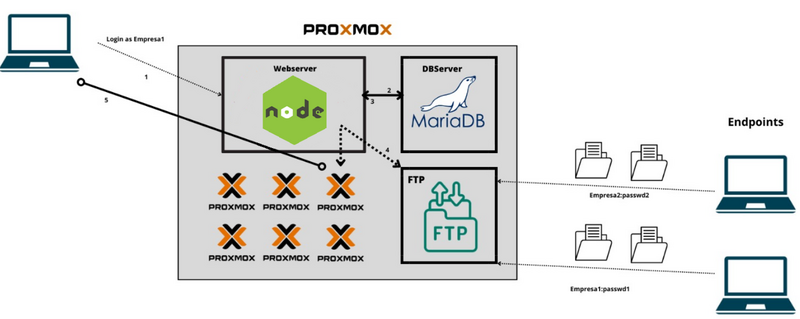
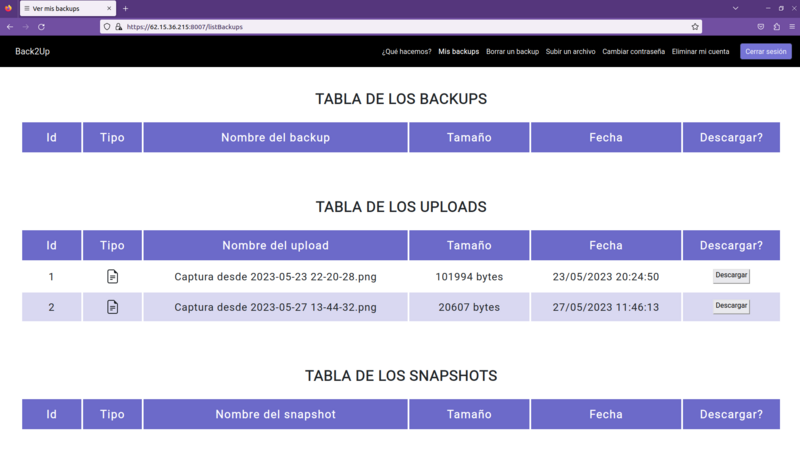
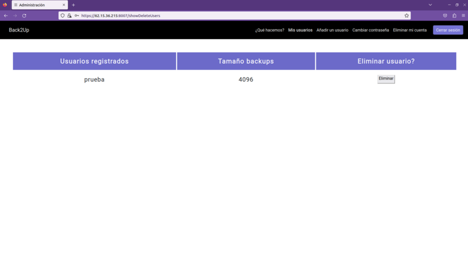

## Contents

* [1 Back2Up](#Back2Up)
  + [1.1 Resumen del proyecto](#Resumen_del_proyecto)
  + [1.2 Tecnologías utilizadas](#Tecnolog.C3.ADas_utilizadas)
  + [1.3 Funcionamiento](#Funcionamiento)

# Back2Up[[edit](/pti/index.php?title=Categor%C3%ADa:Back2Up&veaction=edit&section=1 "Edit section: Back2Up") | [edit source](/pti/index.php?title=Categor%C3%ADa:Back2Up&action=edit&section=1 "Edit section: Back2Up")]

Esquema de Back2Up.

## Resumen del proyecto[[edit](/pti/index.php?title=Categor%C3%ADa:Back2Up&veaction=edit&section=2 "Edit section: Resumen del proyecto") | [edit source](/pti/index.php?title=Categor%C3%ADa:Back2Up&action=edit&section=2 "Edit section: Resumen del proyecto")]

La propuesta se basa en crear un sistema de *backups* remoto con máquinas virtuales. Estará montado sobre Proxmox, una plataforma de virtualización y administración de servidores que combina la virtualización de máquinas virtuales y contenedores en un entorno único, donde tendremos virtualizados un servidor de base de datos y un servidor web con FTP para la interacción con el cliente.   
Una vez tengamos esta base, la idea es hacer un método automático para poder levantar las máquinas a partir de las imágenes transferidas al *endpoint* y que los usuarios puedan acceder a ellas en remoto (Disaster Recovery).

## Tecnologías utilizadas[[edit](/pti/index.php?title=Categor%C3%ADa:Back2Up&veaction=edit&section=3 "Edit section: Tecnologías utilizadas") | [edit source](/pti/index.php?title=Categor%C3%ADa:Back2Up&action=edit&section=3 "Edit section: Tecnologías utilizadas")]

Hemos utilizado Proxmox como plataforma como se ha mencionado anteriormente, FTP para pasar los ficheros y un *endpoint* para poder gestionar la subida de los *backups* y qué archivos subir.   
En la página web que sirve para la interacción con el usuario, hemos usado principalmente NodeJS con sus módulos para el backend, y HTML y CSS para el frontend.  
Por otra parte, para facilitar la compatibilidad y portabilidad de la aplicación, decidimos implementar la aplicación sobre contenedores Docker.  
Podemos ver la relación de estas tecnologías utilizadas en el esquema de la primera figura.

## Funcionamiento[[edit](/pti/index.php?title=Categor%C3%ADa:Back2Up&veaction=edit&section=4 "Edit section: Funcionamiento") | [edit source](/pti/index.php?title=Categor%C3%ADa:Back2Up&action=edit&section=4 "Edit section: Funcionamiento")]

Hay dos tipos de usuarios, los particulares y los usuarios dados de alta por una empresa, y la empresa en cuestión:

* Lo primeros hacen una gestión de sus *backups* (listarlos, borrarlos) subidos con el *endpoint* (se descarga desde el menú principal de la página web), proporcionándoles la flexibilidad de qué tipo de *backup* quieren hacer (incremental, total, tarball, snapshot), con qué ficheros y si quieren que se les avise por mail si se ha podido hacer correctamente. Asimismo, también pueden subir archivos puntuales para dejarlos almacenados con Back2Up. Como podemos ver en la siguiente tabla, se pueden descargar los ficheros subidos previamente. Por otro lado, pueden personalizar su cuenta con ajustes como el cambio de contraseña, o la eliminación de esta.

Página web de las tablas mencionadas del usuario particular o de empresa.

* En el caso de los segundos, hacen más bien una gestión de los usuarios que el administrador de la empresa ha dado de alta. Pueden crear usuarios asociados a esta empresa, listarlos y eliminarlos, además de poder personalizar su cuenta como los usuarios del punto anterior.

Página web de las tablas mencionadas del usuario administrador de empresa.