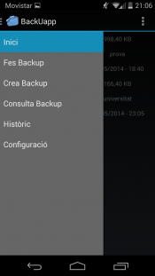

## Contents

* [1 ¿Què és BackUapp?](#.C2.BFQu.C3.A8_.C3.A9s_BackUapp.3F)
* [2 Com funciona?](#Com_funciona.3F)
* [3 Aplicació Android](#Aplicaci.C3.B3_Android)
  + [3.1 Perfil de Backup](#Perfil_de_Backup)
  + [3.2 Crear perfil de Backup](#Crear_perfil_de_Backup)
  + [3.3 Fer Backup (Ara)](#Fer_Backup_.28Ara.29)
  + [3.4 Consultar Backups](#Consultar_Backups)
  + [3.5 Seguretat](#Seguretat)

## ¿Què és BackUapp?[[edit](/pti/index.php?title=Categor%C3%ADa:BackUapp&veaction=edit&section=1 "Edit section: ¿Què és BackUapp?") | [edit source](/pti/index.php?title=Categor%C3%ADa:BackUapp&action=edit&section=1 "Edit section: ¿Què és BackUapp?")]

Suport web per consultar els diferents backups que hagi realitzat l'usuari.

BackUapp és una aplicació per a dispositius Android que permet a l'usuari tenir una còpia de seguretat dels directoris i fitxers del seu dispositiu d'una manera fàcil, senzilla i còmode. A més, no cal ser *root* per a poder utilitzar-la. Aquestes còpies de seguretat es guarden en el núvol i l'usuari podrà consultar i/o descarregar les còpies de seguretat que ha realitzat fins al moment des de la pàgina web que dona suport a l'aplicació.

## Com funciona?[[edit](/pti/index.php?title=Categor%C3%ADa:BackUapp&veaction=edit&section=2 "Edit section: Com funciona?") | [edit source](/pti/index.php?title=Categor%C3%ADa:BackUapp&action=edit&section=2 "Edit section: Com funciona?")]

D'una manera molt senzilla i fàcil l'usuari podrà triar quins directoris i fitxers desitjarà conservar en el que anomenen "[perfil de backup](/pti/index.php/Categor%C3%ADa:BackUapp#Perfil_de_Backup "Categoría:BackUapp")" (s'explica més endavant). A aquest perfil se li assigna un dia i una hora per tal de programar quan es realitzarà aquesta còpia de seguretat. Això és tot el que l'usuari ha de fer per a que es realitzi una còpia de seguretat del que vol i quan ho vol. L'aplicació també dona la possibilitat de realitzar una còpia de seguretat en el moment que l'usuari ho desitgi sense haver de programar-ho. Per realitzar la còpia de seguretat utilitzen la llibreria **zip4j\_1.3.2** que utilitza les classes Zip de Java però d'una manera molt més simple i fàcil.

## Aplicació Android[[edit](/pti/index.php?title=Categor%C3%ADa:BackUapp&veaction=edit&section=3 "Edit section: Aplicació Android") | [edit source](/pti/index.php?title=Categor%C3%ADa:BackUapp&action=edit&section=3 "Edit section: Aplicació Android")]

NavigationDrawer

L'aplicació Android és el centre del projecte. Utilitza el mètode de navegació *Navigation Drawer* molt usat per grans marques com Google, Facebook, etc. Com a pàgina principal es mostra un tipus amb informació d'interès per a l'usuari com pot ser la data de l'última còpia de seguretat, de què es va fer l'última còpia de seguretat, quant ocupava l'última còpia de seguretat, data de la pròxima còpia de seguretat, així com el següent perfil de backup del que es farà còpia de seguretat...
  
  
La interfície és molt usable ja que no necessita navegar per moltes pantalles, només les necessàries, per tal d'evitar que l'usuari eventualment es pugui perdre. Ara mateix com a configuració de l'aplicació només hi ha la del idioma (Català o Castellà), però es podrien plantejar varies opcions més per un futur com podria ser netejar totes les dades de configuració de l'aplicació, es a dir, esborrar tots els perfils de backup, per exemple.

### Perfil de Backup[[edit](/pti/index.php?title=Categor%C3%ADa:BackUapp&veaction=edit&section=4 "Edit section: Perfil de Backup") | [edit source](/pti/index.php?title=Categor%C3%ADa:BackUapp&action=edit&section=4 "Edit section: Perfil de Backup")]

Un perfil de backup no és més que un conjunt de directoris i/o fitxers associats a un nom i a una data i hora concretes.

### Crear perfil de Backup[[edit](/pti/index.php?title=Categor%C3%ADa:BackUapp&veaction=edit&section=5 "Edit section: Crear perfil de Backup") | [edit source](/pti/index.php?title=Categor%C3%ADa:BackUapp&action=edit&section=5 "Edit section: Crear perfil de Backup")]

Creació d'un perfil de backup

Selecció dels directoris i fitxers per fer còpia de seguretat

L'usuari ha d'introduir les següents dades: el nom amb el que identificarà aquest perfil. Per exemple, si el nom és **Universitat** l'usuari ja sap que en aquest perfil hi haurà un seguit de directoris i fitxers que tindran relació amb la Universitat. D'altra banda si el nom fos **backup\_18\_05\_2014** (backup del 18/05/014) resulta molt menys descriptiu. Tot seguit s'hauran d'indicar els directoris i fitxers dels quals vol còpia de seguretat. Per últim caldrà indicar la data i l'hora. Només es podrà seleccionar dates i hores futures, ja que no te sentit programar una còpia de seguretat per una data que ja ha passat.

### Fer Backup (Ara)[[edit](/pti/index.php?title=Categor%C3%ADa:BackUapp&veaction=edit&section=6 "Edit section: Fer Backup (Ara)") | [edit source](/pti/index.php?title=Categor%C3%ADa:BackUapp&action=edit&section=6 "Edit section: Fer Backup (Ara)")]

Aquest opció permet realitzar una còpia de seguretat en el mateix moment. Es llistarà els perfils de backup que l'usuari te creats en el dispositiu i aquest haurà de seleccionar el que vulgui. Llavors després d'una confirmació es farà la còpia de seguretat del perfil seleccionat.

### Consultar Backups[[edit](/pti/index.php?title=Categor%C3%ADa:BackUapp&veaction=edit&section=7 "Edit section: Consultar Backups") | [edit source](/pti/index.php?title=Categor%C3%ADa:BackUapp&action=edit&section=7 "Edit section: Consultar Backups")]

Llista dels perfils creats per l'usuari.

L'usuari podrà també consultar tots els perfils de backup que ha creat i podrà o bé esborrar-los o bé editar-los.

### Seguretat[[edit](/pti/index.php?title=Categor%C3%ADa:BackUapp&veaction=edit&section=8 "Edit section: Seguretat") | [edit source](/pti/index.php?title=Categor%C3%ADa:BackUapp&action=edit&section=8 "Edit section: Seguretat")]

La comunicació entre l'aplicació mòbil i el servidor es fa, sempre, de manera xifrada. En l'enviament de la còpia de seguretat s'utilitzarà el protocol SCP utilitzant les llibreries per a Java **org.apache.ant-jsch-1.9.4**. Per a a comunicació amb els serveis web les llibreries **commons-net-3.3** i **com.google.code.gson-2.2.4**.