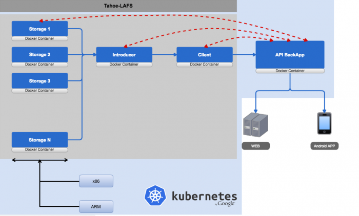
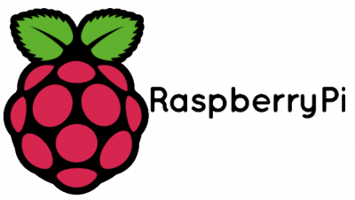
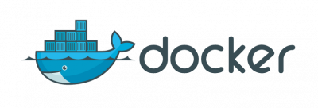
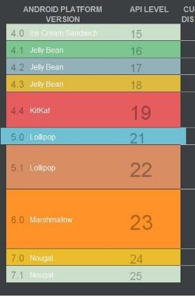
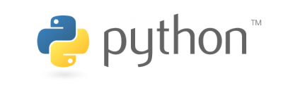

## Contents

* [1 Projecte HectoEktós](#Projecte_HectoEkt.C3.B3s)
  + [1.1 Què és HectoEktós?](#Qu.C3.A8_.C3.A9s_HectoEkt.C3.B3s.3F)
  + [1.2 Objectius del projecte](#Objectius_del_projecte)
  + [1.3 Infraestructura](#Infraestructura)
  + [1.4 Tecnologias](#Tecnologias)

# Projecte HectoEktós[[edit](/pti/index.php?title=Categor%C3%ADa:BackupDescentralitzat&veaction=edit&section=1 "Edit section: Projecte HectoEktós") | [edit source](/pti/index.php?title=Categor%C3%ADa:BackupDescentralitzat&action=edit&section=1 "Edit section: Projecte HectoEktós")]

## Què és HectoEktós?[[edit](/pti/index.php?title=Categor%C3%ADa:BackupDescentralitzat&veaction=edit&section=2 "Edit section: Què és HectoEktós?") | [edit source](/pti/index.php?title=Categor%C3%ADa:BackupDescentralitzat&action=edit&section=2 "Edit section: Què és HectoEktós?")]

Estem en un món informàtic, cada cop més endinsat al núvol, les tecnologies de la informació s'han d'adaptar a un model distribuït i interconnectat. La nostra funció com a estudiants d'enginyeria especialitzats en tecnologies de la informació és desenvolupar un sistema que permeti aprofitar aquest paradigma per construir un sistema sòlid de Backups. Aquest, serà fàcilment escalable, requerirà molt pocs recursos per a funcionar i serà lleugera. Però, sobretot que serà un sistema molt robust.

Hem pensat en un sistema senzill, que permeti al client realitzar i gestionar les seves pròpies còpies de seguretat del sistema. S'ha pensat en una eina inicial que es presenti al públic en forma d'aplicació Web, conjuntament amb una aplicació Android, que permeti gestionar en tot moment les còpies de seguretat i les distribueixi entre diferents nodes.

## Objectius del projecte[[edit](/pti/index.php?title=Categor%C3%ADa:BackupDescentralitzat&veaction=edit&section=3 "Edit section: Objectius del projecte") | [edit source](/pti/index.php?title=Categor%C3%ADa:BackupDescentralitzat&action=edit&section=3 "Edit section: Objectius del projecte")]

Entrant ja al nostre projecte, volem aclarir que el projecte està pensat, no crearà les còpies de seguretat del sistema, ja que creiem que això dependrà de l'administrador de sistemes, simplement es proporciona una eina més segura per a gestionar totes les còpies de seguretat i que permeti fàcilment pujar-les, gestionar-les i crear-les i distribuir-les.

## Infraestructura[[edit](/pti/index.php?title=Categor%C3%ADa:BackupDescentralitzat&veaction=edit&section=4 "Edit section: Infraestructura") | [edit source](/pti/index.php?title=Categor%C3%ADa:BackupDescentralitzat&action=edit&section=4 "Edit section: Infraestructura")]

Nuestro infraestructura consiste de distintos componentes. En primer lugar tenemos un Arduino conectado a unos sensores de temperatura, humedad y presión. Este a su vez, se conecta con una Raspberry Pi para enviarle los datos recogidos por los sensores.

La Raspberry nos servirá para dos fines: almacenar estos datos meteorológicos en una base de datos SQL y para crear un servicio web que será el encargado de recibir las peticiones GET de la página web y la aplicación Android y responder a estas peticiones con los datos pedidos en formato JSon. Tanto la Base de datos como el servicio web se encuentran en dos contenedores independientes que se gestionan mediante Docker.

Para poder visualizar estos datos, al usuario se le ofrecen dos posibilidades, acceder a ellos mediante una página web y una aplicación Android.

## Tecnologias[[edit](/pti/index.php?title=Categor%C3%ADa:BackupDescentralitzat&veaction=edit&section=5 "Edit section: Tecnologias") | [edit source](/pti/index.php?title=Categor%C3%ADa:BackupDescentralitzat&action=edit&section=5 "Edit section: Tecnologias")]

* Ubuntu 16.04

* Raspbian Jessie Lite

* Docker 1.12.6

* Kubernetes v1.5.2

* Android 5.1 Lollipop o Superior

* Python 3

* Flask

* HTML, CSS, JavaScript

* Tahoe-LAFS

* SQLite

* Java 8

* OpenVPN

