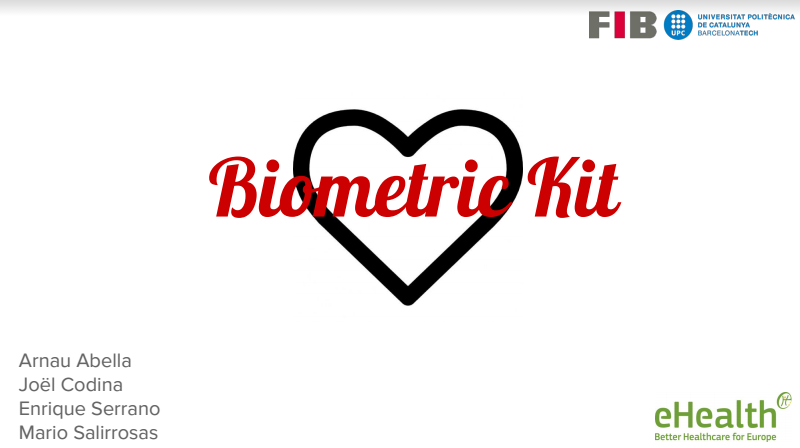
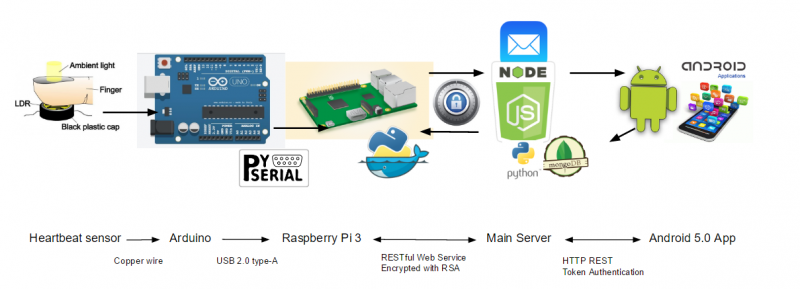
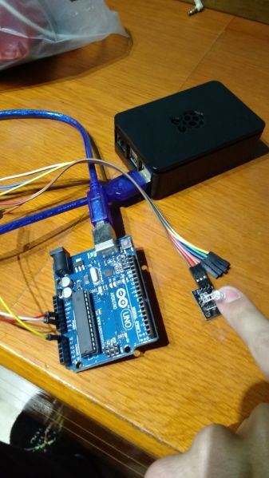
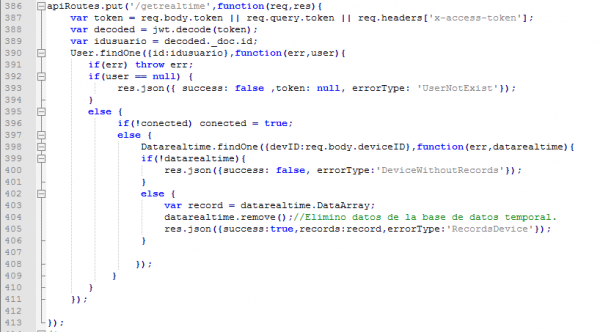
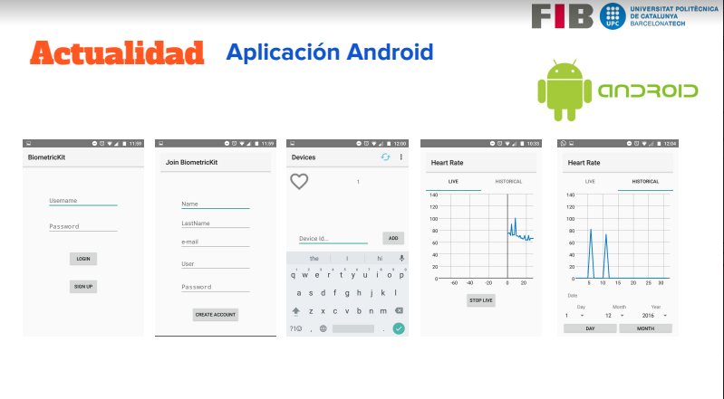

## Contents

* [1 Biometric Kit](#Biometric_Kit)
  + [1.1 Nuestro proyecto](#Nuestro_proyecto)
  + [1.2 Tecnologías integradas](#Tecnolog.C3.ADas_integradas)
    - [1.2.1 1.- Módulo dispositivo portátil](#1.-_M.C3.B3dulo_dispositivo_port.C3.A1til)
    - [1.2.2 2.- Módulo servidor central](#2.-_M.C3.B3dulo_servidor_central)
    - [1.2.3 3.- Módulo aplicación móvil](#3.-_M.C3.B3dulo_aplicaci.C3.B3n_m.C3.B3vil)
  + [1.3 Distribución del trabajo](#Distribuci.C3.B3n_del_trabajo)
  + [1.4 Conclusiones](#Conclusiones)
  + [1.5 Bugs y mejoras futuras](#Bugs_y_mejoras_futuras)
* [2 Memoria](#Memoria)
  + [2.1 Contacto](#Contacto)

# Biometric Kit[[edit](/pti/index.php?title=Categor%C3%ADa:Biometric_kit&veaction=edit&section=1 "Edit section: Biometric Kit") | [edit source](/pti/index.php?title=Categor%C3%ADa:Biometric_kit&action=edit&section=1 "Edit section: Biometric Kit")]

## Nuestro proyecto[[edit](/pti/index.php?title=Categor%C3%ADa:Biometric_kit&veaction=edit&section=2 "Edit section: Nuestro proyecto") | [edit source](/pti/index.php?title=Categor%C3%ADa:Biometric_kit&action=edit&section=2 "Edit section: Nuestro proyecto")]

Nuestro proyecto se basa en un sistema de monitorización a distancia, en su fase prototipo sólo monitoriza el pulso, el cual mediante una aplicación de móvil con una interfaz sencilla permite visualizar los datos de esta monitorización, propios o de otras personas (habitualmente pacientes que requieran monitorización a distancia), en la pantalla tanto en tiempo real como los valores a lo largo del día, semana e incluso mes. Todos los datos de nuestros clientes son almacenados con completa privacidad en una base de datos remota, de forma gratuïta y con persistencia de aproximadamente un año.

Nuestro proyecto no es algo inédito, proyectos como el nuestro existen desde hace años, y cada vez tienen un mejor rendimiento y precio y una mayor demanda. Nuestro proyecto ofrece, a diferencia de las soluciones existentes al problema de la monitorización, una alternativa económica a los dispositivos de monitorización médica ya que si lo comparamos con proyectos de otras compañías como por ejemplo MySignals de Libelium (1600€) nuestro producto ofrece un precio muchísimo menor (30€) y una plataforma abierta y de código libre.

Nuestro proyecto integra nuevas tecnologías (Dockers, Python, NodeJS) como alternativas a viejas soluciones y sistemas de comunicación. Nosotros no sólo vendemos el dispositivo, sino también toda la infraestructura que hay por detrás: servidores, comunicaciones seguras, … Una de las ventajas de Biometric Kit es que permite mejorar la calidad de monitorización intercambiando el hardware (en nuestro prototipo el pulsímetro) sin tener que cambiar toda la infraestructura que hay por detrás.

## Tecnologías integradas[[edit](/pti/index.php?title=Categor%C3%ADa:Biometric_kit&veaction=edit&section=3 "Edit section: Tecnologías integradas") | [edit source](/pti/index.php?title=Categor%C3%ADa:Biometric_kit&action=edit&section=3 "Edit section: Tecnologías integradas")]

En el diagrama podemos observar los diferentes dispositivos hardware y la función que implementan cada uno de ellos:

### 1.- Módulo dispositivo portátil[[edit](/pti/index.php?title=Categor%C3%ADa:Biometric_kit&veaction=edit&section=4 "Edit section: 1.- Módulo dispositivo portátil") | [edit source](/pti/index.php?title=Categor%C3%ADa:Biometric_kit&action=edit&section=4 "Edit section: 1.- Módulo dispositivo portátil")]

El primer módulo está compuesto de tres elementos hardware diferenciados: pulsímetro, Arduino y Raspberry PI 3.0. Su función es obtener datos del paciente y comunicarlos de forma automática y segura a un servidor centralizado en un lugar geográfico distinto. Para conseguir esto pensamos en esta posible solución:

**Pulsímetro**: la forma más económica y rápida de diseñar un pulsímetro es mediante una resistencia dependiente de la luz. Durante todo el proyecto hemos usado esta técnica para obtener los valores del pulso, como veremos en las conclusiones no es una técnica 100% precisa pero por su coste económico hace buenas mediciones. El circuito electrónico se basa en un led que emite luz de baja frecuencia y una resistencia en el otro extremo del circuito, entre el led y la resistencia el paciente coloca su dedo, la tensión en la resistencia será linear ya que la luz que atraviesa el dedo llegará siempre con la misma intensidad (encontraremos pequeñas subidas y bajadas debido a errores de lectura) exceptuando en el caso de que circule sangre por el dedo, en estos casos, se formará una valle en la línea del voltaje debido a que la sangre absorberá gran parte de esta luz y el voltaje de la resistencia disminuye.

**Arduino**: se encarga de conectar los extremos del pulsímetro a los pins de E/S del Arduino y de leer variaciones de voltaje en el circuito, el tiempo entre dos valles de voltaje será equivalente a un pulso del paciente. En un mundo ideal estos valores son 100% precisos pero debido a errores de lectura debido a cambios de intensidad de la luz ambiental diferencias los valles producidos por la sangre y los valles producidos por ruido no es tan fácil. Tendremos que aplicar en la raspberry una serie de filtros para eliminar falsos positivos.

**Raspberry PI 3.0**: este componente es el encargado de comunicar los datos del pulso obtenidos localmente al servidor central. La idea original era que cada raspberry tuviera una base de datos pequeña, con los datos obtenidos en las diferentes monitorizaciones y que estos datos se sincronizan con el servidor cada x tiempo en caso de disponer de conexión a Internet. En principio la raspberry corría un proceso encargado de obtener los datos del Arduino, y almacenarlos en la base de datos local. Otro proceso, un servidor de HTTP encapsulado en Dockers, se encargaría de recibir peticiones del servidor y de proporcionar los datos pedidos. La idea era asignar una IP a cada Raspberry y que estas respondieran al servidor. Fue una mala idea de diseño. Primero de todo porque en una situación real habría miles de dispositivos conectados y asignar una dirección IP a cada uno de ellos no es viable. Segundo, el hecho de tener dos procesos comunicándose entre sí mediante una base de datos local (que no deja de ser un proceso de mayor capacidad) es algo lento y costoso y realmente no nos podíamos permitir esto en una comunicación crítica en tiempo real. Finalmente encapsular el servidor pero no la base de datos ni el proceso que obtenía los datos quitaba todo significado al contenedor (recordemos que una de las gracias de los contenedores es que permiten exportar e importar con facilidad procesos encapsulados en ellos entre diferentes distribuciones). Por todos estos motivos y más, se decidió cambiar el diseño de las tecnologías utilizadas en el dispositivo portátil, el hardware sería el mismo pero no la tecnología. En el apartado 3 se explica la versión actual, mejor implementada, que hemos usado y que funciona.

### 2.- Módulo servidor central[[edit](/pti/index.php?title=Categor%C3%ADa:Biometric_kit&veaction=edit&section=5 "Edit section: 2.- Módulo servidor central") | [edit source](/pti/index.php?title=Categor%C3%ADa:Biometric_kit&action=edit&section=5 "Edit section: 2.- Módulo servidor central")]

Este módulo es el encargado de la gestión de los diferentes usuarios y de sus diferentes dispositivos. Cuando un usuario, desde su aplicación móvil, requiera los datos de un paciente este se encargará de enviar la solicitud a la Raspberry y de recoger la respuesta y de suministrar estos datos a la aplicación móvil. La idea original del servidor era únicamente un módulo de gestión, con poca carga de trabajo, almacena datos de usuarios y proporciona los datos de los pacientes a los usuarios encargados de sus dispositivos. Veremos que a lo largo del proyecto la idea de un servidor enlace no triunfó y decidimos para aliviar trabajo en la raspberry de los dispositivos que era el servidor (normalmente en una máquina más potente) que debe encargarse de almacenar los datos constantemente, aceptando miles de peticiones tanto de los dispositivos de monitorización como de los usuarios móviles y almacenar/suministrar los datos requeridos.

### 3.- Módulo aplicación móvil[[edit](/pti/index.php?title=Categor%C3%ADa:Biometric_kit&veaction=edit&section=6 "Edit section: 3.- Módulo aplicación móvil") | [edit source](/pti/index.php?title=Categor%C3%ADa:Biometric_kit&action=edit&section=6 "Edit section: 3.- Módulo aplicación móvil")]

Este módulo es el que menos ha sido modificado durante el proyecto, la idea era muy clara, una aplicación para dispositivos Android versión 5.0 o superior que permitiera al usuario, en caso de tener una cuenta registrada y autenticada (ya veremos cómo se consigue esto), puede añadir dispositivos, y leer datos de los dispositivos registrados. Una vez seleccionado un dispositivo podemos visualizar datos en tiempo real de este, mediante una gráfica y datos guardados a lo largo del día, semana y mes. Aunque a priori parezca una interfaz sencilla, tiene por debajo muchas llamadas al servidor. En el cuarto apartado encontraremos una explicación detallada de las funciones y operaciones que realiza esta aplicación y cómo se comunica con el servidor, autentifica y que tipo de datos pide. También las diferentes librerías para hacer el cliente REST y las gráficas con los datos.

Esta imagen muestra una de las funciones del servidor Node.js: *getRealTime()* que se encarga de obtener los valores en tiempo real.

## Distribución del trabajo[[edit](/pti/index.php?title=Categor%C3%ADa:Biometric_kit&veaction=edit&section=7 "Edit section: Distribución del trabajo") | [edit source](/pti/index.php?title=Categor%C3%ADa:Biometric_kit&action=edit&section=7 "Edit section: Distribución del trabajo")]

**Mario Salirrosas**: se ha encargado del servidor Node.js y de alquilar la máquina del servidor remoto

**Enrique Serrano**: se ha encargado de diseñar y implementar toda la aplicación en Android

**Joël Codina**: se ha encargado de escribir el código del Arduino y de conseguir pulsimetro+Arduino+Raspberry PI 3.0

**Arnau Abella**: se ha encargado del dispositivo, crear el contenedor Docker y del encriptador/desencriptador. También de escribir toda la documentación asociada con este trabajo. Y de escribir la entrada de la wikia

## Conclusiones[[edit](/pti/index.php?title=Categor%C3%ADa:Biometric_kit&veaction=edit&section=8 "Edit section: Conclusiones") | [edit source](/pti/index.php?title=Categor%C3%ADa:Biometric_kit&action=edit&section=8 "Edit section: Conclusiones")]

Al principio ninguno de nosotros teníamos claro si sería posible finalizar el proyecto ya que nunca habíamos trabajado con las diferentes tecnologías que hemos usado en nuestro proyecto: pulsímetro, arduino, Raspberry, Docker, servicios RESTful, Node.js, Android … Pero a lo largo de estos 4 meses, en los que hemos sufrido pero también aprendido mucho, nos hemos dado cuenta que con paciencia, con muchas horas de documentación y trabajando diariamente se pueden conseguir muchas cosas. Biometric Kit a día de hoy es una realidad.

## Bugs y mejoras futuras[[edit](/pti/index.php?title=Categor%C3%ADa:Biometric_kit&veaction=edit&section=9 "Edit section: Bugs y mejoras futuras") | [edit source](/pti/index.php?title=Categor%C3%ADa:Biometric_kit&action=edit&section=9 "Edit section: Bugs y mejoras futuras")]

Biometric Kit es un prototipo muy barato y por este motivo tiene problemas de precisión en el sensor. No es un dispositivo fiable, y mucho menos para pacientes críticos. Es importante comprar un hardware de medición mejor, calibrar mejor este sensor. El dispositivo portátil no consta de batería portátil por lo que de portátil no tiene nada. Se podría integrar en una raspberry integrada, de menos potencia pero con batería autónoma. A nivel de servidor central es muy importante solucionar el problema del desencriptado, el propio servidor Node.js debe encargarse de desencriptar los datos ya que por muy eficiente que este sea, si depende de un servidor de baja calidad de Python pierde toda la gracia. La aplicación se puede mejorar a nivel de diseño.

# Memoria[[edit](/pti/index.php?title=Categor%C3%ADa:Biometric_kit&veaction=edit&section=10 "Edit section: Memoria") | [edit source](/pti/index.php?title=Categor%C3%ADa:Biometric_kit&action=edit&section=10 "Edit section: Memoria")]

Enlace a la memoria [File:MemoriaFinal BK.pdf](/pti/index.php?title=Special:Upload&wpDestFile=MemoriaFinal_BK.pdf "File:MemoriaFinal BK.pdf")

## Contacto[[edit](/pti/index.php?title=Categor%C3%ADa:Biometric_kit&veaction=edit&section=11 "Edit section: Contacto") | [edit source](/pti/index.php?title=Categor%C3%ADa:Biometric_kit&action=edit&section=11 "Edit section: Contacto")]

Si alguien está interesado en este proyecto puede contactarme : [arnauabella@gmail.com](/pti/index.php?title=Arnauabella@gmail.com&action=edit&redlink=1 "Arnauabella@gmail.com (page does not exist)")