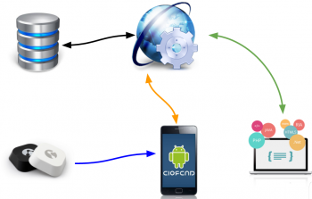
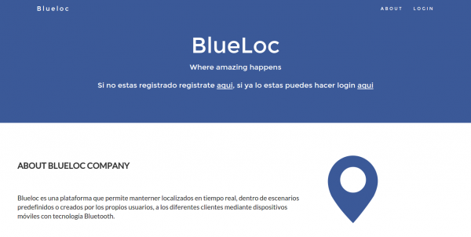
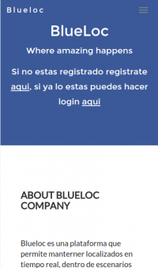
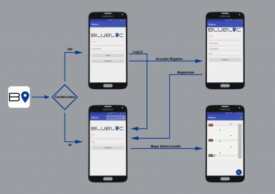

## Contents

* [1 Proyecto BlueLoc](#Proyecto_BlueLoc)
* [2 Tecnologías](#Tecnolog.C3.ADas)
  + [2.1 Flujo principal](#Flujo_principal)
  + [2.2 Servidor](#Servidor)
  + [2.3 Página web](#P.C3.A1gina_web)
  + [2.4 Servicio web REST](#Servicio_web_REST)
  + [2.5 Beacons](#Beacons)
  + [2.6 Algoritmo de posicionamiento](#Algoritmo_de_posicionamiento)
  + [2.7 Aplicación Android](#Aplicaci.C3.B3n_Android)
* [3 Resultado](#Resultado)
* [4 Futuro](#Futuro)

# Proyecto BlueLoc[[edit](/pti/index.php?title=Categor%C3%ADa:Blueloc&veaction=edit&section=1 "Edit section: Proyecto BlueLoc") | [edit source](/pti/index.php?title=Categor%C3%ADa:Blueloc&action=edit&section=1 "Edit section: Proyecto BlueLoc")]

BlueLoc es una plataforma que permite mantener localizados en tiempo real, dentro de escenarios generados por los propios usuarios, a los diferentes clientes mediante dispositivos móviles con tecnología Bluetooth. El principal objetivo tecnológico es crear una plataforma que permita localizar en tiempo real a los diferentes usuarios mediante Bluetooth, dando alternativas a la localización GPS, especialmente en entornos donde esta tecnología tenga menos cobertura o se necesite una mayor precisión y control del sistema.

Esta plataforma consta de una página web, una aplicación Android y un servicio web REST. La página web permite a los usuarios gestionar sus mapas y monitorizar a los usuarios dentro de los mapas. La apicación Android es la encargada de calcular el posicionamiento de los usuarios y además muestra la posición de los demás usuarios (hay un sistema de permisos que controla la visualización entre estos). Servicio web REST que se encarga de comunicar la página web con la aplicación Android y la base de datos.

# Tecnologías[[edit](/pti/index.php?title=Categor%C3%ADa:Blueloc&veaction=edit&section=2 "Edit section: Tecnologías") | [edit source](/pti/index.php?title=Categor%C3%ADa:Blueloc&action=edit&section=2 "Edit section: Tecnologías")]

## Flujo principal[[edit](/pti/index.php?title=Categor%C3%ADa:Blueloc&veaction=edit&section=3 "Edit section: Flujo principal") | [edit source](/pti/index.php?title=Categor%C3%ADa:Blueloc&action=edit&section=3 "Edit section: Flujo principal")]

El centro de nuestra plataforma es el servicio web REST que se comunica bidireccionalmente con la base de datos, la página web y la aplicación Android. Además las beacons solo envían una señal a los dispositivos móviles pero no guardan ninguna información de estos. Una vez el móvil recibe la señal de tres o más beacons comenzará a calcular su localización.

Esta nueva posición calculada será enviada al servicio REST y este la guardará en la base de datos y como respuesta le devolverá la posición del resto de usuarios de los cuales tenga permiso para visualizar. A su vez la web podrá visualizar todos estos datos y añadir nuevos mapas al sistema.

## Servidor[[edit](/pti/index.php?title=Categor%C3%ADa:Blueloc&veaction=edit&section=4 "Edit section: Servidor") | [edit source](/pti/index.php?title=Categor%C3%ADa:Blueloc&action=edit&section=4 "Edit section: Servidor")]

Datos del servidor donde se aloja nuestra web app y web service:

* Intel(R) Atom(TM) CPU N2800 @ 1.86GHz
* Memoria RAM 3926 MB
* Placa base: DN2800MT
* Versión de bios: MTCDT10N.86A.0165.2013.0114.1540

● Discos 40GB ssd

* Velocidad de lectura : 248.45 MB/s

El servicio de hosting elegido es Kimsufi.

## Página web[[edit](/pti/index.php?title=Categor%C3%ADa:Blueloc&veaction=edit&section=5 "Edit section: Página web") | [edit source](/pti/index.php?title=Categor%C3%ADa:Blueloc&action=edit&section=5 "Edit section: Página web")]

La página web se adapta perfectamente a los distintos dispositivos ya que se ha empleado el framework de Bootstrap. La página web permite registrar usuarios, añadir y gestionar los mapas y monitorizar a los usuarios de los mapas que administra el usuario.

* Bootstrap.
* HTML.
* CSS.
* Ajax.

Browser de un PC

Browser de un dispositivo móvil

## Servicio web REST[[edit](/pti/index.php?title=Categor%C3%ADa:Blueloc&veaction=edit&section=6 "Edit section: Servicio web REST") | [edit source](/pti/index.php?title=Categor%C3%ADa:Blueloc&action=edit&section=6 "Edit section: Servicio web REST")]

El servicio web REST se ha implementado en PHP con los métodos HTTP GET, PUT y POST. Las respuestas de este servicio son en formato JSON. Este servicio permite:

* Iniciar sesión.
* Registrarse.
* Vincularse a un mapa.
* Descargar imagen.
* Descargar descripción del mapa.
* Actualizar posición.
* Consultar posición.

## Beacons[[edit](/pti/index.php?title=Categor%C3%ADa:Blueloc&veaction=edit&section=7 "Edit section: Beacons") | [edit source](/pti/index.php?title=Categor%C3%ADa:Blueloc&action=edit&section=7 "Edit section: Beacons")]

Se han empleado seis beacons con el protocolo [Eddystone](https://github.com/google/eddystone) para hacer las pruebas de posicionamiento de la empresa [Kontakt](http://kontakt.io/). Estas beacons permiten:

* Cambiar entre los diferentes protocolos (Eddystone o iBeacon).
* Modificar el ID y la potencia de transmisión.
* Autonomía de dos años.

## Algoritmo de posicionamiento[[edit](/pti/index.php?title=Categor%C3%ADa:Blueloc&veaction=edit&section=8 "Edit section: Algoritmo de posicionamiento") | [edit source](/pti/index.php?title=Categor%C3%ADa:Blueloc&action=edit&section=8 "Edit section: Algoritmo de posicionamiento")]

[200 px](/pti/index.php?title=Special:Upload&wpDestFile=Triang.PNG "File:Triang.PNG")

Como hemos descrito anteriormente, tenemos un sistema con dispositivos repartidos por el “mapa” objetivo que envían mensajes con su identificador cada cierto tiempo. Sin embargo, conseguir a partir de éstos una posición precisa no es tarea sencilla.

La clave está en la **triangulación**: el proceso que nos permite calcular la posición de un punto conociendo su distancia a tres o más puntos no alineados del mismo plano. Para calcular nuestra posición triangularemos a partir de las distancias que midamos a cada una de las balizas que tenemos a nuestro alcance.

Sin embargo, nosotros disponemos de medidas con gran variabilidad, por lo que muchas veces no tendremos una intersección puntual de cada una de las circunferencias determinadas por las balizas y la distancia a ellas: tendremos que hacer un algoritmo que haga una **estimación de la posición real**.

El algoritmo escogido cumple dos características muy importantes en el entorno móvil en el que nos estamos moviendo: bajo consumo de energía y poco requerimiento de computación.

## Aplicación Android[[edit](/pti/index.php?title=Categor%C3%ADa:Blueloc&veaction=edit&section=9 "Edit section: Aplicación Android") | [edit source](/pti/index.php?title=Categor%C3%ADa:Blueloc&action=edit&section=9 "Edit section: Aplicación Android")]

Inicialmente cuando se entra en la aplicación para dispositivos móviles Android, el sistema consulta si hay credenciales guardadas de sesiones anteriores. Si no las hay, usuario procederá a insertar sus credenciales para iniciar sesión o registrarse. Una vez ya ha insertado los datos o ya había unas credenciales guardadas de una sesión anterior, el usuario procederá a unirse a un mapa.

En esta sección el usuario debe insertar el identificador del mapa que deberá haber consultado con anterioridad al administrador del mapa y opcionalmente un rol o conjunto de permisos con los que acceder al mapa. Si no se inserta rol, el usuario entrará con los permisos por defecto que haya seleccionado el administrador.

Una vez se accede al mapa, se descarga toda la información del mapa y el usuario tan solo deberá darle al botón de empezar y la posición se irá recalculando gracias al algoritmo de triangulación anteriormente descrito.

Si el usuario quiere cerrar la sesión podrá realizarlo desde el menú superior que encontrará en cada una de las secciones.

.

# Resultado[[edit](/pti/index.php?title=Categor%C3%ADa:Blueloc&veaction=edit&section=10 "Edit section: Resultado") | [edit source](/pti/index.php?title=Categor%C3%ADa:Blueloc&action=edit&section=10 "Edit section: Resultado")]

El resultado de esta plataforma ha sido muy positivo, ya que se ha conseguido unir una aplicación web con una aplicación móvil que permiten a los usuarios localizarse en entornos definidos por ellos mismos mediante beacons bluetooth.

A pesar de haber aplicado numerosas mejoras al algoritmo, no se ha conseguido limitar el error lo suficiente. Por lo que sería más conveniente que en vez de dar el punto exacto de posicionamiento de cada usuario, se debería mostrar la posición de los usuarios por áreas definidas o en caso de ser escenarios que se encuentren en el interior de edificios, delimitarlo por habitaciones.

# Futuro[[edit](/pti/index.php?title=Categor%C3%ADa:Blueloc&veaction=edit&section=11 "Edit section: Futuro") | [edit source](/pti/index.php?title=Categor%C3%ADa:Blueloc&action=edit&section=11 "Edit section: Futuro")]

Próximos pasos propuestos para la mejora de a plataforma:

* Mejorar la precisión de la localización.
* Implementar un generador de mapas personalizados en la web para hacer más intuitiva y simple la creación de mapas.
* Guardar el flujo de movimiento de los usuarios, ofreciendo más estadísticas a los administradores.