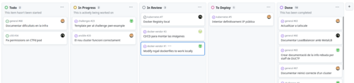

Logotip de CTFd

## Contents

* [1 Què és un CTF?](#Qu.C3.A8_.C3.A9s_un_CTF.3F)
* [2 Plantejament del projecte](#Plantejament_del_projecte)
  + [2.1 Tipus de Challenges](#Tipus_de_Challenges)
  + [2.2 Components principals](#Components_principals)
    - [2.2.1 Coordinació i flux de treball](#Coordinaci.C3.B3_i_flux_de_treball)
    - [2.2.2 Arquitectura de Kubernetes](#Arquitectura_de_Kubernetes)
    - [2.2.3 Orquestració (Ansible)](#Orquestraci.C3.B3_.28Ansible.29)
    - [2.2.4 CI/CD (GitHub Actions)](#CI.2FCD_.28GitHub_Actions.29)
    - [2.2.5 CTFd](#CTFd)
    - [2.2.6 Challenges](#Challenges)
    - [2.2.7 Challenge Manager](#Challenge_Manager)
    - [2.2.8 Monitoratge i SIEM](#Monitoratge_i_SIEM)

# Què és un CTF?[[edit](/pti/index.php?title=Categor%C3%ADa:CTF_Infrastructure&veaction=edit&section=1 "Edit section: Què és un CTF?") | [edit source](/pti/index.php?title=Categor%C3%ADa:CTF_Infrastructure&action=edit&section=1 "Edit section: Què és un CTF?")]

Un CTF (Capture The Flag) és una competició de seguretat informàtica on els participants han de resoldre una sèrie de reptes amb l'objectiu de 'capturar la bandera'. En aquest context, la bandera o 'flag' és una cadena de text que s'aconsegueix quan es supera amb èxit un repte o es troba una vulnerabilitat en un sistema. La funció bàsica d'una 'flag' és demostrar que un objectiu en concret s'ha assolit.

Per a poder participar en un CTF, inicialment un usuari o equip s'ha de registrar a la pàgina web del CTF en qüestió.

Registre d'usuari a CTFd.

Un cop els participants s'hagin resgistrat, aquests podran accedir a diversos panells dins de l'àmbit de la competició: el panell de normes, el de l'scoreboard i el dels reptes o challenges que és el més important i en el que hi posarem més atenció.

Al panell de reptes, és on es mostren els reptes de la competició dividits en les categories esmentades anteriorment que els participants hauran de resoldre:

Panell de reptes de ctfd.

Es pot interactuar amb els reptes fent-hi clic. D'aquesta manera, es mostrarà la descripció del repte, un botó per a descarregar els fitxers necessaris per a poder solucionar-lo i, depenent del repte, informació per a poder connectar-se a instàncies remotes.

Interacció amb el repte 'shelf' de la categoria de Pwn.

Una vegada es resol un repte, cal subministrar la 'flag' obtinguda a la pàgina web del CTF. Si la 'flag' es valida correctament, els participants obtindran la quantitat de punts assignada al repte.

Validació de la 'flag' del repte 'shelf' de la categoria de Pwn.

Al final de la competició, l'equip que tingui més punts guanya.

# Plantejament del projecte[[edit](/pti/index.php?title=Categor%C3%ADa:CTF_Infrastructure&veaction=edit&section=2 "Edit section: Plantejament del projecte") | [edit source](/pti/index.php?title=Categor%C3%ADa:CTF_Infrastructure&action=edit&section=2 "Edit section: Plantejament del projecte")]

## Tipus de Challenges[[edit](/pti/index.php?title=Categor%C3%ADa:CTF_Infrastructure&veaction=edit&section=3 "Edit section: Tipus de Challenges") | [edit source](/pti/index.php?title=Categor%C3%ADa:CTF_Infrastructure&action=edit&section=3 "Edit section: Tipus de Challenges")]

- Single File. Aquests reptes només requereixen que el participant pugui descarregar-se un comprimit amb contingut sobre el repte.

- Jailed Instance. Aquest tipus de repte, a part de requerir que el participant es pugui descarregar un comprimit amb contingut sobre el repte, requereix que hi hagi aixecades instàncies que ofereixin una connexió TCP a través d'un port en concret. Cada connexió que rebi cada instància haurà d'estar totalment aïllada de la resta. Aquí és on apareix la complexitat d'aquest tipus de repte

- On-demand Instance. Aquest tipus de repte pot no requerir la descàrrega d'un comprimit amb contingut del repte, és a dir, aquesta part és opcional. Tot i així el el tipus de repte més complex dels tres, ja que en aquests reptes es dona la potestat als participants d'aixecar instàncies o parar-les a la seva voluntat. Cada instància està separada en funció de l'equip o participant que la demani. Els integrants d'un mateix equip comparteixen instància.

## Components principals[[edit](/pti/index.php?title=Categor%C3%ADa:CTF_Infrastructure&veaction=edit&section=4 "Edit section: Components principals") | [edit source](/pti/index.php?title=Categor%C3%ADa:CTF_Infrastructure&action=edit&section=4 "Edit section: Components principals")]

Per tal de poder servir els tipus de challenges anteriors, necessitem implementar la integració entre diversos components.

Diagrama general del projecte

### Coordinació i flux de treball[[edit](/pti/index.php?title=Categor%C3%ADa:CTF_Infrastructure&veaction=edit&section=5 "Edit section: Coordinació i flux de treball") | [edit source](/pti/index.php?title=Categor%C3%ADa:CTF_Infrastructure&action=edit&section=5 "Edit section: Coordinació i flux de treball")]

Establir l'ús d’eines i bones pràctiques per garantir una bona comunicació i millorar la qualitat del codi i la documentació.

Sprint setmanal d'exemple.

### Arquitectura de Kubernetes[[edit](/pti/index.php?title=Categor%C3%ADa:CTF_Infrastructure&veaction=edit&section=6 "Edit section: Arquitectura de Kubernetes") | [edit source](/pti/index.php?title=Categor%C3%ADa:CTF_Infrastructure&action=edit&section=6 "Edit section: Arquitectura de Kubernetes")]

Implementar un cluster de Kubernetes bare-metal que compleixi amb tots els requeriments del projecte.

Connexió entre les màquines del Cluster i els usuaris.

### Orquestració (Ansible)[[edit](/pti/index.php?title=Categor%C3%ADa:CTF_Infrastructure&veaction=edit&section=7 "Edit section: Orquestració (Ansible)") | [edit source](/pti/index.php?title=Categor%C3%ADa:CTF_Infrastructure&action=edit&section=7 "Edit section: Orquestració (Ansible)")]

Automatitzar el desplegament de la infraestructura del cluster en les màquines corresponents

Log d'execució del playbook de Ansible.

### CI/CD (GitHub Actions)[[edit](/pti/index.php?title=Categor%C3%ADa:CTF_Infrastructure&veaction=edit&section=8 "Edit section: CI/CD (GitHub Actions)") | [edit source](/pti/index.php?title=Categor%C3%ADa:CTF_Infrastructure&action=edit&section=8 "Edit section: CI/CD (GitHub Actions)")]

Automatitzar el desplegament dels components de Kubernetes en el cluster.

Diagrama d'execució de les pipelines.

### CTFd[[edit](/pti/index.php?title=Categor%C3%ADa:CTF_Infrastructure&veaction=edit&section=9 "Edit section: CTFd") | [edit source](/pti/index.php?title=Categor%C3%ADa:CTF_Infrastructure&action=edit&section=9 "Edit section: CTFd")]

Implementar els components de Kubernetes corresponents a CTFd, la web per de la competició.

Desplegament de CTFd en el Cluster.

### Challenges[[edit](/pti/index.php?title=Categor%C3%ADa:CTF_Infrastructure&veaction=edit&section=10 "Edit section: Challenges") | [edit source](/pti/index.php?title=Categor%C3%ADa:CTF_Infrastructure&action=edit&section=10 "Edit section: Challenges")]

Crear challenges dels diferents tipus i desplegar-los automàticament a CTFd i al Cluster.

Diagrama de pujada dels challenges del tipus on-demand.

### Challenge Manager[[edit](/pti/index.php?title=Categor%C3%ADa:CTF_Infrastructure&veaction=edit&section=11 "Edit section: Challenge Manager") | [edit source](/pti/index.php?title=Categor%C3%ADa:CTF_Infrastructure&action=edit&section=11 "Edit section: Challenge Manager")]

Implementar els components de Kubernetes corresponents al Challenge Manager, un gestor dels challenges de tipus On-demand Instance.

Desplegament del Challenge Manager en el Cluster.

### Monitoratge i SIEM[[edit](/pti/index.php?title=Categor%C3%ADa:CTF_Infrastructure&veaction=edit&section=12 "Edit section: Monitoratge i SIEM") | [edit source](/pti/index.php?title=Categor%C3%ADa:CTF_Infrastructure&action=edit&section=12 "Edit section: Monitoratge i SIEM")]

Administrar i monitoritzar l’estat del Cluster.

Monitoratge i administració del Cluster amb OpenLens.