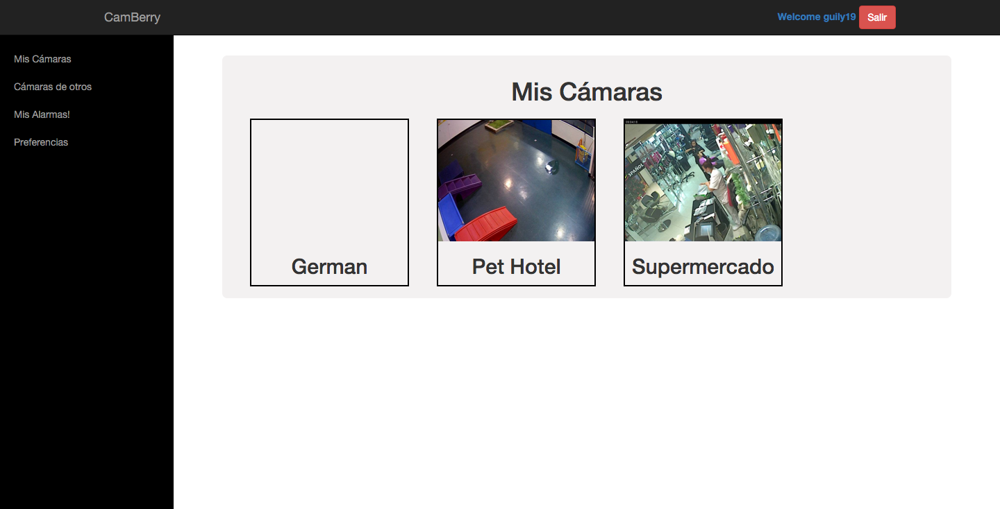

## Contents

* [1 Camberry](#Camberry)
  + [1.1 El proyecto Camberry](#El_proyecto_Camberry)
  + [1.2 Objetivos](#Objetivos)
* [2 Tecnologías](#Tecnolog.C3.ADas)
  + [2.1 Web](#Web)
  + [2.2 Raspberry](#Raspberry)
  + [2.3 Servidor](#Servidor)
* [3 Memoria](#Memoria)

# Camberry[[edit](/pti/index.php?title=Categor%C3%ADa:Camberry&veaction=edit&section=1 "Edit section: Camberry") | [edit source](/pti/index.php?title=Categor%C3%ADa:Camberry&action=edit&section=1 "Edit section: Camberry")]

[](/pti/index.php/File:RHbFANI.png)

## El proyecto Camberry[[edit](/pti/index.php?title=Categor%C3%ADa:Camberry&veaction=edit&section=2 "Edit section: El proyecto Camberry") | [edit source](/pti/index.php?title=Categor%C3%ADa:Camberry&action=edit&section=2 "Edit section: El proyecto Camberry")]

El proyecto Camberry nace de la idea de dar un servicio de gestión y organización de cámaras IP. A raíz de esto se ha creado un portal web que ofrece la capacidad de gestionar cámaras IP públicas o privadas en una cuenta de usuario. Además, este servicio se ha ido complementando con diferentes servicios extra que principalmente incluyen la detección de movimiento con grabación y almacenamiento de imágenes así como la generación de alertas via e-mail.

Adicionalmente, el proyecto se ha basado en el uso de sistemas Raspberry PI y cámaras Web de coste muy bajo. Tanto, que el propio equipo Camberry estudia la posibilidad de vender un Kit Camberry incluyendo una Raspberry y una webcam. No obstante, cabe decir que el proyecto ha sido desarrollado con la idea de que se pueda utilizar con cualquier tipo de cámaras IP, ya sea configurada por el mismo usuario con una IP-cam casera, con nuestro Kit o directamente con una cámara IP comercial.

## Objetivos[[edit](/pti/index.php?title=Categor%C3%ADa:Camberry&veaction=edit&section=3 "Edit section: Objetivos") | [edit source](/pti/index.php?title=Categor%C3%ADa:Camberry&action=edit&section=3 "Edit section: Objetivos")]

Los objetivos de este proyecto consisten principalmente en integrar distintas tecnologías para conseguir un proyecto de ingeniería de tecnologías de la información. El proceso de creación de todo el proyecto debe permitir a los integrantes y a todo aquel que lo desee un valor educativo proporcional al esfuerzo y horas que se le hayan dedicado. No obstante, de forma secundaria, este proyecto (y muchos otros dentro de la asignatura) tiene todas las características necesarias para proporcionar conceptos básicos e ideas de proyecto real que en un futuro podrían convertirse en negocios o tecnologías con diferentes beneficios, incluyendo el social o el económico.

# Tecnologías[[edit](/pti/index.php?title=Categor%C3%ADa:Camberry&veaction=edit&section=4 "Edit section: Tecnologías") | [edit source](/pti/index.php?title=Categor%C3%ADa:Camberry&action=edit&section=4 "Edit section: Tecnologías")]

[](/pti/index.php/File:Camberry.png)

## Web[[edit](/pti/index.php?title=Categor%C3%ADa:Camberry&veaction=edit&section=5 "Edit section: Web") | [edit source](/pti/index.php?title=Categor%C3%ADa:Camberry&action=edit&section=5 "Edit section: Web")]

Frontend:

```
   Angular.js
   Bootstrap CSS

```

Backend:

```
   MySQL
   phpmyadmin

```

## Raspberry[[edit](/pti/index.php?title=Categor%C3%ADa:Camberry&veaction=edit&section=6 "Edit section: Raspberry") | [edit source](/pti/index.php?title=Categor%C3%ADa:Camberry&action=edit&section=6 "Edit section: Raspberry")]

Raspberry PI Debian (raspbian)
Librería Motion
OpenCV

## Servidor[[edit](/pti/index.php?title=Categor%C3%ADa:Camberry&veaction=edit&section=7 "Edit section: Servidor") | [edit source](/pti/index.php?title=Categor%C3%ADa:Camberry&action=edit&section=7 "Edit section: Servidor")]

Ubuntu 14.04 Server
LAMP

# Memoria[[edit](/pti/index.php?title=Categor%C3%ADa:Camberry&veaction=edit&section=8 "Edit section: Memoria") | [edit source](/pti/index.php?title=Categor%C3%ADa:Camberry&action=edit&section=8 "Edit section: Memoria")]

Enlace a la memoria [File:MemoriaCamberry.pdf](/pti/index.php?title=Special:Upload&wpDestFile=MemoriaCamberry.pdf "File:MemoriaCamberry.pdf")