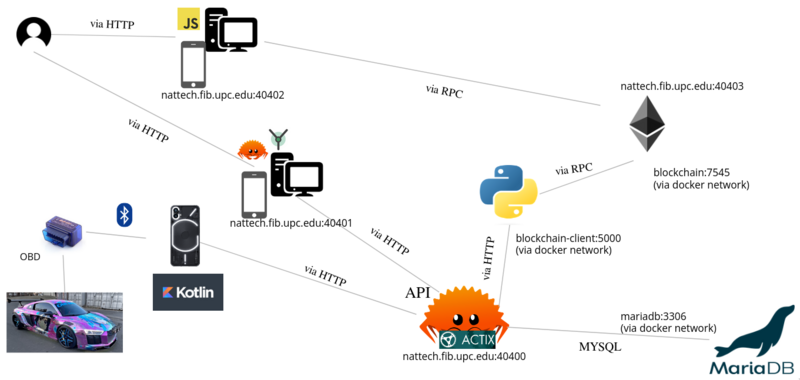

CarTracking.

## Contents

* [1 Introducción](#Introducci.C3.B3n)
  + [1.1 ¿Qué es CarTracking?](#.C2.BFQu.C3.A9_es_CarTracking.3F)
* [2 Infraestructura y tecnologías usadas](#Infraestructura_y_tecnolog.C3.ADas_usadas)
  + [2.1 Despliegue](#Despliegue)
* [3 Documentación y repositorios](#Documentaci.C3.B3n_y_repositorios)
  + [3.1 Memoria](#Memoria)
  + [3.2 Código fuente](#C.C3.B3digo_fuente)

# Introducción[[edit](/pti/index.php?title=Categor%C3%ADa:CarTracking&veaction=edit&section=1 "Edit section: Introducción") | [edit source](/pti/index.php?title=Categor%C3%ADa:CarTracking&action=edit&section=1 "Edit section: Introducción")]

## ¿Qué es CarTracking?[[edit](/pti/index.php?title=Categor%C3%ADa:CarTracking&veaction=edit&section=2 "Edit section: ¿Qué es CarTracking?") | [edit source](/pti/index.php?title=Categor%C3%ADa:CarTracking&action=edit&section=2 "Edit section: ¿Qué es CarTracking?")]

CarTracking es un proyecto que tiene el objetivo de dar al usuario un método fácil y sencillo de consultar los datos de la centralita de su coche. Esto le permite conocer consumos, velocidad media, kilómetros recorridos ente otros datos que el coche tiene pero este no muestra.

Gracias a un lector OBD2 Bluetooth genérico, la aplicación móvil de nuestro sistema y nuestra aplicación web, el usuario puede cómodamente acceder a los datos que recolecta su coche. Además damos la posibilidad de certificar mediante blockchain el kilometraje del vehículo.

**Video de demostración**: <https://www.youtube.com/watch?v=OHfLq0G7820>

# Infraestructura y tecnologías usadas[[edit](/pti/index.php?title=Categor%C3%ADa:CarTracking&veaction=edit&section=3 "Edit section: Infraestructura y tecnologías usadas") | [edit source](/pti/index.php?title=Categor%C3%ADa:CarTracking&action=edit&section=3 "Edit section: Infraestructura y tecnologías usadas")]

Esquema Final.

Para este proyecto se han usados una amplia variedad de tecnologías:

* **Frontend**: Yew (Rust)
* **Backend**: Rust (Framework Actix Web y Diesel para la comunicación con la base de datos)
* **Aplicación móvil**: Kotlin
* **Blockchain**: Ganache (Truffle), Javascript y Solidity
* **Blockchain Client**: Python
* **Base de datos**: MariaDB

## Despliegue[[edit](/pti/index.php?title=Categor%C3%ADa:CarTracking&veaction=edit&section=4 "Edit section: Despliegue") | [edit source](/pti/index.php?title=Categor%C3%ADa:CarTracking&action=edit&section=4 "Edit section: Despliegue")]

Hemos usado docker-compose para levantar todos los servicios.

# Documentación y repositorios[[edit](/pti/index.php?title=Categor%C3%ADa:CarTracking&veaction=edit&section=5 "Edit section: Documentación y repositorios") | [edit source](/pti/index.php?title=Categor%C3%ADa:CarTracking&action=edit&section=5 "Edit section: Documentación y repositorios")]

Aquí está disponible la memoria y la documentación del proyecto junto al código fuente.

También hay disponible más documentación en el README.md del proyecto. Para saber sobre los tests acceder a /backend/tests.

## Memoria[[edit](/pti/index.php?title=Categor%C3%ADa:CarTracking&veaction=edit&section=6 "Edit section: Memoria") | [edit source](/pti/index.php?title=Categor%C3%ADa:CarTracking&action=edit&section=6 "Edit section: Memoria")]

* [Memoria](/pti/images/9/92/Memoria.pdf "Memoria.pdf")
* <https://drive.google.com/file/d/1BHj8pqeyhsrR4mizl0lmtu9xOxGxe71_/view?usp=sharing>
* <https://github.com/s4izh/car-tracking-fullstack/blob/main/memoria.pdf>

## Código fuente[[edit](/pti/index.php?title=Categor%C3%ADa:CarTracking&veaction=edit&section=7 "Edit section: Código fuente") | [edit source](/pti/index.php?title=Categor%C3%ADa:CarTracking&action=edit&section=7 "Edit section: Código fuente")]

* <https://github.com/s4izh/car-tracking-fullstack>
* <https://github.com/FerranFuentes/car-tracking-fullstack>
* <https://github.com/marcelituu/car-tracking-fullstack>
* <https://github.com/R-kill-9/car-tracking-fullstack>
* <https://github.com/adriroyo/car-tracking-fullstack>