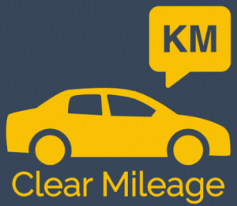
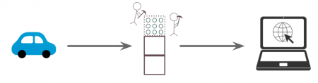
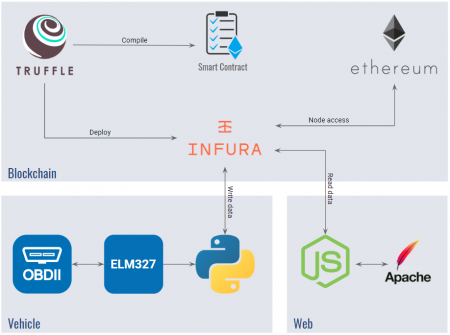
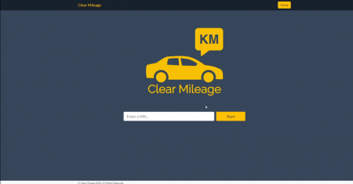
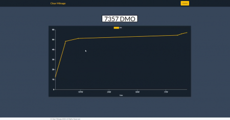

ClearMileage.

Clear Mileage es una dApp hecha con el objetivo de garantizar que el kilometraje de un coche es verídico de cara a la compraventa de coches de segunda mano.

## Contents

* [1 Introducción](#Introducci.C3.B3n)
  + [1.1 ¿Por qué ClearMileage?](#.C2.BFPor_qu.C3.A9_ClearMileage.3F)
  + [1.2 Nuestra Solución](#Nuestra_Soluci.C3.B3n)
* [2 Arquitectura](#Arquitectura)
* [3 Uso por parte de un usuario](#Uso_por_parte_de_un_usuario)
* [4 Uso por parte de un vehículo](#Uso_por_parte_de_un_veh.C3.ADculo)
* [5 Enlaces](#Enlaces)

# Introducción[[edit](/pti/index.php?title=Categor%C3%ADa:ClearMileage&veaction=edit&section=1 "Edit section: Introducción") | [edit source](/pti/index.php?title=Categor%C3%ADa:ClearMileage&action=edit&section=1 "Edit section: Introducción")]

## ¿Por qué ClearMileage?[[edit](/pti/index.php?title=Categor%C3%ADa:ClearMileage&veaction=edit&section=2 "Edit section: ¿Por qué ClearMileage?") | [edit source](/pti/index.php?title=Categor%C3%ADa:ClearMileage&action=edit&section=2 "Edit section: ¿Por qué ClearMileage?")]

Desde siempre, uno de los factores más importantes a la hora de comprar un coche de segunda mano, es la cantidad de kilómetros hechos del vehículo. Una preocupación de los compradores es el hecho de si el kilometraje del vehículo se ha falsificado, reduciendo el número de kilómetros hechos y encareciendo así el producto.

Según la NHTSA, se estima que en los Estados Unidos de América se venden cada año unos 450.000 vehículos con el odómetro falsificado. Con este dato presente, queremos intentar solucionar este problema.

## Nuestra Solución[[edit](/pti/index.php?title=Categor%C3%ADa:ClearMileage&veaction=edit&section=3 "Edit section: Nuestra Solución") | [edit source](/pti/index.php?title=Categor%C3%ADa:ClearMileage&action=edit&section=3 "Edit section: Nuestra Solución")]

Utilizamos una serie de tecnologías para dar más seguridad al comprador del vehículo de que el kilometraje no ha sido falsificado. Hemos aprovechado la inmutabilidad y el carácter público de una blockchain para usarla como base de datos, donde guardamos el kilometraje del vehículo hecho a lo largo del tiempo, para que sea verificable por cualquier persona y que no se pueda falsificar a la hora de su posible venta en el mercado de segunda mano.

Flujo de los datos del vehículo

# Arquitectura[[edit](/pti/index.php?title=Categor%C3%ADa:ClearMileage&veaction=edit&section=4 "Edit section: Arquitectura") | [edit source](/pti/index.php?title=Categor%C3%ADa:ClearMileage&action=edit&section=4 "Edit section: Arquitectura")]

El proyecto está dividido en tres partes bien diferenciadas:

* Blockchain: Utilizamos un smart contract en Ethereum que sirve como base de datos de todos los vehículos que utilizan esta dApp.
* Web: Aplicación web que utiliza el ususario que quiere consultar el kilometraje de cualquier vehículo. Se ocupa de leer los datos de la blockchain y representarlos de forma legible para el usuario.
* Vehículo: Aplicación que se ocupa de comunicarse con el vehículo y de enviar los datos del kilometraje a la blockchain. Está escrita en python y se comunica con el vehículo mediante ELM 327 y OBD.

Componentes

# Uso por parte de un usuario[[edit](/pti/index.php?title=Categor%C3%ADa:ClearMileage&veaction=edit&section=5 "Edit section: Uso por parte de un usuario") | [edit source](/pti/index.php?title=Categor%C3%ADa:ClearMileage&action=edit&section=5 "Edit section: Uso por parte de un usuario")]

Un usario de nuestra apliación web introduce un VIN (vehicle identification number).

Aplicación web

Si el VIN está registrado en la blockchain, se muestra la matrícula del vehículo y un gráfico con el kilometraje a lo largo del tiempo.

Gráfico

# Uso por parte de un vehículo[[edit](/pti/index.php?title=Categor%C3%ADa:ClearMileage&veaction=edit&section=6 "Edit section: Uso por parte de un vehículo") | [edit source](/pti/index.php?title=Categor%C3%ADa:ClearMileage&action=edit&section=6 "Edit section: Uso por parte de un vehículo")]

Se debe de tener conectada una interfaz ELM 327 al puerto OBD del vehículo y ejecutar el script python. La primera vez se debe introducir la configuración que se muestra en consola. El script se encarga de enviar los datos necesarios a la blockchain una vez se apaga el vehículo.

Durante el proyecto hemos usado un simulador OBD así que la conexión está configurada con un puerto serie virtual. Se tendría que cambiar para acomodar el tipo de conexión del dispositivo ELM 327 que se esté utilizando.

# Enlaces[[edit](/pti/index.php?title=Categor%C3%ADa:ClearMileage&veaction=edit&section=7 "Edit section: Enlaces") | [edit source](/pti/index.php?title=Categor%C3%ADa:ClearMileage&action=edit&section=7 "Edit section: Enlaces")]

El código final del proyecto se puede consultar en el repositorio en [Github](https://github.com/jc4sombrero/ClearMileage).

La versión final del smart contract se encuentra publicada en [Ropsten](https://ropsten.etherscan.io/address/0x32eb8b9D9bcD2d8ED5d5294250d4D39497882a34) para que cualquiera pueda hacer uso de éste.