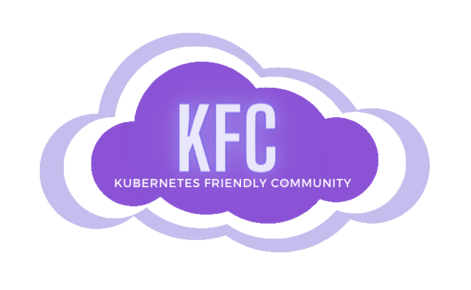
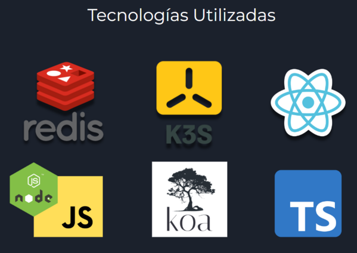

## Contents

* [1 Introducción](#Introducci.C3.B3n)
* [2 Infraestructura](#Infraestructura)
* [3 Potencial de innovación](#Potencial_de_innovaci.C3.B3n)
* [4 Tecnologías utilizadas](#Tecnolog.C3.ADas_utilizadas)
* [5 Frontend](#Frontend)
* [6 Backend](#Backend)
* [7 Futuras Mejoras](#Futuras_Mejoras)
  + [7.1 Link](#Link)

# Introducción[[edit](/pti/index.php?title=Categor%C3%ADa:ClusterK3SComunitario&veaction=edit&section=1 "Edit section: Introducción") | [edit source](/pti/index.php?title=Categor%C3%ADa:ClusterK3SComunitario&action=edit&section=1 "Edit section: Introducción")]

Nuestro proyecto consiste en crear un cluster de K3s alojado en una máquina de la facultad, que tiene el papel de nodo master/servidor.
A este nodo principal se le añaden nodos externos que tendrán el papel de trabajadores. Uno de los objetivos de nuestro proyecto, a parte de entender el funcionamiento de éstas nuevas tecnologías, era dar la posibilidad de poder montar clústers fácilmente entre un grupo de personas. La idea que principalmente nos vino a la cabeza era que este recurso fuese preferiblemente utilizado por grupos de amigos que quisieran compartir recursos entre ellos. Todo esto con la finalidad de poder crear un sistema de compartición de recursos de hardware que permite alojar servicios, siendo los mismos usuarios los que aportan estos recursos.

# Infraestructura[[edit](/pti/index.php?title=Categor%C3%ADa:ClusterK3SComunitario&veaction=edit&section=2 "Edit section: Infraestructura") | [edit source](/pti/index.php?title=Categor%C3%ADa:ClusterK3SComunitario&action=edit&section=2 "Edit section: Infraestructura")]

Disponemos de un servidor HTTP en el que implementamos cinco APIs que a través de la web nos dan diferentes servicios:

* Login (“/api/loginUser”) (para que el usuario pueda acceder a los servicios de la aplicación web)
* Register (“/api/registerUser”) (para registrar a los usuarios y puedan hacer el login)
* Descargar script de instalación para el cliente (“/api/getscript”)
* Mostrar el token de K3S (“/api/getToken”) (para conseguir el token de K3S y pueda acceder a los servicios)
* Enviar el fichero .yaml al servidor (“/api/uploadYAML”)) (para correr el servicio que se pasa como YAML).

Tanto las APIs como la aplicación web acceden a una base de datos Redis para autenticar a los usuarios.

# Potencial de innovación[[edit](/pti/index.php?title=Categor%C3%ADa:ClusterK3SComunitario&veaction=edit&section=3 "Edit section: Potencial de innovación") | [edit source](/pti/index.php?title=Categor%C3%ADa:ClusterK3SComunitario&action=edit&section=3 "Edit section: Potencial de innovación")]

Con este proyecto se permite que usuarios privados o pequeñas empresas que disponen de recursos limitados, dispongan de una infraestructura mayor en momentos puntuales de necesidad, sin tener que hacer un desembolso muy elevado.
Los principales consumidores objetivo son todos aquellos usuarios independientes o empresas que quieran desplegar sus servicios o experimentar con ellos, sin tener que recurrir a opciones privadas de alto coste.
Los principales competidores de nuestro proyecto son todas las empresas que ofrecen servicios de alojamiento en la nube y que poseen su propia infraestructura de hardware para ofrecer estos servicios. La competitividad que ofrecemos es la ausencia de infraestructura propia a mantener, ya que son los usuarios del sistema los que aportan todo el hardware, reduciendo así los costes de operación. Aún así, creemos que nuestro modelo de negocio no va dirigido a la obtención de ingresos ni a competir contra otras opciones existentes en el mercado, sino a un enfoque orientado a la colaboración comunitaria. Nuestra intención es poder dar un servicio accesible y asequible para todos los usuarios, sin depender del pago a otras empresas que ofrecen este servicio.
En cuanto a los principales riesgos y amenazas del proyecto, podemos decir que son todos los relacionados con la seguridad, ya que se trata de un sistema comunitario en el que todo el mundo puede acceder.
Los gastos principales de la compañía consisten en el mantenimiento y funcionamiento del servidor central que gestiona los nodos y el servidor web. No habrá costes asociados a la adquisición de hardware para crear los nodos o a su mantenimiento, ya que estos serán cedidos por los usuarios.

# Tecnologías utilizadas[[edit](/pti/index.php?title=Categor%C3%ADa:ClusterK3SComunitario&veaction=edit&section=4 "Edit section: Tecnologías utilizadas") | [edit source](/pti/index.php?title=Categor%C3%ADa:ClusterK3SComunitario&action=edit&section=4 "Edit section: Tecnologías utilizadas")]

**React**: teníamos la idea de hacer una interfaz rápida, limpia y simple para que el usuario pueda entender, de forma intuitiva, su funcionamiento. Es por eso que hemos escogido React que es un framework basado en javascript que se basa en el uso de componentes, es decir, cada componente es una pieza independiente de la UI y puede ser reutilizada varias veces en la aplicación. Así pues haría el proceso de desarrollo del frontend mucho más fácil.

**Koa.js (NodeJS)**: como nuestro frontend está en JavaScript, y que, gracias a NodeJS, puede ser utilizado en el backend y tiene librerías para todo, decidimos utilizar NodeJS. Escogimos Koa.js (framework de backend de NodeJS) por que tiene menos funcionalidades implementadas por defecto que Express (el framework de backend más conocido de NodeJS).

**Typescript**: en un punto bastante avanzado del proyecto nos dimos cuenta de que JavaScript era un falso amigo y nos causaba muchos problemas. En particular su tipado dinámico combinado con el sistema asíncrono causó muchos problemas difíciles de detectar. Por ese motivo añadimos TypeScript al proyecto, el uso principal de este era añadir anotaciones de tipos y utilizarlo como Linter, de esta manera resolvimos muchos de estos problemas rápidamente.

**Redis:** como la mayor parte de nuestro proyecto recae sobre K3S y una sesión de la página web, los únicos datos que al final almacenamos serán los datos relacionados con cada usuario: username, password. Nos interesaba una DB que fuese rápida y eficiente. Es por eso que hemos decidido usar Redis ya que es una base de datos no relacional, muy escalable y de alto rendimiento, ya que guarda los datos en memoria. Además tiene una muy buena integración con NodeJS.

**K3S**: es una distribución de Kubernetes para entornos menos potentes ya que resulta ser una versión simplificada de Kubernetes (K8S). En un principio planteamos usar K8S pero al madurar un poco más la idea de nuestro proyecto, creímos oportuno usar K3S. Como este proyecto está dirigido al aprovechamiento de hardware, pensamos que K3S acabaría siendo una mejor opción por que asumimos que los recursos que se donan no son particularmente potentes.

# Frontend[[edit](/pti/index.php?title=Categor%C3%ADa:ClusterK3SComunitario&veaction=edit&section=5 "Edit section: Frontend") | [edit source](/pti/index.php?title=Categor%C3%ADa:ClusterK3SComunitario&action=edit&section=5 "Edit section: Frontend")]

Para la implementación del frontend de la aplicación web, hemos usado el framework React para la lógica de las páginas y luego HTML + CSS para el diseño de la UI. La intención era tener un diseño limpio y intuitivo para el usuario, es por eso que hemos decidido que la página web tenga la siguiente estructura: Página de Home, página de login, página de registro, página de menú del usuario, página para registrar un nodo y página para correr un servicio.

La intención de la página web es simplemente cogerle la mano al usuario para que pueda acceder a las funcionalidades que nosotros aportamos. Es por eso que en cada una de las páginas que tienen un valor más técnico, le proporcionamos la ayuda suficiente. Así pues, cualquier usuario de cualquier contexto puede tener una buena experiencia.

# Backend[[edit](/pti/index.php?title=Categor%C3%ADa:ClusterK3SComunitario&veaction=edit&section=6 "Edit section: Backend") | [edit source](/pti/index.php?title=Categor%C3%ADa:ClusterK3SComunitario&action=edit&section=6 "Edit section: Backend")]

La estructura del código del backend sigue la estructura de los apartados de la web. La idea de este diseño es que en un futuro se podría dividir el webserver y separar las API y lógica de K3S y de Wireguard si esto fuese necesario.

**main.ts:** Punto de entrada a la aplicación, contiene la función main que se ejecuta. Configura una instancia de Koa y la ejecuta.

**api.ts**: Incluye el Router de Koa principal. Empaqueta todas las API declaradas y las exporta para ser montadas desde main.

**api/endpoints**: Directorio que contiene el código de cada API. Se han separado según su aplicación.

**utils**: La mayoría de la lógica de nuestra aplicación se sitúa en estos ficheros. Las API utilizan funciones declaradas en estos ficheros para comunicarse con K3S, Redis o Wireguard.

**types:** Contiene Tipos propios de TypeScript. Sólo fue añadido para reducir los avisos generados por TypeScript relacionados con el body de los requests a las API. Sólo incluye dos Tipos y són de poco interés, describen los campos que deberían tener bodys concretos.

# Futuras Mejoras[[edit](/pti/index.php?title=Categor%C3%ADa:ClusterK3SComunitario&veaction=edit&section=7 "Edit section: Futuras Mejoras") | [edit source](/pti/index.php?title=Categor%C3%ADa:ClusterK3SComunitario&action=edit&section=7 "Edit section: Futuras Mejoras")]

En este proyecto nos hubiera gustado alcanzar más objetivos que por falta de tiempo no hemos podido conseguir como:

* Un sistema de monitorización con Grafana y Prometheus
* Registro de imágenes de Docker propio
* Sistema de configuración de la aplicación
* Sistema de tokens para la propagación de identidad y privilegios
* Uso de Kubernetes Ingress para exponer los servicios al usuario.

## Link[[edit](/pti/index.php?title=Categor%C3%ADa:ClusterK3SComunitario&veaction=edit&section=8 "Edit section: Link") | [edit source](/pti/index.php?title=Categor%C3%ADa:ClusterK3SComunitario&action=edit&section=8 "Edit section: Link")]

Los códigos utilizados en este proyecto se pueden encontrar en: <https://github.com/zhesnaile/pti-cloud>

Video sobre como instalar el servidor: <https://drive.google.com/file/d/1j-JEz3LMa71f7WXdIUm2JVUnTYT_VOZb/view?usp=sharing>

Video donde se muestra la instalación del cliente: <https://drive.google.com/file/d/1JkRie19kGaPZ0EMivHF3OzKXj_SmLgMU/view?usp=sharing>

Video donde se muestra como correr un servicio: <https://drive.google.com/file/d/1cMH_8djfVFy1Lz2kHXFIk5JLPszpteIK/view?usp=sharing>