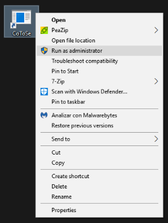
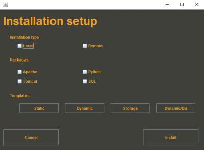
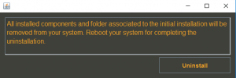

**Convert To Server consiste en un ejecutable que permita configurar un sistema para que actúe como un servidor.**

## Contents

* [1 ¿Qué es CoToSe?](#.C2.BFQu.C3.A9_es_CoToSe.3F)
* [2 Caracteristicas de CoToSe](#Caracteristicas_de_CoToSe)
* [3 ¿Cómo funciona externamente CoToSe?](#.C2.BFC.C3.B3mo_funciona_externamente_CoToSe.3F)
  + [3.1 Arranque](#Arranque)
  + [3.2 Selección de paquetes](#Selecci.C3.B3n_de_paquetes)
  + [3.3 Instalación](#Instalaci.C3.B3n)
  + [3.4 Desinstalación](#Desinstalaci.C3.B3n)
* [4 ¿Cómo funciona internamente CoToSe?](#.C2.BFC.C3.B3mo_funciona_internamente_CoToSe.3F)
  + [4.1 Padre (principal)](#Padre_.28principal.29)
  + [4.2 Hijos (paquetes)](#Hijos_.28paquetes.29)

## ¿Qué es CoToSe?[[edit](/pti/index.php?title=Categor%C3%ADa:CoToSe&veaction=edit&section=1 "Edit section: ¿Qué es CoToSe?") | [edit source](/pti/index.php?title=Categor%C3%ADa:CoToSe&action=edit&section=1 "Edit section: ¿Qué es CoToSe?")]

CoToSe (Convert to Server) nace de la idea de crear un fichero ejecutable que permita configurar un sistema para que actúe como un servidor. Sabemos que los procesos de instalación de estas herramientas pueden llegar a ser muy costosos y nos pueden llevar bastante tiempo, por eso lo que prentendemos es evitar a los usuarios este trabajo de tal forma que puedan realizar la instalación y configuración de herramientas de server de forma muy simple, senzilla, rápida y cómoda.
CoToSe está enfocado a dos tipos de usuarios:

* **Usuario sin conocimiento informático** - Ofrecemos un ejecutable multiplataforma para poder instalar y confirgurar (de forma rápida y transparente) los paquetes (Tomcat7, SQL, Apache, etc.) que quiera el usuario simplemente con un click.
* **Usuario con conocimiento informático** - Ofrecemos la posibilidad de poder realizar la instalación y configuración de los mismos paquetes de forma remota a uno o mas equipos a la vez (igualmente de forma senzilla).

La última funcionalidad que nos ofrece CoToSe es la desinstalación de los paquetes que hayamos instalado.

## Caracteristicas de CoToSe[[edit](/pti/index.php?title=Categor%C3%ADa:CoToSe&veaction=edit&section=2 "Edit section: Caracteristicas de CoToSe") | [edit source](/pti/index.php?title=Categor%C3%ADa:CoToSe&action=edit&section=2 "Edit section: Caracteristicas de CoToSe")]

* Multiplataforma (ejecutable en Windows, Linux, MacOS)
* Modular
* Selección de versión
* Instalación remota masiva
* Altamente escalable

## ¿Cómo funciona externamente CoToSe?[[edit](/pti/index.php?title=Categor%C3%ADa:CoToSe&veaction=edit&section=3 "Edit section: ¿Cómo funciona externamente CoToSe?") | [edit source](/pti/index.php?title=Categor%C3%ADa:CoToSe&action=edit&section=3 "Edit section: ¿Cómo funciona externamente CoToSe?")]

CoToSe es una aplicación muy intuitiva y muy fácil de usar. A continuación veremos los pasos que hay que seguir para su correcto uso.

### Arranque[[edit](/pti/index.php?title=Categor%C3%ADa:CoToSe&veaction=edit&section=4 "Edit section: Arranque") | [edit source](/pti/index.php?title=Categor%C3%ADa:CoToSe&action=edit&section=4 "Edit section: Arranque")]

Tenemos que tener en cuenta que trabajamos con una aplicación multiplataforma, por este movtivo la utilización de esta aplicación es identica para su uso en Windows, Linux y MacOS. Deberemos ejecutar CoToSe.exe en **modo Administrador**.

Luego nos aparecerá una pantalla de carga.

Y a continuación la interfaz principal de la aplicación.

### Selección de paquetes[[edit](/pti/index.php?title=Categor%C3%ADa:CoToSe&veaction=edit&section=5 "Edit section: Selección de paquetes") | [edit source](/pti/index.php?title=Categor%C3%ADa:CoToSe&action=edit&section=5 "Edit section: Selección de paquetes")]

Podremos seleccionar y deseleccionar todos los paquetes (rojo) que queramos. Además podremos usar plantillas (azul) que nos seleccionaran automaticamente un conjunto de paquetes (segun el uso del "server").

### Instalación[[edit](/pti/index.php?title=Categor%C3%ADa:CoToSe&veaction=edit&section=6 "Edit section: Instalación") | [edit source](/pti/index.php?title=Categor%C3%ADa:CoToSe&action=edit&section=6 "Edit section: Instalación")]

Primero deberemos seleccionar si se quiere hacer la instalación en local o en remoto (azul). Una vez terminemos de comprobar que los paquetes y el tipo de instalación seleccionamos, procederemos a la instalación clicando en el botón Install (rojo).

En cuanto la instalación termine, se nos abrirá una ventana que dice que la instalación se ha realizado con éxito.

### Desinstalación[[edit](/pti/index.php?title=Categor%C3%ADa:CoToSe&veaction=edit&section=7 "Edit section: Desinstalación") | [edit source](/pti/index.php?title=Categor%C3%ADa:CoToSe&action=edit&section=7 "Edit section: Desinstalación")]

En caso de que hayamos instalado paquetes desde la aplicación, la segunda vez que la ejecutemos nos saldrá la misma interfaz de carga, pero a continuación nos saldra una nueva interfaz de desinstalación. En esta interfaz deberemos clickar al botón Uninstall y se desinstalarán todos los paquetes que hubiesemos instalado previamente.

## ¿Cómo funciona internamente CoToSe?[[edit](/pti/index.php?title=Categor%C3%ADa:CoToSe&veaction=edit&section=8 "Edit section: ¿Cómo funciona internamente CoToSe?") | [edit source](/pti/index.php?title=Categor%C3%ADa:CoToSe&action=edit&section=8 "Edit section: ¿Cómo funciona internamente CoToSe?")]

La parte de código esta compuesta por dos partes, ejecución principal (lo llamaremos padre) y los paquetes (los llamaremos hijos).

### Padre (principal)[[edit](/pti/index.php?title=Categor%C3%ADa:CoToSe&veaction=edit&section=9 "Edit section: Padre (principal)") | [edit source](/pti/index.php?title=Categor%C3%ADa:CoToSe&action=edit&section=9 "Edit section: Padre (principal)")]

Esta parte está programado en java y tiene varias funciones:

* Detectar el SO en el que trabajamos
* Lanzar y eliminar las interfaces
* Leer los datos seleccionados por el usuario y llamar a las funciones de instalación o desinstalación de los distintos paquetes

### Hijos (paquetes)[[edit](/pti/index.php?title=Categor%C3%ADa:CoToSe&veaction=edit&section=10 "Edit section: Hijos (paquetes)") | [edit source](/pti/index.php?title=Categor%C3%ADa:CoToSe&action=edit&section=10 "Edit section: Hijos (paquetes)")]

Esta parte está programada en ficheros .java, .sh, .bat y .ps1 (.sh, .bat y .ps1 para scripts). Las funciones de estos paquetes consiten en:

* Conectarse al servidor remoto
* Instalar el paquete en local en Windows(.bat y .ps1), Linux(.sh), MacOS(.sh) o remotamente en Linux(.sh)
* Desinstalar el paquete en local en Windows(.bat y .ps1), Linux(.sh), MacOS(.sh) o remotamente en Linux(.sh)