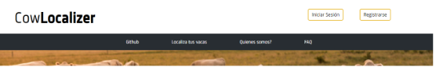

## Contents

* [1 ¿Qué es Cowlocalizer?](#.C2.BFQu.C3.A9_es_Cowlocalizer.3F)
* [2 Motivación](#Motivaci.C3.B3n)
* [3 Visión general](#Visi.C3.B3n_general)
  + [3.1 Demo](#Demo)
  + [3.2 Tecnologías usadas](#Tecnolog.C3.ADas_usadas)
  + [3.3 Funcionamiento general](#Funcionamiento_general)
  + [3.4 Funcionamiento específico](#Funcionamiento_espec.C3.ADfico)
    - [3.4.1 Funcionamiento TTGO T-Beam](#Funcionamiento_TTGO_T-Beam)
      * [3.4.1.1 Funcionamiento tecnología GPS](#Funcionamiento_tecnolog.C3.ADa_GPS)
      * [3.4.1.2 Funcionamiento tecnología LoRa](#Funcionamiento_tecnolog.C3.ADa_LoRa)
      * [3.4.1.3 Funcionamiento tecnología WiFi](#Funcionamiento_tecnolog.C3.ADa_WiFi)
    - [3.4.2 Funcionamiento Google Maps API](#Funcionamiento_Google_Maps_API)
* [4 Requerimiento técnico](#Requerimiento_t.C3.A9cnico)
* [5 Arquitectura](#Arquitectura)
  + [5.1 Front end](#Front_end)
  + [5.2 Back end](#Back_end)
    - [5.2.1 Node.js](#Node.js)
    - [5.2.2 Mongo DB](#Mongo_DB)
* [6 Conclusiones y futuras mejoras](#Conclusiones_y_futuras_mejoras)
  + [6.1 Conclusiones](#Conclusiones)
  + [6.2 Futuras mejoras](#Futuras_mejoras)
* [7 Manual de usuario](#Manual_de_usuario)

# ¿Qué es Cowlocalizer?[[edit](/pti/index.php?title=Categor%C3%ADa:CowTracking&veaction=edit&section=1 "Edit section: ¿Qué es Cowlocalizer?") | [edit source](/pti/index.php?title=Categor%C3%ADa:CowTracking&action=edit&section=1 "Edit section: ¿Qué es Cowlocalizer?")]

CowLocalizer es un proyecto pensado y desarrollado para la localización de animales. Así, podemos ayudar en el desarrollo de la tecnología enfocado al cuidado de animales y ramaderia y pensamos que también puede impulsar a los desarolladores a hacer la tecnología más justa: pensando en los casos de uso de la población que viva en estas zonas y poniendo a su disposición la técnica, adaptandonos al terreno físico y a la conectividad actual.

# Motivación[[edit](/pti/index.php?title=Categor%C3%ADa:CowTracking&veaction=edit&section=2 "Edit section: Motivación") | [edit source](/pti/index.php?title=Categor%C3%ADa:CowTracking&action=edit&section=2 "Edit section: Motivación")]

Hoy en día, la tecnología ha avanzado y popularizado a un ritmo muy rápido. Mientras que en los años 90 en España era inimaginable que en prácticamente cada casa hubiera un ordenador con conexión a Internet, hoy en día esta quimera es una realidad.

No obstante, esta popularización no se ha llevado al mismo ritmo en todos los lugares. Por ejemplo, en zonas rurales, muchas veces las tecnologías de acceso a internet móvil brillan por su ausencia.

Este hecho ha llevado a que muchas veces la tecnología no se desarrollase teniendo en cuenta las necesidades de toda la población. Mientras en las grandes ciudades la gente adapta sus hogares a la domótica y el IoT, hay poblaciones en las cuales aún se está reclamando el derecho a una línea de acceso a Internet de velocidad y estabilidad suficiente.

Pensando en este tipo de áreas, nos encontramos con la tecnología LoRa, que se trata de una forma de transmisión de datos de bajo consumo y largo alcance. Pensamos que podría ayudar mucho en aquellas zonas en las cuales no tenemos un acceso de calidad a internet móvil, y enfocándolo a las necesidades de la población.

# Visión general[[edit](/pti/index.php?title=Categor%C3%ADa:CowTracking&veaction=edit&section=3 "Edit section: Visión general") | [edit source](/pti/index.php?title=Categor%C3%ADa:CowTracking&action=edit&section=3 "Edit section: Visión general")]

## Demo[[edit](/pti/index.php?title=Categor%C3%ADa:CowTracking&veaction=edit&section=4 "Edit section: Demo") | [edit source](/pti/index.php?title=Categor%C3%ADa:CowTracking&action=edit&section=4 "Edit section: Demo")]

## Tecnologías usadas[[edit](/pti/index.php?title=Categor%C3%ADa:CowTracking&veaction=edit&section=5 "Edit section: Tecnologías usadas") | [edit source](/pti/index.php?title=Categor%C3%ADa:CowTracking&action=edit&section=5 "Edit section: Tecnologías usadas")]

CowLocalizer es una aplicación web que depende de la tecnología lora . Aquí todos los animales que están siendo localizados tienen asignada la placa lora y usamos la tecnología Lora para enviar las ubicaciones reales de los animales al backend.Usamos Mongodb, NodeJS, servidor de la fib, Html , JS , CSS y API de Google maps.

Todos los componentes que hemos usado menos Google maps API son open source.

## Funcionamiento general[[edit](/pti/index.php?title=Categor%C3%ADa:CowTracking&veaction=edit&section=6 "Edit section: Funcionamiento general") | [edit source](/pti/index.php?title=Categor%C3%ADa:CowTracking&action=edit&section=6 "Edit section: Funcionamiento general")]

Las siguientes son las principales funcionalidades del CowLocalizer:
Registrar usuario en el sitio web
El usuario registrado puede entonces mirar su perfil que tendrá información básica como el nombre de usuario,correo ,contraseñas y opciones para cambiar la contraseña y así sucesivamente.
El usuario puede consultar los localizadores que tiene y añadir localizadores también. Aquí cada localizador tiene asignada la ID que tiene que ser única para todos los localizadores (placa lora).
Una vez que el usuario ha agregado su localizador, es decir, las vacas registradas en el sistema, con la ayuda de los Google maps, puede monitorear la posición de las vacas en todo momento.
Para no tener el conflicto de Ids cada usuario que tenga la placa lora lista para ser colgada en las vacas tendrá que hablar con el administrador para obtener las identificaciones que están disponibles para ser asignadas a todas las vacas.

## Funcionamiento específico[[edit](/pti/index.php?title=Categor%C3%ADa:CowTracking&veaction=edit&section=7 "Edit section: Funcionamiento específico") | [edit source](/pti/index.php?title=Categor%C3%ADa:CowTracking&action=edit&section=7 "Edit section: Funcionamiento específico")]

### Funcionamiento TTGO T-Beam[[edit](/pti/index.php?title=Categor%C3%ADa:CowTracking&veaction=edit&section=8 "Edit section: Funcionamiento TTGO T-Beam") | [edit source](/pti/index.php?title=Categor%C3%ADa:CowTracking&action=edit&section=8 "Edit section: Funcionamiento TTGO T-Beam")]

En este caso, tanto los localizadores de los animales como la “estación central” que se encargará de recibir la señal enviada por los demás, tratan de placas TTGO T-Beam.

Estas placas, que se pueden encontrar por unos 22€ en el mercado, disponen de un procesador ESP32, GPS, conectividad LoRa, WiFi y Bluetooth.

En lo que se refiere a la alimentación de las mismas, se pueden alimentar mediante puerto USB Micro A (mediante el cual también podremos establecer una conexión serie con el ordenador, a modo de pantalla, para poder debuggear nuestro programa) o bien con pilas 18650 de 3.7V. El precio de las mismas es ligeramente superior al de pilas estándar AA.

Además, las placas son muy ligeras, de tal manera que podemos, por ejemplo, mediante alguna especie de collar, hacer que sean portadas por los animales con total seguridad.

Como hemos comentado brevemente, la tecnología LoRa se trata de radiofrecuencia capaz de enviar datos a una gran distancia y baja velocidad. Pese a las limitaciones de esta tecnología, las prestaciones que nos ofrece son más que suficientes para este caso de uso.

En lo que se refiere a nuestro proyecto, tendremos dos tipos de placa diferentes: las placas enviadoras (las que “tienen los animales encima” y se encargan de enviar su propia posición y formar la mesh, explicaremos este funcionamiento más adelante) y las receptoras, que son las encargadas de escuchar en todo momento el espacio LoRa y, en caso de que sean capaces de encontrar algún mensaje con una posición válida (es decir, en la que hayan participado más de tres satélites para su cálculo), la enviará mediante WiFi al endpoint habilitado en el servidor.

Así entonces, las placas enviadoras enviarán su posición cada 5 segundos. En caso de no esté enviando su posición, estará escuchando el medio en busca de mensajes LoRa. En caso de haber recibido uno, primero mirará el identificador del mensaje (en el punto 2.3.1.2) explicaremos la estructura del mensaje) y, en caso de que lo haya recibido y enviado ya, o bien si ese mensaje viene de la misma placa, no lo enviará. En caso contrario, esperará entre medio segundo y cinco para reenviar el mensaje. La razón de esta espera variable es la de evitar colisiones en el momento en que haya varias placas que reciban un mensaje reenviable a la vez.

#### Funcionamiento tecnología GPS[[edit](/pti/index.php?title=Categor%C3%ADa:CowTracking&veaction=edit&section=9 "Edit section: Funcionamiento tecnología GPS") | [edit source](/pti/index.php?title=Categor%C3%ADa:CowTracking&action=edit&section=9 "Edit section: Funcionamiento tecnología GPS")]

En este caso, las placas que envían su propia posición, lo primero que harán es obtenerla mediante los satélites GPS.

Como ya sabemos, esta tecnología funciona trilaterando la posición conectándose con al menos tres satélites. De esta manera, dado que los satélites saben la distancia a la cual se mantienen entre ellos, podemos saber fácilmente la posición relativa del receptor (en este caso, de la placa TTGO).

#### Funcionamiento tecnología LoRa[[edit](/pti/index.php?title=Categor%C3%ADa:CowTracking&veaction=edit&section=10 "Edit section: Funcionamiento tecnología LoRa") | [edit source](/pti/index.php?title=Categor%C3%ADa:CowTracking&action=edit&section=10 "Edit section: Funcionamiento tecnología LoRa")]

Como hemos mencionado anteriormente, LoRa es una tecnología inalámbrica la cual emplea un tipo de modulación en radiofrecuencia patentado por la empresa Semtech. En este caso, tiene tres bandas de trabajo: 915 MHz en América, 433 MHz en Asia y 868 MHz en Europa. En el caso de España, el uso de esta frecuencia está regulado según la norma UN-39, y se considera “Aplicación de baja potencia con la consideración de uso común”. Por lo tanto, no necesitamos tener ninguna licencia para poder utilizarla.

En las pruebas que hemos podido realizar sobre este proyecto, la tecnología LoRa tiene un alcance de unos 800 metros (en ciudad, con edificios altos). No obstante, tiene un alcance en llano de unos 10 kilómetros, por lo que es ideal para nuestro caso de uso.

En nuestro caso en concreto, como hemos indicado anteriormente, utilizamos una estructura de mensaje bien definido:
ID\_mensajedID\_placadN\_SatsdLat\_GPSdLong\_GPS

Vamos a revisar para qué sirve cada uno de los campos:
ID\_mensaje: se trata de un entero no superior a 999999. De esta manera, podemos identificar si un mensaje ya ha sido reenviado o no, una vez tengamos la mesh formada. Tenemos que tener en cuenta que en reenviar el mensaje, no se modifica ningún campo: únicamente se reenvia. También lo utilizará la placa receptora para saber si el mensaje ya se ha enviado al servidor o no.
Carácter ‘d’: Se utiliza de separador entre campo y campo.
ID\_placa: Es un entero que identifica la placa de la cual se está enviando la posición (y, por tanto, la placa originaria del mensaje). Nos servirá para poder discernir a qué usuario pertenece cada ubicación posteriormente.
Carácter ‘d’: Se utiliza de separador entre campo y campo.
N\_Sats: Indica el número de satélites mediante los cuales se ha obtenido la posición GPS. Lo utilizará la placa receptora para poder saber si se trata de una localización fiable (y por tanto, la puede enviar al servidor) o no.
Carácter ‘d’: Se utiliza de separador entre campo y campo.
Lat\_GPS: Indica la latitud de la posición de la placa enviadora.
Carácter ‘d’: Se utiliza de separador entre campo y campo.
Long\_GPS: Indica la longitud de la posición de la placa enviadora.

#### Funcionamiento tecnología WiFi[[edit](/pti/index.php?title=Categor%C3%ADa:CowTracking&veaction=edit&section=11 "Edit section: Funcionamiento tecnología WiFi") | [edit source](/pti/index.php?title=Categor%C3%ADa:CowTracking&action=edit&section=11 "Edit section: Funcionamiento tecnología WiFi")]

En este caso, nuestra placa receptora tendrá que enviar los mensajes válidos al servidor. Para ello, tenemos hardcodeado el SSID y contraseña del AP WiFi en el programa de la placa receptora. Así entonces, se conectará a la red indicada durante el inicio de la misma y después enviará los mensajes recibidos mediante LoRa al servidor mediante la API, con una petición HTTP Post.

### Funcionamiento Google Maps API[[edit](/pti/index.php?title=Categor%C3%ADa:CowTracking&veaction=edit&section=12 "Edit section: Funcionamiento Google Maps API") | [edit source](/pti/index.php?title=Categor%C3%ADa:CowTracking&action=edit&section=12 "Edit section: Funcionamiento Google Maps API")]

El uso de Google Maps aquí es para ver la posición de las vacas en cada momento.
.Usamos JavaScript para utilizar la API de mapas de Google. La API de Google Maps nos da opciones para agregar tantos marcadores como queramos dada la latitud y la longitud.

Para usar la API de Google Maps, uno debe registrarse para obtener una clave API
Podemos ir al sitio <https://console.cloud.google.com/> donde creamos un nuevo proyecto y luego, después de crear el proyecto, podemos ir a nuestras credenciales y generar una clave API.Hay algunos documentos y ejemplos del uso de la API de Google Maps que se pueden encontrar en [http://code.google.com/apis/maps/](https://code.google.com/apis/maps/) .

Todas las coordenadas que se enviaron se guardan en la base de datos. Aquí a través del javascript lo que hacemos es elegir la última coordenada de cada placa y luego con la ayuda de google maps mostramos la posición actual de las vacas. Teniendo en cuenta que las vacas no cambian su posición con más frecuencia recargamos la posición actual de la vaca cada 10 segundos y así mirando la última posición cada 10 segundos podemos ver la posición actual y también el movimiento de las vacas.

# Requerimiento técnico[[edit](/pti/index.php?title=Categor%C3%ADa:CowTracking&veaction=edit&section=13 "Edit section: Requerimiento técnico") | [edit source](/pti/index.php?title=Categor%C3%ADa:CowTracking&action=edit&section=13 "Edit section: Requerimiento técnico")]

* Requisito del cliente

Como CowLocalizer es una aplicación web, se puede ejecutar en la mayoría de los sistemas operativos personalizados a través de un navegador web. Hemos probado Cowlocalizer en algunos navegadores web populares como Chrome y Mozilla y no encontramos ningunas problemas.

* Requisito del servidor

Hemos utilizado el servidor proporcionado por nuestra universidad pero debería funcionar sin problemas en Apache 2.2.1, etc.

# Arquitectura[[edit](/pti/index.php?title=Categor%C3%ADa:CowTracking&veaction=edit&section=14 "Edit section: Arquitectura") | [edit source](/pti/index.php?title=Categor%C3%ADa:CowTracking&action=edit&section=14 "Edit section: Arquitectura")]

La arquitectura consiste básicamente en un front-end y un back-end.

## Front end[[edit](/pti/index.php?title=Categor%C3%ADa:CowTracking&veaction=edit&section=15 "Edit section: Front end") | [edit source](/pti/index.php?title=Categor%C3%ADa:CowTracking&action=edit&section=15 "Edit section: Front end")]

El frontend es todo aquello con lo que interactúa el usuario, aquí el usuario puede ver el mapa que muestra las posiciones de todas las vacas que le pertenecen.
Esta capa se creó utilizando HTML, CSS y JavaScript.Además , hemos incorporado google maps.

Como hemos comentado, para el FrontEnd hemos utilizado HTML5, CSS3 y JS. Con HTML y CSS hemos diseñado toda la estructura de la página web.

Como se puede ver en esta imagen de la pagina principal, podemos identificar un “header”, un “navegador” y todo el contenido, dónde hacemos un pequeño resumen de las tecnologias que usamos:

Además para conseguir que el navegador, fuese un “sticky nav”, se usó un poco de javascript:

Si ahora miramos tanto, la página de registrarse cómo la de iniciar sesión, podemos ver que utilizamos HTMLH y CSS3 para crear un formulario y así poder enviar la información necesaria para registrarse e iniciar sesión:

Para que un usuario pueda añadir sus placas LoRa, también utilizamos un formulario para enviar su identificador, en caso de querer eliminar una placa, proporcionamos un botón que sirve para eliminar a la placa de la Base de Datos del proyecto:

Por último, tenemos que comentar que al crear un usuario, añadir un localizador, eliminar un localizador, los errores al iniciar sesión… todas estas alertas se han conseguido a través de bootstrap, un framework de FrontEnd para que nos quede un buen diseño y el usuario pueda saber en todo momento que cosas esta haciendo bien y que cosas no:

## Back end[[edit](/pti/index.php?title=Categor%C3%ADa:CowTracking&veaction=edit&section=16 "Edit section: Back end") | [edit source](/pti/index.php?title=Categor%C3%ADa:CowTracking&action=edit&section=16 "Edit section: Back end")]

El backend está implementado con Node.js que conectaba con una base de datos noSQL en este caso MonogoDB.

### Node.js[[edit](/pti/index.php?title=Categor%C3%ADa:CowTracking&veaction=edit&section=17 "Edit section: Node.js") | [edit source](/pti/index.php?title=Categor%C3%ADa:CowTracking&action=edit&section=17 "Edit section: Node.js")]

Los principales módulos de Nodejs que hemos usado són:
express --> framewwork node
express-handlerbars
express-session
method-override -->extension formularios(+PUT,DELETE...)
mongoose -->Permite unir express con la base de datos (permite conectarse, no es la BBDD)
passport -->autenticar usuário
passport-local -->autenticar usuário
bcryptjs -->Permite convertir un stirng en un hash que usaremos para cifrar passwords
connect-flash --> Para enviar diferentes vistas.
Algunos que hemos ido añadiendo según los hemos necesitado són:
path --> este viene ya instalado sirve para realizar paths de forma multiplataforma de manera que no nos preocupamos si es en entorno windows o linux
dotenv --> Para poder usar variables de entorno (ejemplo, token de servicios, conexion bbdd...)
nodemon -D --> Para no tener que estar reiniciando el servidor
handlebars --> En caso de errores con express-handlerbars (sino no instalar)
mpn-check-update --> Para verificar si hay módulos actualizados

Para poder desarrollar el backend de manera que fuera sencilla de mantener y fuera lo más escalable posible creamos una estructura de directorios y una serie de ficheros de configuración tanto del propio servidor como de la conexión con la BBDD. La estructura que decidimos usar para organizar el backend es la siguiente.
rotues = urls
views = archivos que vamos a enviar al ordenador
public = insertar archivos estáticos, imágenes...
models = como serán los datos dentro de la base de datos
helpers = funciones que podemos usar (no es necesario)
config = variables de config del entorno, como estamos autenticando...

Además de tres ficheros de configuración, que realizaban el arranque del backend, la configuración de este con la base de datos, y la configuración de la propia base de datos

Los end points principales y por lo tanto las funcionalidades principales de este servidor son, por un lado la comunicación con las placas LoRa, estas tienen un endPoint creado donde pueden realizar POST de las ubicaciones, y este los guardará en la BBDD si son placas de un usuario existente.

La segunda función principal es la de manejo de usuarios de la aplicación, ja sea creación comprobación de usuarios, así como las lógicas entre usuarios y sus placas (creación de placas de cada usuario, que solo este pueda ver sus placas…).

Y por último los endPoints relacionados con la API de GoogleMaps que muestra las ubicaciones de las diferentes placas que previamente hayan sido registradas por los usuarios.

### Mongo DB[[edit](/pti/index.php?title=Categor%C3%ADa:CowTracking&veaction=edit&section=18 "Edit section: Mongo DB") | [edit source](/pti/index.php?title=Categor%C3%ADa:CowTracking&action=edit&section=18 "Edit section: Mongo DB")]

Como hemos comentado anteriormente, hemos usado una base de datos noSQL para este proyecto, la principal diferencia es que en vez de contener tablas relacionadas entre ellas lo que usa Mongo son schemas. En nuestro caso tenemos definidos 3 Schemas, uno para usuarios (donde se almacenan todos los datos relacionados con este y las contraseñas previamente cifradas) , otro que relaciona los usuarios con las placas LoRa de cada usuario y el último para guardar las localizaciones de las placas LoRa.

Un esquema de flujo de interacción, una vez integrado el proyecto sería:

# Conclusiones y futuras mejoras[[edit](/pti/index.php?title=Categor%C3%ADa:CowTracking&veaction=edit&section=19 "Edit section: Conclusiones y futuras mejoras") | [edit source](/pti/index.php?title=Categor%C3%ADa:CowTracking&action=edit&section=19 "Edit section: Conclusiones y futuras mejoras")]

## Conclusiones[[edit](/pti/index.php?title=Categor%C3%ADa:CowTracking&veaction=edit&section=20 "Edit section: Conclusiones") | [edit source](/pti/index.php?title=Categor%C3%ADa:CowTracking&action=edit&section=20 "Edit section: Conclusiones")]

Cow localizer es un proyecto para ayudar a los ramaderos a localizar a sus animales con la ayuda de la tecnología lora que tiene un alcance de unos 800 metros (en ciudad, con edificios altos). No obstante, tiene un alcance en llano de unos 10 kilómetros, por lo que es ideal para nuestro caso de uso.

A diferencia de otros proveedores de servicios, la tecnología que estamos utilizando no depende de la cobertura 4G para localizar los animales, lo cual es ideal en áreas remotas o rurales donde se realiza el cultivo pero la cobertura de la red no es tan buena.

El caso de uso no solo se limita a localizar las vacas, ya que podemos usar las tecnologías lora para rastrear animales en el zoo , rastrear animales en los parques nacionales , cuidado de ganado en espacios abiertos ,seguimiento de animales domésticos ,seguimiento de flota de coches etc.

## Futuras mejoras[[edit](/pti/index.php?title=Categor%C3%ADa:CowTracking&veaction=edit&section=21 "Edit section: Futuras mejoras") | [edit source](/pti/index.php?title=Categor%C3%ADa:CowTracking&action=edit&section=21 "Edit section: Futuras mejoras")]

1. **HTTPS** : Por el momento, nuestro sitio utiliza http, pero en un futuro próximo podemos utilizar https para hacer que el sitio sea más seguro.
2. **Encriptación** : El envío de los paquetes de una placa lora a otra placa lora y también de la placa lora al servidor no están encriptados, pero en futuro podemos usar la encriptación de algún tipo para que los paquetes enviados no sean manipulados o cambiados por hackers.
3. **Aplicación para móvil** : Por el momento, el servicio que damos está basado en la web, pero en el futuro podemos crear una aplicación móvil que podría ser más portable.
4. **Mostrar trayectoria** :Por el momento, los usuarios pueden ver la posición actual de sus animales, pero podemos trabajar para mostrar toda la trayectoria de un animal en particular para que el usuario vea dónde había estado el animal durante todo el día.

# Manual de usuario[[edit](/pti/index.php?title=Categor%C3%ADa:CowTracking&veaction=edit&section=22 "Edit section: Manual de usuario") | [edit source](/pti/index.php?title=Categor%C3%ADa:CowTracking&action=edit&section=22 "Edit section: Manual de usuario")]

Un usuario cuando abre la página web de CowLocalizer se puede ver una breve información sobre el proyecto.
Sin embargo, el usuario no podrá localizar las vacas hasta que haya iniciado sesión.

Ahora, si el usuario quiere utilizar el producto, tiene dos opciones: iniciar sesión o registrarse.

* Inicializar la sesión es simple ya que el usuario puede ingresar el nombre de usuario y la contraseña y podrá utilizar el servicio de localización de las vacas.

* El usuario que quiera registrarse deberá poner el nombre de usuario email y contraseña. La contraseña proporcionada no puede tener menos de 4 caracteres.

* Ahora una vez que el usuario está registrado puede agregar los localizadores y también consultar sus localizadores

|  |  |  |
| --- | --- | --- |
|  |  |  |

.

* El usuario haciendo clic en "Localiza tus vacas" lo llevará a la página que muestra los mapas y puede ver la posición de las vacas que pertenecen al usuario.

* El usuario, por supuesto, tiene las opciones de acercar, alejar, cambiar la vista de normal a terreno, mirar en la vista de satélite, etc.

* Y al final el usuario cuando quiera puede cerrar la sesión.