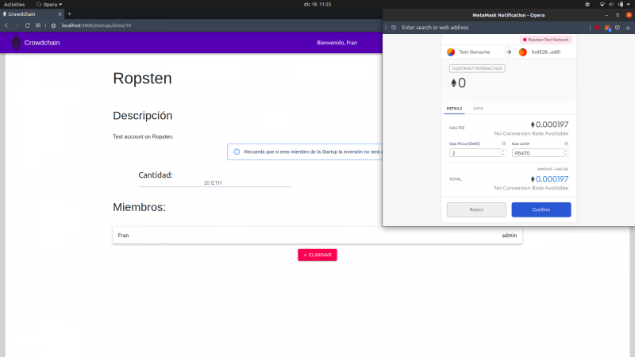

## Contents

* [1 Introducción](#Introducci.C3.B3n)
  + [1.1 ¿Qué es CrowdChain?](#.C2.BFQu.C3.A9_es_CrowdChain.3F)
* [2 Infraestructura](#Infraestructura)
* [3 Funcionamiento](#Funcionamiento)

# Introducción[[edit](/pti/index.php?title=Categor%C3%ADa:Crowdchain&veaction=edit&section=1 "Edit section: Introducción") | [edit source](/pti/index.php?title=Categor%C3%ADa:Crowdchain&action=edit&section=1 "Edit section: Introducción")]

## ¿Qué es CrowdChain?[[edit](/pti/index.php?title=Categor%C3%ADa:Crowdchain&veaction=edit&section=2 "Edit section: ¿Qué es CrowdChain?") | [edit source](/pti/index.php?title=Categor%C3%ADa:Crowdchain&action=edit&section=2 "Edit section: ¿Qué es CrowdChain?")]

CrowdChain es un proyecto orientado a la financiación de startups. CrowdChain ofrece a los usuarios la posibilidad de registrarse, presentar su proyecto, y tener la capacidad de que otros usuarios financien su proyecto obteniendo más tarde beneficios si el proyecto tiene éxito. Por otro lado se usa BlockChain como herramienta, lo cual ayuda a blindar las transferencias para hacer más seguro el proceso y que los usuarios que invierten en startups tengan transparencia absoluta sobre el proceso de inversión y sobre el estado de su inversión.

# Infraestructura[[edit](/pti/index.php?title=Categor%C3%ADa:Crowdchain&veaction=edit&section=3 "Edit section: Infraestructura") | [edit source](/pti/index.php?title=Categor%C3%ADa:Crowdchain&action=edit&section=3 "Edit section: Infraestructura")]

Estructura del proyecto.

Como podemos observar, nuestro proyecto se divide en una base de datos sql relacional común, creada con mySQL; una API REST creada con Express (Node.js) como backend, que se encargara de mediar entre la DB y el frontend; un frontend hecho con React, que se encargara de hablar tanto con el backend, como de usar el proveedor de Metamask (herramienta de gestión de wallets) para comunicarnos con nuestro Contract en la blockchain, y finalmente nuestro SmartContract que contendra todas las operaciones de inversión, alta de startups, registro de inversiones e inversores, etc...

Toda la información referente a las startups, sus miembros, inversores, inversiones realizadas, estará replicado en la base de datos mysql, ya que es mucho mas rápido leer de ahí para cargar el frontend, que llamando a las operaciones del contrato, ya que en la red principal o de test, al haber tantos bloques, estas acciones tardan bastante, especialmente las de escritura.

# Funcionamiento[[edit](/pti/index.php?title=Categor%C3%ADa:Crowdchain&veaction=edit&section=4 "Edit section: Funcionamiento") | [edit source](/pti/index.php?title=Categor%C3%ADa:Crowdchain&action=edit&section=4 "Edit section: Funcionamiento")]

Nada más entrar en el portal vemos un listado de las startups que hay dadas de alta en el sistema. Arriba derecha tenemos la opción de logear o de crear una cuenta. Si creamos una cuenta (en caso de no tener cuenta) y logeamos tenemos dos opciones, acceder a las startups que hay en el listado para poder invertir en ellas o la opción de crear nuestra propia startup. Si le damos a crear startup (ver figura 3) esto nos abre una ventana de metamask donde tenemos el coste del gas y el límite de gas que tiene el proceso de crear esta startup. Tras aceptar, nuestra startup queda creada y aparece en el portal de entrada en el listado. Mientras no haya inversores podemos borrar la startup y volver a crear otra si así lo deseamos.

Startups.

Ahora supongamos que nosotros queremos invertir en una startup, accedemos a la que queramos en el portal (ver figura 4) e introducimos la cantidad de ethereum que queremos invertir y de nuevo se nos abre la ventana de metamask en este caso para el gas que vamos a utilizar para invertir en esta startup, una vez confirmamos se nos descuenta el gas y nuestra inversión queda guardada en la blockchain. Este es el funcionamiento básico de la aplicación

Inverion.

En resumidas cuentas, así es como funciona CrowdChain, y así ofrecemos una gestión segura de las inversiones en las startups.