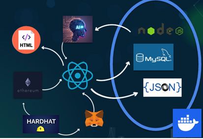
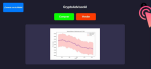
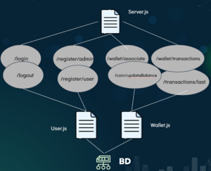
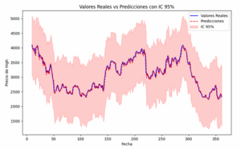
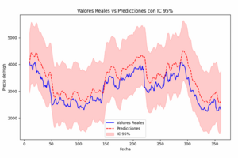
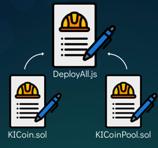
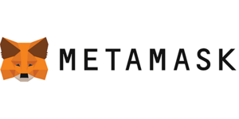
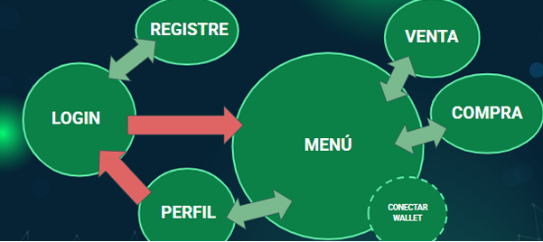

CryptoAdvisorAI

## Contents

* [1 Resum del Projecte](#Resum_del_Projecte)
  + [1.1 Què és CryptoAdvisorAI?](#Qu.C3.A8_.C3.A9s_CryptoAdvisorAI.3F)
* [2 Tecnologies](#Tecnologies)
* [3 Frontend](#Frontend)
  + [3.1 Disseny de la web](#Disseny_de_la_web)
  + [3.2 Estructura del frontend](#Estructura_del_frontend)
* [4 Backend](#Backend)
  + [4.1 Estructura general](#Estructura_general)
  + [4.2 Arquitectura](#Arquitectura)
  + [4.3 Base de Dades](#Base_de_Dades)
* [5 Intel·ligència Artificial](#Intel.C2.B7lig.C3.A8ncia_Artificial)
  + [5.1 Desenvolupament de la IA](#Desenvolupament_de_la_IA)
  + [5.2 Entrenament i Predicció](#Entrenament_i_Predicci.C3.B3)
  + [5.3 Tecnologies usades per la IA](#Tecnologies_usades_per_la_IA)
* [6 Blockchain](#Blockchain)
  + [6.1 Creació de la Criptomoneda](#Creaci.C3.B3_de_la_Criptomoneda)
  + [6.2 Airdrop dels Smart Contract](#Airdrop_dels_Smart_Contract)
  + [6.3 Integració de la Wallet](#Integraci.C3.B3_de_la_Wallet)
  + [6.4 Entorn de Llançament](#Entorn_de_Llan.C3.A7ament)
* [7 Contenidors](#Contenidors)
  + [7.1 Xarxa i Comunicació](#Xarxa_i_Comunicaci.C3.B3)
  + [7.2 Deployment](#Deployment)
* [8 Diagrama de Flux](#Diagrama_de_Flux)
* [9 Conclusions](#Conclusions)

# Resum del Projecte[[edit](/pti/index.php?title=Categor%C3%ADa:CryptoAdvisorAI&veaction=edit&section=1 "Edit section: Resum del Projecte") | [edit source](/pti/index.php?title=Categor%C3%ADa:CryptoAdvisorAI&action=edit&section=1 "Edit section: Resum del Projecte")]

CryptoAdvisorAI és un projecte innovador que combina blockchain, intel·ligència artificial i
contenedors Docker per acostar el món de les criptomonedes a usuaris de tots els nivells.
Aquesta plataforma busca oferir un entorn educatiu, segur i interactiu per operar amb
criptomonedes i rebre assessorament intel·ligent i personalitzat.

## Què és CryptoAdvisorAI?[[edit](/pti/index.php?title=Categor%C3%ADa:CryptoAdvisorAI&veaction=edit&section=2 "Edit section: Què és CryptoAdvisorAI?") | [edit source](/pti/index.php?title=Categor%C3%ADa:CryptoAdvisorAI&action=edit&section=2 "Edit section: Què és CryptoAdvisorAI?")]

És una aplicació web descentralitzada que permet operar amb una criptomoneda pròpia
basada en Ethereum, i disposa d’una IA que actua com a assessor financer. Aquesta IA
analitza el mercat i ofereix recomanacions basades en dades reals o sintètiques. A més, s’hi
poden realitzar operacions de compra i venda a través d’un exchange integrat.

# Tecnologies[[edit](/pti/index.php?title=Categor%C3%ADa:CryptoAdvisorAI&veaction=edit&section=3 "Edit section: Tecnologies") | [edit source](/pti/index.php?title=Categor%C3%ADa:CryptoAdvisorAI&action=edit&section=3 "Edit section: Tecnologies")]

**Frontend:** HTML, React, Tailwind CSS, Vite
  
**Backend:** Node JS, Docker, MySQL, Docker Compose, Encriptació JSON
  
**Blockchain:** Ethereum, Hardhat, Smart contracts ERC20, MetaMask(Wallet)
  
**IA:** Python, API pròpia, Models de IA(Algoritmes)

# Frontend[[edit](/pti/index.php?title=Categor%C3%ADa:CryptoAdvisorAI&veaction=edit&section=4 "Edit section: Frontend") | [edit source](/pti/index.php?title=Categor%C3%ADa:CryptoAdvisorAI&action=edit&section=4 "Edit section: Frontend")]

Disseny del Web

## Disseny de la web[[edit](/pti/index.php?title=Categor%C3%ADa:CryptoAdvisorAI&veaction=edit&section=5 "Edit section: Disseny de la web") | [edit source](/pti/index.php?title=Categor%C3%ADa:CryptoAdvisorAI&action=edit&section=5 "Edit section: Disseny de la web")]

La implementació de la web de CryptoAdvisorAI promou dues funcionalitats principals,
d’acord amb el sentit de la propia aplicació. Aquestes, rauen en els diferents paradigmes
d’ús de la página, el del client i el de l’usuari autenticat.

## Estructura del frontend[[edit](/pti/index.php?title=Categor%C3%ADa:CryptoAdvisorAI&veaction=edit&section=6 "Edit section: Estructura del frontend") | [edit source](/pti/index.php?title=Categor%C3%ADa:CryptoAdvisorAI&action=edit&section=6 "Edit section: Estructura del frontend")]

Els components programats que estructuran el frontend segueixen un ordre jeràrquic
d’acord amb quin lloc ocupen dins de l'arbre de relacions del projecte, en aquest sentit,
podem definir l’estructura diferenciant els següents components:
  
● main.jsx: Punt d’entrada que carrega l’aplicació Reactmain.
  
● App.jsx: Component principal que gestiona l’estat, connexió amb MetaMask i interacció amb els smart contractsApp.
  
● Components: Formularis de login, compra, venda, connexió amb wallet, etc.
  
● Pàgines: Login, registre, menú principal, perfils d’usuari, vista de trading.
  
● Contractes JSON: ABI dels smart contracts desplegats.

# Backend[[edit](/pti/index.php?title=Categor%C3%ADa:CryptoAdvisorAI&veaction=edit&section=7 "Edit section: Backend") | [edit source](/pti/index.php?title=Categor%C3%ADa:CryptoAdvisorAI&action=edit&section=7 "Edit section: Backend")]

Estructura del BackEnd

## Estructura general[[edit](/pti/index.php?title=Categor%C3%ADa:CryptoAdvisorAI&veaction=edit&section=8 "Edit section: Estructura general") | [edit source](/pti/index.php?title=Categor%C3%ADa:CryptoAdvisorAI&action=edit&section=8 "Edit section: Estructura general")]

El backend del projecte de Crypto Advisor AI està fet amb Node.js. La seva estructura
general és senzilla. El backend està compost per vuit endpoints que s'encarreguen de les
diferents operacions.

Totes les funcions tenen control d'errors, per si l’usuari introdueix dades de manera
incorrecta o té alguna intenció maliciosa de fer caure el servei. A més, els endpoints estan
assegurats contra diversos tipus d’atacs que es podrien intentar en cas que el servei fos
públic.

## Arquitectura[[edit](/pti/index.php?title=Categor%C3%ADa:CryptoAdvisorAI&veaction=edit&section=9 "Edit section: Arquitectura") | [edit source](/pti/index.php?title=Categor%C3%ADa:CryptoAdvisorAI&action=edit&section=9 "Edit section: Arquitectura")]

Pel que fa al backend, els endpoints principals es troben a l’arxiu Server.js. Aquest fitxer rep
suport de dos fitxers addicionals que s'encarreguen de realitzar les operacions relacionades
amb la base de dades. En aquest cas, disposem dels arxius User.js, que gestiona les
peticions relacionades amb qualsevol informació necessària d’un usuari, i Wallet.js, que
s'encarrega de les operacions associades tant a la wallet de l’usuari com a la connexió amb
la blockchain.

## Base de Dades[[edit](/pti/index.php?title=Categor%C3%ADa:CryptoAdvisorAI&veaction=edit&section=10 "Edit section: Base de Dades") | [edit source](/pti/index.php?title=Categor%C3%ADa:CryptoAdvisorAI&action=edit&section=10 "Edit section: Base de Dades")]

La base de dades utilitzada en el projecte és una base de dades MySQL, que es connecta
principalment amb el backend i s'encarrega de gestionar la persistència, els usuaris, les
operacions i altres elements del sistema.
La base de dades disposa de tres taules principals que gestionen la persistència del
sistema:
  
**users:** Usuaris registrats. Guarda id, usuario, password (xifrada), salt i rol (admin/user).
  
**wallets:** Carteres virtuals. Té id, user\_id (únic), wallet\_address, i balance. Relació 1:1 amb
users.
  
**user\_transactions:** Registre de transaccions. Inclou id, user\_id, transaction\_hash,
wallet\_address, amount, transaction\_type i timestamp.

# Intel·ligència Artificial[[edit](/pti/index.php?title=Categor%C3%ADa:CryptoAdvisorAI&veaction=edit&section=11 "Edit section: Intel·ligència Artificial") | [edit source](/pti/index.php?title=Categor%C3%ADa:CryptoAdvisorAI&action=edit&section=11 "Edit section: Intel·ligència Artificial")]

La IA és capaç d'entrenar i predir els pròxims moviments i fluctuacions del preu de la nostra moneda. És per això que el backend s'encarrega d'enviar les dades necessàries a la API per entrenar una sèrie de models. D'aquests models, després de predir els moviments corresponents, segons el MAE, escollirem el model més adequat.

Prediction with Lasso Model

Prediction with MLP Model

## Desenvolupament de la IA[[edit](/pti/index.php?title=Categor%C3%ADa:CryptoAdvisorAI&veaction=edit&section=12 "Edit section: Desenvolupament de la IA") | [edit source](/pti/index.php?title=Categor%C3%ADa:CryptoAdvisorAI&action=edit&section=12 "Edit section: Desenvolupament de la IA")]

Em dissenyat una API on implementem la IA. Tenir la IA en una API en comptes de en el Backend també té el seu motiu. Seguint el motiu anterior,
les empreses solen tenir la IA en un servidor dedicat, el qual sempre està apagat i només l’encenen en determinades hores per poder utilitzar-ho.
Quan acaben, el tornen a apagar. És per això que nosaltres vam decidir fer-ho de la mateixa manera, però en comptes de tenir un servidor dedicat,
fer-ho en la mateixa api.

## Entrenament i Predicció[[edit](/pti/index.php?title=Categor%C3%ADa:CryptoAdvisorAI&veaction=edit&section=13 "Edit section: Entrenament i Predicció") | [edit source](/pti/index.php?title=Categor%C3%ADa:CryptoAdvisorAI&action=edit&section=13 "Edit section: Entrenament i Predicció")]

Mètodes principals de la API:  
**/train** → Entrenament del model. Aquest endpoint rep les dades d’entrenament per entrenar un model de regressió i el guarda al servidor. El model pot ser utilitzat posteriorment per fer prediccions.  
**/predict** → Realitza una predicció. Aquest endpoint rep dades d’entrada i retorna les prediccions generades pel model entrenat.

## Tecnologies usades per la IA[[edit](/pti/index.php?title=Categor%C3%ADa:CryptoAdvisorAI&veaction=edit&section=14 "Edit section: Tecnologies usades per la IA") | [edit source](/pti/index.php?title=Categor%C3%ADa:CryptoAdvisorAI&action=edit&section=14 "Edit section: Tecnologies usades per la IA")]

NumPy i Pandas: Llibreries de python per la gestió de dades.  
FastAPI: Facilita la implementació i creació de la API.  
scikit-learn: Llibreria d’on s’han importat els models, entre altres.

# Blockchain[[edit](/pti/index.php?title=Categor%C3%ADa:CryptoAdvisorAI&veaction=edit&section=15 "Edit section: Blockchain") | [edit source](/pti/index.php?title=Categor%C3%ADa:CryptoAdvisorAI&action=edit&section=15 "Edit section: Blockchain")]

Per tal de poder operar dins la plataforma CryptoAdvisorAI, ha estat necessari desenvolupar
una criptomoneda pròpia basada en la tecnologia Ethereum. Aquesta moneda, anomenada
KICoin, segueix l’estàndard ERC20, fet que garanteix la seva compatibilitat amb eines
existents com MetaMask i altres aplicacions descentralitzades.

## Creació de la Criptomoneda[[edit](/pti/index.php?title=Categor%C3%ADa:CryptoAdvisorAI&veaction=edit&section=16 "Edit section: Creació de la Criptomoneda") | [edit source](/pti/index.php?title=Categor%C3%ADa:CryptoAdvisorAI&action=edit&section=16 "Edit section: Creació de la Criptomoneda")]

Interacció de SmartContracts amb Backend

Per a la creació de la criptomoneda a la blockchain s’han fet servir dos fitxers claus:

**KICoin.sol:** és el contracte intel·ligent que defineix el token KICoin, desenvolupat segons
l’estàndard ERC20 d’Ethereum.
Aquest contracte especifica funcionalitats com:
  
● Emissió inicial de tokens.
  
● Transferències entre usuaris.
  
● Consulta de saldo.   
● Aprovar una tercera part per gastar tokens en nom teu.

**KICoinPool.sol:** contracte de tipus "liquidity pool" (o AMM – Automated Market Maker) que
permet operar amb el token. Aquest contracte gestiona:

● Canvi de KICoin per ETH (funció: ethToTokenSwap).

● Canvi d’ETH per KICoin (funció: tokenToEthSwap).

● Requereix que l’usuari aprovi prèviament la quantitat de tokens a vendre.

## Airdrop dels Smart Contract[[edit](/pti/index.php?title=Categor%C3%ADa:CryptoAdvisorAI&veaction=edit&section=17 "Edit section: Airdrop dels Smart Contract") | [edit source](/pti/index.php?title=Categor%C3%ADa:CryptoAdvisorAI&action=edit&section=17 "Edit section: Airdrop dels Smart Contract")]

El desplegament dels contractes intel·ligents s’ha realitzat amb el framework Hardhat a partir del fitxer DeployAll.js, el
qual ofereix un entorn de desenvolupament local molt similar al de la xarxa principal
d’Ethereum.

**El procés que duu a terme el script es el següent:**   
1. Compila els fitxers .sol mitjançant Hardhat.   
2. Desplega el contracte de token KICoin.sol.   
3. Desplega el contracte de pool KICoinPool.sol, vinculant-lo a l’adreça del token
anterior.   
4. Afegeix liquiditat inicial al pool amb una quantitat determinada de KICoin i ETH.

A la consola de Hardhat s’observa l’execució pas a pas del procés, incloent l’aprovació del
token per part del contracte i la crida a la funció addLiquidity, que registra les reserves
inicials en el contracte de la pool. Totes aquestes operacions són visibles mitjançant logs de
la blockchain local, que mostren les transaccions, els blocs generats i els valors transferits.

## Integració de la Wallet[[edit](/pti/index.php?title=Categor%C3%ADa:CryptoAdvisorAI&veaction=edit&section=18 "Edit section: Integració de la Wallet") | [edit source](/pti/index.php?title=Categor%C3%ADa:CryptoAdvisorAI&action=edit&section=18 "Edit section: Integració de la Wallet")]

MetaMask és una cartera digital (wallet) que funciona com una extensió del navegador i
permet als usuaris interactuar amb la blockchain d’Ethereum de manera fàcil, segura i sense
necessitat de mantenir un node propi. En el context de CryptoAdvisorAI, MetaMask juga un
paper fonamental, ja que és l’eina que connecta l’usuari amb els smart contracts desplegats
localment o a la testnet.

## Entorn de Llançament[[edit](/pti/index.php?title=Categor%C3%ADa:CryptoAdvisorAI&veaction=edit&section=19 "Edit section: Entorn de Llançament") | [edit source](/pti/index.php?title=Categor%C3%ADa:CryptoAdvisorAI&action=edit&section=19 "Edit section: Entorn de Llançament")]

Per al llançament, s’ha utilitzat la testnet local de Hardhat, la qual permet desplegar i
interactuar amb els contractes sense costos reals. A més, s’ha configurat MetaMask per
interactuar amb aquesta testnet, afegint la xarxa manualment, com s’especifica més amunt.
Aquesta arquitectura ens ha permès verificar totes les funcionalitats relacionades amb la
compra i venda de tokens, assegurant el correcte funcionament del sistema.

# Contenidors[[edit](/pti/index.php?title=Categor%C3%ADa:CryptoAdvisorAI&veaction=edit&section=20 "Edit section: Contenidors") | [edit source](/pti/index.php?title=Categor%C3%ADa:CryptoAdvisorAI&action=edit&section=20 "Edit section: Contenidors")]

Amb l’objectiu d’afavorir la modularitat, el desplegament i la portabilitat del sistema, s’ha optat per l’ús de contenidors mitjançant la tecnologia Docker. Aquesta eina ens permet encapsular els diferents components de la plataforma en imatges independents i autoexecutable.

Amb Docker es creen 3 imatges:   
● Frontend: Node 20 + React   
● Backend+Blockchain: Java + Servlets + MySQL Connector   
● Blockchain: Localhost de la testnet (Hardhat)

## Xarxa i Comunicació[[edit](/pti/index.php?title=Categor%C3%ADa:CryptoAdvisorAI&veaction=edit&section=21 "Edit section: Xarxa i Comunicació") | [edit source](/pti/index.php?title=Categor%C3%ADa:CryptoAdvisorAI&action=edit&section=21 "Edit section: Xarxa i Comunicació")]

Per facilitar la comunicació entre aquests contenidors, s’ha definit una xarxa interna que connecta el backend amb la base de dades, i una connexió HTTP entre el frontend i el backend. El backend actua com a intermediari principal, ja que també manté la comunicació amb la blockchain i amb l’API de la intel·ligència artificial.

## Deployment[[edit](/pti/index.php?title=Categor%C3%ADa:CryptoAdvisorAI&veaction=edit&section=22 "Edit section: Deployment") | [edit source](/pti/index.php?title=Categor%C3%ADa:CryptoAdvisorAI&action=edit&section=22 "Edit section: Deployment")]

L’orquestració dels serveis es realitza mitjançant Docker Compose, utilitzant un fitxer docker-compose.yml que especifica la configuració de cada servei: imatges, ports, dependències, xarxes i volums. Aquesta solució ens permet posar en marxa tot el sistema amb una sola comanda:  
●**(docker-compose up --build)**

# Diagrama de Flux[[edit](/pti/index.php?title=Categor%C3%ADa:CryptoAdvisorAI&veaction=edit&section=23 "Edit section: Diagrama de Flux") | [edit source](/pti/index.php?title=Categor%C3%ADa:CryptoAdvisorAI&action=edit&section=23 "Edit section: Diagrama de Flux")]

Diagrama de flux del Usuari

# Conclusions[[edit](/pti/index.php?title=Categor%C3%ADa:CryptoAdvisorAI&veaction=edit&section=24 "Edit section: Conclusions") | [edit source](/pti/index.php?title=Categor%C3%ADa:CryptoAdvisorAI&action=edit&section=24 "Edit section: Conclusions")]

En resum, CryptoAdvisorAI no només implementa un sistema tecnològicament avançat, sinó
que també proposa una eina educativa i segura per acostar l’ús responsable de les
criptomonedes a la societat.

***CryptoAdvisorAI representa la fusió entre tecnologia emergent i educació financera.***