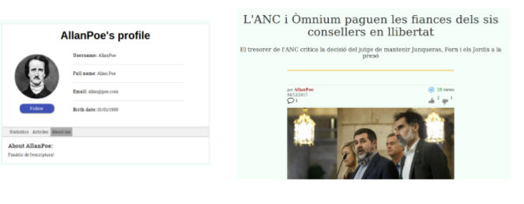

[](/pti/index.php/File:DailyLiberty.PNG)

## Contents

* [1 Projecte DailyLiberty](#Projecte_DailyLiberty)
  + [1.1 ¿Qué es DailyLiberty?](#.C2.BFQu.C3.A9_es_DailyLiberty.3F)
* [2 Estructura projecte](#Estructura_projecte)
  + [2.1 Esquema](#Esquema)
  + [2.2 Clients](#Clients)
    - [2.2.1 Lector(no loguejat)](#Lector.28no_loguejat.29)
    - [2.2.2 Lector i Editor (loguejat)](#Lector_i_Editor_.28loguejat.29)
  + [2.3 Pàgina Web](#P.C3.A0gina_Web)
    - [2.3.1 Frontend](#Frontend)
      * [2.3.1.1 Funcionalitats](#Funcionalitats)
      * [2.3.1.2 Tecnologies emprades](#Tecnologies_emprades)
    - [2.3.2 Backend](#Backend)
      * [2.3.2.1 Funcionalitats](#Funcionalitats_2)
      * [2.3.2.2 Tecnologies emprades](#Tecnologies_emprades_2)
    - [2.3.3 Disseny](#Disseny)
* [3 Conclusions](#Conclusions)
* [4 Bibliografia](#Bibliografia)

# Projecte DailyLiberty[[edit](/pti/index.php?title=Categor%C3%ADa:DailyLiberty&veaction=edit&section=1 "Edit section: Projecte DailyLiberty") | [edit source](/pti/index.php?title=Categor%C3%ADa:DailyLiberty&action=edit&section=1 "Edit section: Projecte DailyLiberty")]

## ¿Qué es DailyLiberty?[[edit](/pti/index.php?title=Categor%C3%ADa:DailyLiberty&veaction=edit&section=2 "Edit section: ¿Qué es DailyLiberty?") | [edit source](/pti/index.php?title=Categor%C3%ADa:DailyLiberty&action=edit&section=2 "Edit section: ¿Qué es DailyLiberty?")]

L’objectiu d’aquest projecte és poder crear una aplicació web que permeti a qualsevol periodista independent (no afiliat a cap diari), poder publicar les seves notícies per a ser llegides per tothom, i ser remunerats en base a aquestes visites.
Per la part estètica de la web ens ajudarem amb Bootstrap, per a l’emmagatzematge de dades farem servir MongoDB, per a la part de cerques complexes farem ús del servidor de cerca Elasticsearch que proporciona un motor de cerca de text complet, distribuït y amb capacitat de multi-tenència amb una interfície web RESTful i amb documents JSON, i per a realitzar la mencionada remuneració ens basarem en l’API de remuneració de contingut audiovisual de les xarxes, com és el cas del que fa Google AdSense per YouTube. (Pagar en base a anuncis). L’aplicació ha de ser segura, i no permetre que qualsevol tregui profit del contingut d’un periodista, o que les creacions realitzades puguin ser modificades per accions amb males intencions. També hi haurà un sistema corrector que analitzarà i censurarà paraules malsonants que puguin ser escrites en un article. Pel que fa a la part del lector, podrà filtrar quines notícies vol llegir, en base a temàtiques diverses, “última hora”, o directament buscant els seus autors preferits. (Als quals podrà “marcar com a favorits”), podrà comentar articles, hi haurà un sistema de likes/dislikes per valorar cada article, i es podrà compartir tant la pàgina com l’article específic a twitter.
La relació del projecte amb l’assignatura està basada amb la que mantindran les diferents tecnologies de la informació del projecte. (Servidor web, gestió de base de dades, servidor de cerques, seguretat de dades, etc.)

[](/pti/index.php/File:Home.PNG "Imatge del home")

# Estructura projecte[[edit](/pti/index.php?title=Categor%C3%ADa:DailyLiberty&veaction=edit&section=3 "Edit section: Estructura projecte") | [edit source](/pti/index.php?title=Categor%C3%ADa:DailyLiberty&action=edit&section=3 "Edit section: Estructura projecte")]

## Esquema[[edit](/pti/index.php?title=Categor%C3%ADa:DailyLiberty&veaction=edit&section=4 "Edit section: Esquema") | [edit source](/pti/index.php?title=Categor%C3%ADa:DailyLiberty&action=edit&section=4 "Edit section: Esquema")]

[](/pti/index.php/File:EsquemaDaily.png)

## Clients[[edit](/pti/index.php?title=Categor%C3%ADa:DailyLiberty&veaction=edit&section=5 "Edit section: Clients") | [edit source](/pti/index.php?title=Categor%C3%ADa:DailyLiberty&action=edit&section=5 "Edit section: Clients")]

L’aplicació web permet dos nivells d’accés. Un nivell on els clients poden accedir a diverses parts de la web sense haver fet el login i per tant amb menys funcionalitats(únicament lector) i l’altre un cop s’ha fet el correponent login permetent doncs un accés complet a tota la web(lector i editor).

### Lector(no loguejat)[[edit](/pti/index.php?title=Categor%C3%ADa:DailyLiberty&veaction=edit&section=6 "Edit section: Lector(no loguejat)") | [edit source](/pti/index.php?title=Categor%C3%ADa:DailyLiberty&action=edit&section=6 "Edit section: Lector(no loguejat)")]

El client que vulgui accedir a la nostra web sense haver de loguejar-se podrà accedir a diferents parts de la web amb unes funcionalitats més restringides.

**Funcionalitats disponibles:**

```
  - Llegir els articles més actuals
  - Llegir les tendències del moment
  - Visualitzar articles filtrats per la seva categoría
  - Cerca d’articles a través de la barra de navegació
  - Compartició de la página i dels articles a twitter  
  - Accés a les preguntes freqüents i informació de DailyLiberty

```

**Funcionalitats no disponibles:**

```
  - Escriure i eliminar articles propis
  - Editar i comentar articles
  - Valoració d’articles
  - Seguiment d’autors
  - Visió i edició de perfil propi
  - Visió de perfil d’usuaris
  - Accés a la llista de subcripcions i followers
  - Veure la quantitat estimada de la remuneració per visites

```

### Lector i Editor (loguejat)[[edit](/pti/index.php?title=Categor%C3%ADa:DailyLiberty&veaction=edit&section=7 "Edit section: Lector i Editor (loguejat)") | [edit source](/pti/index.php?title=Categor%C3%ADa:DailyLiberty&action=edit&section=7 "Edit section: Lector i Editor (loguejat)")]

El client que vulgui accedir a totes les funcionalitats de la nostra web s’haurà d’haver registrat i seguidament loguejar-se. Un cop fet podrà accedir totes les parts de la web sense cap tipus de restricció.

**Funcionalitats disponibles:**

```
   -  Llegir els articles més actuals
   -  Llegir les tendències del moment
   -  Visualitzar articles filtrats per la seva categoría
   -  Cerca d’articles a través de la barra de navegació
   -  Compartició de la página i dels articles a twitter
   -  Accés a les preguntes freqüents i informació de DailyLiberty
   -  Escriure i eliminar articles propis
   -  Editar i comentar articles
   -  Valoració d’articles
   -  Seguiment d’autors
   -  Visió i edició de perfil propi
   -  Visió de perfil d’usuaris
   -  Accés a la llista de subcripcions
   -  Accés a la llista de followers
   -  Veure la quantitat estimada de la remuneració per visites

```

## Pàgina Web[[edit](/pti/index.php?title=Categor%C3%ADa:DailyLiberty&veaction=edit&section=8 "Edit section: Pàgina Web") | [edit source](/pti/index.php?title=Categor%C3%ADa:DailyLiberty&action=edit&section=8 "Edit section: Pàgina Web")]

L’estructura de la web DailyLiberty consisteix en pàgines web HTML que recullen peticions HTTP dels clients i les envien al servidor. El servidor està configurat en llenguatge NodeJS, i per realitzar les peticions de creació, modificació, esborrat, login, registres, etc, interaccionarà amb un servidor de Base de Dades, MongoDB, per a realitzar les tasques esmentades. Si el client tria la opció de cerca d’articles, el servidor interaccionarà amb un servidor de cerques, ElasticSearch. El disseny responsive de la web permet que s’adapti a múltiples plataformes diferents de PC, com telèfons mòbils o tauletes.

### Frontend[[edit](/pti/index.php?title=Categor%C3%ADa:DailyLiberty&veaction=edit&section=9 "Edit section: Frontend") | [edit source](/pti/index.php?title=Categor%C3%ADa:DailyLiberty&action=edit&section=9 "Edit section: Frontend")]

#### Funcionalitats[[edit](/pti/index.php?title=Categor%C3%ADa:DailyLiberty&veaction=edit&section=10 "Edit section: Funcionalitats") | [edit source](/pti/index.php?title=Categor%C3%ADa:DailyLiberty&action=edit&section=10 "Edit section: Funcionalitats")]

A nivell de pàgines

```
  -  “Login” i “Register” per iniciar sessió o registar-se.
  -  “Home” amb notícies ordenades de més recent a més antiga, es pot filtrar per categoria amb la barra de navegació, o per resultats de cerca.
  -  Tendències, on apareixen els articles més populars.
  -  Visitar els diferents perfils.
  -  Llegir articles, amb opció de valorar i comentar.
  -  Consultar tant seguidors com suscripcions.
  -  Pàgines d’error si es produeix algun.
  -  About us per a més informació sobre nosaltres.

```

A nivell de barres de navegació

```
  -  Barra de navegació per consultar inici, tendències, categories i subscripcions. 
  -  Al consultar categories, apareix un nou desplegable on trobem les categories d’Esports, Tecnologia, Cultura, Política i Altres.
  -  Un desplegable en la imatge de perfil de l’usuari amb diverses funcionalitats, depenent de si l’usuari està identificat o no. En cas que si, el desplegable conté les opcions de veure el perfil, escriure un article i de fer “log out”. En cas contrari, permet a l’usuari registrar-se i iniciar sessió, a part de l’ “about us” que es pot accedir en ambdós casos.
  -  Una barra de cerca per buscar articles a partir de les paraules introduïdes on es mostraran per ordre d’importancia.
  -  Logo de DailyLiberty en la barra superior que té la mateixa funció que el Home, tornar a la pàgina d’inici.

```

#### Tecnologies emprades[[edit](/pti/index.php?title=Categor%C3%ADa:DailyLiberty&veaction=edit&section=11 "Edit section: Tecnologies emprades") | [edit source](/pti/index.php?title=Categor%C3%ADa:DailyLiberty&action=edit&section=11 "Edit section: Tecnologies emprades")]

[](/pti/index.php/File:TecnologiesFrontend.PNG)

### Backend[[edit](/pti/index.php?title=Categor%C3%ADa:DailyLiberty&veaction=edit&section=12 "Edit section: Backend") | [edit source](/pti/index.php?title=Categor%C3%ADa:DailyLiberty&action=edit&section=12 "Edit section: Backend")]

#### Funcionalitats[[edit](/pti/index.php?title=Categor%C3%ADa:DailyLiberty&veaction=edit&section=13 "Edit section: Funcionalitats") | [edit source](/pti/index.php?title=Categor%C3%ADa:DailyLiberty&action=edit&section=13 "Edit section: Funcionalitats")]

En la nostra aplicació web, el servidor s’encarrega de:

```
   -  Gestionar les autenticacions i els registres de nous usuaris.
   -  Gestionar les bases de dades en funció de les operacions que rep. (Per exemple: si cal editar un article, actualitzar la BD d’articles.)
   -  Processar peticions d’accés a les diferents pàgines i respondre carregant les pàgines adients amb els valors necessaris.
   -  Processar cerques d’articles, ordenacions (popularitat, data de creació…) i filtrar el Home en funció del que tria l’usuari (categoria, etc.)

```

#### Tecnologies emprades[[edit](/pti/index.php?title=Categor%C3%ADa:DailyLiberty&veaction=edit&section=14 "Edit section: Tecnologies emprades") | [edit source](/pti/index.php?title=Categor%C3%ADa:DailyLiberty&action=edit&section=14 "Edit section: Tecnologies emprades")]

[](/pti/index.php/File:TecnologiesBackend.PNG)

### Disseny[[edit](/pti/index.php?title=Categor%C3%ADa:DailyLiberty&veaction=edit&section=15 "Edit section: Disseny") | [edit source](/pti/index.php?title=Categor%C3%ADa:DailyLiberty&action=edit&section=15 "Edit section: Disseny")]

A continuació es mostren algunes parts de la web DailyLiberty:

En les tres imatges es mostra, primerament el login, la segona imatge es l'apartat de tendències i l'últim el formulari de registre.

[](/pti/index.php/File:LogTenReg.png)

A l'esquerra de la imatge podem trobar com es veuen els followers i les subscripcions a autors i a la dreta com es mostraria el resultat d'alguna cerca.

[](/pti/index.php/File:CercaFollSub.png)

Visionat del perfil d'un usuari juntament amb el mostreig del contingut d'un article.

[](/pti/index.php/File:PerArt.png)

# Conclusions[[edit](/pti/index.php?title=Categor%C3%ADa:DailyLiberty&veaction=edit&section=16 "Edit section: Conclusions") | [edit source](/pti/index.php?title=Categor%C3%ADa:DailyLiberty&action=edit&section=16 "Edit section: Conclusions")]

La principal conclusió que treiem de realitzar aquest projecte és que aquesta aplicació web és una alternativa original als diaris que llegim habitualment. A la vegada, és una oportunitat de treball “a curt termini” pel seu sistema de financiació tipus YouTube. No creiem que es pugui viure de fer articles a DailyLiberty, però pots aconseguir un prestigi i ampliar el teu currículum, de manera que les empreses grans de notícies podran contactar amb tu si veuen nivell alt de periodisme.

Està clar que hi ha detalls per aclarir, com què fer quan hi ha notícies “spam” o “clickbait”, o si és eficient el sistema actual amb un creixement exponencial de la popularitat de la web (per pagaments, etc.), però amb un afegit d’inversió de pressupost que permeti contractar “encarregats de manteniment/remunerar” o bé concedir rols als autors amb més prestigi per a què s’encarreguin de realitzar tasques de manteniment a la web (lògicament amb un extra de pagament), potser podríem trobar solucions a aquests detalls comentats.

Finalment, afegir que la realització d’aquest projecte ha sigut una font de coneixement en quant a tecnologies de la informació, i una molt bona oportunitat per aprendre sobre les tecnologies que no havíem vist o treballat fins ara durant el grau.

# Bibliografia[[edit](/pti/index.php?title=Categor%C3%ADa:DailyLiberty&veaction=edit&section=17 "Edit section: Bibliografia") | [edit source](/pti/index.php?title=Categor%C3%ADa:DailyLiberty&action=edit&section=17 "Edit section: Bibliografia")]

[1] Documentació html: <https://www.w3schools.com/html/>

[2] Documentació i manual css: <https://www.w3schools.com/css/>

<https://desarrolloweb.com/manuales/manual-css-hojas-de-estilo.html>

[3] Tutorials less: <http://programandoointentandolo.com/2017/07/tutorial-less-import.html>

<https://ivanmendoza.net/desarrollo-web/introduccion-less-css>