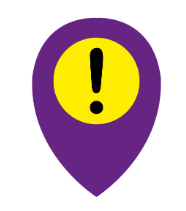
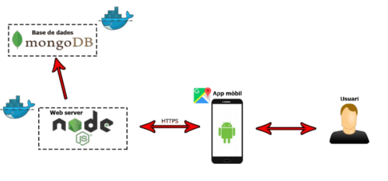

## Contents

* [1 DangerTracker](#DangerTracker)
* [2 Introducció](#Introducci.C3.B3)
  + [2.1 Què és DangerTracker?](#Qu.C3.A8_.C3.A9s_DangerTracker.3F)
  + [2.2 Perquè es va escollir?](#Perqu.C3.A8_es_va_escollir.3F)
* [3 Tecnologies](#Tecnologies)
  + [3.1 Android](#Android)
  + [3.2 Servidor](#Servidor)
* [4 Estructura del projecte](#Estructura_del_projecte)

# DangerTracker[[edit](/pti/index.php?title=Categor%C3%ADa:DangerTracker&veaction=edit&section=1 "Edit section: DangerTracker") | [edit source](/pti/index.php?title=Categor%C3%ADa:DangerTracker&action=edit&section=1 "Edit section: DangerTracker")]

# Introducció[[edit](/pti/index.php?title=Categor%C3%ADa:DangerTracker&veaction=edit&section=2 "Edit section: Introducció") | [edit source](/pti/index.php?title=Categor%C3%ADa:DangerTracker&action=edit&section=2 "Edit section: Introducció")]

## Què és DangerTracker?[[edit](/pti/index.php?title=Categor%C3%ADa:DangerTracker&veaction=edit&section=3 "Edit section: Què és DangerTracker?") | [edit source](/pti/index.php?title=Categor%C3%ADa:DangerTracker&action=edit&section=3 "Edit section: Què és DangerTracker?")]

DangerTracker és una aplicació dissenyada per avisar als usuaris al entrar en el radi d’influència de les zones perilloses de la ciutat de Barcelona usant com a mapa l’Api de Google Maps.

## Perquè es va escollir?[[edit](/pti/index.php?title=Categor%C3%ADa:DangerTracker&veaction=edit&section=4 "Edit section: Perquè es va escollir?") | [edit source](/pti/index.php?title=Categor%C3%ADa:DangerTracker&action=edit&section=4 "Edit section: Perquè es va escollir?")]

Es va triar aquest tema perquè ens va semblar una aplicació realment útil, especialment per als turistes, ja que són els usuaris més propensos a possiblement introduir-se en una d’aquestes àrees al no tenir un coneixement profund de les zones perilloses d’aquelles ciutats que van a visitar. També un altre fet que ens va fer decantar a agafar aquesta idea i desenvolupar-la era que no hi havien gaires aplicacions semblants o amb funcionalitats similars tot i siguent una aplicació a priori molt útil i assequible al només haver de baixar-te el software i no haver d’usar altres dispositius

# Tecnologies[[edit](/pti/index.php?title=Categor%C3%ADa:DangerTracker&veaction=edit&section=5 "Edit section: Tecnologies") | [edit source](/pti/index.php?title=Categor%C3%ADa:DangerTracker&action=edit&section=5 "Edit section: Tecnologies")]

## Android[[edit](/pti/index.php?title=Categor%C3%ADa:DangerTracker&veaction=edit&section=6 "Edit section: Android") | [edit source](/pti/index.php?title=Categor%C3%ADa:DangerTracker&action=edit&section=6 "Edit section: Android")]

* Java
* Android API
* Google Maps

## Servidor[[edit](/pti/index.php?title=Categor%C3%ADa:DangerTracker&veaction=edit&section=7 "Edit section: Servidor") | [edit source](/pti/index.php?title=Categor%C3%ADa:DangerTracker&action=edit&section=7 "Edit section: Servidor")]

* F5 Access
* NodeJS
* MongoDB
* Docker

# Estructura del projecte[[edit](/pti/index.php?title=Categor%C3%ADa:DangerTracker&veaction=edit&section=8 "Edit section: Estructura del projecte") | [edit source](/pti/index.php?title=Categor%C3%ADa:DangerTracker&action=edit&section=8 "Edit section: Estructura del projecte")]

