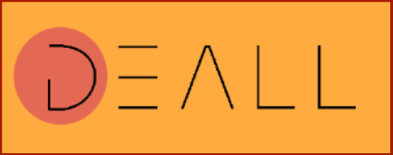

## Contents

* [1 Introducción](#Introducci.C3.B3n)
  + [1.1 ¿Qué es Deall?](#.C2.BFQu.C3.A9_es_Deall.3F)
  + [1.2 ¿Por qué Deall?](#.C2.BFPor_qu.C3.A9_Deall.3F)
* [2 Tecnologías usadas](#Tecnolog.C3.ADas_usadas)
  + [2.1 Angular](#Angular)
  + [2.2 Flutter](#Flutter)
  + [2.3 Python y Flask](#Python_y_Flask)
  + [2.4 MongoDB](#MongoDB)
  + [2.5 Google Cloud APIs](#Google_Cloud_APIs)
  + [2.6 Seguridad](#Seguridad)
  + [2.7 Envío de correos](#Env.C3.ADo_de_correos)
  + [2.8 QR](#QR)
* [3 Esquema de tecnologías](#Esquema_de_tecnolog.C3.ADas)
* [4 ¿Cómo se ha llevado a cabo?](#.C2.BFC.C3.B3mo_se_ha_llevado_a_cabo.3F)
* [5 ¿Cómo nos hemos organizado?](#.C2.BFC.C3.B3mo_nos_hemos_organizado.3F)

# Introducción[[edit](/pti/index.php?title=Categor%C3%ADa:Deall&veaction=edit&section=1 "Edit section: Introducción") | [edit source](/pti/index.php?title=Categor%C3%ADa:Deall&action=edit&section=1 "Edit section: Introducción")]

## ¿Qué es Deall?[[edit](/pti/index.php?title=Categor%C3%ADa:Deall&veaction=edit&section=2 "Edit section: ¿Qué es Deall?") | [edit source](/pti/index.php?title=Categor%C3%ADa:Deall&action=edit&section=2 "Edit section: ¿Qué es Deall?")]

Deall es un proyecto revolucionario que busca acercar y facilitar a los usuarios la búsqueda de ofertas. Deall ofrece al usuario ofertas de todo tipo mediante una aplicación de móvil donde el usuario puede filtrar por cercanía desde su posición actual y por tipo.
Estas ofertas son publicadas por una empresa en una web que Deall les ofrece para publicar sus ofertas, y donde también pueden controlar cuan a gusto está la gente con estas ofertas.

## ¿Por qué Deall?[[edit](/pti/index.php?title=Categor%C3%ADa:Deall&veaction=edit&section=3 "Edit section: ¿Por qué Deall?") | [edit source](/pti/index.php?title=Categor%C3%ADa:Deall&action=edit&section=3 "Edit section: ¿Por qué Deall?")]

El COVID ha sido muy duro para todos, pero especialmente para los pequeños comercios. En Deall tenemos una política clara: todos los comercios pueden publicitarse, por lo que le damos la misma oportunidad al pequeño comercio que al gran comercio. Además, le facilitamos al usuario encontrar ofertas cerca de donde él está y del tipo que él quiere.

# Tecnologías usadas[[edit](/pti/index.php?title=Categor%C3%ADa:Deall&veaction=edit&section=4 "Edit section: Tecnologías usadas") | [edit source](/pti/index.php?title=Categor%C3%ADa:Deall&action=edit&section=4 "Edit section: Tecnologías usadas")]

## Angular[[edit](/pti/index.php?title=Categor%C3%ADa:Deall&veaction=edit&section=5 "Edit section: Angular") | [edit source](/pti/index.php?title=Categor%C3%ADa:Deall&action=edit&section=5 "Edit section: Angular")]

La web es una parte muy importante de Deall, ya que debe ser atractiva para las empresas. El framework usado para el diseño e implementación de la web (sección dirigida básicamente a empresas) ha sido Angular, en concreto, el paquete de Angular Cli en su versión 10.1.7 con una versión soporte de Node.js 14.13.1. Como soporte a este framework web se han usado algunos componentes de Angular Material personalizados por nosotros.

## Flutter[[edit](/pti/index.php?title=Categor%C3%ADa:Deall&veaction=edit&section=6 "Edit section: Flutter") | [edit source](/pti/index.php?title=Categor%C3%ADa:Deall&action=edit&section=6 "Edit section: Flutter")]

Para crear una aplicación móvil que se pueda exportar al mismo tiempo en iOS y en Android, sólo había una opción: usar Flutter, una nueva tecnología muy efectiva para evitar tener que programar en dos lenguajes distintos.

## Python y Flask[[edit](/pti/index.php?title=Categor%C3%ADa:Deall&veaction=edit&section=7 "Edit section: Python y Flask") | [edit source](/pti/index.php?title=Categor%C3%ADa:Deall&action=edit&section=7 "Edit section: Python y Flask")]

Para crear las APIs que usa el frontend, se ha usado Flask debido a su gran efectividad para crear APIs en tiempo récord. Para usar Flask, debíamos usar Python.

## MongoDB[[edit](/pti/index.php?title=Categor%C3%ADa:Deall&veaction=edit&section=8 "Edit section: MongoDB") | [edit source](/pti/index.php?title=Categor%C3%ADa:Deall&action=edit&section=8 "Edit section: MongoDB")]

Usamos una base de datos NoSQL mongoDB para guardar toda la información de los anuncios, usuarios y sesiones. Como Deall está pensado para tener una gran cantidad de datos, no podíamos usar una base de datos SQL.

## Google Cloud APIs[[edit](/pti/index.php?title=Categor%C3%ADa:Deall&veaction=edit&section=9 "Edit section: Google Cloud APIs") | [edit source](/pti/index.php?title=Categor%C3%ADa:Deall&action=edit&section=9 "Edit section: Google Cloud APIs")]

Usamos APIs de Google Cloud para realizar las funciones de la app. APIs para calcular distancias y geolocalizar.

## Seguridad[[edit](/pti/index.php?title=Categor%C3%ADa:Deall&veaction=edit&section=10 "Edit section: Seguridad") | [edit source](/pti/index.php?title=Categor%C3%ADa:Deall&action=edit&section=10 "Edit section: Seguridad")]

Hasheamos las contraseñas y todas las comunicaciones van cifradas (HTTPs). Además, mantenemos sesiones de los usuarios con un token para evitar intercambiar credenciales.

## Envío de correos[[edit](/pti/index.php?title=Categor%C3%ADa:Deall&veaction=edit&section=11 "Edit section: Envío de correos") | [edit source](/pti/index.php?title=Categor%C3%ADa:Deall&action=edit&section=11 "Edit section: Envío de correos")]

El usuario necesita feedback. Una buena manera es enviando correos, por lo que se implementó esta funcionalidad en el backend. Se hace usando gmail.

## QR[[edit](/pti/index.php?title=Categor%C3%ADa:Deall&veaction=edit&section=12 "Edit section: QR") | [edit source](/pti/index.php?title=Categor%C3%ADa:Deall&action=edit&section=12 "Edit section: QR")]

¿De qué serviria Deall si sólo anuncia las ofertas? Usamos unos QR para notificar a la empresa que ese usuario viene de Deall y tiene la aplicación descargada. Generamos un QR único para ese usuario por cada anuncio que pone en favoritos.

# Esquema de tecnologías[[edit](/pti/index.php?title=Categor%C3%ADa:Deall&veaction=edit&section=13 "Edit section: Esquema de tecnologías") | [edit source](/pti/index.php?title=Categor%C3%ADa:Deall&action=edit&section=13 "Edit section: Esquema de tecnologías")]

# ¿Cómo se ha llevado a cabo?[[edit](/pti/index.php?title=Categor%C3%ADa:Deall&veaction=edit&section=14 "Edit section: ¿Cómo se ha llevado a cabo?") | [edit source](/pti/index.php?title=Categor%C3%ADa:Deall&action=edit&section=14 "Edit section: ¿Cómo se ha llevado a cabo?")]

Se ha repartido el frontend y el backend entre los 4 integrantes. 2 integrantes se han encargado del frontend móvil (Flutter), 1 integrante se ha encargado del frontend web (Angular) y el integrante restante ha desarrollado el backend (Python).

# ¿Cómo nos hemos organizado?[[edit](/pti/index.php?title=Categor%C3%ADa:Deall&veaction=edit&section=15 "Edit section: ¿Cómo nos hemos organizado?") | [edit source](/pti/index.php?title=Categor%C3%ADa:Deall&action=edit&section=15 "Edit section: ¿Cómo nos hemos organizado?")]

La organización ha sido profesional en todo momento. Desde el primer momento, se definieron roles que debía cumplir cada miembro y se definieron fechas para hacer reuniones tanto grupales como grupales con el profesor.
Para hacer las reuniones, se usaron softwares como Discord y Google Meet.