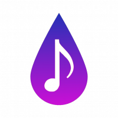

Logo de la apliación

# ¿Qué es Drop It?[[edit](/pti/index.php?title=Categor%C3%ADa:DropIt&veaction=edit&section=1 "Edit section: ¿Qué es Drop It?") | [edit source](/pti/index.php?title=Categor%C3%ADa:DropIt&action=edit&section=1 "Edit section: ¿Qué es Drop It?")]

Drop It es una aplicación pensada para compartir música utilizando la geolocalización de los usuarios.
Es una aplicación que utiliza la API de Spotify para acceder a la información de la música y reproducción del usuario y la API de Google Maps para mostrar el mapa, ubicación del usuario y otras funciones.
Los usuarios que utilizan esta aplicación podrán adoptar dos roles no excluyentes entre ellos.

-**Droppers**: Estos usuarios serán los que mientras se desplacen, dejan la canción que están escuchando en ese momento en Spotify en la ubicación actual designándole un estado de ánimo para más personalización. Estos elementos serán los llamados "drops".

-**Discoverers**: Este es el rol que corresponde a los usuarios que descubren los drops, los cuales se podrán filtrar por estado de ánimo asignado y gesto y de los cuales podrás descubrir información extra sobre esa canción como pueden ser la letra, conciertos del grupo o una breve descripción del artista.

Con esta aplicación queremos acercar gustos musicales muy dispares a todo tipo de usuarios ya sea encontrando música de forma casual como filtrando dependiendo del género musical o el estado de ánimo. Mediante el uso de Drop It se fomenta la exploración ya que obliga al usuario a acercarse ahí donde se encuentran los drops y en ese caso poder guardarlos para escucharlos más tarde.

# Tecnologías utilizadas[[edit](/pti/index.php?title=Categor%C3%ADa:DropIt&veaction=edit&section=2 "Edit section: Tecnologías utilizadas") | [edit source](/pti/index.php?title=Categor%C3%ADa:DropIt&action=edit&section=2 "Edit section: Tecnologías utilizadas")]

Este proyecto está formado por un aplicación móvil desarrollada con Android Studio y un backend con el que se conecta y donde se administran los datos.

La aplicación se conecta con varias API para obtener cierta información y funcionalidades, estas son: Spotify API, Google Maps API, Apiseed, Songkick API y Last.fm API.

El backend utiliza las siguientes tecnologías: Docker, Node.js y MongoDB.

# Funcionamiento[[edit](/pti/index.php?title=Categor%C3%ADa:DropIt&veaction=edit&section=3 "Edit section: Funcionamiento") | [edit source](/pti/index.php?title=Categor%C3%ADa:DropIt&action=edit&section=3 "Edit section: Funcionamiento")]

Captura de la apliación

Como resultado final tenemos una aplicación que es capaz de dejar drops sobre un mapa, encontrarlos, poder obtener información de ellos y finalmente si el usuario lo desea, guardarlos en favoritos.
La primera vez que iniciemos la aplicación se nos pedirán permisos de de geolocalización y para conectar esta aplicación con la app de Spotify. Una vez aceptemos todo estos requisitos accederemos a la vista principal de la aplicación con la que ya podremos interactuar. Siempre que se inicie la aplicación se comprobará que el usuario existe y sino se creará.

Para realizar un drop debemos presionar el botón central ya indicado con el nombre de Drop y a continuación asignaremos un estado de animo si asi lo deseamos. El drop contendrá la canción que estemos escuchando en ese momento en Spotify junto con un estado de ánimo. Una vez realizado el drop se añadirá un marcador en el mapa representando este drop y cualquier otro usuario puede obtener su información si se encuentra lo suficientemente cerca.

Para encontrar los drops el usuario debe acercarse a su ubicación, si bien podemos observar los marcadores no podremos obtener su información si no nos encontramos suficientemente cerca. Una vez estemos cerca de un drop el color del marcador cambiará y podremos acceder a su información. Cuando seleccionamos un drop podemos reproducir la canción asociada, guardar el drop en favoritos o acceder a más información.

En la vista de más información encontramos tres pestañas con distintos tipos de información relacionada con el drop. La primera pestaña corresponde a los lyrics de la canción, la segunda contiene información relacionada con conciertos del autor de la canción y por último la tercera pestaña nos proporciona información general sobre el autor y la canción.

En la vista principal también encontramos un botón en la esquina inferior izquierda que nos permite acceder a los drops favoritos del usuario. Una vez que accedamos tendremos un listado de los drops favoritos del usuario y si accedemos a cualquier de ellos no redireccionará a la vista de más información donde podremos obtener toda la información relacionada con el drop.