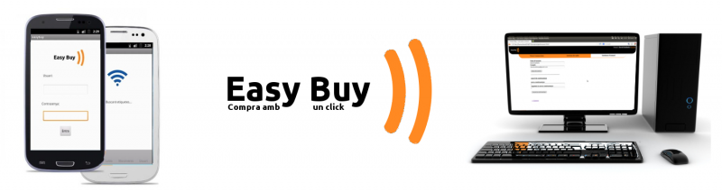
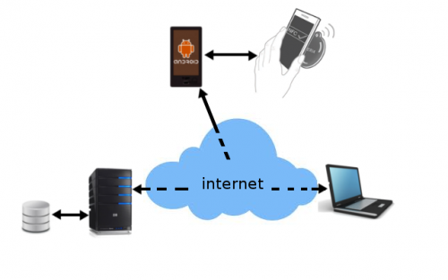

## Contents

* [1 1. ¿Qué es EasyBuy?](#1._.C2.BFQu.C3.A9_es_EasyBuy.3F)
* [2 2. ¿Cómo funciona?](#2._.C2.BFC.C3.B3mo_funciona.3F)
* [3 3. Tecnologías usadas](#3._Tecnolog.C3.ADas_usadas)
  + [3.1 Cliente](#Cliente)
  + [3.2 Servidor](#Servidor)

## 1. ¿Qué es EasyBuy?[[edit](/pti/index.php?title=Categor%C3%ADa:EasyBuy&veaction=edit&section=1 "Edit section: 1. ¿Qué es EasyBuy?") | [edit source](/pti/index.php?title=Categor%C3%ADa:EasyBuy&action=edit&section=1 "Edit section: 1. ¿Qué es EasyBuy?")]

EasyBuy es una plataforma que permite a los usuarios que tienen un dispositivo de lectura de etiquetas
NFC, utilizar ese dispositivo para los pagos en diversos lugares. Para eso sólo hace falta acercar el
smartphone a una etiqueta NFC en un cierto lugar, y desde allí se llama nuestra aplicación Android en el
smartphone del usuario, dónde éste puede comprar y adquirir sus entradas digitales para diversos eventos.

El proyecto consiste en una aplicación para Android, donde los usuarios pueden autenticarse, consultar
y aumentar su saldo, ver sus transacciones, cambiar los datos de su cuenta y, por supuesto, hacer compras
a través de su dispositivo con NFC.
La otra parte del proyecto es una aplicación Web que permite a los usuarios que se registren en la
plataforma, ver sus transacciones, comprobar su saldo, comprobar lo que ya han comprado, etc.

## 2. ¿Cómo funciona?[[edit](/pti/index.php?title=Categor%C3%ADa:EasyBuy&veaction=edit&section=2 "Edit section: 2. ¿Cómo funciona?") | [edit source](/pti/index.php?title=Categor%C3%ADa:EasyBuy&action=edit&section=2 "Edit section: 2. ¿Cómo funciona?")]

Consta de una aplicación móvil para Android con un dispositivo con soporte para NFC que hace lectura de
etiquetas NFC. Este se comunica por la red con el sevidor para acceder a los datos de compra y los datos
de usuario. A su vez, el servidor se comunica con la aplicación web para servir también todos los datos y
los equipos de los usuarios (pc’s) se conectan a la web a través de su browser.

## 3. Tecnologías usadas[[edit](/pti/index.php?title=Categor%C3%ADa:EasyBuy&veaction=edit&section=3 "Edit section: 3. Tecnologías usadas") | [edit source](/pti/index.php?title=Categor%C3%ADa:EasyBuy&action=edit&section=3 "Edit section: 3. Tecnologías usadas")]

En este proyecto, hemos utilzado una serie de tecnologías para poder hacerlo todo funcional, que son las
citadas a continuación. La intención es intentar utilizar todo lo posible para llegar al máximo de usuarios
y, no obstante, utilizar las últimas tecnologías actuales para desarroyadores.

### Cliente[[edit](/pti/index.php?title=Categor%C3%ADa:EasyBuy&veaction=edit&section=4 "Edit section: Cliente") | [edit source](/pti/index.php?title=Categor%C3%ADa:EasyBuy&action=edit&section=4 "Edit section: Cliente")]

* **Android 2.3.3 o superior** - Hemos decidido utilizar Android con su versión más extendida actualmente, la 2.3.3 (Gingerbread). Para el desarroyo de apps lo más importante es tener un target amplio a la hora de distribuirlas. La idea, si se continuara extendiendo el proyecto sería hacer una versión para Android 4.0.1 y WindowsPhone que ya ha alcanzado en la cota de mercado a Apple.
* **Near Field Communication** - NFC, es una tecnología inovadora, y muy útil. En el proyecto hemos querido utilizar tecnologías modernas y con posiblilidad de futuro. Además, nos permite adquirir información de forma útil y rápida. Así cómo conseguirla mediante códigos QR limita el funcionamiento a la calidad de la cámara y de la imagen, y bluetooth necesita energía para transmitir información, NFC nos permite la lectura de etiquetas que no requieren energía para ser leídas y sirve sin problema para cualquier móvil con esta tecnología
* **Librería de Paypal** - Hemos utilizado las librerías y servicios de Paypal para las gestiones de dinero a traves de Paypal
* **Librería itext (Generación de PDF's)** - Hemos utilizado la librería Java y fácilmente usable con Android para la generación de pdf's (para la generación de las entradas y de códigos de barras para autentificación de las entradas)

### Servidor[[edit](/pti/index.php?title=Categor%C3%ADa:EasyBuy&veaction=edit&section=5 "Edit section: Servidor") | [edit source](/pti/index.php?title=Categor%C3%ADa:EasyBuy&action=edit&section=5 "Edit section: Servidor")]

* **Servidor Apache/2.2.19** - El servido utilizado es el que nos brinda 1&1 hosting. Este servidor dispone de Apache/2.2.19. Este servidor nos permite todas las funcionalidades de apache y, aunque finalmente no hemos utilizado, también había opción de tomcat con la utilización de servlets.
* **PHP 5.4** - En 1&1 también disponen de soporte para PHP 5.4 que nos permite todas las funcionalidades de la última versión de PHP. Combinado con HTML5 y CSS3, ponen la web a los servicios de las últimas tecnologías de internet. La web también couenta con scripts de JavaScript y con las funcionalidades de JQuery que nos permiten más interactividad y una visión más atractiva de la web.
* **Base de datos mySQL** - Para la base de datos tenemos una base de datos relacional MySql. Aunque se pueden utilizar otros tipos, hemos decidido seguir con lo clásico, entre otros motivos, porqué es lo que ofrece el servidor contratado. Para la gestión de la base de datos hemos utilizado phpMyAdmin. También ofrecido por el servidor.