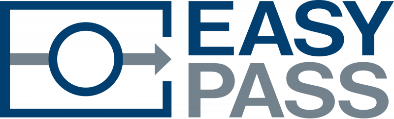

## Contents

* [1 Projecte EasyPass](#Projecte_EasyPass)
* [2 Tecnologies](#Tecnologies)
  + [2.1 NFC](#NFC)
  + [2.2 Servidor web](#Servidor_web)
* [3 Implementació del sistema](#Implementaci.C3.B3_del_sistema)
  + [3.1 Base de Dades](#Base_de_Dades)
  + [3.2 Aplicació Android](#Aplicaci.C3.B3_Android)
  + [3.3 Software NFC](#Software_NFC)
  + [3.4 Pàgina Web](#P.C3.A0gina_Web)
* [4 Conclusions](#Conclusions)

# Projecte EasyPass[[edit](/pti/index.php?title=Categor%C3%ADa:EasyPass&veaction=edit&section=1 "Edit section: Projecte EasyPass") | [edit source](/pti/index.php?title=Categor%C3%ADa:EasyPass&action=edit&section=1 "Edit section: Projecte EasyPass")]

EasyPass és un sistema que permet unificar les targetes de transport públic de AMB en una sola targeta NFC, fent que l’accés al transport públic sigui més ràpid i còmode que el actual mètode. A més a més, el sistema permet tenir un control del viatges que realitzes (origen i destí, hora d’entrada i sortida), un control dels bitllets comprats i permet tenir una visió general del ús dels accessos al transport públic en una estació i hora concreta.

La informació extreta a partir de les entrades i sortides dels usuaris pot servir a la empresa, per exemple TMB, en saber el us que tenen les seves estacions de metro o parades de autobús, per tal de millorar el rendiment d’aquests, o bé per l’usuari, per poder tenir la opció de triar l’estació de metro o parada de autobús a la que vol anar segons la gent que hi pugui haver.

# Tecnologies[[edit](/pti/index.php?title=Categor%C3%ADa:EasyPass&veaction=edit&section=2 "Edit section: Tecnologies") | [edit source](/pti/index.php?title=Categor%C3%ADa:EasyPass&action=edit&section=2 "Edit section: Tecnologies")]

## NFC[[edit](/pti/index.php?title=Categor%C3%ADa:EasyPass&veaction=edit&section=3 "Edit section: NFC") | [edit source](/pti/index.php?title=Categor%C3%ADa:EasyPass&action=edit&section=3 "Edit section: NFC")]

* Raspberry Pi 3 Model B
* Connexió a Internet
* Explore-NFC-WW (Lector NFC de la marca NXP)
* MIFARE ultralight EV1 (Targeta contactless)

## Servidor web[[edit](/pti/index.php?title=Categor%C3%ADa:EasyPass&veaction=edit&section=4 "Edit section: Servidor web") | [edit source](/pti/index.php?title=Categor%C3%ADa:EasyPass&action=edit&section=4 "Edit section: Servidor web")]

El servei de hosting que hem fet servir és de la empresa Hosteurope. Les carecterístiques del servidor no les podem saber del tot ja que el servei contractat que hem fet servir es un hosting compartit, és a dir, el hardware que tenim assignat no el podem saber.

# Implementació del sistema[[edit](/pti/index.php?title=Categor%C3%ADa:EasyPass&veaction=edit&section=5 "Edit section: Implementació del sistema") | [edit source](/pti/index.php?title=Categor%C3%ADa:EasyPass&action=edit&section=5 "Edit section: Implementació del sistema")]

* Base de Dades (MySql)
* Aplicació Android
* Software NFC
* Pàgina Web

## Base de Dades[[edit](/pti/index.php?title=Categor%C3%ADa:EasyPass&veaction=edit&section=6 "Edit section: Base de Dades") | [edit source](/pti/index.php?title=Categor%C3%ADa:EasyPass&action=edit&section=6 "Edit section: Base de Dades")]

Un dels punts fonamentals del nostre projecte és la base de dades. Hem fet servir un sistema MySQL. Ens ajuda a conectar el usuari amb la targeta i tots els seus moviments de viatges i compres.

## Aplicació Android[[edit](/pti/index.php?title=Categor%C3%ADa:EasyPass&veaction=edit&section=7 "Edit section: Aplicació Android") | [edit source](/pti/index.php?title=Categor%C3%ADa:EasyPass&action=edit&section=7 "Edit section: Aplicació Android")]

L’aplicació d’android de Easypass es una aplicació nativa, es dir, els llenguatges utilitzats en la apliació son Java i XML, i el programa empreat per crear-lo es l’Android Studio. Aquesta aplicació s’ha creat amb API 22 i per tant es compatible desde la versió 5.1 d’Android fins l’actual en el moment (6.0).
Aquesta aplicació te diferents utilitats, intentant oferir un servei usable i fàcil d’entendre a l’usuari, per fer-ho així, em fet ús d’un menú lateral, el que ens comporta que utilitzem fragments per mostrar totes la pantalles de la aplicació.

## Software NFC[[edit](/pti/index.php?title=Categor%C3%ADa:EasyPass&veaction=edit&section=8 "Edit section: Software NFC") | [edit source](/pti/index.php?title=Categor%C3%ADa:EasyPass&action=edit&section=8 "Edit section: Software NFC")]

A continuació us explicarem detalladament el sistema NFC. Per entendre-ho millor hem separat els softwares en diferents arxius, ja que a la vida real tindrem varies maquines (la màquina validadora que ens permet accedir al transport públic, la màquina per comprar els bitllets i finalment la màquina que permetrà registrar la targeta al sistema i comprovar que s’ha gravar correctament).

## Pàgina Web[[edit](/pti/index.php?title=Categor%C3%ADa:EasyPass&veaction=edit&section=9 "Edit section: Pàgina Web") | [edit source](/pti/index.php?title=Categor%C3%ADa:EasyPass&action=edit&section=9 "Edit section: Pàgina Web")]

L’inici de la pàgina web s’ha fet amb una plantilla de bootstrap, tot i que no se n’ha aprofitat gaire i s’ha fet a la nostra manera, ens donava un punt per començar. Sense assemblar-se a la plantilla inicial, s’ha anat modificant tot l’aspecte de la pàgina web mitjançant html 5 i css, per tal de donar forma i fer la imatge de la plana web. A més a més, amb bootstrap hem aconseguit que la pàgina web sigui responsive.

Seguidament, per tal d’implementar totes les funcionalitats, s’ha fet mitjançant php i javascript. Php s’ha fet servir per la majoria de serveis, principalment quan s’ha d’accedir a la base de dades per obtenir informació i per transmetre-ho a la web, javascript en canvi, ho hem fet servir per mostrar el resultat de les cerques de l’apartat de dades en format d’una gràfica lineal que té fins a dues estacions per tal de poder comparar la quantitat de gent que hi passa.

Podeu visitar la pàgina web fent click al següent enllaç: [EasyPass](http://www.dispenia.com/easypass)

# Conclusions[[edit](/pti/index.php?title=Categor%C3%ADa:EasyPass&veaction=edit&section=10 "Edit section: Conclusions") | [edit source](/pti/index.php?title=Categor%C3%ADa:EasyPass&action=edit&section=10 "Edit section: Conclusions")]

En aquest projecte hem escollit que cadascú desenvolupi una part que no coneixia anteriorment, per tal d’aprendre noves tecnologies. El resultat després d’aquests mesos barallant-nos, preguntant, i cercant a Internet com bojos ha sigut Easypass, un projecte que intenta millorar el sistema de validació dels tiquets del transport públic, així com dotar d’una interfície per a que l’usuari hi pugui interactuar i un rere fons per a completar la gestió de les dades.
Aquest projecte ens ha aportat saber com comunicar-nos entre el grup, gestionar les feines pendents, saber com planificar el temps per no deixar-ho tot l’últim dia, i també ens ha obligat a buscar-nos la vida cercant per Internet i/o preguntant als respectius companys.

Moltes gràcies per llegir el projecte i esperem que us hagi agradat!