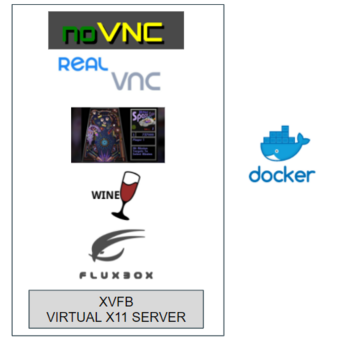

## Contents

* [1 Introducció](#Introducci.C3.B3)
* [2 Objectius](#Objectius)
* [3 Tecnologies](#Tecnologies)
* [4 Hardware](#Hardware)
* [5 Conclusions](#Conclusions)

# Introducció[[edit](/pti/index.php?title=Categor%C3%ADa:FIBADIA&veaction=edit&section=1 "Edit section: Introducció") | [edit source](/pti/index.php?title=Categor%C3%ADa:FIBADIA&action=edit&section=1 "Edit section: Introducció")]

Durant el Q1 de 2021 - 2022 nosaltres, Albert Acedo, Antoni Paredes, Oriol Ortiz i Sergi Vilches, hem dedicat el projecte de l’assignatura de PTI a realitzar una aplicació web per l’streaming de videojocs utilitzant diferents tecnologies que avui en dia podem trobar en el mercat i que ens permeten poder jugar en una Web tenint la capacitat computacional en un altre dispositiu.

# Objectius[[edit](/pti/index.php?title=Categor%C3%ADa:FIBADIA&veaction=edit&section=2 "Edit section: Objectius") | [edit source](/pti/index.php?title=Categor%C3%ADa:FIBADIA&action=edit&section=2 "Edit section: Objectius")]

El primer pilar del projecte és la gestió dels jocs de forma dinàmica pel funcionament en qualsevol dispositiu que estigui connectat mitjançant Internet. Per a realitzar-ho, hem decidit “Dockeritzar” els jocs als que podien accedir els usuaris i utilitzar la distribució K3s de Kubernetes per a gestionar els inicis d’aquest i els tancaments.

A més, per a poder contenir els diferents jocs hem necessitat d’un stack de tecnologies de les quals ens permeten desde l’ús dels jocs basats en Windows per a clients UNIX, com l’ús del nostre navegador sense la necessitat d’instal·lar qualsevol tipus d’aplicació en el client.

El segon pilar es tracta de la implementació d’una aplicació web per a que els clients es puguin connectar des de qualsevol part del món i puguis accedir als nostres jocs i puguin jugar de forma remota sense haver de carregar amb una capacitat computacional. Per això hem desenvolupat una aplicació web Java la qual mitjançant JSP i Servlets podem tractar les peticions d’aquests usuaris i poder comunicar-nos amb la API del nostre Clúster de Kubernetes per poder iniciar els jocs i fer streaming.

Com a últim pilar tenim la integració del Clúster de Kubernetes dintre d’un stack de Raspberry simulant un petit centre de processament de dades i poder córrer els jocs dintre d’aquest HW.

# Tecnologies[[edit](/pti/index.php?title=Categor%C3%ADa:FIBADIA&veaction=edit&section=3 "Edit section: Tecnologies") | [edit source](/pti/index.php?title=Categor%C3%ADa:FIBADIA&action=edit&section=3 "Edit section: Tecnologies")]

**-Docker**: En altres paraules, podem definir Docker com a l’ús de contenidors. Aquesta tecnologia serà necessària per poder compactar i estandarditzar els diferents jocs que proporcionarem als usuaris.

**-Kubernetes (K3s)**: Aquesta tecnologia ens permet poder tenir una organització dels nostres contenidors en viu i controlar quins estan actius, poder crear-los i poder destruir-los.

**-X Windows System**: El servidor accepta les entrades de l'usuari com per exemple el ratolí i teclat. I respon amb la sortida gràfica, les finestres, que es mostraran per pantalla.

**-Fluxbox**: Existeixen tota mena de X Windows Manager, des de Managers complexos i amb funcionalitats específiques fins als més simples. En el nostre projecte hem utilitzat Fluxbox, per la seva simplicitat, baix consum i velocitat.

**-VNC**: VNC són les sigles de Virtual Network Computing, està basat en una estructura client-servidor, la qual permet observar les accions de l'ordinador servidor a través d'un ordinador client.

**-WINE**: La majoria de videojocs que hi ha al mercat no suporten Unix com a sistema operatiu, estan tots pensats per a Windows. Per aquest motiu hem instal·lat Wine, un programa que ens permet executar funcions de Windows en Linux.

**-NoVNC**: noVNC és un projecte open source creat per Joel Martin, el qual integra un client VNC al navegador, fent ús de WebSockify.

# Hardware[[edit](/pti/index.php?title=Categor%C3%ADa:FIBADIA&veaction=edit&section=4 "Edit section: Hardware") | [edit source](/pti/index.php?title=Categor%C3%ADa:FIBADIA&action=edit&section=4 "Edit section: Hardware")]

Com a hardware per a muntar el clúster, inicialment vam escollir dues Raspberry Pi 3 ja que disposavem d’elles i a més era una manera innovadora de crear el nostre projecte.
El handicap del projecte, a part de la complexitat de la integració de les tecnologies usades, ha sigut adaptar-les a les característiques limitades de les nostres Raspberrys, per això ens hem decantat per versions lleugeres de les tecnologies com es el cas de k3s. La creació del clúster ha sigut un èxit, els nodes es comuniquen entre ells, duen a terme correctament la funció de master/slave, i la gestió dels containers es eficient.

# Conclusions[[edit](/pti/index.php?title=Categor%C3%ADa:FIBADIA&veaction=edit&section=5 "Edit section: Conclusions") | [edit source](/pti/index.php?title=Categor%C3%ADa:FIBADIA&action=edit&section=5 "Edit section: Conclusions")]

Podem afirmar que aquest projecte ha estat concebut per a posar en pràctica idees d’un sistema de jugabilitat en remot, no tant com a un projecte d’implementació de les millors tecnologies actuals i punteres per tal de tenir un resultat amb un rendiment increible. El nostre objectiu principal ha estat la de desenvolupar una aplicació funcional i a la pràctica s’ha conseguit. Aquesta aplicació conta amb un sistema fiable i operatiu i hem sigut capaços de jugar en remot al Pinball tal i com vam demostrar a les Demos realitzades a l’aula de classe.

Aquest tipus de projectes han demostrat ser molt escalables i en un futur encoratgem als nous estudiants a poder seguir amb les línies d’investigació que nosaltres hem obert per tal de que puguis seguir, millorar i optimitzar tot aquell treball que hem dedicat a aquest projecte. Les tecnologies d’streaming són part del futur i aquest stack segur que ha assentat les bases de futures desenvolupacions.