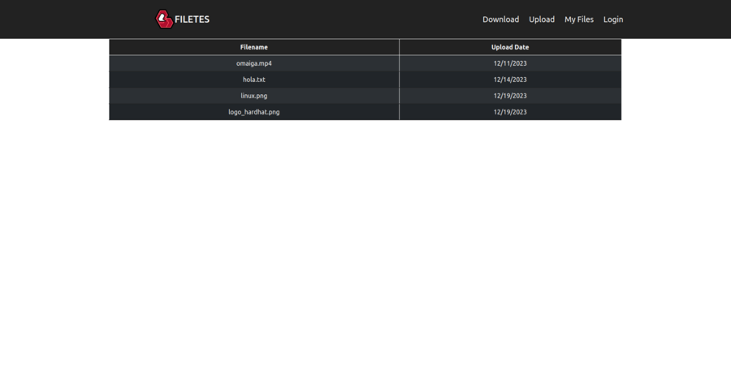

## Contents

* [1 Introducció](#Introducci.C3.B3)
* [2 Què és FILETES?](#Qu.C3.A8_.C3.A9s_FILETES.3F)
* [3 Idea del projecte](#Idea_del_projecte)
* [4 Tecnologies utilitzades](#Tecnologies_utilitzades)
  + [4.1 FRONTEND](#FRONTEND)
  + [4.2 BACKEND](#BACKEND)
  + [4.3 BLOCKCHAIN](#BLOCKCHAIN)
  + [4.4 CI/CD](#CI.2FCD)
* [5 Imatges d'exemple](#Imatges_d.27exemple)

# Introducció[[edit](/pti/index.php?title=Categor%C3%ADa:FILETES&veaction=edit&section=1 "Edit section: Introducció") | [edit source](/pti/index.php?title=Categor%C3%ADa:FILETES&action=edit&section=1 "Edit section: Introducció")]

FILE Trusted Environment Storage (FILETES) és un servei web que permet verificar la procedència i integritat dels documents pujats al mateix servei.

Logo de FILETES.

# Què és FILETES?[[edit](/pti/index.php?title=Categor%C3%ADa:FILETES&veaction=edit&section=2 "Edit section: Què és FILETES?") | [edit source](/pti/index.php?title=Categor%C3%ADa:FILETES&action=edit&section=2 "Edit section: Què és FILETES?")]

FILE Trusted Environment Storage (FILETES) és un servei web que ens permet pujar i baixar fitxers multimèdia garantint la integritat, seguretat i procedència de tots els fitxers. En cas que un atacant modifiqui algun fitxer, a l'hora de descarregar-lo, FILETES detectarà l'anomalia i no permetrà que es pugui obtenir el fitxer. D'aquesta manera se'ns fa possible identificar els autors i verificar que el contingut és l'original.

# Idea del projecte[[edit](/pti/index.php?title=Categor%C3%ADa:FILETES&veaction=edit&section=3 "Edit section: Idea del projecte") | [edit source](/pti/index.php?title=Categor%C3%ADa:FILETES&action=edit&section=3 "Edit section: Idea del projecte")]

Els nostres objectius són:

* Creació d'una pàgina web per gestionar fitxers i poder compartir-los.
* Utilitzar les propietats de la blockchain per resoldre problemes relacionats amb la integritat dels fitxers.
* Oferir claus públiques als usuaris per a que es puguin identificar.
* Virtualitzar el nostre servei mitjançant kubernetes.

Per tant, afegint un segell de qualitat als documents pujats al nostre servei, podem garantir la procedència i integritat del document. A més a més, vam trobar una necessitat que fos fàcil d'utilitzar i obert a tot el públic.

# Tecnologies utilitzades[[edit](/pti/index.php?title=Categor%C3%ADa:FILETES&veaction=edit&section=4 "Edit section: Tecnologies utilitzades") | [edit source](/pti/index.php?title=Categor%C3%ADa:FILETES&action=edit&section=4 "Edit section: Tecnologies utilitzades")]

Esquema de les tecnologies utilitzades

### FRONTEND[[edit](/pti/index.php?title=Categor%C3%ADa:FILETES&veaction=edit&section=5 "Edit section: FRONTEND") | [edit source](/pti/index.php?title=Categor%C3%ADa:FILETES&action=edit&section=5 "Edit section: FRONTEND")]

* React

### BACKEND[[edit](/pti/index.php?title=Categor%C3%ADa:FILETES&veaction=edit&section=6 "Edit section: BACKEND") | [edit source](/pti/index.php?title=Categor%C3%ADa:FILETES&action=edit&section=6 "Edit section: BACKEND")]

* Nodejs

### BLOCKCHAIN[[edit](/pti/index.php?title=Categor%C3%ADa:FILETES&veaction=edit&section=7 "Edit section: BLOCKCHAIN") | [edit source](/pti/index.php?title=Categor%C3%ADa:FILETES&action=edit&section=7 "Edit section: BLOCKCHAIN")]

* Solidity
* Sepolia
* Hardhat

### CI/CD[[edit](/pti/index.php?title=Categor%C3%ADa:FILETES&veaction=edit&section=8 "Edit section: CI/CD") | [edit source](/pti/index.php?title=Categor%C3%ADa:FILETES&action=edit&section=8 "Edit section: CI/CD")]

* Kubernetes
* Docker

# Imatges d'exemple[[edit](/pti/index.php?title=Categor%C3%ADa:FILETES&veaction=edit&section=9 "Edit section: Imatges d'exemple") | [edit source](/pti/index.php?title=Categor%C3%ADa:FILETES&action=edit&section=9 "Edit section: Imatges d'exemple")]

Homepage de FILETES

Registre d'usuaris

Mostra dels meus fitxers