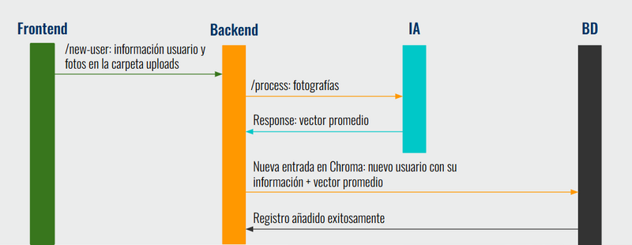
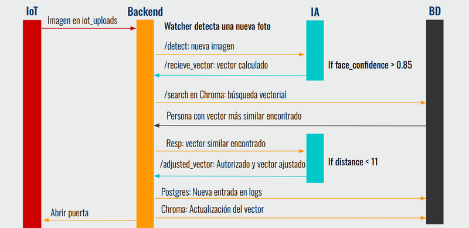
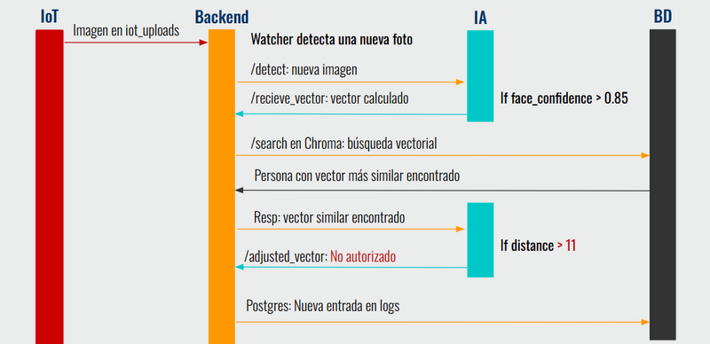

## Contents

* [1 Introducción](#Introducci.C3.B3n)
* [2 Estructura del sistema](#Estructura_del_sistema)
  + [2.1 Frontend](#Frontend)
  + [2.2 Base de datos](#Base_de_datos)
  + [2.3 IoT](#IoT)
  + [2.4 Inteligencia artificial](#Inteligencia_artificial)
  + [2.5 Backend](#Backend)
  + [2.6 Despliegue de servicios](#Despliegue_de_servicios)

# Introducción[[edit](/pti/index.php?title=Categor%C3%ADa:FacePass&veaction=edit&section=1 "Edit section: Introducción") | [edit source](/pti/index.php?title=Categor%C3%ADa:FacePass&action=edit&section=1 "Edit section: Introducción")]

En el presente proyecto se ha desarrollado un sistema de desbloqueo de puertas mediante reconocimiento facial, orientado a pequeñas, medianas y grandes empresas que busquen modernizar sus instalaciones y, al mismo tiempo, incrementar los niveles de seguridad de sus accesos físicos. Este sistema permite gestionar de forma centralizada el control de accesos a diferentes instalaciones, sustituyendo o complementando los tradicionales métodos de apertura mediante llaves, tarjetas o códigos.
En el contexto actual de digitalización y automatización de procesos empresariales, la seguridad física sigue siendo un área prioritaria en constante evolución. La implementación de soluciones basadas en inteligencia artificial y sistemas de identificación biométrica ha dejado de ser exclusiva de grandes corporaciones para convertirse en una opción viable y cada vez más accesible para empresas de todos los tamaños. Este proyecto se enmarca en esta tendencia, ofreciendo una propuesta que combina comodidad, fiabilidad y escalabilidad.

# Estructura del sistema[[edit](/pti/index.php?title=Categor%C3%ADa:FacePass&veaction=edit&section=2 "Edit section: Estructura del sistema") | [edit source](/pti/index.php?title=Categor%C3%ADa:FacePass&action=edit&section=2 "Edit section: Estructura del sistema")]

Para la realización de este proyecto, se ha decidido separar el desarrollo de los diferentes componentes que conforman el sistema, con el objetivo de aumentar la paralelización de la implementación y facilitar el testeo de estos componentes. El sistema modular creado se conforma de cinco bloques funcionales interrelacionados:

* IoT (Internet of Things): Encargado de la gestión y control de los dispositivos físicos, en concreto de la cámara que proporciona las imágenes para el reconocimiento facial y del servomotor que simula la cerradura de la entrada monitorizada.
* Base de Datos: Responsable del almacenamiento seguro de la información necesaria para el correcto funcionamiento del sistema, incluyendo los datos de los usuarios autorizados y los registros de intentos de acceso.
* Frontend: Proporciona una interfaz de usuario intuitiva para la monitorización y configuración del sistema desarrollado.
* Backend: Gestiona la lógica del sistema y se encarga de la comunicación entre los diferentes módulos, procesando las peticiones y enviando los comandos necesarios.
* Inteligencia Artificial: Módulo encargado de realizar el reconocimiento facial de los usuarios, determinando si se autoriza o no el acceso en función de los datos almacenados.

A continuación, se muestra un esquema representativo de la estructura planteada para el sistema, definiendo claramente las conexiones necesarias entre los módulos para el correcto funcionamiento del mismo:

* IA ⭤ Backend: Necesaria para proporcionar los datos requeridos en el proceso de reconocimiento facial y en la decisión de apertura de la entrada.
* Frontend ⭤ Backend: Proporciona los datos necesarios para una correcta visualización del estado del sistema y, a su vez, permite al usuario ingresar o proporcionar sus propios datos.
* Base de Datos ⭤ Backend: Garantiza el correcto almacenamiento de los datos, además de permitir recuperarlos en cualquier momento.
* IoT ⭤ Backend: Permite la transmisión de imágenes y recibe los comandos necesarios para el control de los accesos.

Estructura del sistema

## Frontend[[edit](/pti/index.php?title=Categor%C3%ADa:FacePass&veaction=edit&section=3 "Edit section: Frontend") | [edit source](/pti/index.php?title=Categor%C3%ADa:FacePass&action=edit&section=3 "Edit section: Frontend")]

El módulo Frontend está orientado al desarrollo de una interfaz que permita al usuario no solo monitorizar en tiempo real el estado y las estadísticas más relevantes del sistema, sino también configurar los distintos componentes que lo integran y añadir nuevos elementos al entorno existente.
Para ello, se ha optado por implementar una aplicación web accesible desde cualquier navegador, eliminando la necesidad de instalar programas adicionales y garantizando así una mayor accesibilidad y compatibilidad para un mayor número de usuarios. La aplicación ha sido desarrollada utilizando React una biblioteca de javascript y complementada con módulos CSS para el diseño y la estética visual.

## Base de datos[[edit](/pti/index.php?title=Categor%C3%ADa:FacePass&veaction=edit&section=4 "Edit section: Base de datos") | [edit source](/pti/index.php?title=Categor%C3%ADa:FacePass&action=edit&section=4 "Edit section: Base de datos")]

En este proyecto se han utilizado distintas bases de datos con el objetivo de almacenar y gestionar la información necesaria para el funcionamiento del sistema. Para ello, se realizó primero un análisis de los datos que debían almacenarse, se eligieron las bases de datos más adecuadas para cada tipo de información y se implementó finalmente el módulo de bases de datos.

Se identificaron dos grandes bloques de datos: por un lado, los datos personales de las personas autorizadas a acceder, y por otro, los logs de accesos. Los datos personales incluían identificador, rol, email, teléfono, permisos de acceso y un vector facial utilizado por el sistema de reconocimiento facial. Los logs registraban información como la puerta, la persona que intentó acceder, fecha, hora y si el acceso fue exitoso.

A la hora de elegir las bases de datos, inicialmente se planteó usar PostgreSQL para todo. Sin embargo, tras la recomendación de un profesor, se decidió investigar ChromaDB para la gestión de los vectores faciales, ya que está optimizada para almacenar y consultar vectores. De este modo, se utilizó ChromaDB para almacenar tanto los vectores como la metadata asociada a cada persona, y se mantuvo PostgreSQL para guardar los registros de logs, al ser datos simples que no requerían bases especializadas.

Respecto a la implementación, en un primer momento se crearon bases de datos de forma local en Python, pero pronto se detectó que solo era posible interactuar con ellas ejecutando ese mismo script. Para solucionar esto, se decidió exponer las bases de datos a través de peticiones HTTP, permitiendo así añadir, eliminar y consultar datos de forma remota desde otros módulos, especialmente el Frontend. Se comprobó su funcionamiento utilizando curl y navegadores web.

El resultado fue un módulo de bases de datos accesible, funcional y bien integrado en el sistema, permitiendo una gestión flexible y eficiente de los datos.

## IoT[[edit](/pti/index.php?title=Categor%C3%ADa:FacePass&veaction=edit&section=5 "Edit section: IoT") | [edit source](/pti/index.php?title=Categor%C3%ADa:FacePass&action=edit&section=5 "Edit section: IoT")]

El módulo de IoT es el usado para realizar la toma de fotos y la apertura de la puerta. El módulo consiste de un par de periféricos (cámara y mecanismo de apertura) que se conectan a un microcontrolador central encargado de comunicarse con ellos y con el servidor central. Los componentes usados han sido un servomotor Emax ES08A II para simular el cerrojo de una puerta, una Logitech C920 HD Pro como cámara y una Raspberry Pi 3 como microcontrolador.

La comunicación con el servidor central la ha realizado la Raspberry Pi 3 mediante 2 protocolos. Uno de ellos es MQTT para la recepción de los mensajes de apertura. El backend se encarga de enviar un mensaje "open" cada vez que debamos abrir la puerta. El otro protocolo usado es HTTP para el envío de las imágenes de forma periódica al backend para su posterior análisis por la IA.

## Inteligencia artificial[[edit](/pti/index.php?title=Categor%C3%ADa:FacePass&veaction=edit&section=6 "Edit section: Inteligencia artificial") | [edit source](/pti/index.php?title=Categor%C3%ADa:FacePass&action=edit&section=6 "Edit section: Inteligencia artificial")]

Para la implementación de la sección de la IA hemos utilizado la librería Deepface donde ya se proporcionan modelos de reconocimiento facial. Para nuestro proyecto se ha utilizado el modelo Facenet que extrae los vectores faciales de una fotografía dada, por lo que no se ha entrenado desde cero.
Nuestro módulo de IA en el proyecto ha consistido en integrar DeepFace en un sistema real. Se han diseñado dos scripts para realizar las funciones principales de nuestro proyecto.
Por un lado, se ha implementado el código para registrar una persona al sistema. Este registro consiste en añadir un nuevo usuario con su información y fotografías. De esta manera, esta persona ya estará autorizada a entrar.
El otro script consiste en detectar a una persona y hacer el reconocimiento para determinar si está autorizada o no a entrar. Es decir, hacer una detección en tiempo real, comparar el vector extraído con los que hay guardados en la base de datos Chroma y ajustar el vector.

## Backend[[edit](/pti/index.php?title=Categor%C3%ADa:FacePass&veaction=edit&section=7 "Edit section: Backend") | [edit source](/pti/index.php?title=Categor%C3%ADa:FacePass&action=edit&section=7 "Edit section: Backend")]

Este módulo se encarga de hacer las conexiones necesarias entre las diferentes secciones del sistema.

**Conexión Frontend-Backend-BD**

La conexión entre el frontend y la base de datos a través del módulo de Backend en este proyecto se basa en una comunicación sencilla, utilizando solicitudes HTTP y datos en formato JSON. Estas solicitudes se realizan desde las vistas implementadas hacia los endpoints definidos en el backend, y este mismo se encarga de solicitar la información necesaria a las bases de datos a traves de los endpoints creados en el servicio BD. De esta manera se permite que el frontend obtenga y muestre la información de manera dinámica, además de permitir la interacción y actualización de datos en tiempo real.
Para facilitar esta comunicación, se crearon endpoints específicos en el backend, cada uno diseñado para proporcionar respuestas predefinidas que cubrieran las necesidades de las distintas funcionalidades del frontend. Estos endpoints se encargan de gestionar los datos necesarios para el correcto funcionamiento de las vistas, asegurando que la interfaz responda correctamente a las acciones del usuario.
A continuación, se enumeran los endpoints implementados, con una breve descripción de su finalidad y funcionamiento:

* /metrics: Este endpoint devuelve un conjunto de métricas predefinidas y hardcodeadas sobre el sistema, como el número de accesos autorizados y denegados, la hora con más intentos de acceso, la puerta más accedida y la evolución de los accesos durante la semana. La idea sería disponer de la lógica necesaria para calcular estas estadísticas con los valores reales del sistema.
* /users: Este endpoint realiza una solicitud GET a la base de datos para obtener todos los usuarios añadidos y sus propiedades más básicas.
* /user/:id: Este endpoint recibe un parámetro id a través de la URL y dependiendo del tipo de petición realizada GET o PATCH , el endpoint realizará una tarea diferente. En el caso de realizar una petición de tipo GET, el endpoint se encarga mediante una solicitud a la base de datos, en obtener los datos del usuario correspondiente desde el servicio externo.
* /new-user: En este endpoint es donde se reciben los datos que el usuario ha introducido en el formulario al crear un nuevo usuario. Además, se pasa el nombre de cada fotografía para que el backend sepa cuáles coger de la carpeta uploads.
* /entries: Este endpoint permite obtener todas las puertas almacenadas en el sistema, asi como sus propiedades más básicas. En este caso, se trata de un conjunto de datos hardcodeados que representan la única puerta disponible en el sistema.
* /entries/:id: Este endpoint recibe un parámetro id en la URL, y en función del tipo de petición especificada, realiza una tarea u otra de la misma manera que en el caso del endpoint /user/:id . Si la petición realizada se trata de una solicitud GET, se realiza una petición a la base de datos para obtener los datos de la puerta correspondiente. Por otro lado, si la petición es de tipo PATCH, este endpoint permite actualizar los datos de una puerta existente.
* /addentry : Este endpoint permite agregar una nueva puerta al sistema. Actualmente esta funcionalidad no está disponible pues el sistema desarrollado no dispone de ninguna base de datos donde guardar esta información.
* /logs: Este endpoint obtiene todos los registros de acceso desde la base de datos de Postgres.
* /deniedlogs: Este endpoint obtiene únicamente los registros de accesos denegados desde el servicio externo de Postgres.
* /last5logs: Este endpoint obtiene los últimos 5 registros de acceso desde el servicio de Postgres, sin tener en cuenta ningún tipo de filtro.
* /userlogs/:id: Este endpoint obtiene los registros de acceso de un usuario específico, utilizando el parámetro id proporcionado en la URL.
* /entrylogs/:id: De la misma manera que el endpoint anterior, este endpoint obtiene los registros de acceso relacionados con una puerta específica, utilizando el parámetro id proporcionado en la URL.
* /systemsettings: Este endpoint permite obtener la configuración actual del sistema incluyendo configuraciones como el tema de la interfaz y el idioma . Actualmente se trata de datos hardcodeados directamente sobre el backend.
* /alertsettings: Este endpoint devuelve la configuración actual de las alertas. Como en el caso anterior, actualmente se trata de datos hardcodeados.

En cuanto al testeo de todas estas comunicaciones, se llevó a cabo directamente mediante el despliegue local de los módulos necesarios, Frontend, Backend y ambas bases de datos. Durante este proceso, se corrigieron errores menores relacionados principalmente con la coordinación de nombres o lógicas mal definidas en ciertas interacciones. Este enfoque permitió identificar cómodamente los fallos para rápidamente corregirlos asegurando el correcto funcionamiento del sistema.

**Conexión para añadir usuario: New-user – Backend – IA – BD**

Para poder realizar la funcionalidad de agregar un nuevo usuario al sistema, se ha de hacer la conexión desde Frontend, pasando por IA hasta la base de datos.
Primero de todo, en Frontend se rellena el formulario para agregar a un nuevo usuario. Se indica el nombre, el rol, el email, el número de teléfono, la puerta a la que está autorizado a entrar y las fotografías del nuevo usuario. Esta información se envía al backend y las fotografías se colocan en la carpeta /uploads.
El backend se encarga de la gestión de la conexión entre la IA y la base de datos Chroma. En primer lugar, backend envía todas las fotografías que corresponden a la persona nueva introducida en el sistema con una petición http POST a la IA. La IA extrae los vectores faciales de cada una de las imágenes recibidas y se calcula el vector promedio como se explica en la sección de la IA.
La IA responde a la petición inicial del backend con el vector promedio facial de la nueva persona. Con este vector promedio, el backend ya puede crear una nueva entrada en la base de datos Chroma con toda la información del usuario recibida anteriormente por el Frontend y el vector promedio calculado por la IA.
En la siguiente imagen se puede observar el flujo del procedimiento de añadir un nuevo usuario al sistema y cómo se realiza la comunicación entre los distintos módulos para obtener la lógica deseada.

Conexión para poder implementar la funcionalidad de añadir un usuario

**Conexión para la detección: IoT – Backed – IA – BD**

El funcionamiento de este apartado se centra en verificar si la persona detectada en la cámara está o no autorizada a entrar.
Para ello, se ha tenido que establecer comunicación entre IoT, backend, la IA y la base de datos.
La comunicación empieza en IoT, cada diez segundos se realiza una fotografía con la cámara y se envía a la carpeta /iot\_uploads. Para ello, se utilizó la librería Multer, lo que permitió establecer un límite de 4 imágenes almacenadas simultáneamente. Una vez alcanzado ese límite, la imagen más antigua se elimina automáticamente de la carpeta para dejar espacio a la nueva.
En el backend hay un watcher que es responsable de detectar con librería de Axios si una nueva imagen se ha colocado en la carpeta /iot\_uploads. Entonces, el watcher se espera unos segundos antes de enviar la imagen a la IA para que se pueda cargar bien. La IA recibe la imagen en el endpoint /detect. Esta función se encarga de detectar si hay o no un rostro como se ha mencionado anteriormente en la sección de IA. En el caso de que se detecte una cara, la IA envía al endpoint del backend /recieve\_vector el vector extraído.
A continuación, el backend establece una conexión con la base de datos Chroma para iniciar una búsqueda del vector más similar guardado con el que se pasa en la petición. El backend recibe la respuesta de la base de datos Chroma.
Lo siguiente que realiza el backend es responder a la petición que había hecho la IA al endpoint /recieve\_vector con el vector más similar obtenido en la base de datos. En este momento, la IA mira la distancia entre ambos vectores y según el threshold determina si la persona está o no autorizada.
Ahora esta funcionalidad se divide en dos casos. El caso en que la persona está autorizada y el caso en que no lo está.
En el caso de que la persona esté autorizada, la IA se encarga de ajustar el vector y enviárselo al backend al endpoint /adjusted\_vector. El backend con esta información, modifica la entrada ya existente de la persona en la base de datos Chroma con el nuevo vector ajustado. Por otro lado, añade una nueva entrada en la base de datos Postgres con la fecha, el nombre de la persona y el estado del acceso como autorizado.

Conexión para poder implementar la funcionalidad de detectar un usuario autorizado

Para el caso en que la persona no está autorizada a entrar, la IA envía al endpoint /adjusted\_vector, un vector vacío, dando a entender que la persona no ha estado autorizada y por lo tanto no se ha podido ajustar ningún vector.
Finalmente, backend envía un POST a la base de datos Postgres para crear una nueva entrada de un log. Se establece la persona como desconocida que en una fecha determinada ha intentado entrar, pero el acceso ha sido denegado.

Conexión para poder implementar la funcionalidad de detectar un usuario no autorizado

## Despliegue de servicios[[edit](/pti/index.php?title=Categor%C3%ADa:FacePass&veaction=edit&section=8 "Edit section: Despliegue de servicios") | [edit source](/pti/index.php?title=Categor%C3%ADa:FacePass&action=edit&section=8 "Edit section: Despliegue de servicios")]

El despliegue de servicios hace referencia a la preparación del resto de módulos (excepto IoT) para ser fácilmente desplegables en un servidor central. El servidor central es la maquina virtual de OpenNebula proporcionada por la FIB. Para realizar el despliegue se han usado tecnologías como Docker y K3S, además de habilidades de administración de sistemas y de redes.

El primer paso para poder realizar este módulo es dockerizar todos los módulos del sistema que deben ejecutarse en un servidor (todos menos IoT). Cada una de las imágenes Docker generadas se han subido a Dockerhub en el siguiente repositorio: <https://hub.docker.com/r/andmas199/pti>. Tras esto, se han generado los ficheros yaml para el despliegue con k3s. Una parte importante de la generación de los ficheros ha sido la asignación de puertos de cada servicio, especialmente para aquellos accesibles desde el exterior. Los modulos accesibles desde el exterior se han desplegado en los puertos 8088(frontend) y 8086(backend). Además de esto, hay otro puerto accesible al exterior (8082) reservado para la comunicación del broker MQTT con IoT.