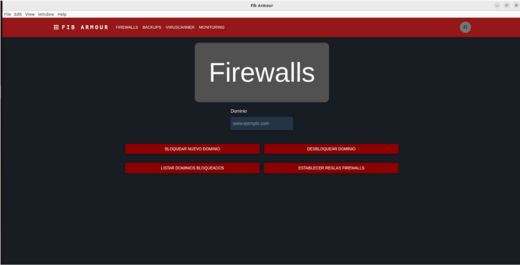
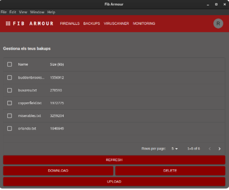

[](/pti/index.php/File:Logo_Fib_Armour.png)

## Contents

* [1 Introducción](#Introducci.C3.B3n)
  + [1.1 ¿Qué es FibArmour?](#.C2.BFQu.C3.A9_es_FibArmour.3F)
* [2 Tecnologías utilizadas](#Tecnolog.C3.ADas_utilizadas)
  + [2.1 Cliente](#Cliente)
  + [2.2 Servidor](#Servidor)
* [3 Infraestructura](#Infraestructura)
  + [3.1 Arquitectura general](#Arquitectura_general)
* [4 Servicios](#Servicios)

# Introducción[[edit](/pti/index.php?title=Categor%C3%ADa:FibArmour&veaction=edit&section=1 "Edit section: Introducción") | [edit source](/pti/index.php?title=Categor%C3%ADa:FibArmour&action=edit&section=1 "Edit section: Introducción")]

## ¿Qué es FibArmour?[[edit](/pti/index.php?title=Categor%C3%ADa:FibArmour&veaction=edit&section=2 "Edit section: ¿Qué es FibArmour?") | [edit source](/pti/index.php?title=Categor%C3%ADa:FibArmour&action=edit&section=2 "Edit section: ¿Qué es FibArmour?")]

FIB-Armour nace de la necesidad de las pequeñas empresas que utilizan sistemas informáticos a diario y que no tienen la capacidad económica de contratar a personal cualificado para las tareas de gestión y protección de recursos informáticos en la empresa. Como bien sabemos, hay servicios externos que se dedican a cubrir este mercado, pero al ser tan costoso, muchas veces las empresas optan por recortar gastos en este ámbito. El objetivo de FIB-ARMOUR es el de ser un IT system management software simple e intuitivo, pero a su vez completo y seguro, aportando nuestros servicios a un precio reducido para llegar a esas pequeñas empresas que no se puede permitir contratar a un gigante de la industria como IBM.

Nuestras ventajas serían que el cliente tendría una aplicación de precio reducido, totalmente centralizado y sin la necesidad de contratar a un especialista TI para que gestione el software.

# Tecnologías utilizadas[[edit](/pti/index.php?title=Categor%C3%ADa:FibArmour&veaction=edit&section=3 "Edit section: Tecnologías utilizadas") | [edit source](/pti/index.php?title=Categor%C3%ADa:FibArmour&action=edit&section=3 "Edit section: Tecnologías utilizadas")]

Como bien sabemos, uno de los principales objetivos que se plantean dentro de estos proyectos es la de integrar diferentes tecnologías. En el siguiente apartado pasaremos a listar todas las tecnologías que se utilizan dentro de este proyecto. Las diferenciaremos tanto en el ámbito del cliente como del servidor.

## Cliente[[edit](/pti/index.php?title=Categor%C3%ADa:FibArmour&veaction=edit&section=4 "Edit section: Cliente") | [edit source](/pti/index.php?title=Categor%C3%ADa:FibArmour&action=edit&section=4 "Edit section: Cliente")]

Por la parte del cliente podemos destacar las siguientes tecnologías, que están sumamente dirigidas al desarrollo del frontend, es decir, frameworks que nos permiten interactuar por ejemplo con código en HTML o CSS.

* **Electron** Electron es un proyecto de código abierto mantenido por la OpenJS Foundation y una activa comunidad de colaboradores. Facilita el desarrollo de aplicaciones de escritorio. Electron incorpora Chromium y Node.js para que los desarrolladores web puedan crear aplicaciones de escritorio.
  + **Electron Forge** Electron Forge es un conjunto de herramientas para crear y publicar aplicaciones Electron. Nos permite crear por ejemplo archivos .deb o .rpm (en Linux) para poder distribuir la aplicación.
* **Webpack** Webpack es un empaquetador de módulos, es decir, te permite generar un archivo único con todos aquellos módulos que necesita tu aplicación para funcionar. Para darte una idea, te permite incluir todos tus archivos javascript . js en un único archivo, incluso se pueden incluir hasta archivos de estilos.
* **React** La función principal de React es desarrollar páginas web de una manera gratuita y sencilla gracias a sus componentes reutilizables. Estos hacen posible usar un mismo elemento en varias partes del sitio o en otros sitios sin necesidad de volver a escribir todo el código.

## Servidor[[edit](/pti/index.php?title=Categor%C3%ADa:FibArmour&veaction=edit&section=5 "Edit section: Servidor") | [edit source](/pti/index.php?title=Categor%C3%ADa:FibArmour&action=edit&section=5 "Edit section: Servidor")]

Por la parte del servidor encontramos tecnologías que nos permiten desplegar servidores, crear API REST y interactuar con bases de datos. Así mismo, tenemos tecnologías especificas para la implementación de los servicios que incluye este proyecto. Las tecnologías utilizadas son:

* **Node.js** Ideado como un entorno de ejecución de JavaScript orientado a eventos asíncronos, Node.js está diseñado para crear aplicaciones network escalables.
* **MongoDB** MongoDB es un sistema de base de datos NoSQL, orientado a documentos y de código abierto.
* **Eclipse Mosquitto** Eclipse Mosquitto es un broker de mensajes de código abierto que implementa las versiones 5.0, 3.1.1 y 3.1 del protocolo MQTT. Mosquitto es ligero y se puede utilizar en todos los dispositivos, desde ordenadores monoplaca de bajo consumo hasta servidores completos.
* **MQTT** MQTT es un protocolo de mensajería basado en estándares, o un conjunto de reglas, que se utiliza para la comunicación de un equipo a otro.
* **Grafana** Grafana es una plataforma interactiva y open source de visualización de datos desarrollada por Grafana Labs. Dicha plataforma permite a los usuarios ver sus datos a través de tablas y gráficos que se unifican en un panel de control (o en varios) para facilitar la interpretación y la comprensión.
* **Prometheus** Prometheus es una solución de supervisión de código abierto líder para las métricas y las alertas. Prometheus admite datos dimensionales con identificadores de clave-valor para las métricas, proporciona el lenguaje de consulta PromQL y admite muchas integraciones mediante exportadores para otros productos.
* **Ansible** Ansible es una herramienta open source que automatiza los procesos informáticos para preparar la infraestructura, gestionar la configuración, implementar las aplicaciones y organizar los sistemas, entre otros procedimientos manuales de TI.

# Infraestructura[[edit](/pti/index.php?title=Categor%C3%ADa:FibArmour&veaction=edit&section=6 "Edit section: Infraestructura") | [edit source](/pti/index.php?title=Categor%C3%ADa:FibArmour&action=edit&section=6 "Edit section: Infraestructura")]

## Arquitectura general[[edit](/pti/index.php?title=Categor%C3%ADa:FibArmour&veaction=edit&section=7 "Edit section: Arquitectura general") | [edit source](/pti/index.php?title=Categor%C3%ADa:FibArmour&action=edit&section=7 "Edit section: Arquitectura general")]

Para realizar el proyecto nos hemos decantado por un modelo de microservicios donde nosotros exponemos una serie de servicios al exterior empleando una API Gateway. Para tener una idea general de la arquitectura os presentamos el siguiente diagrama donde tenemos tanto la parte del cliente como la parte del servidor y como se comunican entre ellas.

[](/pti/index.php/File:Arquitectura_general.png)

Arquitectura general del proyecto

# Servicios[[edit](/pti/index.php?title=Categor%C3%ADa:FibArmour&veaction=edit&section=8 "Edit section: Servicios") | [edit source](/pti/index.php?title=Categor%C3%ADa:FibArmour&action=edit&section=8 "Edit section: Servicios")]

El siguiente diagrama detalla los casos de uso que se han implementado en la aplicación. Para resumir se pueden diferenciar los siguientes casos de uso

[](/pti/index.php/File:Casos_de_uso.png)

Casos de uso del proyecto.

```
— Gestión de usuarios: Relacionado con el login, logout y registro en la aplicación.

```

```
— Backups: La posibilidad de realizar, eliminar, modificar y consultar backups.

```

```
— Firewalls: La creación, modificación, consulta y eliminación de firewalls. 

```

```
— Monitorización: Consulta de los recursos utilizados por cada máquina de la empresa.

```

```
— Virus: Consulta de si un archivo es malicioso o no y consulta de un histórico.

```

[](/pti/index.php/File:Servicio_Monitorizaci%C3%B3n.png)

Servicio Monitorización

[](/pti/index.php/File:Firewalls.png)

Servicio de Firewalls

[](/pti/index.php/File:Backups.png)

Servicio de Backups

[](/pti/index.php/File:Servicio_de_Virus.png)

[](/pti/index.php/File:Inicio_de_sesi%C3%B3n.png)

Inicio de sesión