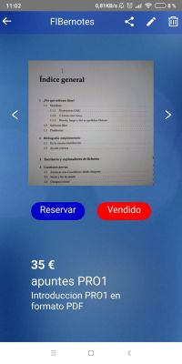

Logo FIBernotes

## Contents

* [1 Introducció](#Introducci.C3.B3)
  + [1.1 ¿Què és FIBernotes?](#.C2.BFQu.C3.A8_.C3.A9s_FIBernotes.3F)
* [2 Tecnologies](#Tecnologies)
* [3 Diagrama general del projecte](#Diagrama_general_del_projecte)
* [4 Captures de pantalla](#Captures_de_pantalla)
* [5 Memòria](#Mem.C3.B2ria)

# Introducció[[edit](/pti/index.php?title=Categor%C3%ADa:FiberNotes&veaction=edit&section=1 "Edit section: Introducció") | [edit source](/pti/index.php?title=Categor%C3%ADa:FiberNotes&action=edit&section=1 "Edit section: Introducció")]

De la necessitat de tenir uns bons apunts per poder aprobar els exàmens de la FIB neix Fibernotes

## ¿Què és FIBernotes?[[edit](/pti/index.php?title=Categor%C3%ADa:FiberNotes&veaction=edit&section=2 "Edit section: ¿Què és FIBernotes?") | [edit source](/pti/index.php?title=Categor%C3%ADa:FiberNotes&action=edit&section=2 "Edit section: ¿Què és FIBernotes?")]

El projecte es tracta d'una aplicació mòbil multiplataforma que permet la compra-venta d'apunts, exercicis, pràctiques i exàmens anteriors, limitat a l'entorn de la FIB. Aquests documents poden ser venuts tant en format físic com digital.

# Tecnologies[[edit](/pti/index.php?title=Categor%C3%ADa:FiberNotes&veaction=edit&section=3 "Edit section: Tecnologies") | [edit source](/pti/index.php?title=Categor%C3%ADa:FiberNotes&action=edit&section=3 "Edit section: Tecnologies")]

Les tecnologies principals utilitzades són:

* React Native
* NodeJS
* MongoDB
* Docker

# Diagrama general del projecte[[edit](/pti/index.php?title=Categor%C3%ADa:FiberNotes&veaction=edit&section=4 "Edit section: Diagrama general del projecte") | [edit source](/pti/index.php?title=Categor%C3%ADa:FiberNotes&action=edit&section=4 "Edit section: Diagrama general del projecte")]

A continuació podeu veure com es relacionen les tecnolgíes emprades en l'aplicació.

Mapa de les tecnologíes emprades

# Captures de pantalla[[edit](/pti/index.php?title=Categor%C3%ADa:FiberNotes&veaction=edit&section=5 "Edit section: Captures de pantalla") | [edit source](/pti/index.php?title=Categor%C3%ADa:FiberNotes&action=edit&section=5 "Edit section: Captures de pantalla")]

A continuació podeu veure quin és el resultat final de l'aplicació.

|  |  |  |  |
| --- | --- | --- | --- |
|  Login |  Sign Up |  Principal |  Menú |
|  Producte |  Cerca |  Perfil |  Compres |

# Memòria[[edit](/pti/index.php?title=Categor%C3%ADa:FiberNotes&veaction=edit&section=6 "Edit section: Memòria") | [edit source](/pti/index.php?title=Categor%C3%ADa:FiberNotes&action=edit&section=6 "Edit section: Memòria")]

Podeu veure la memòria del projecte aquí [[[1]](http://wiki.fib.upc.es/pti/index.php/File:Memoria_Fibernotes.pdf)