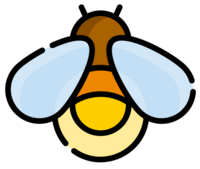
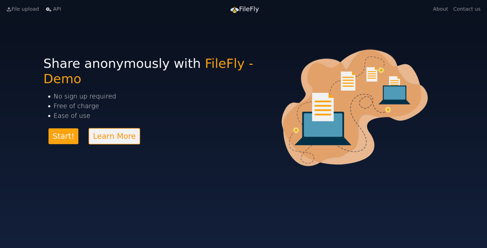

Logo del proyecto.

Pagina principal

## Contents

* [1 Introducción](#Introducci.C3.B3n)
  + [1.1 ¿Qué es FileFly?](#.C2.BFQu.C3.A9_es_FileFly.3F)
* [2 Infraestructura y Stack Tecnológico](#Infraestructura_y_Stack_Tecnol.C3.B3gico)
* [3 Integración continua y desligue continuo (CI/CD)](#Integraci.C3.B3n_continua_y_desligue_continuo_.28CI.2FCD.29)
  + [3.1 Github Actions](#Github_Actions)
  + [3.2 Docker](#Docker)

# Introducción[[edit](/pti/index.php?title=Categor%C3%ADa:FileFly&veaction=edit&section=1 "Edit section: Introducción") | [edit source](/pti/index.php?title=Categor%C3%ADa:FileFly&action=edit&section=1 "Edit section: Introducción")]

Cuando empezamos a pensar en el proyecto que nos gustaría implementar, dándole vueltas a la cabeza se nos ocurrió está aplicación llamada FileFly. Básicamente esta aplicación consiste en una página web para el intercambio de ficheros.

## ¿Qué es FileFly?[[edit](/pti/index.php?title=Categor%C3%ADa:FileFly&veaction=edit&section=2 "Edit section: ¿Qué es FileFly?") | [edit source](/pti/index.php?title=Categor%C3%ADa:FileFly&action=edit&section=2 "Edit section: ¿Qué es FileFly?")]

Todos conocemos mil páginas en las que podemos intercambiar ficheros pero en prácticamente todas necesitamos registrarnos y dejar datos personales con los que nos pueden relacionar. De esto se trata la innovación de nuestro proyecto, en nuestra aplicación no necesitaremos registrarnos para poder compartir ficheros, simplemente se pedirá al usuario los campos necesarios para subir el fichero y de esta forma se le otorgara un enlace mediante el que se podrá descargar el contenido.

Nuestra idea también es hacer ficheros efímeros, es decir, ficheros que no perduran para la eternidad, por ejemplo un usuario puede subir un archivo con limitación de tiempo y de numero de descargas.

# Infraestructura y Stack Tecnológico[[edit](/pti/index.php?title=Categor%C3%ADa:FileFly&veaction=edit&section=3 "Edit section: Infraestructura y Stack Tecnológico") | [edit source](/pti/index.php?title=Categor%C3%ADa:FileFly&action=edit&section=3 "Edit section: Infraestructura y Stack Tecnológico")]

Stack MERNÍ

Nuestro infraestructura consiste de distintos componentes. En primer lugar todo esta hosteado en DigitalOcean una nube publica que concede créditos gratuitos a estudiantes para proyectos como este. En ella tenemos nuestras maquinas virtuales, donde corre la aplicación, bases de datos y el almacenamiento.

Nuestra aplicación esta compuesta por diferentes tecnologías de las cuáles podríamos decir que no son las mas habituales para este tipo de aplicaciones, usamos un stack tecnológico llamado MERN, M de MongoDB, E de Express, R de React y por último N de Nodejs, todo este stack combinado con IPFS.

# Integración continua y desligue continuo (CI/CD)[[edit](/pti/index.php?title=Categor%C3%ADa:FileFly&veaction=edit&section=4 "Edit section: Integración continua y desligue continuo (CI/CD)") | [edit source](/pti/index.php?title=Categor%C3%ADa:FileFly&action=edit&section=4 "Edit section: Integración continua y desligue continuo (CI/CD)")]

Una de las tareas más repetitivas en un proyecto de software es el proceso de build y deploy de la aplicación. Si estas deben realizarse de manera manual cada vez que queremos testear la aplicación o desplegarla para producción acabaremos invirtiendo en ellas tiempo que podría haberse dedicado al desarrollo de la aplicación.

## Github Actions[[edit](/pti/index.php?title=Categor%C3%ADa:FileFly&veaction=edit&section=5 "Edit section: Github Actions") | [edit source](/pti/index.php?title=Categor%C3%ADa:FileFly&action=edit&section=5 "Edit section: Github Actions")]

Dado que ya estábamos usando GitHub antes de decidir que herramienta de CI/CD usaríamos, optamos por usar el sistema de GitHub Actions. Actions permite definir una serie de tareas que se realizan cuando ocurren determinadas acciones en el repositorio, como por ejemplo un push en una rama. Cada tarea tiene una serie de pasos a realizar y se pueden definir dependencias entre tareas.

En nuestro proyecto hemos definido 3 tareas diferenciadas. Una primera acción para comprobar que la aplicación funciona y no produce errores de compilación, una segunda para compilar tanto el frontend como el backend y construir una imagen Docker a partir de ambos y una tercera para desplegar la imagen creada en DigitalOcean.

## Docker[[edit](/pti/index.php?title=Categor%C3%ADa:FileFly&veaction=edit&section=6 "Edit section: Docker") | [edit source](/pti/index.php?title=Categor%C3%ADa:FileFly&action=edit&section=6 "Edit section: Docker")]

Como ya se ha comentado en el apartado anterior, hemos utilizado Docker para realizar el despliegue de la aplicación. Docker no solo nos permite ofrecer una imagen compacta con la aplicación, sino que gracias al registro de contenedores de DigitalOcean también podemos acceder a estas de manera rápida y sencilla desde las VM.

Para nuestra imagen hemos escogido una distribución ligera como es AlpineLinux. En caso de necesitar escalar en el futuro podríamos dividir la aplicación en dos microservicios de backend y frontend para replicarlos con un sistema de orquestración como Docker Swarm o Kubernetes.