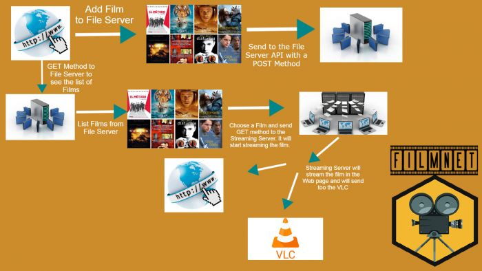

FilmNet Logo

# Introducció[[edit](/pti/index.php?title=Categor%C3%ADa:Filmnet&veaction=edit&section=1 "Edit section: Introducció") | [edit source](/pti/index.php?title=Categor%C3%ADa:Filmnet&action=edit&section=1 "Edit section: Introducció")]

## Que és FilmNet?[[edit](/pti/index.php?title=Categor%C3%ADa:Filmnet&veaction=edit&section=2 "Edit section: Que és FilmNet?") | [edit source](/pti/index.php?title=Categor%C3%ADa:Filmnet&action=edit&section=2 "Edit section: Que és FilmNet?")]

Filmnet. Inclou la descripció del projecte, el procés de planificació i de implementació d’aquesta nova tecnologia; una infraestructura per a poder veure pel·lícules amb els amics en remot i activat des de qualsevol dispositiu.

La nova tecnologia consta d’una Aplicació Web que permet visualitzar la cartellera de pel·lícules disponibles en un Servidor de fitxers i la possibilitat de reproduir la pel·lícula tant al mòbil com a una TV o Monitor per streaming mitjançant una Raspberry Pi (o qualsevol altre dispositiu que tingui la possibilitat de ser configurat com a servidor) connectada per HDMI. Per tal de pujar les pel·lícules al Servidor de Fitxers, és disposa a d’un servei Web que a través d’un formulari permet pujar la pel·lícula desitjada.

# Arquitectura[[edit](/pti/index.php?title=Categor%C3%ADa:Filmnet&veaction=edit&section=3 "Edit section: Arquitectura") | [edit source](/pti/index.php?title=Categor%C3%ADa:Filmnet&action=edit&section=3 "Edit section: Arquitectura")]

Estructura del projecte.

Filmnet utilitza dos APIs per poder servir el streaming. Per un costat tenim l’API del File Server que escolta en el port 8080 i que gestiona les peticions fetes per part de la web app. Per altra banda tenim l’API de streaming en el port 7000, que mitjançant Node Media Server s’encarrega de inicialitzar el procés per visualitzar la pel·lícula en viu. Per últim tenim un servidor Web que està connectat directament amb el servidor de fitxers per tal de crear i poder llistar tot el contingut disponible en aquesta plataforma.

Per poder utilitzar l'aplicació s'ha de fer servir la pàgina web per tal de introduïr les pel·lícules i enviar les dades a partir d'un fitxer JSON al servidor de fitxers. Seguidament podrem llistar les pel·lícules i seleccionar la pel·lícula que és vol reproduir. Si el servidor de streaming esta conectat a un televisó o pantalla, el contingut seleccionat es reproduirà a partir del reproductor VLC. En qualsevol moment podem anar a qualsevol dispositiu web, introduïr la pàgina de la pel·lícula en streaming i poder-la visualitzar.