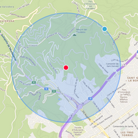
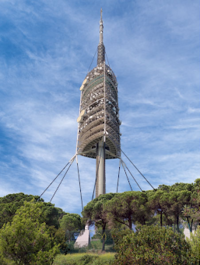
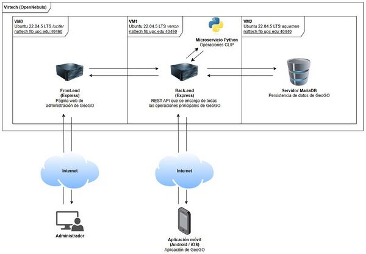

.png)

Logo del proyecto.

## Contents

* [1 Introducción](#Introducci.C3.B3n)
  + [1.1 ¿Qué es GeoGO?](#.C2.BFQu.C3.A9_es_GeoGO.3F)
* [2 Reglas del juego](#Reglas_del_juego)
  + [2.1 Mecánica principal](#Mec.C3.A1nica_principal)
  + [2.2 Puntos](#Puntos)
  + [2.3 Pistas](#Pistas)
* [3 Infraestructura](#Infraestructura)
* [4 Comparación de imágenes](#Comparaci.C3.B3n_de_im.C3.A1genes)
* [5 Aplicación móvil](#Aplicaci.C3.B3n_m.C3.B3vil)

# Introducción[[edit](/pti/index.php?title=Categor%C3%ADa:GeoGo&veaction=edit&section=1 "Edit section: Introducción") | [edit source](/pti/index.php?title=Categor%C3%ADa:GeoGo&action=edit&section=1 "Edit section: Introducción")]

## ¿Qué es GeoGO?[[edit](/pti/index.php?title=Categor%C3%ADa:GeoGo&veaction=edit&section=2 "Edit section: ¿Qué es GeoGO?") | [edit source](/pti/index.php?title=Categor%C3%ADa:GeoGo&action=edit&section=2 "Edit section: ¿Qué es GeoGO?")]

GeoGO es un juego de geolocalización para dispositivos móviles. Los jugadores reciben una fotografía recortada sobre algún lugar de interés de su ciudad (como una calle o monumento emblemático, por ejemplo), y tendrán que averiguar y acercarse a su origen. Al hacerlo, ganarán puntos y podrán aprender algún dato histórico sobre el lugar que han visitado.

Los objetivos son los mismos para todos los jugadores y se añaden diariamente sin expirar. Los jugadores que encuentren los objetivos antes recibirán puntos adicionales y habrá un ranking por cada ciudad. El juego incentiva la exploración, el desplazamiento físico y la interacción social, y está inspirado en otros juegos como GeoGuessr o Pokémon GO.

# Reglas del juego[[edit](/pti/index.php?title=Categor%C3%ADa:GeoGo&veaction=edit&section=3 "Edit section: Reglas del juego") | [edit source](/pti/index.php?title=Categor%C3%ADa:GeoGo&action=edit&section=3 "Edit section: Reglas del juego")]

## Mecánica principal[[edit](/pti/index.php?title=Categor%C3%ADa:GeoGo&veaction=edit&section=4 "Edit section: Mecánica principal") | [edit source](/pti/index.php?title=Categor%C3%ADa:GeoGo&action=edit&section=4 "Edit section: Mecánica principal")]

Los jugadores comparten una lista de objetivos. Cada objetivo cuenta con una foto recortada (que llamaremos “recorte”) del lugar a descubrir y una posición relativa (que llamaremos “radio de localización”) en forma de radio de 1 km. Veamos un ejemplo con la Torre de Collserola:

|  |  |  |
| --- | --- | --- |
|  Ejemplo de Recorte. |  |  Ejemplo de Radio de localización. |

El jugador debe adentrarse en el radio de localización y tomar una foto del lugar de referencia del recorte. Si se encuentra fuera del radio, se le avisará que no puede completar el objetivo. Si se encuentran dentro del radio pero la foto es incorrecta, tampoco podrá completarlo. Si se encuentra dentro del radio y la foto es correcta, habrá resuelto el objetivo y se le recompensará con: la foto original, una descripción del lugar y 50 puntos.

Foto original.

## Puntos[[edit](/pti/index.php?title=Categor%C3%ADa:GeoGo&veaction=edit&section=5 "Edit section: Puntos") | [edit source](/pti/index.php?title=Categor%C3%ADa:GeoGo&action=edit&section=5 "Edit section: Puntos")]

Los puntos sirven para clasificarse en las tablas de cada ciudad. Por cada ciudad, habrá una tabla con los mejores jugadores de la última semana, el último mes, el último año, y siempre.

## Pistas[[edit](/pti/index.php?title=Categor%C3%ADa:GeoGo&veaction=edit&section=6 "Edit section: Pistas") | [edit source](/pti/index.php?title=Categor%C3%ADa:GeoGo&action=edit&section=6 "Edit section: Pistas")]

Los jugadores pueden gastar 25 créditos en una pista de un objetivo sin resolver. Dicha pista consiste en la reducción del radio de localización.

# Infraestructura[[edit](/pti/index.php?title=Categor%C3%ADa:GeoGo&veaction=edit&section=7 "Edit section: Infraestructura") | [edit source](/pti/index.php?title=Categor%C3%ADa:GeoGo&action=edit&section=7 "Edit section: Infraestructura")]

La arquitectura del proyecto está basada en una solución de **tres máquinas virtuales** que distribuyen las responsabilidades entre el *backend*, la base de datos y la interfaz de administración. Adicionalmente, se incluye una aplicación móvil que consume directamente los servicios del *backend*. Toda la solución utiliza contenedores Docker para facilitar la portabilidad, despliegue y mantenimiento.

Arquitectura del sistema.

* **Servidor *frontend* de administración:** Servidor **Express**. Este *frontend* se utiliza para administrar la aplicación, permite añadir y eliminar usuarios y desafíos, entre otras cosas.

* **Servidor *backend***: Contiene dos servicios. El principal es un servidor **Express** que ofrece la API REST a la que hacen las solicitudes tanto la aplicación móvil como la interfaz de administración. Además, contiene un **microservicio adicional en Python** y utilizando Flask encargado de gestionar la comparación de imágenes a través de inteligencia artificial. Este microservicio solamente se encarga de esta tarea, y no recibe peticiones directamente del *frontend*, sino solo del propio *backend*.

* **Servidor de Base de Datos**: Se utiliza **MariaDB** para gestionar la base de datos. Los accesos a esta se hacen desde el *backend*.

# Comparación de imágenes[[edit](/pti/index.php?title=Categor%C3%ADa:GeoGo&veaction=edit&section=8 "Edit section: Comparación de imágenes") | [edit source](/pti/index.php?title=Categor%C3%ADa:GeoGo&action=edit&section=8 "Edit section: Comparación de imágenes")]

Para encontrar la similitud entre la imagen del desafío y la subida por el usuario utilizamos el modelo CLIP de OpenAI.

Este modelo está pensado principalmente para relacionar imágenes y textos, esto lo consigue representándolos en forma de vectores (embedding) y comparándolos. En nuestro caso lo usamos para comparar dos imágenes, sin la componente del texto, aunque esta no sea su principal funcionalidad. Para esto obtenemos los vectores de las dos imágenes objetivo y calculamos la semejanza de estos con la similitud coseno. De esta operación obtenemos un resultado, el cual tenemos que valorar cuán cercano a 1 debe ser para poder afirmar que se tratan de imágenes suficientemente parecidas.

Para integrar CLIP en el proyecto necesitamos utilizar librerias de Python, por lo que hemos creado un microservicio destinado solamente a esta tarea. Este escucha solicitudes del backend, recibe dos imágenes y devuelve su similitud. Las librerias que necesitamos son *clip* y *torch*.

# Aplicación móvil[[edit](/pti/index.php?title=Categor%C3%ADa:GeoGo&veaction=edit&section=9 "Edit section: Aplicación móvil") | [edit source](/pti/index.php?title=Categor%C3%ADa:GeoGo&action=edit&section=9 "Edit section: Aplicación móvil")]

La aplicación móvil, construida con React Native, está disponible para Android y iOS.