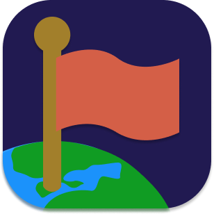
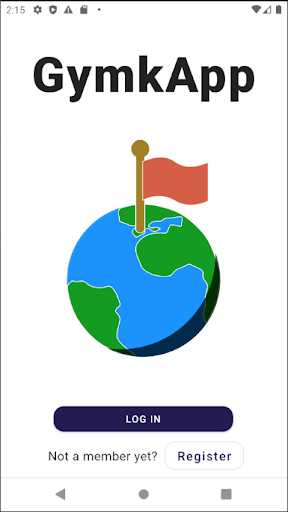
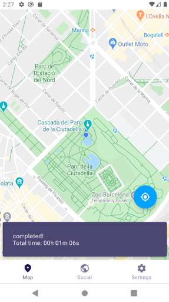

GymkApp

## Contents

* [1 Introducció](#Introducci.C3.B3)
* [2 Objectius](#Objectius)
* [3 Mètode](#M.C3.A8tode)
  + [3.1 Estructura del sistema](#Estructura_del_sistema)
  + [3.2 Tecnologies](#Tecnologies)
* [4 Producte final](#Producte_final)
* [5 Conclusions](#Conclusions)

# Introducció[[edit](/pti/index.php?title=Categor%C3%ADa:GymkApp&veaction=edit&section=1 "Edit section: Introducció") | [edit source](/pti/index.php?title=Categor%C3%ADa:GymkApp&action=edit&section=1 "Edit section: Introducció")]

La present memòria recull per escrit la informació que fa referència al projecte de tecnologies de la informació que hem dut a terme: GymkApp. Es descriu el procés de planificació disseny i implementació del sistema, una aplicació Android per a construïr i jugar gimcanes pel món.
Les gimkanes o mapes són conjunts de punts, que consten a més d’una descripció general que ajuda a definir quin tipus de joc ens trobarem. Els punts consten d’una posició en el mapa i un petit text que ens dona una pista sobre on anar. Per a jugar una gimcana cal passar per totes els punts, el text dels quals es revel·la quan es supera l’anterior.
L’aplicació està pensada per a permetre la creació de punts i mapes als usuaris i per a poder jugar qualsevol d’ells. Finalment el desenvolupament ha arribat a poder jugar-ne una sola precarregada al sistema.

# Objectius[[edit](/pti/index.php?title=Categor%C3%ADa:GymkApp&veaction=edit&section=2 "Edit section: Objectius") | [edit source](/pti/index.php?title=Categor%C3%ADa:GymkApp&action=edit&section=2 "Edit section: Objectius")]

Havent analitzat les necessitats que presenta el món de la gimcana, ens plantegem els següents objectius:

* Digitalitzar la gimcana
  + Pot ser jugada sense suport físic.
  + Pot ser jugada telemàticament.
  + Permetre un nombre elevat de jugadors.
* Fer les gimcanes reutilitzables.
  + Mantenir un registre de les gimcanes
  + Poder compartir les gimcanes amb altres persones.
* Comprovar el compliment de proves.

# Mètode[[edit](/pti/index.php?title=Categor%C3%ADa:GymkApp&veaction=edit&section=3 "Edit section: Mètode") | [edit source](/pti/index.php?title=Categor%C3%ADa:GymkApp&action=edit&section=3 "Edit section: Mètode")]

En aquesta secció trobem necessari una introducció del model el qual es recolza l’api creada i el conjunt que s’utilitzen tant en el Back End com en el FrontEnd.

## Estructura del sistema[[edit](/pti/index.php?title=Categor%C3%ADa:GymkApp&veaction=edit&section=4 "Edit section: Estructura del sistema") | [edit source](/pti/index.php?title=Categor%C3%ADa:GymkApp&action=edit&section=4 "Edit section: Estructura del sistema")]

En la figura podem veure les principals tecnologies que s’han implementat en el projecte i quina és la interacció entre elles.

Estructura del sistema.

## Tecnologies[[edit](/pti/index.php?title=Categor%C3%ADa:GymkApp&veaction=edit&section=5 "Edit section: Tecnologies") | [edit source](/pti/index.php?title=Categor%C3%ADa:GymkApp&action=edit&section=5 "Edit section: Tecnologies")]

Aquestes són totes les tecnologies usades per al desenvolupament de la app.

* Node.js
* MongoDB
* Express
* JWT
* Docker
* Github
* UPCLink
* Android SDK
* Kotlin/JVM
* Android Jetpack
* Maps SDK
* Google Location Services
* Material Design
* Retrofit 2
* OkHTTP3
* Gson

# Producte final[[edit](/pti/index.php?title=Categor%C3%ADa:GymkApp&veaction=edit&section=6 "Edit section: Producte final") | [edit source](/pti/index.php?title=Categor%C3%ADa:GymkApp&action=edit&section=6 "Edit section: Producte final")]

Aparença final de l'aplicació.

Pantalla de login

Gimcana completada

# Conclusions[[edit](/pti/index.php?title=Categor%C3%ADa:GymkApp&veaction=edit&section=7 "Edit section: Conclusions") | [edit source](/pti/index.php?title=Categor%C3%ADa:GymkApp&action=edit&section=7 "Edit section: Conclusions")]

El resultat d'aquest projecte ha estat un sistema que integra diferents tecnologies tan vistes a classe com algunes que ens ha semblat interessants aplicar-les.
En primer lloc, com s'ha pogut veure al llarg del treball s'han complert els principals objectius del projecte amb un resultat satisfactori: digitalitzar les gimcanes, fer-les i comprovar el compliment de les proves mitjançant la ubicació de l'usuari. Es tracta de modernitzar les gimcanes i això pot tenir un gran impacte en el temps actual on es busca l'entreteniment digital.
En segon lloc, hem ampliat els nostres coneixements en tecnologies utilitzades en l'actualitat i que tenen un impacte important a l'hora de crear, desenvolupar i desplegar un projecte tecnològic.
Tot i això, fins al moment de presentació d’aquesta memòria, la implementació per part del servidor ha aconseguit la seva completesa, però per part de l’aplicació s’ha arribat a jugar a un mapa prefixat, sense poder crear-lo ni seleccionar quin volem jugar.