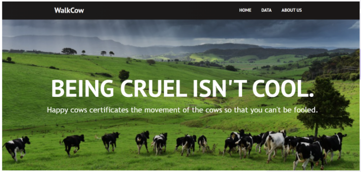
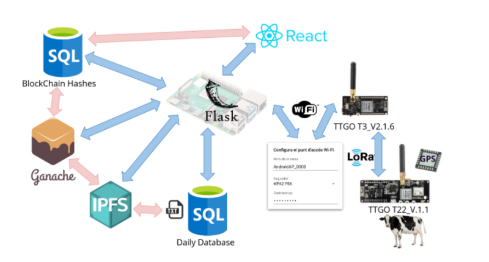
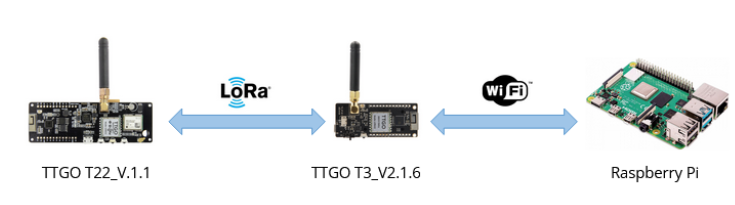

WEB.

## Contents

* [1 Introducció](#Introducci.C3.B3)
  + [1.1 Què és WalkCow?](#Qu.C3.A8_.C3.A9s_WalkCow.3F)
* [2 Arquitectura](#Arquitectura)
  + [2.1 Hardware](#Hardware)
  + [2.2 SQL](#SQL)
  + [2.3 IPFS](#IPFS)
  + [2.4 Blockchain](#Blockchain)
  + [2.5 FrontEnd](#FrontEnd)
* [3 Integració](#Integraci.C3.B3)
* [4 Conlusions](#Conlusions)

# Introducció[[edit](/pti/index.php?title=Categor%C3%ADa:HappyCows&veaction=edit&section=1 "Edit section: Introducció") | [edit source](/pti/index.php?title=Categor%C3%ADa:HappyCows&action=edit&section=1 "Edit section: Introducció")]

La idea del projecte walkcow sorgeix de la necessitat de certificar la procedència dels aliments làctics i carnis que s’ofereixen en els establiments, amb l’objectiu únic de millorar-ne l’origen, tant en termes de qualitat, com en termes de l’estat dels animals. I és que avui en dia, moltes marques industrials intenten engatusar al consumidor amb publicitat i eslògans que no encaixen amb la realitat dels seus animals. Concretament en l’àmbit del bestiar, la indústria alimentícia en el mercat làctic i càrnic on, en nombroses ocasions, apareixen en els envasos logotips de certificacions de dubtosa procedència en els productes de les grans productores per blanquejar l’origen dels productes.

Walkcow consisteix en un sistema de certificació del moviment del bestiar, en concret les vaques, que es recolza en la tecnologia descentralitzada de Blockchain i de la IPFS, i mitjançant un sistema de timestamp, amb l’objectiu que a aquestes productores els sigui més difícil enganyar als consumidors.

Actualment ja existeixen certificacions d’aquesta mena, amb l’essencial característica que la seva veracitat recau en la confiança que es té a l’entitat que audita les granges. Walkcow és una proposta que aporta confiança distribuida: el sistema està basat en Blockchain, la confiança en el sistema en sí certifica les dades, i n’evita la modificació. Això és, teòricament, un sistema resilient a modificacions fraudulentes amb l’objectiu de tergiversar l’estat del bestiar i, en conseqüència, l’origen o procedència dels productes que adquireix el consumidor.

### Què és WalkCow?[[edit](/pti/index.php?title=Categor%C3%ADa:HappyCows&veaction=edit&section=2 "Edit section: Què és WalkCow?") | [edit source](/pti/index.php?title=Categor%C3%ADa:HappyCows&action=edit&section=2 "Edit section: Què és WalkCow?")]

En concret, el nostre projecte consisteix a monitoritzar el moviment de les vaques mitjançant la col·locació de plaques de LoRa amb GPS integrat. Aquests xips envien paquets de dades amb informació geogràfica sobre la posició de les vaques a un gateway connectat a una Raspberry Pi, les quals es guarden en una base de dades temporal. Aquesta informació s’enviarà diariament a la IPFS per a ser emmagatzemats de forma distribuïda i permanent. Llavors, el hash de l’arxiu a la IPFS serà introduït a la Blockchain per a assegurar-ne la seva immutabilitat.
Les dades geogràfiques són accessibles als consumidors mitjançant una pàgina web dissenyada amb ReactJS. En la pàgina web els consumidors podran veure les dades en un format més visual, concretament en un mapa. A més a més es disposa d’una base de dades que ens permet emmagatzemar els hashes de la blockchain per a poder recuperar les dades. Per a integrar totes les parts d’aquest projecte s’ha utilitzat flask i crontab.

# Arquitectura[[edit](/pti/index.php?title=Categor%C3%ADa:HappyCows&veaction=edit&section=3 "Edit section: Arquitectura") | [edit source](/pti/index.php?title=Categor%C3%ADa:HappyCows&action=edit&section=3 "Edit section: Arquitectura")]

Arquitectura.

En primer lloc, per poder fer el seguiment del bestiar s'ha utilitzat la tecnologia LoRa amb GPS. Un sistema que utilitza pocs recursos, arriba a llargues distàncies i no necessita d’una gran infraestructura.

Un cop tenim les dades, volem que aquestes quedin emmagatzemades d’alguna manera a la blockchain, provocant així que no puguin ser modificades. Però guardar tantes dades a la blockchain implicaria una quantitat molt gran de transaccions, que això implica una enorme quantitat de diners gastats, cosa no molt sostenible diem-ne. Per tant necessitem un mètode d’emmagatzematge de dades diferent. Per simplicitat s'ha decidit fer una base de dades SQL, els motius són igual de simples: és un estàndard dins l'emmagatzematge de dades. La quantitat de dades que s’envien, depenent de la quantitat de bestiar, poden arribar a ser abismals, per aquest motiu, s'ha decidit que es farà una de diària; a més a més, seria preferible no guardar-la en local, ja que la quantitat de dades seria una mica monumental.

Un cop guardades, una manera de posar-les a la blockchain seria fer un hash de la base de dades diària i posar només aquest hash a la blockchain, cosa que ens estalvia una gran quantitat de transaccions i, per tant, de diners.

Ara només ens resta un problema: aquest projecte és per a una granja. No podem fer que el granger hagi de tenir un sistema informàtic amb unes especificacions d’emmagatzematge tan grans, a més a més, hi ha la possibilitat de perdre les dades si s’espatlla alguna cosa.
Aquí entra el mòdul IPFS, un sistema de fitxers distribuït. Les dades guardades a la base de dades diària es poden pujar a la IPFS, de manera que: en cas de pèrdua de dades no hi haurà cap problema ja que el node de la IPFS les guarda, i, directament, no necessitarem guardar les dades en local. Aquest sistema ens retorna un hash del fitxer, la qual cosa o cosa que ens estalvia el fet d’haver-ne de fer un.

L’addició d’aquest mòdul provoca que les necessitats del sistema d’integració es vegin molt reduïdes a una simple RaspberryPi amb accés a internet, que integrarà el sistema i utilitz Flask.

Per tant, els mòduls necessaris són: LoRa amb GPS pel seguiment i transmissió de dades, SQL per a la base de dades diària, IPFS per a guardar-ho en remot i Blockchain per a fer-les inamovibles.

Només ens queda una nova base de dades, també SQL, que guardi tots els hashs retornats de la Blockchain i un mòdul per a mostrar els resultats als usuaris que així ho desitgin. Per a fer això s'ha utilitzat React.

## Hardware[[edit](/pti/index.php?title=Categor%C3%ADa:HappyCows&veaction=edit&section=4 "Edit section: Hardware") | [edit source](/pti/index.php?title=Categor%C3%ADa:HappyCows&action=edit&section=4 "Edit section: Hardware")]

El mòdul de hardware es compon de les plaques de desenvolupament TTGO amb el software que executen, i la connexió WiFi amb la Raspberry Pi.

En concret, l’arquitectura interna d’aquest mòdul és la següent:

Arquitectura.

Se’n diferencien tres components (d’esquerra a dreta): els nodes LoRa, el gateway LoRa, i la Raspberry Pi.

Els nodes LoRa (la placa que porten les vaques) són plaques de desenvolupament TTGO T-Beam V1.1 (TTGO T22\_V1.1), que tenen un processador ESP32, un xip GPS i un transmisor/receptor LoRa, entre d’altres característiques.

El node Gateway LoRa és una placa de desenvolupament similar, una TTGO LoRa32 V2.1.6 (TTGO T3\_V1.6, o també TTGO LoRa32 V2.1 release 1.6), que conté un processador ESP32, un transmisor/receptor LoRa, connexió WiFi i Bluetooth.

Per últim, la Raspberry Pi, que conté connexió WiFi, la qual ens permet connectar-se amb la placa del Gateway LoRa.

El desenvolupament del software per a les plaques es duu a terme a Arduino IDE.

## SQL[[edit](/pti/index.php?title=Categor%C3%ADa:HappyCows&veaction=edit&section=5 "Edit section: SQL") | [edit source](/pti/index.php?title=Categor%C3%ADa:HappyCows&action=edit&section=5 "Edit section: SQL")]

Els mètodes que proporciona aquesta llibreria són:

* Construir una nova BD (fitxer)
* Construir una nova taula
* Escriure elements a la taula
* Llegir elements de la taula

La funció newFile (construir una nova BD) genera un nou fitxer amb el nom triat, encara que el fitxer existeixi, de manera que també es pot utilitzar com a mètode de destrucció.

S’ha conclòs que és necessària una funcionalitat addicional setFile per a assignar la base de dades que es vol modificar/llegir, de manera que facilita l’ús d’aquesta llibreria als desenvolupadors.

Per a construir una nova taula s’utilitzarà la funció newTable amb paràmetres: nom, camps\*, tipus\*, propietats\*, clau primària. S’ha de tenir en compte que els paràmetres marcats amb un asterisc són vectors i l’element ièssim de cadascun d’ells ha de correspondre al mateix camp.

Per a escriure elements a la taula s’ha programat el write amb paràmetres: nom, valors. On el nom és el nom de la taula que es vol editar i els valors són les noves entrades que s’hi volen afegir.

Per a llegir elements de la taula no és necessari per a aquest projecte tenir un lector de base de dades molt específic, així que la funció read llegeix tota una taula d’una base de dades (en SQL: SELECT \* FROM nom\_taula).

Com a funcionalitat complementària s’hi ha afegit un detector simple d’injeccions SQL per a que no es puguin modificar les dades de qualsevol manera.

## IPFS[[edit](/pti/index.php?title=Categor%C3%ADa:HappyCows&veaction=edit&section=6 "Edit section: IPFS") | [edit source](/pti/index.php?title=Categor%C3%ADa:HappyCows&action=edit&section=6 "Edit section: IPFS")]

Per al mòdul IPFS, precisarem de dues funcionalitats, principalment:

* Pujar un fitxer
* Llegir un fitxer

L’IPFS necessita un node on treballar, en aquest projecte se n’han emprat dos: un de públic i un de privat. El node públic és molt útil per a testejar però no és convenient utilitzar-ho en producció.

Per a pujar un fitxer al node IPFS s’utilitzarà la funció uploadFile amb el nom del fitxer com a paràmetre. Es retornarà un hash per a poder-hi accedir posteriorment, així que seria convenient guardar-se’l.

Per a llegir un fitxer del node IPFS s’emprarà el mètode readFile amb el hash guardat anteriorment com a paràmetre. Es retornarà el contingut del fitxer.

Quan es llegeix un fitxer d’un node IPFS pot tenir una latència considerable, cosa que provoca l’ús de la nova funció waitFile amb el hash com a paràmetre. Aquesta funció mostra el moment en què un fitxer es troba disponible per a llegir.

## Blockchain[[edit](/pti/index.php?title=Categor%C3%ADa:HappyCows&veaction=edit&section=7 "Edit section: Blockchain") | [edit source](/pti/index.php?title=Categor%C3%ADa:HappyCows&action=edit&section=7 "Edit section: Blockchain")]

Respecte a aquest apartat es pot dir que ha estat fallit. La idea era crear una blockchain local amb l'ajuda de ganache i truffle, però a causa d'un error es va abandonar.

Ja que els altres mòduls ja estaven integrats, es va decidir fer una llibreria que simulés la blockchain per a poder fer proves. Pel que fa a la llibreria que vam implementar, aquesta es dedica a guardar els hashos de la ispf en un fitxer de text, associant-los a un tag per saber a quin hash ens estem referint.

## FrontEnd[[edit](/pti/index.php?title=Categor%C3%ADa:HappyCows&veaction=edit&section=8 "Edit section: FrontEnd") | [edit source](/pti/index.php?title=Categor%C3%ADa:HappyCows&action=edit&section=8 "Edit section: FrontEnd")]

La página web on els consumidors poden consultar les estadístiques de moviment de les vaques va ser implementada amb ReactJS, que és una biblioteca Javascript. Vam utilitzar React degut a la facilitat i rapidesa que proporciona a l’hora d’implementar pàgines web. No obstant, més endavant vam convertir el codi a HTML per a poder integrar la pàgina web amb la resta de components.

La pàgina web està dividida en 3 parts: HOME, DATA y ABOUT US

A la pàgina de DATA mostrem un mapa (integrat amb OpenStreetMaps API) on es pot observar el recorregut de les vaques d’un dia en concret i les dades en format raw data. Aquestes dades contenen el id de la vaca i les coordenades (latitud i longitud), les quals es corresponen amb un timestamp. El consumidor pot triar el dia del qual vol veure les dades.

Mapa.

# Integració[[edit](/pti/index.php?title=Categor%C3%ADa:HappyCows&veaction=edit&section=9 "Edit section: Integració") | [edit source](/pti/index.php?title=Categor%C3%ADa:HappyCows&action=edit&section=9 "Edit section: Integració")]

Com que s’ha fet tot de forma modular, només s’ha de passar les dades (dades GPS, un hash,...) que s’obtenen d’un mòdul cap a un altre. A vegades s’ha de fer un reformateig.

Un cop desenvolupats tots els mòduls del sistema només ens queda un sistema que els unifiqui: el sistema d’integració. Aquest, s’encarrega de fer el traspàs de dades entre mòduls.

El procés d’obtenció de dades és el següent: es reben les coordenades per mitjà del mòdul Hardware, les emmagatzema al mòdul SQL, s’envia el fitxer a un node de la IPFS mitjançant el mòdul corresponent i rep un hash de resposta, envia aquest hash al mòdul Blockchain i rep un hash com a resposta, finalment, guarda aquest hash, junt amb els seus predecessors, a un altre BD del mòdul SQL.

El procés de recuperació de dades és el següent: tenim guardats els hashs del mòdul Blockchain a una base de dades SQL, els obtenim, recuperem el hash de l’IPFS del mòdul Blockchain, recuperem el fitxer de l’IPFS i mostrem les dades pel mòdul de React.

# Conlusions[[edit](/pti/index.php?title=Categor%C3%ADa:HappyCows&veaction=edit&section=10 "Edit section: Conlusions") | [edit source](/pti/index.php?title=Categor%C3%ADa:HappyCows&action=edit&section=10 "Edit section: Conlusions")]

Pel que fa a la part tecnològica d’aquest projecte, es pot observar que és un bon exemple d’integració ja que en formen part tecnologies que, en un principi, no semblen cohesionar. Pel que fa a aquestes tecnologies es pot dir que tots els membres han sigut capaços d'aprendre coses que no havien vist abans.

El producte obtingut, encara que només sigui un proof of work, creiem que podria tenir bastant futur. És cert que es podrien falsificar les dades si el granger s’ho proposa, però solucionant aquest problema, el mercat podria tenir molt abast. Avui en dia, la gent procura ser més sana i es consciencia més amb el medi ambient i, el nostre producte podria donar als consumidors justament el que desitgen.

Aquest treball està enfocat en les vaques i el seu recorregut, però es pot aplicar també a altres animals, com podrien ser ovelles, porcs, etc. la qual cosa abarcaria un mercat encara més gran. De la mateixa manera, pel fet d’haver modularitzat tot el sistema, qualsevol dels mòduls podria ser emprat en un altre sistema que així ho requereixi.