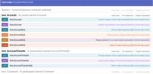
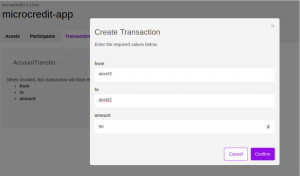

Hyperledger Fabric.

## Contents

* [1 Introducción](#Introducci.C3.B3n)
* [2 Objetivos Principales](#Objetivos_Principales)
* [3 Capturas de la demostración (PoC)](#Capturas_de_la_demostraci.C3.B3n_.28PoC.29)
* [4 Documentación Hyperledger Fabric](#Documentaci.C3.B3n_Hyperledger_Fabric)

# Introducción[[edit](/pti/index.php?title=Categor%C3%ADa:HyperledgerFabric&veaction=edit&section=1 "Edit section: Introducción") | [edit source](/pti/index.php?title=Categor%C3%ADa:HyperledgerFabric&action=edit&section=1 "Edit section: Introducción")]

Nuestro proyecto consiste en entender cómo funciona la arquitectura y el código de Hyperledger Fabric para reunir en un solo sitio toda la información necesaria a la hora de entender estas tecnologías tan recientes. También decidimos que haríamos un Proof of Concept diseñando una pequeña aplicación web que utiliza la cadena de bloques con el fin de realizar microcréditos entre personas de manera que ambas partes pudieran confiar en la otra.

# Objetivos Principales[[edit](/pti/index.php?title=Categor%C3%ADa:HyperledgerFabric&veaction=edit&section=2 "Edit section: Objetivos Principales") | [edit source](/pti/index.php?title=Categor%C3%ADa:HyperledgerFabric&action=edit&section=2 "Edit section: Objetivos Principales")]

El primer y principal objetivo de este proyecto es el de introducir a todo el mundo como funcionan realmente las tecnologías blockchain y, específicamente, el proyecto de Hyperledger Fabric.

Se trata de un objetivo ambicioso dado que son tecnologías muy recientes y que aún no se dispone públicamente de una cantidad de información elevada como puede pasar con otras tecnologías que ya están establecidas. También se da el caso que la diferencia entre las versiones más recientes es muy grande en términos de implementación y eso dificulta el proceso de aprendizaje.

Nuestro segundo objetivo es realizar una prueba de concepto sobre cómo funciona Hyperledger Fabric desarrollando una aplicación web de demostración.

# Capturas de la demostración (PoC)[[edit](/pti/index.php?title=Categor%C3%ADa:HyperledgerFabric&veaction=edit&section=3 "Edit section: Capturas de la demostración (PoC)") | [edit source](/pti/index.php?title=Categor%C3%ADa:HyperledgerFabric&action=edit&section=3 "Edit section: Capturas de la demostración (PoC)")]

|  |  |  |  |  |
| --- | --- | --- | --- | --- |
|  PoC |  PoC |  PoC |  PoC |  PoC |

# Documentación Hyperledger Fabric[[edit](/pti/index.php?title=Categor%C3%ADa:HyperledgerFabric&veaction=edit&section=4 "Edit section: Documentación Hyperledger Fabric") | [edit source](/pti/index.php?title=Categor%C3%ADa:HyperledgerFabric&action=edit&section=4 "Edit section: Documentación Hyperledger Fabric")]

[Memoria de nuestro proyecto](/pti/index.php?title=Special:Upload&wpDestFile=Memoria_-_Hyperledger_Fabric.pdf "Memoria - Hyperledger Fabric.pdf")