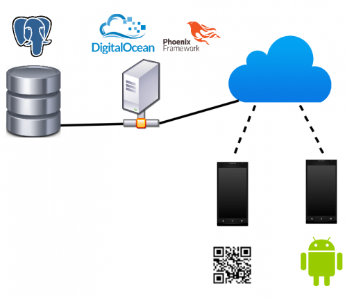
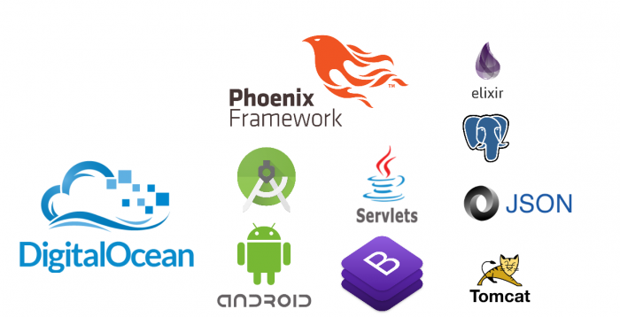
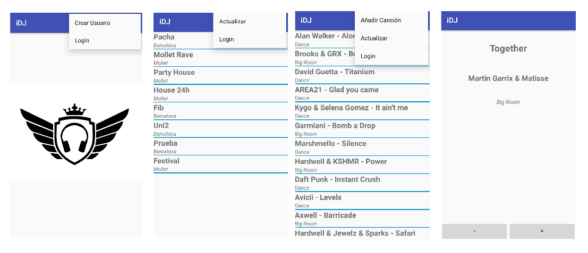
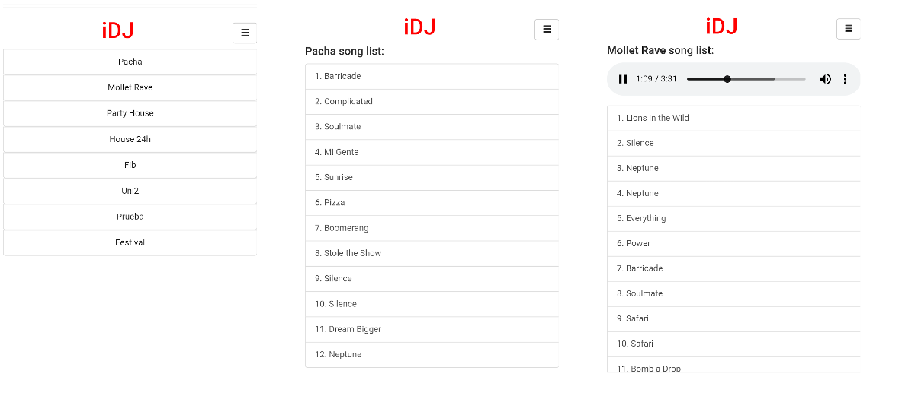

## Contents

* [1 Introducción](#Introducci.C3.B3n)
  + [1.1 ¿Qué es iDJ?](#.C2.BFQu.C3.A9_es_iDJ.3F)
  + [1.2 Objetivos](#Objetivos)
* [2 Infraestructura](#Infraestructura)
* [3 Tecnologías](#Tecnolog.C3.ADas)
* [4 Android](#Android)
* [5 Web](#Web)
* [6 About](#About)

# Introducción[[edit](/pti/index.php?title=Categor%C3%ADa:IDJ&veaction=edit&section=1 "Edit section: Introducción") | [edit source](/pti/index.php?title=Categor%C3%ADa:IDJ&action=edit&section=1 "Edit section: Introducción")]

## ¿Qué es iDJ?[[edit](/pti/index.php?title=Categor%C3%ADa:IDJ&veaction=edit&section=2 "Edit section: ¿Qué es iDJ?") | [edit source](/pti/index.php?title=Categor%C3%ADa:IDJ&action=edit&section=2 "Edit section: ¿Qué es iDJ?")]

Nuestro proyecto consiste en una aplicación en la que existirá la posibilidad de escoger, de una lista de canciones, la música que se reproducirá en una localización concreta. Habrá un administrador y diversos usuarios.

El administrador necesitará una contraseña para poder acceder a la aplicación y será él que tenga el control de la lista. Los usuarios, mediante el código QR o directamente a través de la aplicación, podrán acceder a dicha lista y poder votar, tanto en positivo como negativo, las diferentes canciones que haya.

Cada vez que una canción se acaba, se reordena la lista, la más votada se pone al principio de la lista y se reproduce. Para poder votar, se tiene que estar mínimo dentro de un radio de 100 metros más o menos de la localización.

Si un usuario quiere añadir una canción en la lista, la puede escoger dentro de una base de datos existente en la cual hay todas las canciones disponibles.

Además nuestra aplicación tiene servicio Web, donde hará exactamente lo mismo que la aplicación Android, pero se usará para aquellos usuarios que no tiene la aplicación instalada y puedan tener las mismas funcionalidades que los que sí. Para poder acceder a está página web, el usuario deberá leer un QR donde le redirigirá a la web comentada anteriormente.

## Objetivos[[edit](/pti/index.php?title=Categor%C3%ADa:IDJ&veaction=edit&section=3 "Edit section: Objetivos") | [edit source](/pti/index.php?title=Categor%C3%ADa:IDJ&action=edit&section=3 "Edit section: Objetivos")]

En este proyecto nos hemos puesto una serie de objetivos:

- Cohesionar diferentes tecnologías con el propósito de conseguir diferentes usos en una misma aplicación.

- Entender y saber usar de una forma correcta las tecnologías empleadas.

- Aprender de las tecnologías que usamos sin tener una capacidad previa de éstas.

# Infraestructura[[edit](/pti/index.php?title=Categor%C3%ADa:IDJ&veaction=edit&section=4 "Edit section: Infraestructura") | [edit source](/pti/index.php?title=Categor%C3%ADa:IDJ&action=edit&section=4 "Edit section: Infraestructura")]

- En la parte de Android, hay que crear la pantalla principal para que te dé acceso a la aplicación. Después habrá la opción de escoger el club en el que te encuentras ubicado. Una vez seleccionado la ubicación se te mostrará la lista de canciones de ese sitio y según tu localización, te dejará votar a las canciones, de manera tanto positiva como negativa.

- En la parte de la Web, para acceder se tendrá que escanear el código QR que ya te dará un acceso directo a la lista de clubes que hay. Desde la Web, se podrá hacer lo mismo que desde la aplicación sin necesidad de tenerla instalada.

- En la parte del servidor, la aplicación se conecta a la Base de Datos mediante el servidor. Entonces, dicho servidor, nos proporciona todas las canciones, además de los posibles registros de los usuarios, los clubes que se hayan creado y de las puntuaciones de las canciones de cada club.

# Tecnologías[[edit](/pti/index.php?title=Categor%C3%ADa:IDJ&veaction=edit&section=5 "Edit section: Tecnologías") | [edit source](/pti/index.php?title=Categor%C3%ADa:IDJ&action=edit&section=5 "Edit section: Tecnologías")]

# Android[[edit](/pti/index.php?title=Categor%C3%ADa:IDJ&veaction=edit&section=6 "Edit section: Android") | [edit source](/pti/index.php?title=Categor%C3%ADa:IDJ&action=edit&section=6 "Edit section: Android")]

# Web[[edit](/pti/index.php?title=Categor%C3%ADa:IDJ&veaction=edit&section=7 "Edit section: Web") | [edit source](/pti/index.php?title=Categor%C3%ADa:IDJ&action=edit&section=7 "Edit section: Web")]

# About[[edit](/pti/index.php?title=Categor%C3%ADa:IDJ&veaction=edit&section=8 "Edit section: About") | [edit source](/pti/index.php?title=Categor%C3%ADa:IDJ&action=edit&section=8 "Edit section: About")]

Este proyecto ha sido desarrollado por Albert Vallès, Alejandro Revilla, Amin El Meziani y Eric Pérez.

Grupo 20 PTI Q2 2017/18