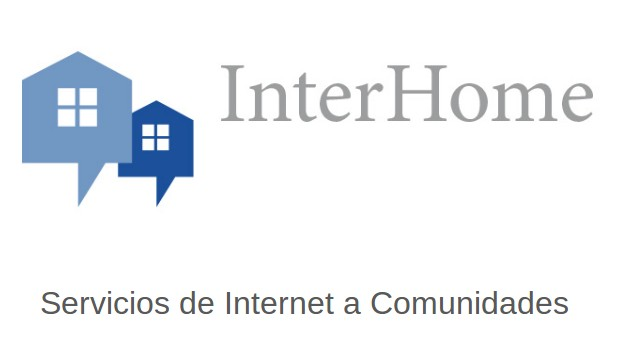
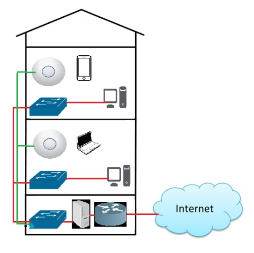
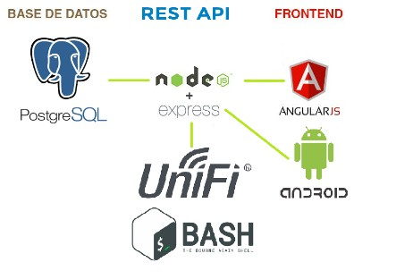

Estructura del proyecto.

## Contents

* [1 Introducción](#Introducci.C3.B3n)
  + [1.1 ¿Qué es InterHome?](#.C2.BFQu.C3.A9_es_InterHome.3F)
  + [1.2 Objetivos del proyecto](#Objetivos_del_proyecto)
* [2 Infraestructura](#Infraestructura)
* [3 Tecnologias](#Tecnologias)
  + [3.1 Aplicación Android](#Aplicaci.C3.B3n_Android)
  + [3.2 Aplicacion Web](#Aplicacion_Web)
  + [3.3 Servidor](#Servidor)
  + [3.4 Infraestructura](#Infraestructura_2)

# Introducción[[edit](/pti/index.php?title=Categor%C3%ADa:InterHome&veaction=edit&section=1 "Edit section: Introducción") | [edit source](/pti/index.php?title=Categor%C3%ADa:InterHome&action=edit&section=1 "Edit section: Introducción")]

## ¿Qué es InterHome?[[edit](/pti/index.php?title=Categor%C3%ADa:InterHome&veaction=edit&section=2 "Edit section: ¿Qué es InterHome?") | [edit source](/pti/index.php?title=Categor%C3%ADa:InterHome&action=edit&section=2 "Edit section: ¿Qué es InterHome?")]

Nuestro proyecto busca llevar un servicio de internet de calidad a comunidades y bloques residenciales. Debido a la agregación de consumo, es posible conectar viviendas individuales por una fracción del precio.
Este servicio va dirigido a todas aquellas comunidades de vecinos que desean tener una conexión a Internet barata y a su vez potente.
Aparte, también puede ser una forma de atraer proveedores a comunidades de vecinos aisladas.

## Objetivos del proyecto[[edit](/pti/index.php?title=Categor%C3%ADa:InterHome&veaction=edit&section=3 "Edit section: Objetivos del proyecto") | [edit source](/pti/index.php?title=Categor%C3%ADa:InterHome&action=edit&section=3 "Edit section: Objetivos del proyecto")]

Los objetivos como idea del proyecto son:

* Abaratar el coste de la conexión de Internet.
* Ofrecer una conexión a Internet potente y fiable.
* Repartir el ancho de banda entre los clientes
* Ofrecer servicios agregados a la comunidad.

También pensamos que el sistema debe ser:

* Autoconfigurable por parte de la comunidad.
* Fácil uso para usuarios sin grandes conocimientos informáticos.
* Mostrar información acerca de los servicios.
* Robusto y fiable frente a la interacción de usuarios no expertos.

# Infraestructura[[edit](/pti/index.php?title=Categor%C3%ADa:InterHome&veaction=edit&section=4 "Edit section: Infraestructura") | [edit source](/pti/index.php?title=Categor%C3%ADa:InterHome&action=edit&section=4 "Edit section: Infraestructura")]

En este apartado explicaremos cómo irán conectados los elementos de la infraestructura en un edificio que contracte nuestro sistema.
El esquema explicado a continuación es un ejemplo. Nuestro sistema es modular y adaptable a distintos escenarios.

Los elementos que interactúan son:

* Conexión ISP
* Servidor InterHome
* Switchs
* Access Points

**Conexión ISP**
El router ISP es el que nos ofrece la conexión a Internet del edificio. Este router se conectará al servidor que nosotros configuramos.

**Servidor InterHome**
El servidor hace de router entre la conexión del ISP y toda la red interna. En el servidor es dónde se dan de alta los usuarios y se configuran los anchos de banda mediante la aplicación web.
La aplicación Android también se conectará al servidor.
El servidor web mediante la API llamará a los scripts que realizaran los cambios a la red.

**Switch**
Los switches dan conectividad cableada a los clientes y también estructuran la red.
En la comunidad hay un switch maestro que da una terminación de cable a cada uno de los usuarios.
Cada usuario dispondrá de un switch doméstico (unmanaged, ~4 ports) en su casa para poder conectar sus equipos.

**Access Points**
Los APs dan conectividad inalámbrica a los clientes. Des de el servidor se puede configurar las redes Wifi y la seguridad, passwords.

# Tecnologias[[edit](/pti/index.php?title=Categor%C3%ADa:InterHome&veaction=edit&section=5 "Edit section: Tecnologias") | [edit source](/pti/index.php?title=Categor%C3%ADa:InterHome&action=edit&section=5 "Edit section: Tecnologias")]

## Aplicación Android[[edit](/pti/index.php?title=Categor%C3%ADa:InterHome&veaction=edit&section=6 "Edit section: Aplicación Android") | [edit source](/pti/index.php?title=Categor%C3%ADa:InterHome&action=edit&section=6 "Edit section: Aplicación Android")]

Para implementar la aplicacion de Android, hemos utilizado la API 19 (KitKat - Android 4.4.4) para ser compatible con un 90% de los dispositivos en el mercado1. Aparte hemos utilizado unas cuantas librerias adicionales como AsyncHttp para poder realizar llamadas HTTP asíncronamente y no utilizar el thread principal que en dispositivos móviles está reservado para operaciones de la interfaz del usuario. Otra libreria que se ha utilizado es Picasso, esta sirve para cargar imágenes externas de forma asíncrona. La ultima libreria que hemos usado es MPAndroidChart con la cual creamos la gráfica de uso de datos.
Aparte como entorno de desarrollo hemos utilizado Android Studio. Finalmente, tambien hemos usado Git y Github como control de versiones a pesar de que tan solo lo ha desarrollado una persona. Pero de esta manera nos aseguramos que teníamos una copia de seguridad y se podía acceder desde cualquier ordenador.

## Aplicacion Web[[edit](/pti/index.php?title=Categor%C3%ADa:InterHome&veaction=edit&section=7 "Edit section: Aplicacion Web") | [edit source](/pti/index.php?title=Categor%C3%ADa:InterHome&action=edit&section=7 "Edit section: Aplicacion Web")]

Para la creación del proyecto hemos utilizado los siguientes frameworks/lenguajes:

* Typescript: Es un superconjunto de JavaScript, que esencialmente añade tipado estático y objetos basados en clases.
* Npm: Node package manager es un gestor de paquetes de NodeJS
* NodeJS: es un runtime de JavaScript, que utiliza un modelo de I/O no bloqueante y conducido por eventos. Esto hace que sea liviano y eficiente.
* PostgreSQL: Base de datos relacional y de código abierto.
* ExpressJS: Es un framework minimalista y flexible para NodeJS con el que haremos la API.
* Angular 5: Es un framework de NodeJS para frontend que permite generar páginas dinámicamente. Se conecta a nuestro backend implementado con Express a traves de servicios.
* PassportJS: Es un middleware para autenticación que te permite implementar fácilmente diferentes tipos de estrategias de autentificación. En nuestro caso solo hemos utilizado la estrategia local pero existen estrategias de facebook, twitter, etc.
* PM2: Es una herramienta de gestión de procesos de NodeJS. Esta herramienta permite mantener la API corriendo permanentemente y si hay errores reiniciarla.
* Otros paquetes: en el proyecto se han utilizado muchos mas paquetes pero solo hemos querido resaltar los más importantes.
* Git y Github: Son unas herramientas de control de versiones y almacenamiento de código que también hemos utilizado para la aplicación de Android.

## Servidor[[edit](/pti/index.php?title=Categor%C3%ADa:InterHome&veaction=edit&section=8 "Edit section: Servidor") | [edit source](/pti/index.php?title=Categor%C3%ADa:InterHome&action=edit&section=8 "Edit section: Servidor")]

Como servidor hemos utilizado un servidor IBM formato torre (Xseries) con dos procesadores Intel Xeon de 32 bits, 4 GB de RAM, una interfaz de red (posibilidad de expansión a 2), fuente de alimentación redundada hot-plug y 4 puertos SATA para almacenaje masivo.

La elección de este hardware ha sido debida a que pertenece a una asociación de alumnos (Fiberparty) que ha accedido a dejarnos el material en préstamo.

## Infraestructura[[edit](/pti/index.php?title=Categor%C3%ADa:InterHome&veaction=edit&section=9 "Edit section: Infraestructura") | [edit source](/pti/index.php?title=Categor%C3%ADa:InterHome&action=edit&section=9 "Edit section: Infraestructura")]

En nuestra red nos hemos decantado, de nuevo por la fácil disponibilidad del material grácias a Fiberparty, por un switch Cisco Catalyst 3550 de 48 puertos FastEthernet (100Mbit/s full duplex). Hemos usado este switch por una combinación de familiaridad con el sistema de configuración Cisco IOS, alta densidad de puertos, y un feature set completo para nuestras necesidades.

Sin embargo, al existir la disponibilidad doméstica de conexiones de fibra superiores a los 100Mbit/s, este aparato se nos puede quedar corto en según que instalaciones. Dicho esto, en aquellos sitios en los que sea suficiente, los switches de 100Mbit/s son mucho más baratos que uno equivalente a GbE.

Para cableado de red usamos cable trenzado Cat5e estándard.

Los APs inalámbricos que hemos seleccionado son unos Ubiquity Networks Unify UAP-AC, elegidos por ser un producto respetable de una marca conocida en el sector. Sus características clave, entre ellas:

* Capacidad de hostear múltiples SSID.
* Velocidades de hasta 1300Mbit/s.
* Capaz de operar en el rango de 5GHz.
* Alcance máximo de 122 metros.

hacen que sea una buena elección para usarlos como punto de acceso, instalado en los espacios comunes de la construcción (rellanos, hueco de escalera, etc).

