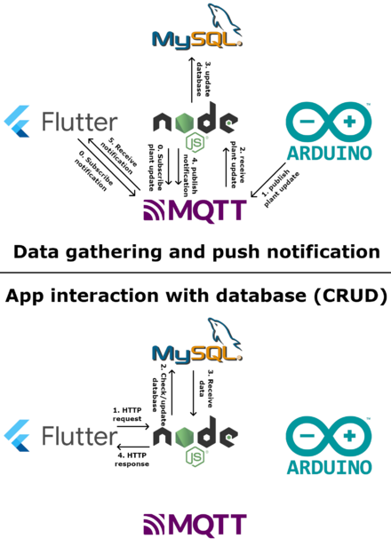
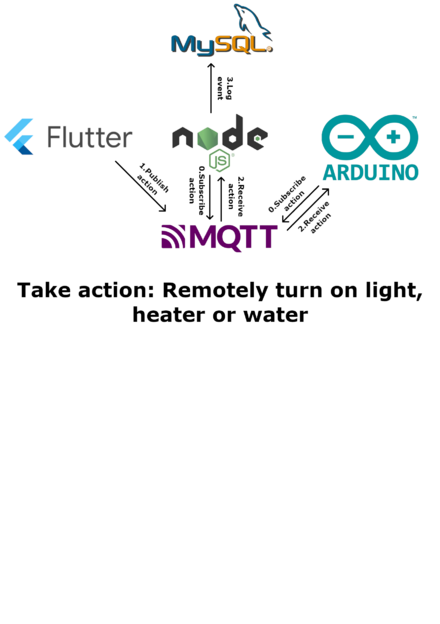
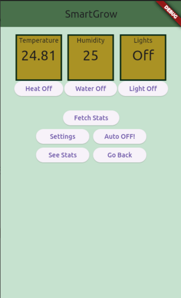

Estructura del proyecto.

Estructura del proyecto.

Pantalla principal de la app.

# Introducción[[edit](/pti/index.php?title=Categor%C3%ADa:IoTPlants&veaction=edit&section=1 "Edit section: Introducción") | [edit source](/pti/index.php?title=Categor%C3%ADa:IoTPlants&action=edit&section=1 "Edit section: Introducción")]

## ¿Qué es SmartGrow?[[edit](/pti/index.php?title=Categor%C3%ADa:IoTPlants&veaction=edit&section=2 "Edit section: ¿Qué es SmartGrow?") | [edit source](/pti/index.php?title=Categor%C3%ADa:IoTPlants&action=edit&section=2 "Edit section: ¿Qué es SmartGrow?")]

Nuestro proyecto consiste en una applicación móvil conectada a un servidor que sirve para monitorizar el estado de las plantas mediante un microcontrolador.

# Infraestructura[[edit](/pti/index.php?title=Categor%C3%ADa:IoTPlants&veaction=edit&section=3 "Edit section: Infraestructura") | [edit source](/pti/index.php?title=Categor%C3%ADa:IoTPlants&action=edit&section=3 "Edit section: Infraestructura")]

Nuestra infraestructura consiste de distintos componentes. En primer lugar tenemos un microcontrolador conectado a unos sensores de temperatura, humedad y luz. Este a su vez, se conecta con un servidor mediante WiFi para enviarle los datos recogidos por los sensores.

El servidor acepta los datos y los coloca en una base de datos MySQL. La aplicacion puede enviar llamadas HTTPS para recoger los datos, y enviar solicitudes de controlar las variables, automaticamente o no.