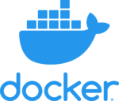

Logo del proyecto.

## Contents

* [1 Introducción](#Introducci.C3.B3n)
  + [1.1 Objetivos](#Objetivos)
  + [1.2 Potencial de innovación](#Potencial_de_innovaci.C3.B3n)
* [2 Herramientas](#Herramientas)
* [3 Estructura del proyecto](#Estructura_del_proyecto)
  + [3.1 Backend](#Backend)
  + [3.2 Frontend](#Frontend)
  + [3.3 IPFS](#IPFS)
  + [3.4 Base de datos](#Base_de_datos)
  + [3.5 DevOps](#DevOps)
    - [3.5.1 Infraestructura](#Infraestructura)
    - [3.5.2 Integration](#Integration)
    - [3.5.3 Deployment](#Deployment)
    - [3.5.4 CI/CD](#CI.2FCD)
* [4 Futuras mejoras](#Futuras_mejoras)
* [5 Manual](#Manual)

# Introducción[[edit](/pti/index.php?title=Categor%C3%ADa:MEDETH&veaction=edit&section=1 "Edit section: Introducción") | [edit source](/pti/index.php?title=Categor%C3%ADa:MEDETH&action=edit&section=1 "Edit section: Introducción")]

MEDETH es una aplicación descentralizada que está basada en el uso de la tecnología Blockchain. Se trata de un sistema de almacenamiento de doctores y pacientes, dónde se guardan los datos personales de estos, como DNIs, teléfonos, nombres, etc. El ingrediente principal de este proyecto es el almacenamiento de archivos de los pacientes.

En los hospitales, cada paciente está asignado a uno o más doctores, por lo tanto, únicamente estos son capaces de subir archivos de sus pacientes, ya sean documentos de vacunación o diagnósticos de una enfermedad, por ejemplo. En este proyecto nos ocupamos de proteger estos datos hospitalarios del acceso ilegal por parte de otros integrantes del hospital, teniendo en cuenta que este acceso sin permiso se puede sancionar legalmente.

*"El acceso sin consentimiento a la Historia Clínica es un delito que apareja pena de prisión. Eso quiere decir que es ilegal consultar la historia de pacientes que no están asignados al mismo profesional. Por lo tanto, no se puede acceder ni a los datos de familiares, ni de amigos y ni de otros compañeros. Incluso post-mortem. Aunque se haga de buena fe, se está incurriendo en un delito contra el derecho a la intimidad.”*

## Objetivos[[edit](/pti/index.php?title=Categor%C3%ADa:MEDETH&veaction=edit&section=2 "Edit section: Objetivos") | [edit source](/pti/index.php?title=Categor%C3%ADa:MEDETH&action=edit&section=2 "Edit section: Objetivos")]

Los objetivos de este proyecto han sido definidos antes de empezar con su desarrollo y se describen en los siguientes puntos:

* Construir un sistema de almacenamiento de EHR (Electronic Hospital Records).
* Usar la tecnología de los smart contracts para interactuar con una blockchain Ethereum.
* Usar truffle i Ganache para desarrollar el proyecto y poder testearlo en una blockchain local.
* Usar DevOps para hacer más rápido el ciclo de vida del desarrollo de software y proporcionar una entrega continua de alta calidad.
* Usar una BBDD para guardar los datos personales de doctores y pacientes.

## Potencial de innovación[[edit](/pti/index.php?title=Categor%C3%ADa:MEDETH&veaction=edit&section=3 "Edit section: Potencial de innovación") | [edit source](/pti/index.php?title=Categor%C3%ADa:MEDETH&action=edit&section=3 "Edit section: Potencial de innovación")]

Este proyecto se planteó como una posibilidad de descubrir la tecnología de blockchain. Barajamos diferentes proyectos pero nos interesó este en específico debido a varios puntos interesantes. En primer lugar, en el sector sanitario hay una gran cantidad de datos sensibles a tratar es muy importante por lo tanto la protección de estos datos, además, la violación de la privacidad es un hecho delictivo, por lo que es una vía interesante.
Como hemos comentados anteriormente, nuestro objetivo es proteger los datos de los pacientes de manera que solo los responsables de este sean capaces de manipular esos datos y acceder a los diagnósticos.
En segundo lugar, el mercado en este sector es muy amplio y hay muchas posibilidades, ya que es necesario para la sociedad, pues tenemos pensado aplicarlo en hospitales y centros sanitarios, aunque por este mismo motivo la competitividad es alta.

# Herramientas[[edit](/pti/index.php?title=Categor%C3%ADa:MEDETH&veaction=edit&section=4 "Edit section: Herramientas") | [edit source](/pti/index.php?title=Categor%C3%ADa:MEDETH&action=edit&section=4 "Edit section: Herramientas")]

Herramientas usadas.

Para programar el backend del proyecto hemos hecho una selección concreta de herramientas para facilitarnos la faena y tener la eficiencia máxima posible. Esta es la lista de estas herramientas:

**NodeJS**: Node.js es un entorno de ejecución para JavaScript que se ejecuta del lado del servidor. Fue creado para permitir a los desarrolladores crear aplicaciones de red escalables y de altas prestaciones utilizando JavaScript. Node.js hace uso de un modelo de ejecución basado en eventos y una arquitectura non-blocking, lo que significa que es capaz de manejar una gran cantidad de conexiones simultáneas de manera eficiente. Esto lo hace ideal para aplicaciones en tiempo real, como chat o juegos en línea. Además, Node.js es compatible con una amplia variedad de plataformas, incluyendo Windows, MacOS, Linux y más.

**ExpressJS**: Express.js es un marco de aplicación web para Node.js. Proporciona un conjunto de características y herramientas que facilitan el desarrollo de aplicaciones web y APIs (interfaces de programación de aplicaciones) utilizando Node.js.

**Solidity**: Solidity es un lenguaje de programación utilizado para desarrollar contratos inteligentes en la cadena de bloques Ethereum. Los contratos inteligentes son programas autoejecutables que se ejecutan en la cadena de bloques y permiten a las personas o empresas realizar transacciones y llevar a cabo acciones específicas de manera automatizada.

**Web3JS**: Web3.js es una biblioteca de JavaScript que proporciona una interfaz para interactuar con la cadena de bloques Ethereum. Permite a las aplicaciones web acceder a la información contenida en la cadena de bloques y realizar transacciones en ella utilizando contratos inteligentes escritos en Solidity.

**React**: React es una biblioteca de JavaScript diseñada para facilitar la creación de interfaces de usuario. Fue desarrollada por Facebook y se ha vuelto extremadamente popular para el desarrollo de aplicaciones web y móviles.

**React Router DOM**: React Router DOM es una biblioteca de enrutamiento para aplicaciones web desarrolladas con React. Se encarga de gestionar la navegación entre diferentes páginas o componentes de la aplicación y proporciona una serie de componentes que se pueden utilizar para enlazar diferentes rutas o para navegar entre ellas.

**MUI (Material-UI)**: Mui (Material-UI) es una biblioteca de componentes de interfaz de usuario para React que se basa en el diseño de Google Material Design. Mui proporciona una amplia variedad de componentes listos para usar que se pueden utilizar para crear aplicaciones web y móviles de aspecto profesional y consistente.

**PostgreSQL**: PostgreSQL es un sistema de gestión de base de datos relacional de código abierto. Es uno de los sistemas de base de datos más populares y ampliamente utilizados en el mundo, y es conocido por su robustez, flexibilidad y rendimiento.

**IPFS**: IPFS (InterPlanetary File System) es una red de distribución de contenidos descentralizada y un protocolo para compartir archivos en una red descentralizada. El objetivo de IPFS es hacer que la distribución de contenidos sea más rápida, más eficiente y más segura al eliminar la necesidad de depender de servidores centralizados para almacenar y transmitir contenido.

# Estructura del proyecto[[edit](/pti/index.php?title=Categor%C3%ADa:MEDETH&veaction=edit&section=5 "Edit section: Estructura del proyecto") | [edit source](/pti/index.php?title=Categor%C3%ADa:MEDETH&action=edit&section=5 "Edit section: Estructura del proyecto")]

## Backend[[edit](/pti/index.php?title=Categor%C3%ADa:MEDETH&veaction=edit&section=6 "Edit section: Backend") | [edit source](/pti/index.php?title=Categor%C3%ADa:MEDETH&action=edit&section=6 "Edit section: Backend")]

Diagrama del backend.

En primer lugar, para poder testear nuestro proyecto en local y ver que realmente funciona el sistema de los smart contracts decidimos usar Metamask, una extensión de navegador que actúa como una criptowallet de Ethereum. Un cliente se registra en el sistema como un doctor o paciente mediante su dirección de la blockchain. Al registrarse se crea un bloque en la blockchain Ethereum. Ahora el cliente, en este caso solo los doctores, puede añadir archivos a uno de sus pacientes desde una API de IPFS a uno de sus pacientes. Al añadir el fichero, se crea un hash y se crea un link de este hash con el bloque del paciente propietario del fichero. Entonces, el cliente puede obtener con su dirección de la blockchain todos estos identificadores de contenido, e interactuar con la API IPFS para obtener los ficheros para su visualización o descarga.

## Frontend[[edit](/pti/index.php?title=Categor%C3%ADa:MEDETH&veaction=edit&section=7 "Edit section: Frontend") | [edit source](/pti/index.php?title=Categor%C3%ADa:MEDETH&action=edit&section=7 "Edit section: Frontend")]

Portal del Doctor

Al empezar el proyecto nos planteamos una serie de objetivos, desarrollar una aplicación visualmente atractiva, intuitiva y rápida. Para ello usamos React, una librería de JavaScript basada en componentes, que son partes de código reutilizable. Esta librería renderiza únicamente las partes necesarias, esto hace que el tiempo de carga disminuya. Para la aplicación desarrollamos una página principal, el portal del doctor, el portal de los pacientes, un formulario de registro, una carta con la información de los doctores y los pacientes y una carta para subir archivos del paciente.

## IPFS[[edit](/pti/index.php?title=Categor%C3%ADa:MEDETH&veaction=edit&section=8 "Edit section: IPFS") | [edit source](/pti/index.php?title=Categor%C3%ADa:MEDETH&action=edit&section=8 "Edit section: IPFS")]

IPFS (InterPlanetary File System) es un sistema de archivos descentralizado que permite almacenar y compartir archivos de manera eficiente y segura en la red. Una API IPFS es un conjunto de herramientas y protocolos que permiten a las aplicaciones acceder y utilizar los servicios de IPFS de manera programática. Esto significa que puedes utilizar una API IPFS para integrar IPFS en tu aplicación y acceder a los archivos almacenados en IPFS de forma sencilla y automatizada.

Una de las principales ventajas de IPFS es que permite el acceso descentralizado a los archivos, lo que significa que no depende de un servidor central para almacenar y distribuir los archivos. En su lugar, los archivos se distribuyen entre los nodos de la red de IPFS y se pueden acceder a ellos desde cualquier lugar. Esto hace que IPFS sea especialmente útil para almacenar y compartir grandes cantidades de datos de manera eficiente y segura. Este es el motivo por el que decidimos utilizar IPFS para guardar los archivos que contienen datos sensibles de los pacientes.

Para configurar la IPFS API de nuestro proyecto lo primero que hicimos fue informarnos sobre cómo encontrar una API gratuita que nos de servicios suficientes para los requerimientos que teníamos en nuestro programa. Después de un tiempo investigando nos topamos con Infura. INFURA es un servicio que proporciona acceso a la red Ethereum y IPFS de manera fácil y segura. INFURA ofrece una plataforma de infraestructura de red descentralizada (DRIN) que permite a las aplicaciones y servicios acceder a la red Ethereum y IPFS sin tener que configurar y mantener sus propios nodos.

INFURA ofrece un servicio gratuito de IPFS API siempre y cuando no se supere el límite máximo de GBs de capacidad. Si se supera el límite se tendría que pagar por GB/€, pero teniendo en cuenta que solo lo íbamos a usar para testear no nos preocupaba. Después de contratar los servicios, tuvimos que configurar el IPFS en nuestro proyecto.

## Base de datos[[edit](/pti/index.php?title=Categor%C3%ADa:MEDETH&veaction=edit&section=9 "Edit section: Base de datos") | [edit source](/pti/index.php?title=Categor%C3%ADa:MEDETH&action=edit&section=9 "Edit section: Base de datos")]

PostgreSQL es un sistema de bases de datos relacional orientado a objetos, código abierto y gratuito. Es multiplataforma, por lo que se puede utilizar tanto en Linux como Windows, lo cual nos ayuda bastante porque cada uno trabaja en un entorno. Tiene alta escalabilidad, recomendable si en algún momento el proyecto sale adelante, y dispone de herramientas más avanzadas como MVCC, un sistema de concurrencia que garantiza el acceso seguro concurrente de los usuarios, evitando interferencias, y Hot-Standby, que permite conectarse a los servidores durante el modo recuperación.

La BD consta de dos tablas, una para pacientes (Las columnas que elegimos para los pacientes como más importantes eran el DNI, nombre completo, teléfono, domicilio, edad, join\_date, ya explicada, y la blockchain\_address. Como primary key pusimos el DNI por las mismas razones.
) y otra para doctores (DNI, nombre completo, teléfono, domicilio, la especialidad como doctor, join\_date, que indica la fecha en que se registró, y la blockchain\_address para encontrarlo en la parte de blockchain. Como primary key pusimos el DNI puesto que era único e inconfundible.)

## DevOps[[edit](/pti/index.php?title=Categor%C3%ADa:MEDETH&veaction=edit&section=10 "Edit section: DevOps") | [edit source](/pti/index.php?title=Categor%C3%ADa:MEDETH&action=edit&section=10 "Edit section: DevOps")]

DevOps es un conjunto de prácticas que combina el desarrollo de software y las operaciones de TI para acortar el ciclo de vida del desarrollo de sistemas y proporcionar una entrega continua con alta calidad del software. Su objetivo es establecer una cultura y un entorno en el que se pueda construir, probar y liberar software de manera rápida, frecuente y más fiable.

DevOps es necesario porque ayuda a las organizaciones a:

1. Aumentar la eficiencia y la velocidad: gracias a la automatización de procesos y la integración de equipos de desarrollo y operaciones, permite a las organizaciones desarrollar, probar y liberar software de manera más rápida y frecuente.
2. Mejorar la colaboración y la comunicación: promueve la colaboración entre los equipos de desarrollo y operaciones, lo que ayuda a romper barreras y mejorar la comunicación y la cooperación.
3. Mejorar la calidad y la fiabilidad: se hace hincapié en la importancia de probar y monitorear durante todo el proceso de desarrollo de software, lo que ayuda a garantizar que el software es de alta calidad y fiable.
4. Aumentar la agilidad y la flexibilidad: permite a las organizaciones responder de manera rápida a los cambios en las necesidades del negocio y las demandas de los clientes al permitirles implementar nuevas funciones y actualizaciones en su software de manera más rápida.

En nuestro caso, usar esta metodología ayudaría a desplegar más rápida y fiable nuestro código, además de que sería más fácilmente migrable a otros tipos de entornos, como AWS, Azure, Google Cloud Platform, entre otros.

A continuación explicaremos cómo implementamos la metodología DevOps.

### Infraestructura[[edit](/pti/index.php?title=Categor%C3%ADa:MEDETH&veaction=edit&section=11 "Edit section: Infraestructura") | [edit source](/pti/index.php?title=Categor%C3%ADa:MEDETH&action=edit&section=11 "Edit section: Infraestructura")]

Diagrama de la infraestructura

Empezando por la infraestructura, nos decantamos por usar un cluster de Kubernetes con la estrategia de Master-Slave, la cual usa el servidor Master como controlador de recursos y dos servidores Slave como proporcionadores de recursos. El beneficio de este sistema es que es más sencillo de escalar horizontalmente, ya que añadir otro servidor no sería complicado, lo que añadiría más hardware al clúster en cuestión. Nosotros pudimos hacerlo con un Master y dos Slaves, ya que el profesorado nos facilitó 3 máquinas virtuales, cada una con 4GB de RAM, 2 núcleos de CPU y 20GB de disco duro. Sabiendo lo anterior, nos acabamos quedando con 8GB de RAM, 4 núcleos de CPU y 40GB de disco duro, más que suficientes para nuestras necesidades.

Todo esto ha sido posible gracias a la herramienta de Kubeadm, la cual permite montar este tipo de estrategias master-slave.

Dentro de la máquina virtual Master también se instaló Jenkins, para poder tener herramientas de CI/CD, las cuales explicaremos más adelante.

### Integration[[edit](/pti/index.php?title=Categor%C3%ADa:MEDETH&veaction=edit&section=12 "Edit section: Integration") | [edit source](/pti/index.php?title=Categor%C3%ADa:MEDETH&action=edit&section=12 "Edit section: Integration")]

La integración se refiere a la preparación de todo el software necesario para que el servicio pueda funcionar. En nuestro caso necesitamos Java, Node.js y React para el backend y el frontend y PostgreSQL para la BBDD. Hemos separado el frontend, backend y base de datos en 3 imágenes Docker diferentes basados en Ubuntu, para poder tener una mayor facilidad en caso de migrar el servicio a otros proveedores, ya que todo el software necesario está empaquetado, cada uno de ellos teniendo las librerías necesarias para ejecutar los programas.

Estas imágenes posteriormente se subieron a Docker Hub, el cual es un servicio dado por Docker que sirve para almacenar dichas imágenes. Aún así, no es una herramienta recomendable para empresas, ya que tiene un free-tier bastante pobre.

El beneficio de tener el software en contenedores es que no habría diferencia de software en caso de que el servicio se ejecutara en otro sistema, ya que el mismo estaría empaquetado, asegurando así que funcione en cualquier tipo de máquina que lo pueda soportar.

También cabe mencionar que estas imágenes se usarían en un clúster de Kubernetes, el cual funciona mejor con contenedores de Docker.

Logo de Docker.

### Deployment[[edit](/pti/index.php?title=Categor%C3%ADa:MEDETH&veaction=edit&section=13 "Edit section: Deployment") | [edit source](/pti/index.php?title=Categor%C3%ADa:MEDETH&action=edit&section=13 "Edit section: Deployment")]

En lo que respecta al despliegue de la aplicación, la forma más transparente para el usuario y más sencilla de configurar para el ingeniero DevOps sería el uso de la herramienta Helm, la cual sirve para gestionar e instalar aplicaciones de Kubernetes.

La forma en la que ayuda al ingeniero DevOps es la siguiente, y es que muchos de los objetos de Kubernetes (Deployments, ConfigMaps, Services…) tienen datos que se repiten varias veces, y lo mejor que se puede hacer para configurar esos datos en un solo fichero con Helm, el cual ayuda a que la configuración de dicha aplicación de Kubernetes sea mucho más sencilla y fácil de leer.

A la hora de ayudar al usuario, Helm se puede usar como “botonazo” para instalar la aplicación de Kubernetes con un solo comando, que sería “helm install”. Para actualizar la misma aplicación, lo único que se usaría sería “helm upgrade”.

### CI/CD[[edit](/pti/index.php?title=Categor%C3%ADa:MEDETH&veaction=edit&section=14 "Edit section: CI/CD") | [edit source](/pti/index.php?title=Categor%C3%ADa:MEDETH&action=edit&section=14 "Edit section: CI/CD")]

CI/CD se refiere a Continuous Integration & Continuous Deployment, y es lo que define la manera en la que la integración y el despliegue se puedan hacer de manera automática (que lo haga la máquina).

Para hacer tal acción, se requiere una herramienta de almacenamiento de código basada en Git, que en nuestro caso es GitLab, y una herramienta de automatización de software, como Jenkins.

El código de nuestro software se guarda en un repositorio de GitLab, herramienta que nos ha facilitado la universidad, y siempre que se haga “git push” al repositorio, GitLab ofrece un servicio de Webhook al cual se puede enganchar Jenkins, que sirve para notificar si se ha actualizado cualquier tipo de código dentro de dicho repositorio, y en el caso de que se haya hecho, Jenkins ejecute las “pipelines” pertinentes.

Primero se ejecutaría la pipeline de integración, la que haría el “build” de la imagen de Docker y la subiría al Docker Hub. Si todo está correcto en este aspecto, la pipeline de despliegue hará el “deployment”, conectándose al clúster de Kubernetes y desplegando la aplicación usando Helm. En el caso de que todo estuviese bien, Jenkins lo notificaría y la aplicación se actualizaría a la nueva versión. En caso contrario, se pararía el proceso en el sitio donde hubiese fallado y la aplicación no se habría actualizado, haciendo que así siguiera funcionando.

# Futuras mejoras[[edit](/pti/index.php?title=Categor%C3%ADa:MEDETH&veaction=edit&section=15 "Edit section: Futuras mejoras") | [edit source](/pti/index.php?title=Categor%C3%ADa:MEDETH&action=edit&section=15 "Edit section: Futuras mejoras")]

Al ser un proyecto relacionado con el mercado de la salud, nuestro objetivo es presentar este proyecto a las empresas e instituciones como una versión Demo de lo que puede llegar a ser un proyecto muy desarrollado que trabaje en un entorno seguro y fácil de usar. Al final, nuestra misión como desarrolladores del proyecto sería adaptar esta app a las necesidades y requerimientos de cada centro que contrate nuestros servicios, siempre siguiendo el marco legal de la ley que recae en los centros de salud.

Dentro de estas mejores hemos sacado unos puntos que podrían ser las ideas más populares sobre mejores futuras en la aplicación:

* Ampliar los datos que se guardan en los smart contracts, añadir estructuras o nuevos atributos en las estructuras existentes.
* Añadir diferentes campos para los registros que se suban para cada paciente, por ejemplo: área de vacunación, área de diagnósticos, área de perfil, etc.
* Añadir más campos en el registro de un doctor / paciente para disponer de más información, por ejemplo, en doctores se podría añadir la fecha de ingreso al centro, los estudios y capacidades, por el otro lado, a un cliente se le podría añadir sus alergias, por ejemplo.
* Una área para hacer citas, donde el paciente pueda generar citas y el doctor las recibe en su calendario.

# Manual[[edit](/pti/index.php?title=Categor%C3%ADa:MEDETH&veaction=edit&section=16 "Edit section: Manual") | [edit source](/pti/index.php?title=Categor%C3%ADa:MEDETH&action=edit&section=16 "Edit section: Manual")]

**Las funcionalidades que se pueden realizar estan mostradas en los siguientes vídeos:**

* Registrar un doctor (<https://www.youtube.com/watch?v=jLWtflgV3xM&ab_channel=Pastaspan7>)
* Registrar un paciente (<https://www.youtube.com/watch?v=4JxFJPpnqo8>)
* Añadir / Descargar un informe (<https://www.youtube.com/watch?v=w3N6ctEMOMQ>)
* Consultar datos de usuario (<https://www.youtube.com/watch?v=V8SJQpepQFY>)
* Cambiar de usuario (<https://www.youtube.com/watch?v=o6ucXUv1_10>)