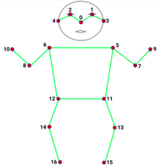
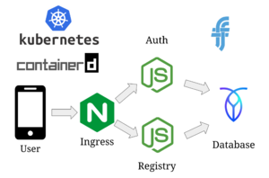

## Contents

* [1 FIBness App](#FIBness_App)
  + [1.1 ¿Qué es FIBness app?](#.C2.BFQu.C3.A9_es_FIBness_app.3F)
* [2 Infraestructura](#Infraestructura)
* [3 Frontend](#Frontend)
  + [3.1 Windows](#Windows)
  + [3.2 Conexió amb la BD](#Conexi.C3.B3_amb_la_BD)
  + [3.3 Conexió amb el ML](#Conexi.C3.B3_amb_el_ML)
* [4 Machine Learning: MoveNet](#Machine_Learning:_MoveNet)
* [5 Backend](#Backend)
* [6 Problemes i futur del projecte](#Problemes_i_futur_del_projecte)

# FIBness App[[edit](/pti/index.php?title=Categor%C3%ADa:MLGim&veaction=edit&section=1 "Edit section: FIBness App") | [edit source](/pti/index.php?title=Categor%C3%ADa:MLGim&action=edit&section=1 "Edit section: FIBness App")]

## ¿Qué es FIBness app?[[edit](/pti/index.php?title=Categor%C3%ADa:MLGim&veaction=edit&section=2 "Edit section: ¿Qué es FIBness app?") | [edit source](/pti/index.php?title=Categor%C3%ADa:MLGim&action=edit&section=2 "Edit section: ¿Qué es FIBness app?")]

El nostre projecte consisteix en una aplicació mòbil d'esport que es beneficia d'un algorisme de Machine Learning per donar feedback en temps real als usuaris que la fan servir. L'aplicació està pensada per a aquelles persones que volen començar al món de l'esport i que per manca de temps o de diners no puguin. L'objectiu de la nostra app és proporcionar una sèrie d'exercicis que qualsevol persona pugui fer des de qualsevol lloc. Aquesta aplicació està pensada per ser utilitzada en qualsevol dispositiu modern actual (sigui Android o IOS).

# Infraestructura[[edit](/pti/index.php?title=Categor%C3%ADa:MLGim&veaction=edit&section=3 "Edit section: Infraestructura") | [edit source](/pti/index.php?title=Categor%C3%ADa:MLGim&action=edit&section=3 "Edit section: Infraestructura")]

Como cualquier aplicación actual la infraestructura de nuestra aplicación se divide en un Frontend y un Backend. Además también disponemos de una sección específica para el algoritmo de Machine Learning. En cada una de las secciones se explicará con más detalle cada una de las infraestructuras.

# Frontend[[edit](/pti/index.php?title=Categor%C3%ADa:MLGim&veaction=edit&section=4 "Edit section: Frontend") | [edit source](/pti/index.php?title=Categor%C3%ADa:MLGim&action=edit&section=4 "Edit section: Frontend")]

Aplicació mòbil principalment pensada per Android i IOS, tot i que es podria utilitzar a Windows i Mac també. Per fer-la s’ha utilitzat un framework de python anomenat Beeware, que permet programar una sola vegada y exportar a qualsevol dispositiu amb una sola comanda “briefcase build [Android/IOS]”. El framework funciona molt similar a la majoria de eines per desarrollar aplicacions mòbils: Crees un canvas, on hi pots ficar diferents caixes en posicions i sentits. Dins de les caixes podem ficar qualsevol tipus de widgets, com per exemple botons, caixes de text, imatges, inputs d'usuari, taules de contingut o menus.

## Windows[[edit](/pti/index.php?title=Categor%C3%ADa:MLGim&veaction=edit&section=5 "Edit section: Windows") | [edit source](/pti/index.php?title=Categor%C3%ADa:MLGim&action=edit&section=5 "Edit section: Windows")]

Les diferents pantalles (Windows) que es mostren a l'usuari son les següents:

```
- Starting: mostra el menú inicial per poder registrarse, entrar amb el teu compte i un botó per tancar l'aplicació, així com el nom de l'aplicació en gran y el logo de la app i de la UPC. 
- Login, window per fer el login, amb els text y password inputs i els botons per entrar y sortir de la finestra
- Signup, window per fer el signup, amb els text inputs per introduir la informació de l'usuari i els botons per entrar y sortir de la finestra.
- Main, la pàgina principal del usuari, on es mostra tota la seva informació dels exercicis, i es permet fer noves repeticions.
- Exercise, finestra generica utilitzada per a tots els exercicis que mostra per pantalla el número de repeticions realitzat en aquella sessió.
- Profile, una finestra on es mostra la informació de l'usuari que ha iniciat sessió, actualment només el nom i el email.

```

## Conexió amb la BD[[edit](/pti/index.php?title=Categor%C3%ADa:MLGim&veaction=edit&section=6 "Edit section: Conexió amb la BD") | [edit source](/pti/index.php?title=Categor%C3%ADa:MLGim&action=edit&section=6 "Edit section: Conexió amb la BD")]

El frontend es comunica amb el backend mitjançant la llibreria requests de python, i codifica la informació a ser enviada amb la llibreria json. Les dades d'usuari son empaquetades en un json, per enviarles a la BD, i la BD retorna un altre fitxer json, amb la informació dels exercicis de l'usuari.

## Conexió amb el ML[[edit](/pti/index.php?title=Categor%C3%ADa:MLGim&veaction=edit&section=7 "Edit section: Conexió amb el ML") | [edit source](/pti/index.php?title=Categor%C3%ADa:MLGim&action=edit&section=7 "Edit section: Conexió amb el ML")]

Donat que l'aplicació està feta amb Python3, per poder utilitzar la part de Machine Learning només ha calgut crear una funció amb tot el codi, i cridar quan es prem el botó per començar a fer l'exercici. També s’han inclòs les llibreries de tensorflow, numpy, matplotlib i openCV per a que tot funcioni adequadament.

[](/pti/index.php/File:Keypoints.png)

Keypoints que prediu Movenet Lightning

# Machine Learning: MoveNet[[edit](/pti/index.php?title=Categor%C3%ADa:MLGim&veaction=edit&section=8 "Edit section: Machine Learning: MoveNet") | [edit source](/pti/index.php?title=Categor%C3%ADa:MLGim&action=edit&section=8 "Edit section: Machine Learning: MoveNet")]

Com a algorisme de Machine Learning nosaltres hem utilitzat un que ja ha sigut entrenat amb una gran varietat de training i data sets. Aquest es coneix com a Movenet Lightning i és una xarxa convolucional que estima la postura d'una sola persona a partir d'una imatge o un frame d'un vídeo. Cal esmentar que el model que hem fet servir és un que té menys capacitat que la seva altra versió Movenet Thunder. Tot i ser menys precís, Movenet Lightning és capaç de proporcionar uns molt bons resultats amb un bon rendiment a la majoria de dispositius actuals. És per això que vam decidir utilitzar aquest algorisme ja que, tot i ser pitjor que Movenet Thunder, aquest es pot utilitzar en la majoria dels dispositius mòbils actuals.

El que fa aquest model és detectar fins a 17 articulacions o més ben dit 17 keypoints del cos d’una persona. Aquest 17 keypoints són els que es poden veure en la imatge de la dreta.

El que fem amb els punts que ens prediu l'algoritme de Machine Learning és calcular l'angle entre certs keypoints (en funció de l'exercici que l'usuari estigui realitzant per comptar el número de repeticions que aquest fa. D'aquesta manera és més còmoda per una persona tenir controlat el nombre de repeticions que realitza.

# Backend[[edit](/pti/index.php?title=Categor%C3%ADa:MLGim&veaction=edit&section=9 "Edit section: Backend") | [edit source](/pti/index.php?title=Categor%C3%ADa:MLGim&action=edit&section=9 "Edit section: Backend")]

[](/pti/index.php/File:Kubernetes-FIBness.png)

Esquema de l'arquitectura de Kubernetes

Per al backend hem utilitzat node.js, juntament amb el framework de express, gràcies a la seva utilitat i facilitat d'ús. La seva funcionalitat principal es la d'oferir la comunicació entre la app mòbil (frontend) i la base de dades. Aquesta comunicació es du a terme mitjançant *endpoints*, els quals quan són cridats des de el frontend passen a executar la funció que tenen associada, que es qui acabarà comunicant-se amb la base de dades. Les funcions més rellevants serien la del login d'usuaris, register d'usuaris, l'actualització i creació d'exercicis.
Hem estructurat el projecte de tal manera que sigui fàcilment escalable i fàcil de llegir, dividint-ho en diferents carpetes segons el que es faci.
Al programar un backend no es pot oblidar mai de la protecció i seguretat. Hem implementat els següents mecanismes de seguretat per evitar:

```
         -Atacs XSS (Cross-Site Scripting): Els hem evitat mitjançant l'ús del mòdul helmet i la validació correcta dels paràmetres.
         -Injeccions SQL: Els hem evitat mitjançant la validació correcta dels paràmetres i la parametrització o preparació de les comandes SQL amb anterioritat, en comptes de concatenar-la directament amb els paràmetres d'entrada dels usuaris.
         -Atacs DoS: Els hem evitat mitjançant el control del nombre de peticions permeses durant un cert període de temps. Ho hem fet mitjançant el mòdul express-rate-limit.

```

Al final, hem dividit el backend en 2 microserveis i hem utilitzat Kubernetes per córrer-ho tot. Hem creat un clúster amb 5 servidors de FIB i hem desplegat tota la infraestructura per sota d'aquest clúster. Els microserveis tenien 4 repliquest cadascú, amb balanceig de càrrega fent servir Service de Kubernetes i també hem provat que s'escalaven a més repliques. Per fer-ho disponible a l'usuari, hem utilitzat Nginx Ingress per la multiplexació. Com la base de dades, hem utilitzat CockroachDB amb 3 rèpliques. Els microserveis que hem programat usaven la BD per guardar tot el seu estat. Hem utilitzat JSON Web Tokens per l'autenticació dels usuaris, ja que és stateless.

# Problemes i futur del projecte[[edit](/pti/index.php?title=Categor%C3%ADa:MLGim&veaction=edit&section=10 "Edit section: Problemes i futur del projecte") | [edit source](/pti/index.php?title=Categor%C3%ADa:MLGim&action=edit&section=10 "Edit section: Problemes i futur del projecte")]

En general el resultat que hem obtingut amb el nostre projecte ha sigut el que esperàvem i creiem que em més temps es podría haver fet una aplicació encara més ben feta. No obstant això, creiem que els resultats han satisfet el que havíem en un principi plantejat. A més, una cosa que ens agradaria mencionar i que també sería un punt a tenir en compte en el futur és el fet de reentrenar l'algorisme de Machine Learning perquè aquest fos capacç també de detectar que l'exercici que s'esta realitzant es fa de forma correcte. A l'inici del projecte teniem pensat realitzar aquest nou entrenament però, per falta de temps i per diferents problemes que vam tenir (probelemes amb llibreries i que per realitzar l'entrenament necessitàvem un training set força gran) no vam poder realitzar-ho. Així que com a propostes de futur, realitzar aquest reentrenament de l'algoritme sería una d'elles.