[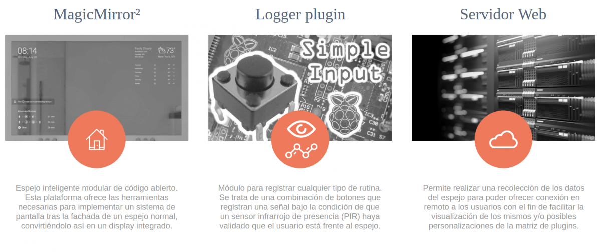](/pti/index.php/File:MMM-main.png)

## Contents

* [1 Introducción](#Introducci.C3.B3n)
* [2 Análisis de la situación actual: problemática](#An.C3.A1lisis_de_la_situaci.C3.B3n_actual:_problem.C3.A1tica)
* [3 Solución propuesta](#Soluci.C3.B3n_propuesta)
  + [3.1 Descripción general](#Descripci.C3.B3n_general)
  + [3.2 Especificaciones del smart mirror](#Especificaciones_del_smart_mirror)
    - [3.2.1 Hardware](#Hardware)
    - [3.2.2 Software](#Software)
  + [3.3 Especificaciones del plugin](#Especificaciones_del_plugin)
  + [3.4 Especificaciones del servidor (web)](#Especificaciones_del_servidor_.28web.29)
    - [3.4.1 Frontend](#Frontend)
    - [3.4.2 Backend](#Backend)
      * [3.4.2.1 Modelos](#Modelos)
      * [3.4.2.2 Rutas](#Rutas)
* [4 Impacto](#Impacto)
  + [4.1 En la asignatura](#En_la_asignatura)
  + [4.2 De innovación](#De_innovaci.C3.B3n)
  + [4.3 Ambiental](#Ambiental)
  + [4.4 Social](#Social)
* [5 Conclusiones](#Conclusiones)
* [6 Apéndice: Manual de usuario](#Ap.C3.A9ndice:_Manual_de_usuario)
  + [6.1 Magic Mirror](#Magic_Mirror)
  + [6.2 Plugin](#Plugin)
  + [6.3 Server (sólo Frontend)](#Server_.28s.C3.B3lo_Frontend.29)
    - [6.3.1 **Acceso**](#Acceso)
    - [6.3.2 **Cambio de contraseña**](#Cambio_de_contrase.C3.B1a)
    - [6.3.3 Registro de espejo](#Registro_de_espejo)
    - [6.3.4 **Listado de espejos**](#Listado_de_espejos)

# Introducción[[edit](/pti/index.php?title=Categor%C3%ADa:Magic_Mirror&veaction=edit&section=1 "Edit section: Introducción") | [edit source](/pti/index.php?title=Categor%C3%ADa:Magic_Mirror&action=edit&section=1 "Edit section: Introducción")]

El concepto principal del proyecto desarrollado gira entorno a la idea del “smart mirror”, concretamente se basa en la plataforma MagicMirror² de espejo inteligente modular de código abierto. Esta plataforma ofrece las herramientas necesarias para implementar un sistema de pantalla tras la fachada de un espejo, convirtiéndolo así en un display integrado.

Con este proyecto se busca combinar la utilidad de los espejos con la conveniencia de la tecnología, optimizando el tiempo por la posibilidad de leer información al tiempo que nos aseamos y añadiendo plugins que puedan aportar un beneficio a la salud y el bienestar.

# Análisis de la situación actual: problemática[[edit](/pti/index.php?title=Categor%C3%ADa:Magic_Mirror&veaction=edit&section=2 "Edit section: Análisis de la situación actual: problemática") | [edit source](/pti/index.php?title=Categor%C3%ADa:Magic_Mirror&action=edit&section=2 "Edit section: Análisis de la situación actual: problemática")]

Para comprender correctamente el proyecto es necesario conocer la problemática sobre la que trabajamos. Esta problemática tiene dos puntos de vista:

* **Punto de optimización**: Por la mañana, cuando suena el despertador, nos despertamos y miramos al infinito con un pensamiento en cabeza que dice algo como *“uf, cinco minutos más”*. Existen personas que se resisten a los poderes de atracción de las sábanas, pero muchas otras caemos en un dulce sueño mañanero y despertamos más tarde sobresaltados y dándonos cuenta de que no nos queda tiempo para prepararnos… Es hora de ser multitarea para no llegar tarde. ¿Qué tareas podríamos optimizar?
* **Punto de control**: Existen edades en que necesitamos rutinas, sea en la infancia, en la tercera edad o incluso como adultos responsables. Ciertas rutinas y controles son imprescindibles en el día a día para mantenernos sanos, activos y saludables. Suele pasarnos que a la hora de despertarnos o ir a dormir llevamos cada día un horario distinto y en ocasiones muy dispar, nos tomamos la medicación tres horas más tarde por un olvido o no tenemos ni idea de cuáles son nuestra temperatura o presión habituales. Llevar un registro de estas rutinas y controles para buscar un equilibrio es tedioso. ¿Cómo podríamos hacerlo más sencillo?

# Solución propuesta[[edit](/pti/index.php?title=Categor%C3%ADa:Magic_Mirror&veaction=edit&section=3 "Edit section: Solución propuesta") | [edit source](/pti/index.php?title=Categor%C3%ADa:Magic_Mirror&action=edit&section=3 "Edit section: Solución propuesta")]

## Descripción general[[edit](/pti/index.php?title=Categor%C3%ADa:Magic_Mirror&veaction=edit&section=4 "Edit section: Descripción general") | [edit source](/pti/index.php?title=Categor%C3%ADa:Magic_Mirror&action=edit&section=4 "Edit section: Descripción general")]

El MagicMirror base tiene un conjunto de plugins básicos para ofrecer información de interés habitual como la hora, el tiempo, detalle del calendario, noticias, etc. En nuestro caso, hemos analizado en profundidad el repositorio de plugins existentes de esta plataforma para localizar aquellos que mejor se ajustan a los objetivos del proyecto y nos permiten ofrecer un resultado de mayor utilidad. El proyecto extiende estas funcionalidades de la plataforma con un módulo de creación propia que se combina con las tecnologías de la información para permitir al usuario el acceso remoto a sus datos u opciones de personalización.

El módulo desarrollado es una combinación de botones que registran una señal bajo la condición de que un sensor infrarrojo de presencia (PIR) valide que el usuario está frente al espejo, permitiendo registrar cualquier tipo de rutina y almacenar un historial para posterior consulta en remoto mediante el uso de un servidor y tecnologías de comunicación que permiten realizar una recolección de los datos del espejo para poder ofrecer conexión en remoto a los usuarios con el fin de facilitar la visualización de los mismos y/o posibles personalizaciones de la matriz de plugins.

## Especificaciones del smart mirror[[edit](/pti/index.php?title=Categor%C3%ADa:Magic_Mirror&veaction=edit&section=5 "Edit section: Especificaciones del smart mirror") | [edit source](/pti/index.php?title=Categor%C3%ADa:Magic_Mirror&action=edit&section=5 "Edit section: Especificaciones del smart mirror")]

### Hardware[[edit](/pti/index.php?title=Categor%C3%ADa:Magic_Mirror&veaction=edit&section=6 "Edit section: Hardware") | [edit source](/pti/index.php?title=Categor%C3%ADa:Magic_Mirror&action=edit&section=6 "Edit section: Hardware")]

Para componer la estructura del espejo se ha empleado una combinación de pantalla, en este caso un monitor antiguo que teníamos por casa: LTM230HT11. El display venía en formato monitor, con lo cual llevaba biseles, soporte y hardware adicional el cual se ha tenido que sacar para reducir al máximo el grosor del espejo. De esta manera, se ha buscado un controlador alternativo el cual lleva todos los periféricos en modo horizontal así ganamos 1.5 centímetros. También se ha usado un espejo de acrílico transparente de 456mm x 608mm x 4mm que permite hacer funcional el espejo con pantalla integrada. Para introducir esta combinación en el hogar de la manera más cómoda y menos intrusiva posible, se ha construido un marco de madera entorno al producto que lo hace más agradable a la vista y ayuda a ocultar la electrónica que lo hace funcionar

Respecto al corazón electrónico del display, se emplea una raspberry pi 4 de 2GB (suficiente para correr el MagicMirror) que ejecuta el software completo del proyecto. Para dar alimentación a todo el hardware se usan dos módulos conversores: uno de 220V AC a 12V DC para alimentar el display y otro de 220V AC a 5V DC para alimentar la Raspberry. Para complementar el plugin, se ha añadido una breadboard para conectar el sensor PIR (sensor de movimiento por infrarrojos), los botones y la raspberry. Para finalizar, hemos puesto un heatsink activo a la raspberry: al estar en modo developer se debe reiniciar los módulos a menudo y se sobre calentaba con tantos tests. Para producción, un heatsink simple de CPU y RAM sería más que suficiente.

### Software[[edit](/pti/index.php?title=Categor%C3%ADa:Magic_Mirror&veaction=edit&section=7 "Edit section: Software") | [edit source](/pti/index.php?title=Categor%C3%ADa:Magic_Mirror&action=edit&section=7 "Edit section: Software")]

Respecto al software del smart mirror, se emplea la plataforma MagicMirror² [ URL ] que actúa como framework principal basado en Javascript y gestiona todos los módulos y configuraciones visuales del proyecto. Se han realizado las configuraciones necesarias para posicionar los efectos visuales de los módulos básicos en las regiones más convenientes para una cómoda utilización del espejo y se han personalizado los contenidos para asociarlos a la región geográfica en que se ha desarrollado el proyecto.

Bajo este framework se han habilitado y configurado los siguientes módulos:

* **Hora**: Este módulo nos da la hora y la fecha actual según la zona geográfica que le introducimos al módulo, en este caso pusimos la ciudad de Barcelona.
* **Tiempo**: Este módulo nos devuelve el tiempo y temperatura actual y una pequeña predicción del tiempo y temperatura de los siguientes días de la semana, todo esto del municipio introducido en el módulo. En nuestro caso también pusimos Barcelona.
* **Calendario**: Este módulo nos muestra por el Magic Mirror un calendario, el cual puede ser totalmente personalizado por nosotros o puede ser otro ya predefinido por terceros. Por ejemplo, podríamos adaptar nuestra agenda en este calendario y de esta manera ver para cada día lo que tenemos planeado. En el ejemplo, sale el calendario de días festivos en los Estados Unidos, esto fue cambiado más tarde.
* **Piropos**: Por último, tenemos el módulo de los piropos el cual se basa en todo un conjunto de frases que tienen como objetivo levantarte el ánimo en cuantos sean leídas. Se pueden añadir más frases o borrar las ya existentes.

## Especificaciones del plugin[[edit](/pti/index.php?title=Categor%C3%ADa:Magic_Mirror&veaction=edit&section=8 "Edit section: Especificaciones del plugin") | [edit source](/pti/index.php?title=Categor%C3%ADa:Magic_Mirror&action=edit&section=8 "Edit section: Especificaciones del plugin")]

El plugin o módulo desarrollado simplifica el método de procesamiento de señales para ofrecer un sistema de menor coste y consumo. Se trata de una combinación de botones que registran una señal bajo la condición de que un sensor infrarrojo de presencia (PIR) valide que el usuario está frente al espejo, permitiendo registrar cualquier tipo de rutina.

Para incorporar este plugin a los módulos de Magic Mirror, se ha diseñado un código de registro (JS) sobre la plataforma que permite la interacción con todas las funcionalidades del framework, entre ellas la actualización de pantalla. Además, se ha construido un segundo código (JS) que actúa como canal de comunicación entre el plugin y el registro con el objetivo de compatibilizar este módulo.

[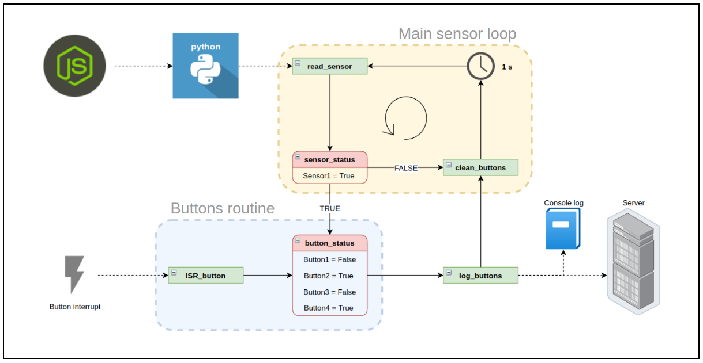](/pti/index.php/File:MMM-modulo.png)

Esquema del módulo

En cuanto al propio código del módulo, este se ha diseñado en Python y consta de dos elementos principales: el loop de comprobación del sensor PIR y la rutina de gestión de los botones. El primero de los elementos permite verificar la presencia de un individuo frente al dispositivo, así como se aprovecha para limpiar los botones y revisar actualizaciones. El segundo, se emplea para reaccionar a las pulsaciones de los botones y permite enviar los valores al servidor cuando ambos elementos detectan actividad.

A todo esto, se han incorporado funciones de actualización automática del código del módulo y se realiza verificación de la conectividad tanto a la red como con el servidor. Las comunicaciones se establecen mediante TCP con mensajes get/post que portan los JSON adecuados para notificar al servidor del estado de los registros. Además, se han añadido eventos de sincronización con el servidor para recobrar los valores guardados en este frecuentemente y evitar una disociación de la bitácora del espejo.

## Especificaciones del servidor (web)[[edit](/pti/index.php?title=Categor%C3%ADa:Magic_Mirror&veaction=edit&section=9 "Edit section: Especificaciones del servidor (web)") | [edit source](/pti/index.php?title=Categor%C3%ADa:Magic_Mirror&action=edit&section=9 "Edit section: Especificaciones del servidor (web)")]

El lenguaje JavaScript se ha convertido en parte fundamental del desarrollo de todo tipo de aplicaciones: web, móviles, bases de datos, administración de sistemas… Esta proliferación ha llevado a JavaScript a todas las capas de desarrollo, teniendo influencia en la cpaa del cliente, la del servidor y la capa de almacenamiento. Gracias a eso, hoy en día es posible crear aplicaciones distribuidas utilizando el mismo lenguaje JavaScript en todas sus fases y capas. A este concepto y las tecnologías que lo posibilitan se les ha bautizado con el nombre de MEAN, acrónimo formado por las iniciales de las cuatro tecnologías principales que entran en juego: MongoDB, Express, Angular y Node.js. Con el cual hemos desarrollado nuestro servidor.

Estructura del servidor

Para implementar nuestra base de datos hemos usado MongoDB, el cual es una base de datos NoSQL que nos da una mayor flexibilidad, menos coherencia y sobre todo mayor capacidad de escalar en los datos. Respecto a la elaboración del backend se usa Express, el cual es una herramienta que nos da soporte para las principales necesidades en este tipo de aplicaciones: gestión de peticiones y respuestas, cabeceras, rutas, vistas… De esta forma no se debe de crear todo desde cero y en bajo nivel. Por otro lado se usa Angular para ayudar en el desarrollo del frontend ya que es una biblioteca de funciones que nos facilita la programación, a la vez que nos brinda todo tipo de funcionalidades avanzadas, extendiendo de hecho las que nos ofrece de por si HTML. Por último, tenemos Node.js el cual es un entorno de ejecución de aplicaciones multiplataforma.
Node.js utiliza por debajo el motor de JavaScript de Google, denominado V8, y provee de una arquitectura orientada a eventos (como la de los navegadores) así como una serie de APIs no-bloqueantes (asíncronas) que le proporcionan un rendimiento y una escalabilidad muy elevadas.
Node.js se puede utilizar para crear cualquier tipo de lógica de aplicación, pero dado que incorpora un módulo para poder actuar como un servidor web, es especialmente popular para crear aplicaciones web.
Finalmente, aunque JSON no forme parte de este MEAN, nos es de vital importancia, ya que permite representar objetos en forma de código JavaScript que luego podemos evaluar. Tiene un formato ligero, que es fácilmente legible por un humano pero también por un ordenador, y además es muy fácil de procesar por parte de cualquier intérprete de este lenguaje.

### Frontend[[edit](/pti/index.php?title=Categor%C3%ADa:Magic_Mirror&veaction=edit&section=10 "Edit section: Frontend") | [edit source](/pti/index.php?title=Categor%C3%ADa:Magic_Mirror&action=edit&section=10 "Edit section: Frontend")]

El front end está desarrollado en angular 11.2.7, que es un framework desarrollado en Typescript, que recordemos que es una extensión de Javascript con características añadidas de tipado fuerte.
La aplicación está conformada por una serie de servicios y de componentes. Cada componente corresponde a una página diferente de la aplicación y está constituida por cuatro archivos diferentes:
Un .html donde maquetamos la página en cuestión. En nuestro caso todo está construido utilizando componentes de una plantilla de bootstrap llamada bootswatch, concretamente el modelo solar.
Un .css donde podemos modificar la hoja de estilo de la página. Dado que hemos utilizado bootstrap, hemos utilizado las hojas de estilo por defecto en la mayoría de los componentes.
Un spec.ts donde van las especificaciones de los componentes. En este archivo hemos dejado las especificaciones por defecto.
Un component.ts . Aquí hemos colocado todo el código del componente en sí que describe su comportamiento. Aquí se llaman a los servicios que toque en cada componente y se trata la respuesta que viene del backend y la redirección al siguiente componente en caso de que ese sea el caso.

### Backend[[edit](/pti/index.php?title=Categor%C3%ADa:Magic_Mirror&veaction=edit&section=11 "Edit section: Backend") | [edit source](/pti/index.php?title=Categor%C3%ADa:Magic_Mirror&action=edit&section=11 "Edit section: Backend")]

El backend está formado por las bibliotecas y códigos externos necesarios para poder ejecutar MEAN y después tiene principalmente dos grandes apartados que han sido elaborados por nosotros.

#### Modelos[[edit](/pti/index.php?title=Categor%C3%ADa:Magic_Mirror&veaction=edit&section=12 "Edit section: Modelos") | [edit source](/pti/index.php?title=Categor%C3%ADa:Magic_Mirror&action=edit&section=12 "Edit section: Modelos")]

El primero fue el modelo User el cual representa a un usuario de la aplicación y tiene tres parámetros: un email, un username y una password. En este mismo modelo, definimos también la creación de una base de datos para usuarios donde el email y username era único por usuario. Por último también añadimos dos funciones encargadas de la encriptación y de la comparación de contraseñas.
El otro, fue el modelo Raspi el cual representa una Raspberry y tiene como parámetros un serial\_number, un username (usuario propietario de la raspberry), tres botones (valor de veces pulsado) y tres goals (para que sirve el botón).

#### Rutas[[edit](/pti/index.php?title=Categor%C3%ADa:Magic_Mirror&veaction=edit&section=13 "Edit section: Rutas") | [edit source](/pti/index.php?title=Categor%C3%ADa:Magic_Mirror&action=edit&section=13 "Edit section: Rutas")]

Son todas las rutas definidas y cada una de ellas ofrece un servicio diferente. Cabe destacar que muchas de ellas son rutas asíncronas, ya que de esta manera cuando llamemos a la base de datos podemos hacer esperas hasta que llegue el resultado para evitar posibles errores de código o ejecución. Por otro lado, hay que diferenciar entre los POST y los GET. Los primeros, son rutas en las cuales nos sirven para hacer actualizaciones de datos, mientras que los segundos sirven para pasar datos o información. Las rutas las podemos dividir en tres grupos.

**Rutas de gestión de usuario**
Estas son las rutas con las cuales el usuario se puede registrar creando una cuenta, con la que después mediante otra ruta podrá acceder a ella. Las rutas que forman este grupo son: /signup, /login. Ambas son asíncronas y la rutina de login en caso de ejecutarse de forma correcta nos genera un Json web token (JWT) el cual es firmado con el id del usuario y su email, y codificado con algún tipo de algoritmo de encriptación.

Más concretamente:

* /signup : Se le pasan tres parámetros: un email, username y password. Se comprueba que ni el email ni el username estén ya en uso en el servidor y si se cumple esto, se encripta la password mediante algoritmos de hash y se guarda todo como un objeto User de la base de datos.
* /login : Se le pasan dos parámetros: un email y una password. Se busca el User correspondiente al email introducido y se compara que la password introducida sea igual a la que tenemos en la base de datos. Si todo es correcto se genera un token firmado para que el usuario pueda tener acceso a nuevas rutas en el frontend. Un token es una manera de dar autorización al usuario a un conjunto de rutas que solo son accesibles con él. En nuestro caso, serían las Rutas de usuario. La función de comprobación del token está en el Anexo.

**Rutas de usuario**
Es todo el conjunto de rutas a las cuales el usuario tiene acceso una vez ha generado el token pertinente. Todas estas rutas son consultadas y accedidas desde el frontend.

En este caso tenemos:

* /setbutton : Ruta que sirve para cambiar el goal de un botón. Se selecciona desde el frontend cual de los tres botones se quiere cambiar y se pone en formato de String, la nueva goal. Se accede a la base de datos y se cambia el parámetro concreto
* /addraspy : El usuario introduce el serial\_number y pin de la Raspberry que quiere añadir en la base de datos. Se comprueba que esta ya no exista en la base de datos, y después que haya sido incluida previamente en el mapa que se llena con Raspberrys preparadas para ser incluidas. En el caso que sea así, y el pin introducido coincida, se crea un objeto Raspi y se añade a la base de datos. Este objeto Raspi tiene el serial\_number, el usuario a la que pertenece, y todos los valores de botones a 0 junto con los goals sin inicializar.
* /deleteraspy : Se pasa un serial\_number se comprueba que exista en la base de datos y que el usuario que ejecuta la ruta sea el dueño de la Raspberry, y en caso afirmativo se borra la Raspberry de la base de datos.
* /myraspis : Se devuelve una lista con todas las Raspberrys cuyo dueño es el usuario que ejecuta la ruta.
* /profile : Ruta donde el usuario puede hacer gestión de su cuenta como cambiar la contraseña.

**Rutas de raspberry**
Se trata de todo el conjunto de rutas que una Raspberry puede usar para comunicarse con el servidor y pedir la información necesaria para la correcta ejecución del módulo desarrollado. En este caso, hemos creado un usuario con el email raspi@raspi.raspi, username: raspi, password: raspi, que será usado por las raspberries. Una raspberry hará el proceso de login con estos datos lo que le generará un token firmado con su email y que le dará acceso único a este tipo de rutas.

Ningún otro usuario tiene acceso a estas rutas, las cuales son:

* /initraspy : Ruta en la que se pasa un serial\_number de una Raspberry y se comprueba si está ya en la Base de Datos, en caso afirmativo se devuelve toda la información de esta. En caso contrario, se devuelve error.
* /setraspy : Ruta que sirve para modificar los valores de los botones de la Raspberry, cada vez que se pulsa un botón se llama a esta ruta y se pasa que botón se ha pulsado. Si el valor del field es 1, el botón ha sido pulsado y se tiene que acceder a la base de datos para incrementar ese valor en uno. Por otro lado, si el serial\_number no existe en la base de datos, se inicia un objeto dentro de un mapa que sirve para guardar Raspberries iniciadas y listas para ser añadidas a la base de datos. El mapa contiene los serial\_number y pin de cada una.

Ambas rutas usan la función verifyRaspi, la cual es muy similar a la función verifyToken, solo que verifica que el token haya sido firmado por el usuario raspi.

# Impacto[[edit](/pti/index.php?title=Categor%C3%ADa:Magic_Mirror&veaction=edit&section=14 "Edit section: Impacto") | [edit source](/pti/index.php?title=Categor%C3%ADa:Magic_Mirror&action=edit&section=14 "Edit section: Impacto")]

## En la asignatura[[edit](/pti/index.php?title=Categor%C3%ADa:Magic_Mirror&veaction=edit&section=15 "Edit section: En la asignatura") | [edit source](/pti/index.php?title=Categor%C3%ADa:Magic_Mirror&action=edit&section=15 "Edit section: En la asignatura")]

Basándonos en las competencias y objetivos de la asignatura, este proyecto comienza con relación directa por la elaboración de una propuesta de proyecto de tecnologías de la información que incluye una planificación temporal y el reparto de tareas entre los miembros del grupo. Esta propuesta es el inicio de un proceso de desarrollo que implica definir, planificar y gestionar con un grupo de personas una solución que integra tecnologías de hardware, software y sistemas de tecnologías de la información basados en red que deberá ser propiamente adaptada, extendida y evaluada. La combinación de criterios de coste y calidad serán imprescindibles para garantizar los materiales y el montaje adecuado de la estructura del espejo y los servicios asociados al mantenimiento del mismo a nivel informático por parte de los servicios de comunicaciones para sistemas distribuidos y dispositivos de computación ubicua que se desea implementar. Mediante la debida organización y control del cumplimiento de la planificación, se logrará disponer de los sistemas adecuadamente instalados, documentados y personalizados para poder realizar demos y presentar los resultados del proyecto desarrollado.

## De innovación[[edit](/pti/index.php?title=Categor%C3%ADa:Magic_Mirror&veaction=edit&section=16 "Edit section: De innovación") | [edit source](/pti/index.php?title=Categor%C3%ADa:Magic_Mirror&action=edit&section=16 "Edit section: De innovación")]

Tal y como se ha explicado anteriormente en los otros apartados, la posibilidad de innovación en este proyecto dependerá en la creación de nuestro propio plugin ya que todos los otros que implementaremos ya están creados. Eso es con lo que respecta a la innovación frente a otros prototipos personales del MagicMirror. Por otro lado este proyecto puede conllevar cambios en poder realizar un tipo de “multitasking” de tareas durante el día conjuntamente con dar la posibilidad de monitorizar de alguna manera algunos aspectos de nuestra salud que son importantes de forma más sencilla y se haría con solo estar delante del espejo. Por tanto, al final el resultado principal del proyecto sería la optimización en nuestro día a día para poder facilitar la multitarea y un elemento de control que nos permita saber el estado de salud y bienestar.

## Ambiental[[edit](/pti/index.php?title=Categor%C3%ADa:Magic_Mirror&veaction=edit&section=17 "Edit section: Ambiental") | [edit source](/pti/index.php?title=Categor%C3%ADa:Magic_Mirror&action=edit&section=17 "Edit section: Ambiental")]

A nivel ambiental, el espejo supone un coste estático mínimo e incluso beneficioso por la capacidad de reciclar una pantalla antigua y convertirla en espejo, colaborando así en el proceso de reutilización de los desechos tecnológicos. Por una parte, el consumo dinámico de tener el espejo encendido es mínimo por la amplia dominancia del color negro (apagado) en el display que garantiza la reflexión. Si tenemos en cuenta la raspberry, el consumo dinámico apenas varía gracias al bajo voltaje y una frecuencia de actividad relativamente baja. Por otra parte, el servidor es capaz de soportar múltiples conexiones simultáneas y puede que esto parezca conllevar un consumo más elevado. Sin embargo, si se tiene en cuenta el impacto energético per cápita (o por espejo), podemos ver que el servidor apenas incrementa el consumo individual.

## Social[[edit](/pti/index.php?title=Categor%C3%ADa:Magic_Mirror&veaction=edit&section=18 "Edit section: Social") | [edit source](/pti/index.php?title=Categor%C3%ADa:Magic_Mirror&action=edit&section=18 "Edit section: Social")]

El producto final que se desarrolla en este proyecto podría llegar a tener un gran impacto social debido a diversos factores. Actualmente, nos encontramos en la llamada revolución de las “Cosas Inteligentes” donde se empiezan a ver muebles capaces de hacer lo mismo que un ordenador o un móvil. Esta revolución nos ha llevado a innovar en un mueble imprescindible en nuestras casas. Un espejo es un mueble esencial en cualquier vivienda, existen de diferentes tamaños y diseños, pero cuando se trata de sus funcionalidades se encuentra limitada a solo una, reflejar imágenes. Por tanto, al añadirle un conjunto de funcionalidades que lo hagan “inteligente”, puede provocar la conversión de nuestro producto a algo esencial e innovador dentro de un sector donde solo hay cambios en los aspectos de diseño o materiales. Por otro lado, se trata de un producto que encajaría en cualquier núcleo familiar ya que puede ser usado por cualquier persona independientemente de su edad, al tener una funcionalidad básica y una fácil gestión de elección de que se proyecta por pantalla en todo momento, mediante una aplicación. Por tanto, nuestro producto se podría convertir en la mejor forma de modernizar el sector de los espejos.

# Conclusiones[[edit](/pti/index.php?title=Categor%C3%ADa:Magic_Mirror&veaction=edit&section=19 "Edit section: Conclusiones") | [edit source](/pti/index.php?title=Categor%C3%ADa:Magic_Mirror&action=edit&section=19 "Edit section: Conclusiones")]

Partiendo de la base de que el concepto principal del proyecto desarrollado gira entorno a la idea del “smart mirror” y que se buscaba extender las funcionalidades de la plataforma con módulos de creación propia, podemos decir que el proyecto ha sido un éxito. Ambos propósitos, tanto el de punto de optimización como el de control, se han logrado adecuadamente.

Por una parte, se ha desarrollado un módulo como combinación de botones y sensor de presencia para detección de actividad que permite almacenar un historial para posterior consulta. La programación y construcción del espejo ha implicado varias búsquedas de información y el aprendizaje del funcionamiento del framework MagicMirror², así como de el funcionamiento de las entradas hardware y las comunicaciones por red desde RaspberryPi.

Por otra parte, se ha implementado un servidor (frontend+backend) bajo el concepto de MEAN stack que permite al usuario el acceso remoto a opciones de personalización. En este ámbito, se ha comenzado desde el desconocimiento casi absoluto y se ha podido ir avanzando a base de lecturas de documentación y tutoriales sobre el funcionamiento de los lenguajes implicados.

Con este proyecto se ha logrado combinar la utilidad de los espejos con la conveniencia de la tecnología, optimizando el tiempo por la posibilidad de leer información al tiempo que nos aseamos y añadiendo plugins que puedan aportar un beneficio a la salud y el bienestar.

# Apéndice: Manual de usuario[[edit](/pti/index.php?title=Categor%C3%ADa:Magic_Mirror&veaction=edit&section=20 "Edit section: Apéndice: Manual de usuario") | [edit source](/pti/index.php?title=Categor%C3%ADa:Magic_Mirror&action=edit&section=20 "Edit section: Apéndice: Manual de usuario")]

## Magic Mirror[[edit](/pti/index.php?title=Categor%C3%ADa:Magic_Mirror&veaction=edit&section=21 "Edit section: Magic Mirror") | [edit source](/pti/index.php?title=Categor%C3%ADa:Magic_Mirror&action=edit&section=21 "Edit section: Magic Mirror")]

Como usuario, basta con conectar el mirror a la corriente para tenerlo en funcionamiento. Cabe destacar la localización de cada uno de los módulos configurados:

[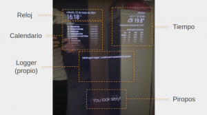](/pti/index.php/File:MagicMirror.png)

Configuración de la pantalla del MagicMirror

## Plugin[[edit](/pti/index.php?title=Categor%C3%ADa:Magic_Mirror&veaction=edit&section=22 "Edit section: Plugin") | [edit source](/pti/index.php?title=Categor%C3%ADa:Magic_Mirror&action=edit&section=22 "Edit section: Plugin")]

Para el empleo del plugin, el usuario debe situarse frente al sensor de presencia (blanco) y pulsar el botón correspondiente a la tarea que desea registrar. El dispositivo registrará su elección, enviará dicho registro al servidor y mostrará por pantalla el valor actualizado.

Hardware del Plugin

## Server (sólo Frontend)[[edit](/pti/index.php?title=Categor%C3%ADa:Magic_Mirror&veaction=edit&section=23 "Edit section: Server (sólo Frontend)") | [edit source](/pti/index.php?title=Categor%C3%ADa:Magic_Mirror&action=edit&section=23 "Edit section: Server (sólo Frontend)")]

### **Acceso**[[edit](/pti/index.php?title=Categor%C3%ADa:Magic_Mirror&veaction=edit&section=24 "Edit section: Acceso") | [edit source](/pti/index.php?title=Categor%C3%ADa:Magic_Mirror&action=edit&section=24 "Edit section: Acceso")]

En la pantalla de incio podrá ver dos botones junto a un mensaje de bienvenida. Dele al de la derecha con el mensaje SignUp.

[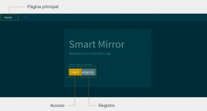](/pti/index.php/File:17.png)

Página de inicio web

Se mostrará una pantalla con tres campos de texto correspondientes al email, usuario y password. Llene los campos con sus datos y dele al botón signup. Si todo ha ido bien verá un mensaje de usuario creado con éxito y le redirigirá a la sección de sign in . En caso de que el usuario esté registrado verá un mensaje de error y será redirigido de nuevo a signup.

[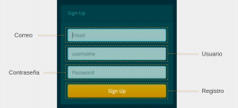](/pti/index.php/File:18MMM.png)

Formulario de registro web

Ahora debería usted encontrarse en sign in. Introduzca las credenciales que acaba de registrar en el paso anterior,email y password y clicke en el botón de sign in y el sistema le dará paso a su perfil.

[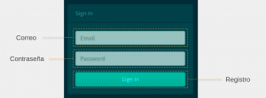](/pti/index.php/File:19MMM.png)

Formulario de acceso

Verá las opciones que ofrece el sistema en una barra muy parecida a la siguiente:

[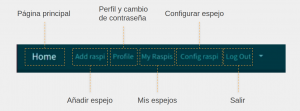](/pti/index.php/File:20MMM.png)

Barra de opciones de menú

### **Cambio de contraseña**[[edit](/pti/index.php?title=Categor%C3%ADa:Magic_Mirror&veaction=edit&section=25 "Edit section: Cambio de contraseña") | [edit source](/pti/index.php?title=Categor%C3%ADa:Magic_Mirror&action=edit&section=25 "Edit section: Cambio de contraseña")]

Para cambiar de contraseña diríjase a profile y presione el botón change password.

Página de perfil

El sistema le pedirá confirme su password, y que ponga el nuevo por duplicado. En caso de éxito le pedirá que ingrese de nuevo con sus nuevas credenciales.

Formulario de cambio de contraseña

### Registro de espejo[[edit](/pti/index.php?title=Categor%C3%ADa:Magic_Mirror&veaction=edit&section=26 "Edit section: Registro de espejo") | [edit source](/pti/index.php?title=Categor%C3%ADa:Magic_Mirror&action=edit&section=26 "Edit section: Registro de espejo")]

**Nota**: se requiere del pin que se muestra en el espejo al iniciarlo.
Una vez en la plataforma debe de seguir los siguientes pasos:
Clicke en “add Raspy”. El sistema le pedirá el número de referencia y pin del espejo. En caso de éxito verá como su raspi ha sido añadido a la lista de raspis.

[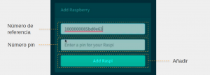](/pti/index.php/File:23MMM.png)

Registro de un nuevo espejo

Seguidamente ha de configurar los botones de la raspi. Haga click en “config raspi”. Verá un seleccionable con todas sus raspis añadidas. Seleccione la que desee y seguidamente elija qué botón desea configurar, en el ejemplo seleccionamos el botón de color rojo, es decir, configuraremos el comportamiento del primer botón físico de nuestro dispositivo.

[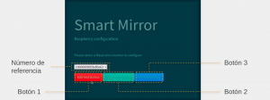](/pti/index.php/File:24MMM.png)

Configuración del espejo

Al seleccionar edit button llegará a una pantalla donde habrán dos campos de texto y un seleccionable.
El primero será un nametag, es decir, un apodo del botón.
El segundo será una meta que designa cuántas veces desea ponerse como objectivo el pulsarlo.
El tercer campo es la frecuencia, que puede ser: diaria, mensual o semanal.
En caso de éxito se redirigirá a config raspi donde podrá seguir configurando botones, en caso de que haya algún error saldrá un mensaje de error.

[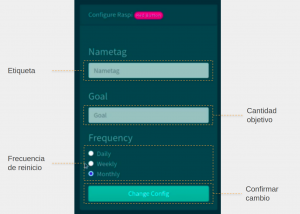](/pti/index.php/File:25MMM.png)

Configuración del botón rojo

### **Listado de espejos**[[edit](/pti/index.php?title=Categor%C3%ADa:Magic_Mirror&veaction=edit&section=27 "Edit section: Listado de espejos") | [edit source](/pti/index.php?title=Categor%C3%ADa:Magic_Mirror&action=edit&section=27 "Edit section: Listado de espejos")]

Haga click en “list raspis”, verá usted dos botones uno para añadir y otro para eliminar. Si selecciona una y le da a eliminar se eliminará y mostrará mensaje de éxito si es posible ejecutar la operación. Si le da a añadir le llevará a la sección para añadir raspi.

[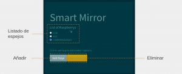](/pti/index.php/File:26MMM.png)

Página de listado de espejos