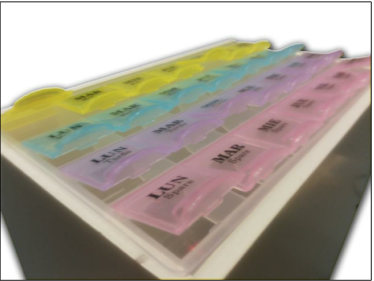
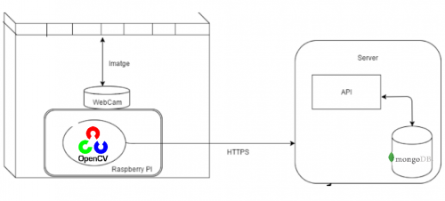
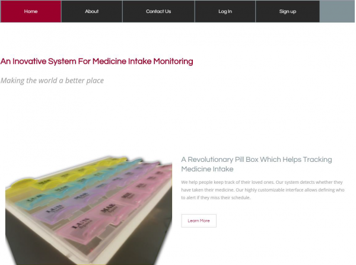
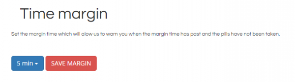
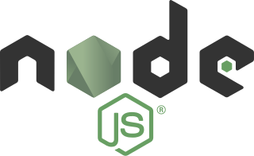

## Contents

* [1 Projecte MediToring](#Projecte_MediToring)
* [2 Components](#Components)
  + [2.1 Pastiller](#Pastiller)
  + [2.2 Raspberry Pi](#Raspberry_Pi)
  + [2.3 Detecció de pastilles](#Detecci.C3.B3_de_pastilles)
  + [2.4 Client Web](#Client_Web)
  + [2.5 Servidor](#Servidor)
* [3 Conclusions](#Conclusions)
* [4 Bibliografia](#Bibliografia)

# Projecte MediToring[[edit](/pti/index.php?title=Categor%C3%ADa:MediToring&veaction=edit&section=1 "Edit section: Projecte MediToring") | [edit source](/pti/index.php?title=Categor%C3%ADa:MediToring&action=edit&section=1 "Edit section: Projecte MediToring")]

MediToring és un projecte que pretén solucionar un problema existenta la societat d'avui en dia, com ho és el fet que la gent gran pot no tenir bona memòria, sent un cas crític a l'hora de prendre's les seves pastilles.

La nostra proposta es basa en la creació d'un pastiller que permet detectar si l'usuari s'ha près les seves pastilles corresponents. Concretament, tindrem un pastiller amb una Raspberry Pi al seu interior que controla una càmera, la qual s'encarrega d'anar prenent imatges des d'una vista inferior del pastiller amb l'objectiu que ella mateixa pugui processar-les mitjançant un algorisme de visió per computadors, com és el cas d'OpenCV, i així detectar si l'usuari s'ha près les pastilles, si se n'ha oblidat o, fins i tot saber si s'ha près les que corresponien a un altre dia o hora. En qualsevol d'aquests casos, la Raspberry enviarà una alerta al servidor. Aquest contindrà una pàgina web, on l'usuari podrà definir els responsables als quals s'ha d'alertar en cas que es detecti una de les situacions mencionades anteriorment, juntament amb la configuració necessària de l'agenda de medicació del pacient.

# Components[[edit](/pti/index.php?title=Categor%C3%ADa:MediToring&veaction=edit&section=2 "Edit section: Components") | [edit source](/pti/index.php?title=Categor%C3%ADa:MediToring&action=edit&section=2 "Edit section: Components")]

## Pastiller[[edit](/pti/index.php?title=Categor%C3%ADa:MediToring&veaction=edit&section=3 "Edit section: Pastiller") | [edit source](/pti/index.php?title=Categor%C3%ADa:MediToring&action=edit&section=3 "Edit section: Pastiller")]

[115px](/pti/index.php?title=Special:Upload&wpDestFile=Pastiller_interior.png "File:Pastiller interior.png")

El pastiller és un dels blocs fonamentals dins del nostre projecte, juntament amb la Raspberry, ja que és l’encarregat de guardar les pastilles ordenades per dies (columnes) i per franges horàries (files). A més, l’embolcall, construït utilitzant cartró ploma, és l’encarregat de contenir la Raspberry i mantenir-la fixa, ja que per la detecció de pastilles és molt important que les imatges estiguin sempre en la mateixa posició.

Per la construcció del pastiller vam utilitzar cartró ploma com a material principal. Primer vam prendre les mides del pastiller en sí, i un cop obtingudes, juntament amb l'alçada necessària, vam prosseguir a la construcció de l'embolcall, fixant la Raspberry i la càmera a la base. També vam afegir un LED per tal d'il·luminar la caixa al moment de prendre les imatges per tal de tenir més llum per a facilitar la detecció. Un cop tota la part de muntatge va acabar, vam afegir el logo del projecte en un lateral com a estètica.

## Raspberry Pi[[edit](/pti/index.php?title=Categor%C3%ADa:MediToring&veaction=edit&section=4 "Edit section: Raspberry Pi") | [edit source](/pti/index.php?title=Categor%C3%ADa:MediToring&action=edit&section=4 "Edit section: Raspberry Pi")]

Pel que fa a la Raspberry Pi, és l’encarregada de prendre les imatges periòdicament i de processar-les utilitzant l’algorisme de visió per computadors (OpenCV). Un cop processades, sabem en quines caselles del pastiller hi ha pastilles, i aquesta informació es codifica en JSON, juntament amb el dia de la setmana, hora actual i un identificador únic per a cada Raspberry i es transmet al servidor mitjançant el mètode POST del protocol HTTPS, i ell s’encarrega de processar aquesta informació rebuda, tal qual s’explica a la part del Servidor.

## Detecció de pastilles[[edit](/pti/index.php?title=Categor%C3%ADa:MediToring&veaction=edit&section=5 "Edit section: Detecció de pastilles") | [edit source](/pti/index.php?title=Categor%C3%ADa:MediToring&action=edit&section=5 "Edit section: Detecció de pastilles")]

Un dels punts importants del projectes és la detecció de pastilles, per tal de saber si el pacient s’ha pres la pastilla que li tocava o se l’ha deixat de pendre. Primer vam pensar en utilitzar sensors en cadascuna de les caselles per tal de detectar si hi havia pastilles. Però vam veure que la visió per computador encaixava perfectament en el nostra projecta i és una eina moderna i en un futur ens podria ajudar a implementar més funcionalitats.

D’aquesta manera vam descobrir una llibreria de visió per computador OpenSource anomenada OpenCV que ens permetia complir el nostre objectiu i a més té suport per Python (el llenguatge que utilitzem a la raspberry) i la Raspberry compleix els requisits mínims per tal de poder córrer la llibreria en aquesta.

Dins d’OpenCV hi ha un algorisme anomenat Watershed que permet segmentar les imatge i això ens ha anat molt bé en el projecte per tal de detectar si hi ha pastilles o no i en un futur inclòs contar les que hi ha.

L’algorisme per detectar les la presència de pastilles principalment realitza els següents passos :

Primer es fa la foto del pastiller tot encenent el LED per fer-la i apagant-lo seguidament .Un cop tenim la imatge presa , aquesta es retalla per tal de deixar en la imatge solament el pastiller i eliminar tota la part visible de l’estructura del pastiller.
A continuació a partir d’unes posicions ja definides per al pastiller es retallen cadascuna de les caselles per aplicar l’algorisme en cadascuna d’aquestes.
La imatge de la casella es binaritza , a continuació es crea un marcador per poder executar el watershed i s’executa. Després s’aplica una màscara per tal de deixar en negre tot el que no siguin pastilles que ha detectat. Finalment comprovant píxel a píxel que el color sigui diferent de negre i amb un threshold podem decidir si hi ha pastilles o no.

## Client Web[[edit](/pti/index.php?title=Categor%C3%ADa:MediToring&veaction=edit&section=6 "Edit section: Client Web") | [edit source](/pti/index.php?title=Categor%C3%ADa:MediToring&action=edit&section=6 "Edit section: Client Web")]

Per tal de poder monitoritzar la presa de medicaments és necessari fer saber al sistema quan el pacient ha de prendre medicaments i per tant, cal controlar si efectivament se’ls pren. Endemés, cal fer una interfície de forma atractiva i intuïtiva als usuaris ja que en cap moment podem pressuposar un coneixement més enllà del que té qualsevol persona. És per això que ens hem pres un gran interès en que la web sigui fàcil d’utilitzar i en cap cas sigui un impediment per interactuar amb el sistema.

Així doncs, la pàgina web és la forma que el responsable del pacient pot definir quan s’han de prendre la medicació, és a dir, el l’hora en concret de cada dia de la setmana; el marge de temps, és a dir, quan de temps més cal esperar a partir de l’hora que hauria de prendre’s la pastilla i els responsables a qui cal alertar en cas que el pacient s’oblidi de prendre la pastilla o bé se’n prengui algunes que no li toca prendre’s. Les alertes es produiran per correu electrònic, per tant, per definir el conjunt de gent a qui cal alertar caldrà introduir el correu electrònic de les respectives persones. A més a més, la pàgina web permetrà registrar nous usuaris així com accedir a la configuració als usuaris que prèviament s’hagin registrat. En resum, la pàgina web actua d’intermediari entre l’usuari i el sistema.

[200px](/pti/index.php?title=Special:Upload&wpDestFile=Webmobil.png "File:Webmobil.png")

Per tal de fer la pàgina web accessible per a diferents dispositius utilitzem una plantilla de Bootstrap. Vista des de la pantalla d’un dispositiu relativament gran (com un ordinador) la pàgina web es veu tal i com mostra la següent figura.

Un cop hem iniciat sessió, podem accedir a la pestanya de configuració, que ens permetrà definir l’agenda de medicació del pacient tal i com mostra la següent imatge:

Hi ha una casella per a cada casella del pastiller. Tal i com es pot observar, la distribució també es correspon amb la del pastiller ja que les caselles estan classificades per dies de la setmana i moment del dia. Per a cada casella, hi ha l’opció de deixar-la amb valor “NONE”, corresponent a que el pacient no s’ha de prendre medicació en aquell moment del dia. Si el pacient ha de prendre’s medicació en algun moment del dia, clicant a una casella, veurem un desplegable que permetrà seleccionar l’hora que sigui convenient.

Ademés de l’hora a la que el pacient s’ha de prendre la medicació, el responsable també pot fixar el marge de temps, que actuarà tant abans de l’hora com després. És a dir, si el pacient es pren les pastilles abans de l’hora i abans del marge de temps el sistema detectarà que se les ha pres massa d’hora. Simètricament si se les pren desprès de l’hora i més tard que el marge de temps, el sistema detectarà que se les ha pres massa tard.

## Servidor[[edit](/pti/index.php?title=Categor%C3%ADa:MediToring&veaction=edit&section=7 "Edit section: Servidor") | [edit source](/pti/index.php?title=Categor%C3%ADa:MediToring&action=edit&section=7 "Edit section: Servidor")]

L'objectiu del servidor en el nostre projecte és servir de backend de la web i comunicar-se amb la raspberry dels pastillers. En particular, realitza les següents funcions:

– Proveir autenticació als usuaris a través de la web

– Proveir les funcions per guardar i recuperar la configuració dels usuaris

– Guardar i recuperar les dades de forma segura de la BD

– Processar les actualitzacions dels pastillers

– Enviar emails d'alerta als usuaris

El servidor està desenvolupat amb Node.js. Hem triat aquest entorn perquè ens permet desenvolupar el servidor de manera ràpida i eficaç. Utilitzem el mòdul Express, que és una infraestructura d'aplicacions web que proporciona un conjunt sòlid de característiques que ens ajuda al desenvolupament. Per implementar l'autenticació, fem servir el mòdul passport, que ens facilita la creació del sistema de signup, login i logout i proporciona middleware per gestionar-ho. Pel que fa a seguretat, en cap cas guardem les contrasenyes en clar, si no que l'algorisme bcrypt crea un hash de les contrasenyes que es guarda a la base de dades. Aquest algorisme està àmpliament provat i utilitzem una implementació de Node.js. A més, si els usuaris també utilitzen una connexió HTTPS, es garanteix que la transmissió de les dades serà segura. La raspberry utilitza HTTPS per defecte. Per emmagatzemar les dades de manera permanent al servidor utilitzem mongoDB. MongoDB és una base de dades NoSQL àmpliament utilitzada per grans empreses. L'hem utilitzat al nostre projecte perquè s'integra molt bé amb Node.js utilitzant el mòdul “mongoose”.

# Conclusions[[edit](/pti/index.php?title=Categor%C3%ADa:MediToring&veaction=edit&section=8 "Edit section: Conclusions") | [edit source](/pti/index.php?title=Categor%C3%ADa:MediToring&action=edit&section=8 "Edit section: Conclusions")]

El resultat d’aquest projecte ha estat un sistema que integra diferents tecnologies tan vistes a classe com no habituals a les assignatures del grau. Des de les bases de dades fins el sistema encastat que utilitzem al pastiller, s’han adaptat i configurat amb el màxim detall per tal d’assolir de forma conjunta les funcionalitats establertes com a objectius del projecte. El resultat ha estat un producte que satisfà una necessitat i resol un problema present en la societat actual; el producte és el resultat de la integració de diferents tecnologies que en conjunt i de forma sinèrgica formen un tot.

Un dels objectius que ens vam fixar des del començament del projecte ha estat el de desenvolupar un producte que tingués una utilitat social tot descobrint i aprenent sobre noves tecnologies. A nivell funcional, creiem que hem assolit aquest objectiu ja que el nostre producte final té una clara utilitat. Semblantment, a nivell formatiu tots els membres hem après sobre un conjunt de tecnologies que prèviament desconeixíem. A més a més, hem millorat la nostra capacitat d’organització i treball en equip, habilitats tant o més importants que les capacitats tècniques.

Pel que fa al producte, creiem que el producte és una idea original que hem aconseguit materialitzar correctament i que ha gaudit d’una bona acceptació. De cara a l’usuari, el servei és transparent, ja que només ha de configurar l’agenda a través de la pàgina web.

En conclusió, tots els membres de l’equip estem molt satisfets i orgullosos de la feina realitzada i del resultat del projecte.

# Bibliografia[[edit](/pti/index.php?title=Categor%C3%ADa:MediToring&veaction=edit&section=9 "Edit section: Bibliografia") | [edit source](/pti/index.php?title=Categor%C3%ADa:MediToring&action=edit&section=9 "Edit section: Bibliografia")]

[1] Raspberry PI webpage: <https://www.raspberrypi.org/>

[2] Python: <https://www.python.org/>

[3] Angular documentation : <http://www.w3schools.com/angular/>

[4] Html documentation: <http://www.w3schools.com/html/>

[5] NodeJs documentation : <https://nodejs.org/api/>

[6] MongoDB documentation: <https://docs.mongodb.org>

[7] OpenCV python tutorials : <https://opencv-python-tutroals.readthedocs.io/en/latest/py_tutorials/py_tutorials.html>

[8] OpenCV watershed tutorial: <http://opencv-python-tutroals.readthedocs.io/en/latest/py_tutorials/py_imgproc/py_watershed/py_watershed.html>

[9] Cloud9 webpage: <https://c9.io/>

[10] Docker docs : <https://docs.docker.com/>

[11] Express api : <http://expressjs.com/en/api.html>