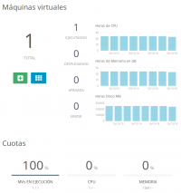

Estructura del proyecto.

## Contents

* [1 Introducción](#Introducci.C3.B3n)
  + [1.1 ¿Qué es MeteoFib?](#.C2.BFQu.C3.A9_es_MeteoFib.3F)
* [2 Infraestructura](#Infraestructura)
* [3 Servicio Web](#Servicio_Web)
  + [3.1 Back-end](#Back-end)
    - [3.1.1 Tecnologías utilizadas](#Tecnolog.C3.ADas_utilizadas)
  + [3.2 Front-end](#Front-end)
    - [3.2.1 Tecnologías utilizadas](#Tecnolog.C3.ADas_utilizadas_2)
* [4 Android](#Android)
* [5 Estación meteorológica](#Estaci.C3.B3n_meteorol.C3.B3gica)
  + [5.1 Arduino](#Arduino)
    - [5.1.1 Componentes y precisión](#Componentes_y_precisi.C3.B3n)
    - [5.1.2 Conexión de sensores con Arduino UNO](#Conexi.C3.B3n_de_sensores_con_Arduino_UNO)
    - [5.1.3 Programación Arduino](#Programaci.C3.B3n_Arduino)
  + [5.2 Raspberry Pi](#Raspberry_Pi)
    - [5.2.1 Conexión con Arduino UNO](#Conexi.C3.B3n_con_Arduino_UNO)
    - [5.2.2 Docker Container: Servidor MySQL](#Docker_Container:_Servidor_MySQL)
    - [5.2.3 Docker Container: Servicio Web RESTful](#Docker_Container:_Servicio_Web_RESTful)
* [6 Referencias](#Referencias)

# Introducción[[edit](/pti/index.php?title=Categor%C3%ADa:Meteo&veaction=edit&section=1 "Edit section: Introducción") | [edit source](/pti/index.php?title=Categor%C3%ADa:Meteo&action=edit&section=1 "Edit section: Introducción")]

## ¿Qué es MeteoFib?[[edit](/pti/index.php?title=Categor%C3%ADa:Meteo&veaction=edit&section=2 "Edit section: ¿Qué es MeteoFib?") | [edit source](/pti/index.php?title=Categor%C3%ADa:Meteo&action=edit&section=2 "Edit section: ¿Qué es MeteoFib?")]

Nuestro proyecto consiste en una estación meteorológica que provee a los usuarios de datos de interés sobre las condiciones climatológicas del día actual y un histórico de los días recientes. El usuario puede consultar dicha información mediante una aplicación de Android o bien mediante una página web habilitada para tal propósito.

# Infraestructura[[edit](/pti/index.php?title=Categor%C3%ADa:Meteo&veaction=edit&section=3 "Edit section: Infraestructura") | [edit source](/pti/index.php?title=Categor%C3%ADa:Meteo&action=edit&section=3 "Edit section: Infraestructura")]

Nuestro infraestructura consiste de distintos componentes. En primer lugar tenemos un Arduino conectado a unos sensores de temperatura, humedad y presión. Este a su vez, se conecta con una Raspberry Pi para enviarle los datos recogidos por los sensores.

La Raspberry nos servirá para dos fines: almacenar estos datos meteorológicos en una base de datos SQL y para crear un servicio web que será el encargado de recibir las peticiones GET de la página web y la aplicación Android y responder a estas peticiones con los datos pedidos en formato JSon. Tanto la Base de datos como el servicio web se encuentran en dos contenedores independientes que se gestionan mediante Docker.

Para poder visualizar estos datos, al usuario se le ofrecen dos posibilidades, acceder a ellos mediante una página web y una aplicación Android.

# Servicio Web[[edit](/pti/index.php?title=Categor%C3%ADa:Meteo&veaction=edit&section=4 "Edit section: Servicio Web") | [edit source](/pti/index.php?title=Categor%C3%ADa:Meteo&action=edit&section=4 "Edit section: Servicio Web")]

## Back-end[[edit](/pti/index.php?title=Categor%C3%ADa:Meteo&veaction=edit&section=5 "Edit section: Back-end") | [edit source](/pti/index.php?title=Categor%C3%ADa:Meteo&action=edit&section=5 "Edit section: Back-end")]

Parte importante de este proyecto era tener un soporte web. Para ello se ha tenido en cuenta en hacer una aplicación web que pudiera dar a los usuarios de nuestro servicio una interfaz accesible, fácil y sencilla de usar para consultar los datos meteorológicos capturados por nuestros equipos.

OpenNebula

Gracias a los recursos y apoyos ofrecidos desde la facultad de informática (FIB), hemos tenido acceso y control de un servidor en la nube (OpenNebula). Para llevar a cabo nuestra tarea con el servidor web, hemos adoptado decisiones necesarias y apropiadas según nuestro criterio hacia las tecnologías a utilizar, a las configuraciones a realizar y al desarrollo para que el servidor consiga el desempeño esperado.

El servidor en la nube es un linux, para la implementación del servicio se ha utilizado python como lenguaje de programación entorno al backend. Python da una flexibilidad para la programación de web services, la cual hemos aprovechado utilizando para desarrollar nuestra API. En la parte de configuración tenemos un servidor web(nginx), un microframework (flask) y un WSI(gunicorn) para la comunicación entre el server y sus peticiones contra el microframework.

A la hora de definir una API, disponemos de diferentes tipos de arquitectura donde elegir, sin embargo en los últimos años un tipo de arquitectura está creciendo, coincidiendo con el auge de los sistemas cloud. Estamos hablando de la arquitectura REST la cual no es un estándar ni un protocolo, sino una serie de principios de arquitectura. Nuestra elección de esta configuración ha sido principalmente para un desarrollo dinámico y con más facilidades. Unas de las ventajas de REST es la comunicación y utilización de los métodos dados por HTTP. Así no es necesario tener una compleja estructura para que los extremos de los servicios se comuniquen. Facilitando el desarrollo en cada punto final del servicio como es la web y la aplicación de Android.

### Tecnologías utilizadas[[edit](/pti/index.php?title=Categor%C3%ADa:Meteo&veaction=edit&section=6 "Edit section: Tecnologías utilizadas") | [edit source](/pti/index.php?title=Categor%C3%ADa:Meteo&action=edit&section=6 "Edit section: Tecnologías utilizadas")]

* OpenNebula: Es la plataforma ofrecido por la FIB para el manejo de un servidor. Nosotros la utilizamos como servidor web, donde albergar nuestra aplicación web.
* Ubuntu: Para el sistema operativo se nos ofrece un template, el cual tiene una serie de configuraciones predeterminadas.
* Nginx: Servidor web/proxy inverso ligero de alto rendimiento
* Gunicorn: Servidor HTTP de Python WSGI para UNIX.
* Python: Lenguaje de programción para la implemtación de Flask.
* Pip: Instalador de dependencias y módulos de python.
* Virtualenv: Herramienta para generar entorno virtual que aisla el directorio de trabajo del resto de la máquina.
* Flask: micro framework para las definiciones de rutas y tratamientos de peticiones.
* Supervisor: Controlador para el fácil deployment de los servidores.

## Front-end[[edit](/pti/index.php?title=Categor%C3%ADa:Meteo&veaction=edit&section=7 "Edit section: Front-end") | [edit source](/pti/index.php?title=Categor%C3%ADa:Meteo&action=edit&section=7 "Edit section: Front-end")]

Lo primero que había que decidir era el diseño que iba a tener la web de nuestro proyecto y a su vez, decidir cuáles serían los diferentes apartados de la misma. Para ello, en un papel realice un pequeño boceto de la idea que tenía para el diseño y con la colaboración de los demás miembros del grupo decidimos los apartados que tendría nuestra web.

Página principal del servicio web.

Inicialmente estos apartados eran: Home, Medición, Estadísticas, Contacto y Sobre Nosotros.

Una vez con el diseño en mente, había que plasmarlo en una pantalla por lo que era necesario aprender sobre las diferentes tecnologías implicadas como son HTML y CSS.

Para los estilo utilizamos Bootstrap, un potente framework que ayudaría al diseño de nuestra web, ya que hasta el momento todos los estilos de la misma los iba haciendo directamente con CSS lo que retrasaba un poco los avances ya que incluso para las cosas más sencillas hacían falta unas cuantas líneas de código con CSS.

Gracias a esto, la web obtuvo un diseño más profesional y agradable a la vista. Este diseño lo podemos apreciar en el diseño final de la misma:

### Tecnologías utilizadas[[edit](/pti/index.php?title=Categor%C3%ADa:Meteo&veaction=edit&section=8 "Edit section: Tecnologías utilizadas") | [edit source](/pti/index.php?title=Categor%C3%ADa:Meteo&action=edit&section=8 "Edit section: Tecnologías utilizadas")]

* HTML: Lenguaje orientado a la especificación de la estructura de los diferentes apartados de la página web.
* CSS: Lenguaje utilizado para describir el diseño de los documentos HTML.
* Bootstrap: Framework para facilitar el desarrollo de los estilos CSS.
* JavaScript: Lenguaje de programación utilizado para mejorar los documentos HTML, darles mayor interacción, entre otros.
* Shell Script: Fichero que contiene una serie de comandos a ejecutar.
* Python: Lenguaje de programación que favorece la legibilidad del código.
* Flask: Web Framework ligero basado en Python.
* Jinja: Template Engine para Python que permite entre otras cosas incluir objetos HTML o no dependiendo de diferentes flags.
* MongoDB: Base de datos no relacional.

# Android[[edit](/pti/index.php?title=Categor%C3%ADa:Meteo&veaction=edit&section=9 "Edit section: Android") | [edit source](/pti/index.php?title=Categor%C3%ADa:Meteo&action=edit&section=9 "Edit section: Android")]

Widget de Android.

Para el desarrollo de nuestra aplicación para Android lo primero que decidí hacer fue fijarme en otras alternativas existentes en el mercado para poder tener una serie de prestaciones comparable pero siempre teniendo en cuenta lo que nuestro sistema puede hacer. Me fijé en dos aplicaciones: AccuWeather y Yahoo Tiempo. De estas dos aplicaciones cogí algunas ideas, entre ellas el disponer de imágenes de fondo de Barcelona y el poder cambiar entre unidades.

App de android.

Para desarrollar la aplicación de Android he trabajado con distintas tecnologías, que son las propias del entorno Android. Son las siguientes:

* Java: Lenguaje orientado a objetos usado para la ejecución del código de la aplicación
* XML: Lenguaje de marcas usado para definir constantes y layouts en el proyecto
* SQL: Lenguaje para la gestión de la Base de Datos de la aplicación mediante SQLite
* JSON: Formato usado para obtener los datos de la Raspberry Pi que luego son parseados para ser legibles por nuestra aplicación.
* Gradle: Herramienta para compilar, testear y empaquetar la aplicación.

En primer lugar tenemos la Activity principal en la que podemos obtener los datos del día actual y los 6 días anteriores. Del primer día podemos ver de forma destacada la temperatura máxima y mínima y el clima. De los otros 6 días podemos ver la temperatura máxima y mínima. Todo esto está integrado dentro de una ListView.

Luego tenemos la Activity de detalle a la que se puede acceder mediante un intent al pulsar un elemento de la lista de la Activity principal. En esta vista, además de los datos que podemos visualizar en la Activity anterior podemos visualizar también la presión y humedad junto con una imagen de fondo para que quede todo más vistoso. Podríamos haber puesto lo datos de presión y humedad en la activity anterior pero el conjunto hubiera quedado demasiado cargado, además de que no mucha gente tiene interés en saber acerca de estos últimos datos. En esta activity hemos implementado un intent implícito para compartir los datos. Podemos elegir la aplicación a la que queramos compartir los datos - Twitter, Gmail, Keep… - y enviarlos.

# Estación meteorológica[[edit](/pti/index.php?title=Categor%C3%ADa:Meteo&veaction=edit&section=10 "Edit section: Estación meteorológica") | [edit source](/pti/index.php?title=Categor%C3%ADa:Meteo&action=edit&section=10 "Edit section: Estación meteorológica")]

## Arduino[[edit](/pti/index.php?title=Categor%C3%ADa:Meteo&veaction=edit&section=11 "Edit section: Arduino") | [edit source](/pti/index.php?title=Categor%C3%ADa:Meteo&action=edit&section=11 "Edit section: Arduino")]

Para la medición de parámetros como temperatura, humedad relativa y presión atmosférica hemos optado por utilizar la placa Arduino UNO por las prestaciones que nos ofrecía para cumplir los objetivos de nuestro proyecto. En dicha placa conectamos los sensores necesarios para la lectura de los parámetros mencionados.

Arduino con los sensores DHT11 y BMP 180.

### Componentes y precisión[[edit](/pti/index.php?title=Categor%C3%ADa:Meteo&veaction=edit&section=12 "Edit section: Componentes y precisión") | [edit source](/pti/index.php?title=Categor%C3%ADa:Meteo&action=edit&section=12 "Edit section: Componentes y precisión")]

Para medir la temperatura, humedad y presión atmosférica utilizamos los sensores DHT11 y BMP 180. El primero mide la temperatura y humedad relativa, mientras que el segundo mide la presión atmosférica, la temperatura y la altura relativa, aunque este último parámetro no es útil.

El sensor DHT11 mide la humedad y la temperatura con un ±5% y ±2ºC de error, respectivamente, mientras que el sensor BMP180 mide la presión atmosférica y la temperatura con un ±0.12hPa y ±2ºC de error, respectivamente.

### Conexión de sensores con Arduino UNO[[edit](/pti/index.php?title=Categor%C3%ADa:Meteo&veaction=edit&section=13 "Edit section: Conexión de sensores con Arduino UNO") | [edit source](/pti/index.php?title=Categor%C3%ADa:Meteo&action=edit&section=13 "Edit section: Conexión de sensores con Arduino UNO")]

Para conectar dichos sensores hacemos uso de una protoboard, la cual conectaremos al arduino, siguiendo con las recomendaciones de los fabricantes de estos sensores.

Por recomendación del fabricante, se conecta al pin de 3.3V del arduino. El pin de datos se conecta al pin 2 (Digital) haciendo un pull-up entre esta línea y la de voltaje mediante una resistencia de 10KOhm. Finalmente conectamos el pin ground al pin GND del arduino.

Para el sensor BMP180 conectamos el pin de voltaje al de 3.3V de Arduino, mientras que los de datos, SDA y SCC, a los pins A4 y A5, respectivamente. Por último conectamos el sensor al pin GND.

### Programación Arduino[[edit](/pti/index.php?title=Categor%C3%ADa:Meteo&veaction=edit&section=14 "Edit section: Programación Arduino") | [edit source](/pti/index.php?title=Categor%C3%ADa:Meteo&action=edit&section=14 "Edit section: Programación Arduino")]

En nuestra placa Arduino UNO cargaremos un programa en C++ para hacer las lecturas de los sensores. Este programa tiene una estructura simple compuesta de, en esencia, tres funciones:

Void setup: en esta función definiremos la velocidad del bus (bps) y pondremos en marcha los sensores DHT11 y BMP180 con las dht.begin() y SensorStart(), respectivamente.

Void loop: Primero comprobamos si hay algún dato en el bus, si es así comprobaremos que dicha dato sea una a. Si esta condición valida a cierto haremos las lecturas de los sensores y los enviaremos mediante la función envioDatos(). Es decir, lo que hacemos en esta función es una comunicación entre el otro extremo y nuestro Arduino: cuando llegue un byte cuyo valor corresponda a una a enviaremos los datos.

Void envioDatos(): procede a leer los datos de ambos sensores con dht.readHumidity, dht.readTemperatura y ReadSensor (este último realiza la lectura sobre el sensor BMP180). Por último, con los datos recibidos de estas funciones se introduce en una string que enviaremos por nuestro bus de comunicación.

## Raspberry Pi[[edit](/pti/index.php?title=Categor%C3%ADa:Meteo&veaction=edit&section=15 "Edit section: Raspberry Pi") | [edit source](/pti/index.php?title=Categor%C3%ADa:Meteo&action=edit&section=15 "Edit section: Raspberry Pi")]

Nuestra Raspberry Pi es un componente esencial en este proyecto porque es la plataforma que se comunica con nuestro Arduino para recibir los datos, almacenarlos en una base de datos y un servicio web que proveerá dichos datos al servidor web y la aplicación Android. En esta sección explicaremos estos tres puntos: conexión con Arduino, base de datos y servicio web.

raspberry utilizada.

### Conexión con Arduino UNO[[edit](/pti/index.php?title=Categor%C3%ADa:Meteo&veaction=edit&section=16 "Edit section: Conexión con Arduino UNO") | [edit source](/pti/index.php?title=Categor%C3%ADa:Meteo&action=edit&section=16 "Edit section: Conexión con Arduino UNO")]

Como ya explicamos en la sección Programación de Arduino, este dispositivo espera a un signal, un byte cuyo valor es a, para hacer la lectura de los sensores y devolverlo por el bus de datos. Para ello tenemos un script en python (script\_escritura.py) que envía dicho byte haciendo uso de la librería Serial.

Una vez obtenidos los datos de nuestros dos sensores tenemos que introducirlos en nuestra base de datos. Para hacer un insert utilizamos la librería MySQLdb. A continuación tenemos una porción de nuestro código donde se realiza la conexión con la BD y la ejecución de una query.

### Docker Container: Servidor MySQL[[edit](/pti/index.php?title=Categor%C3%ADa:Meteo&veaction=edit&section=17 "Edit section: Docker Container: Servidor MySQL") | [edit source](/pti/index.php?title=Categor%C3%ADa:Meteo&action=edit&section=17 "Edit section: Docker Container: Servidor MySQL")]

Un aspecto importante de nuestra BD es que corre sobre un contenedor Docker, cuya tecnología facilita la exportación a otros sistemas, o en este caso a otras Raspberry.

Para nuestra base de datos utilizamos el sistema de gestión MySQL. Los datos obtenidos en nuestro Arduino se enviarán, como hemos explicado, por script\_escritura.py a nuestra base de datos que tiene por nombre meteofib, concretamente en la tabla meteofib\_table. Además de nuestras mediciones, también guardamos la fecha, la hora y la ciudad donde se encuentra la estación meteorológica, así como las coordenadas.

### Docker Container: Servicio Web RESTful[[edit](/pti/index.php?title=Categor%C3%ADa:Meteo&veaction=edit&section=18 "Edit section: Docker Container: Servicio Web RESTful") | [edit source](/pti/index.php?title=Categor%C3%ADa:Meteo&action=edit&section=18 "Edit section: Docker Container: Servicio Web RESTful")]

El servicio web es un WS en REST hecho con el lenguaje de programación Python, concretamente utilizamos el microframework Flask.

Los servicios web en REST aceptan distintos tipos de formato, pero por su simplicidad decidimos utilizar JSON.
Este servicio web recibe las peticiones de nuestro servidor web así como de la aplicación Android. Dependiendo de la petición puede devolver la media de los valores solicitados de un día determinado, la temperatura mínima y máxima o incluso los valores obtenidos para cada hora. Aquí un listado de los endpoints:

* tiempoHoy: devuelve para el día actual la temperatura, la humedad y la presión atmosférica de cada hora.

* TemperaturaHoy: a diferencia de tiempoHoy, este endpoint sólo devuelve la temperatura para cada hora del día actual.

* HumedadHoy: retorna la humedad para cada hora del día actual.

* p\_atmosHoy: devuelve la presión atmosférica para cada hora del día actual.

* coordenadas: retorna las coordenadas asociadas a la estación meteorológica.

* MediaDia (fecha): obtenemos una media de la temperatura, humedad y presión atmosférica de entre todas las horas al pasarle una fecha (YYYY-MM-DD) como parámetro.

* minmaxDia: retorna la temperatura mínima y máxima de la temperatura al pasarle una fecha como parámetro.

# Referencias[[edit](/pti/index.php?title=Categor%C3%ADa:Meteo&veaction=edit&section=19 "Edit section: Referencias") | [edit source](/pti/index.php?title=Categor%C3%ADa:Meteo&action=edit&section=19 "Edit section: Referencias")]

* Amatellanes.wordpress.com. (2016). Android >> Integrando un RESTful Web Service en Android. [online] Available at: <https://amatellanes.wordpress.com/2014/01/02/android-integrando-un-restful-web-service-en-android/> [Accessed 19 Nov. 2016].
* Cloudoki. (2016). Getting started with RESTful APIs using the Flask microframework for Python. [online] Available at: <http://blog.cloudoki.com/getting-started-with-restful-apis-using-the-flask-microframework-for-python/> [Accessed 7 Oct. 2016].
* Docs.oracle.com. (2016). Creating a RESTful Root Resource Class - The Java EE 6 Tutorial. [online] Available at: <http://docs.oracle.com/javaee/6/tutorial/doc/gilik.html> [Accessed 30 Sep. 2016].
* Docs.spring.io. (2016). 18.2 Creating RESTful services. [online] Available at: <http://docs.spring.io/spring/docs/3.0.0.M3/spring-framework-reference/html/ch18s02.html> [Accessed 10 Nov. 2016].
* Dr. Dobb's. (2016). RESTful Web Services: A Tutorial. [online] Available at: <http://www.drdobbs.com/web-development/restful-web-services-a-tutorial/240169069> [Accessed 8 Oct. 2016].
* Flask.pocoo.org. (2016). How to serve HTTPS \*directly\* from Flask (no nginx, no apache, no gunicorn) | Flask (A Python Microframework). [online] Available at: <http://flask.pocoo.org/snippets/111/> [Accessed 3 Nov. 2016].
* Flask.pocoo.org. (2016). Installation — Flask Documentation (0.10). [online] Available at: <http://flask.pocoo.org/docs/0.10/installation/> [Accessed 21 Oct. 2016].
* GitHub. (2016). kennethreitz/flask-sslify. [online] Available at: <https://github.com/kennethreitz/flask-sslify> [Accessed 7 Oct. 2016].
* GitHub. (2016). spring-guides/gs-rest-service. [online] Available at: <https://github.com/spring-guides/gs-rest-service> [Accessed 9 Oct. 2016].
* Grinberg, M. (2016). miguelgrinberg.com. [online] Blog.miguelgrinberg.com. Available at: <https://blog.miguelgrinberg.com> [Accessed 7 Oct. 2016].
* Molinero, S. (2016). Cómo manejar Git como un experto desde Android Studio. [online] Genbetadev.com. Available at: <https://www.genbetadev.com/sistemas-de-control-de-versiones/como-manejar-git-como-un-experto-usando-android-studio> [Accessed 4 Dec. 2016].
* Nervia Digital, S. (2016). nginx españa : la evolución del servidor web de alto rendimiento. [online] Nginx.es. Available at: <http://nginx.es/> [Accessed 10 Dec. 2016].
* Pip.pypa.io. (2016). Installation — pip 9.1.0.dev0 documentation. [online] Available at: <https://pip.pypa.io/en/latest/installing/> [Accessed 7 Oct. 2016].
* Python.org. (2016). Download Python. [online] Available at: <https://www.python.org/downloads/> [Accessed 7 Oct. 2016].
* Spring.io. (2016). Building a RESTful Web Service. [online] Available at: <https://spring.io/guides/gs/rest-service/> [Accessed 9 Dec. 2016].
* Spring.io. (2016). Understanding : REST. [online] Available at: <https://spring.io/understanding/REST> [Accessed 15 Oct. 2016].
* Ubuntufacil.com. (2016). Instalar servidor web Tomcat en Ubuntu | Ubuntu Fácil. [online] Available at: <http://www.ubuntufacil.com/2013/12/instalar-servidor-web-tomcat-en-ubuntu/> [Accessed 3 Sep. 2016].
* Xfront.com. (2016). Citar un sitio web - Cite This For Me. [online] Available at: <http://www.xfront.com/REST-Web-Services.html> [Accessed 23 Nov. 2016].
* DHT11. Librerías e información [online] Available at: <https://www.adafruit.com/product/386>
* BMP180 - Información [online] Available at: <https://cdn-shop.adafruit.com/datasheets/BST-BMP180-DS000-09.pdf>
* Docker - Servidor MySQL [online] Available at: <https://hub.docker.com/r/hypriot/rpi-mysql/>
* MySQL - Documentation [online] Available at: <https://www.mysql.com/>
* Docker - Documentation [online] Available at: <https://docs.docker.com/>