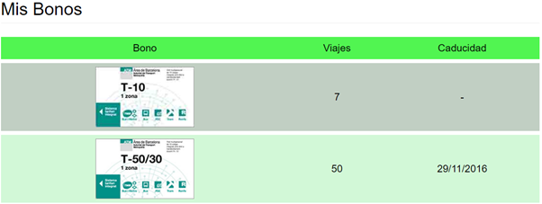
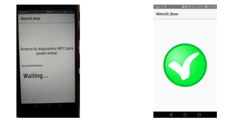

## Contents

* [1 ¿Que es MetroID?](#.C2.BFQue_es_MetroID.3F)
* [2 Objetivos](#Objetivos)
* [3 Herramientas y tecnologías](#Herramientas_y_tecnolog.C3.ADas)
  + [3.1 Hosting](#Hosting)
  + [3.2 Base de Datos](#Base_de_Datos)
  + [3.3 Lenguaje web: HTML5, Java, Bootstrap y CSS](#Lenguaje_web:_HTML5.2C_Java.2C_Bootstrap_y_CSS)
  + [3.4 Netbeans](#Netbeans)
  + [3.5 Android Studio](#Android_Studio)
  + [3.6 NFC](#NFC)
  + [3.7 Servicios web RESTful](#Servicios_web_RESTful)
* [4 Pagina web](#Pagina_web)
  + [4.1 Menú](#Men.C3.BA)
  + [4.2 Home](#Home)
  + [4.3 About](#About)
  + [4.4 Bonos](#Bonos)
  + [4.5 Perfil](#Perfil)
    - [4.5.1 Mis bonos](#Mis_bonos)
    - [4.5.2 Historial](#Historial)
  + [4.6 Nuevo Usuario](#Nuevo_Usuario)
  + [4.7 ContactUs](#ContactUs)
* [5 Servidor](#Servidor)
  + [5.1 Base de Datos](#Base_de_Datos_2)
    - [5.1.1 Tabla bonosDisponibles](#Tabla_bonosDisponibles)
    - [5.1.2 Tabla bonosUsuario](#Tabla_bonosUsuario)
    - [5.1.3 Tabla historial](#Tabla_historial)
  + [5.2 Servidor Web](#Servidor_Web)
  + [5.3 Servicios web RESTfull](#Servicios_web_RESTfull)
  + [5.4 Seguridad](#Seguridad)
* [6 Aplicación Android cliente](#Aplicaci.C3.B3n_Android_cliente)
  + [6.1 Login](#Login)
  + [6.2 Elegir tarjeta de Pago](#Elegir_tarjeta_de_Pago)
  + [6.3 Consultar Bonos disponibles](#Consultar_Bonos_disponibles)
  + [6.4 Pagar](#Pagar)
* [7 Aplicación Android base](#Aplicaci.C3.B3n_Android_base)
* [8 Evaluación, limitaciones y planes de futuro](#Evaluaci.C3.B3n.2C_limitaciones_y_planes_de_futuro)

## ¿Que es MetroID?[[edit](/pti/index.php?title=Categor%C3%ADa:MetroID&veaction=edit&section=1 "Edit section: ¿Que es MetroID?") | [edit source](/pti/index.php?title=Categor%C3%ADa:MetroID&action=edit&section=1 "Edit section: ¿Que es MetroID?")]

Lo que nosotros proponemos es eliminar las tarjetas de cartón que se venden actualmente en el transporte público de Barcelona. En vez de esto, el usuario podrá acceder al transporte público con su teléfono móvil de forma fácil y rápida gracias a una aplicación Android que hará uso del chip NFC del dispositivo móvil.

## Objetivos[[edit](/pti/index.php?title=Categor%C3%ADa:MetroID&veaction=edit&section=2 "Edit section: Objetivos") | [edit source](/pti/index.php?title=Categor%C3%ADa:MetroID&action=edit&section=2 "Edit section: Objetivos")]

El objetivo principal de este proyecto es eliminar las rudimentarias tarjetas de cartón que se venden actualmente para acceder al transporte público de Barcelona. Dichas tarjetas serán sustituidas por una aplicación para el sistema operativo móvil Android, con la que los usuarios podrán acceder al metro pagando con el bono que el usuario seleccione y consultar los bonos disponibles que el usuario haya comprado. Todo este sistema se complementa con una página web en donde se podrán realizar más operaciones. Como puede ser la compra de bonos, consultar el historial de viajes y comprobar el estado de los bonos que el usuario haya comprado.
Gracias al uso de este sistema de pago conseguimos dos objetivos adicionales de gran importancia. El primero de ellos es agilizar la entrada de los usuarios al transporte público haciendo que el procedimiento de pago sea mucho más rápido ya que simplemente con acercar el móvil al lector se nos permitirá (o no) la entrada. El segundo y último objetivo es la reducción de la tala de árboles ya que, con este sistema, se elimina la necesidad de disponer de una tarjeta física de cartón como se hacía hasta ahora.

Para conseguir los objetivos explicados anteriormente también debemos conseguir una serie de objetivos técnicos, los cuales describimos a continuación:

* Conseguir que la aplicación Android base y cliente sean capaces de comunicarse mediante la tecnología NFC.
* Conseguir que la aplicación Android base sea capaz de lanzar peticiones a los servicios alojados en el servidor.
* Crear una página web usable y agradable para que los usuarios puedan interactuar con nuestro sistema.
* Conseguir la persistencia de los datos haciendo uso de una base de datos donde se almacenará toda la información relacionada con los usuarios y los bonos.
* Por último, queremos que nuestra plataforma sea lo más segura posible.

A continuación podemos ver una imagen donde se muestra el esquema general que deberá tener nuestra plataforma al acabar el desarrollo del proyecto

## Herramientas y tecnologías[[edit](/pti/index.php?title=Categor%C3%ADa:MetroID&veaction=edit&section=3 "Edit section: Herramientas y tecnologías") | [edit source](/pti/index.php?title=Categor%C3%ADa:MetroID&action=edit&section=3 "Edit section: Herramientas y tecnologías")]

### Hosting[[edit](/pti/index.php?title=Categor%C3%ADa:MetroID&veaction=edit&section=4 "Edit section: Hosting") | [edit source](/pti/index.php?title=Categor%C3%ADa:MetroID&action=edit&section=4 "Edit section: Hosting")]

Cuando hablamos de hosting nos referimos al Servidor donde estarán alojadas las diferentes aplicaciones necesarias para que el sistema de pago funcione. Elegir un buen hosting es crucial para el correcto funcionamiento de nuestro sistema ya que es donde se procesaran las peticiones de los usuarios cuando quieren pagar el metro, así como otras funciones críticas como puede ser la persistencia de los datos de dichos usuarios.
En nuestro caso, al tratarse de un entorno de pruebas y no ser un proyecto real, nos hemos decantado por los servicios que ofrece la UPC. Dicho servicio nos proporciona una máquina virtual con el sistema operativo Ubuntu, 1 GB de RAM y 10 GB de espacio de almacenamiento.

### Base de Datos[[edit](/pti/index.php?title=Categor%C3%ADa:MetroID&veaction=edit&section=5 "Edit section: Base de Datos") | [edit source](/pti/index.php?title=Categor%C3%ADa:MetroID&action=edit&section=5 "Edit section: Base de Datos")]

Para conseguir que todos los datos relacionados con los usuarios, como puede ser su nombre, sus tarjetas, id, etc…, se queden almacenados de forma persistente necesitamos una base de datos donde almacenarlos. La plataforma elegida ha sido la base de datos mySQL de Oracle, ya que es un producto muy conocido. Además, cumple perfectamente con nuestras necesidades y cuenta con mucho soporte en la red por parte de los usuarios finales, lo que nos agilizará el trabajo en el caso que surja algún imprevisto en lo referente a la configuración y puesta en marcha de mySQL.

### Lenguaje web: HTML5, Java, Bootstrap y CSS[[edit](/pti/index.php?title=Categor%C3%ADa:MetroID&veaction=edit&section=6 "Edit section: Lenguaje web: HTML5, Java, Bootstrap y CSS") | [edit source](/pti/index.php?title=Categor%C3%ADa:MetroID&action=edit&section=6 "Edit section: Lenguaje web: HTML5, Java, Bootstrap y CSS")]

HTML5 es un lenguaje que utiliza etiquetas para definir la estructura de la página web. Para el diseño de la interfaz de la página web hemos utilizado Bootstrap, un framework que permite crear interfaces web con CSS y JavaScript. Su particularidad es la de adaptar la interfaz del sitio web al tamaño del dispositivo en que se visualice.
Para la parte del servidor hemos utilizado Java ya que es un lenguaje conocido y sencillo de programar. Hemos escogido Java ya que nos permite tratar con bases de datos de una forma sencilla y nuestra página web consulta mucho la base de datos.
La página web contiene principalmente JSPs y Servlets. Las JSPs nos permiten crear páginas web dinámicas basadas en HTML utilizando Java. Tener una página JSP es equivalente a tener un Servlet ya que se compila como si fuese una clase Java.

### Netbeans[[edit](/pti/index.php?title=Categor%C3%ADa:MetroID&veaction=edit&section=7 "Edit section: Netbeans") | [edit source](/pti/index.php?title=Categor%C3%ADa:MetroID&action=edit&section=7 "Edit section: Netbeans")]

Para la programación de la página web hemos utilizado Netbeans, un entorno de desarrollo integrado libre y hecho principalmente para el lenguaje de programación Java. Además, se trata de un producto libre y gratuito sin restricciones de uso. Los dos motivos principales para escoger Netbeans son:

* Conexiones a bases de datos remotas: desde el propio Netbeans podemos conectarnos a distintos sistemas gestores de bases de datos. De esta forma podemos ver las tablas y realizar consultas y modificaciones desde el propio IDE.
* Se integra con diversos servidores de aplicaciones, de tal manera que podemos gestionarlos desde el propio IDE.

### Android Studio[[edit](/pti/index.php?title=Categor%C3%ADa:MetroID&veaction=edit&section=8 "Edit section: Android Studio") | [edit source](/pti/index.php?title=Categor%C3%ADa:MetroID&action=edit&section=8 "Edit section: Android Studio")]

Para el desarrollo de las aplicaciones Android tanto base como cliente hemos utilizado Android Studio. Este es el IDE (Entorno de Desarrollo Integrado), es decir, el software que nos proporciona Android para desarrollar sus aplicaciones. El primer paso al utilizar Android Studio es elegir en qué API (Interfaz de Programación de Aplicaciones) trabajarás, ya que la API decidirá qué dispositivos móviles serán compatibles con nuestra aplicación. En ambas aplicaciones hemos elegido la API 23, ya que hoy en día es la API que más dispositivos móviles utilizan y por lo tanto es con la que más móviles podrían utilizar nuestras aplicaciones por la compatibilidad. Además, Android Studio nos ofrece muchas librerías por defecto con las que trabajar, las cuales hemos utilizado en nuestras aplicaciones. Por ejemplo, para incluir el protocolo HTTP o utilizar NFC.

### NFC[[edit](/pti/index.php?title=Categor%C3%ADa:MetroID&veaction=edit&section=9 "Edit section: NFC") | [edit source](/pti/index.php?title=Categor%C3%ADa:MetroID&action=edit&section=9 "Edit section: NFC")]

La tecnología NFC (Near Field Communication) es una tecnología de comunicación inalámbrica de corto alcance y alta frecuencia que permite el intercambio de datos entre dispositivos. Como hemos comentado en el apartado anterior, Android Studio nos proporciona librerías que podemos incluir para poder utilizar NFC en nuestras aplicaciones. En nuestro caso, hemos implementado esta tecnología con el fin de comunicar la aplicación del cliente con la base para así poder enviarle el nombre de usuario y la tarjeta con la que este quiere efectuar el pago. Seguidamente, la aplicación base recibirá esa información y hará las peticiones pertinentes al servidor para dejar pasar (o no) al usuario.

### Servicios web RESTful[[edit](/pti/index.php?title=Categor%C3%ADa:MetroID&veaction=edit&section=10 "Edit section: Servicios web RESTful") | [edit source](/pti/index.php?title=Categor%C3%ADa:MetroID&action=edit&section=10 "Edit section: Servicios web RESTful")]

Como se ha dicho anteriormente, nuestro sistema contará con dos aplicaciones Android que realizarán una serie de funciones. Por lo tanto, necesitamos alguna manera que estas dos aplicaciones puedan realizar peticiones al servidor central. Una manera fácil de conseguirlo es con un servicio Web implementando la arquitectura RESTful que nos ayudará a diseñar los servicios necesarios de una manera organizada y eficiente.
Un servicio web RESTful es simplemente una clase java colgada en un servidor web y que procesa las peticiones que se le realizan de forma remota. Estas petición se envían a través del protocolo HTTP y se usan peticiones GET o POST en función del tipo de operación que queramos realizar (consulta o modificación respectivamente).

## Pagina web[[edit](/pti/index.php?title=Categor%C3%ADa:MetroID&veaction=edit&section=11 "Edit section: Pagina web") | [edit source](/pti/index.php?title=Categor%C3%ADa:MetroID&action=edit&section=11 "Edit section: Pagina web")]

### Menú[[edit](/pti/index.php?title=Categor%C3%ADa:MetroID&veaction=edit&section=12 "Edit section: Menú") | [edit source](/pti/index.php?title=Categor%C3%ADa:MetroID&action=edit&section=12 "Edit section: Menú")]

El menú de la página web consta de una barra que se muestra en todo momento al usuario junto con una imagen en la cabecera. Si el usuario no ha iniciado sesión la barra tiene 3 pestañas: el home de la página, el about y una pestaña para que los usuarios contacten con nosotros.
Además, en el menú hay un formulario para iniciar sesión y un botón “Registrarse” para ir al formulario de registro de un nuevo usuario.

Por otro lado, si el usuario ya ha iniciado sesión además de las 3 pestañas anteriores se muestra la opción de bonos para realizar la compra de un bono y un menú Perfil de tipo dropdown. Este menú tiene las opciones Mis Bonos para que el usuario sepa que bonos tiene comprados e historial para ver los accesos al metro que ha realizado.
La opción de LogIn y de Registrarse ya no son necesarias, dado que hemos iniciado sesión, por lo tanto se muestra un mensaje “Hola, nombre” y un botón “Logout” para cerrar sesión.

Por último, hay una sección con el mapa del metro de Barcelona. Si seleccionamos el botón “Ver imagen” se nos abre una pestaña en el navegador con el mapa del metro para que podamos ampliarlo a través del navegador.

### Home[[edit](/pti/index.php?title=Categor%C3%ADa:MetroID&veaction=edit&section=13 "Edit section: Home") | [edit source](/pti/index.php?title=Categor%C3%ADa:MetroID&action=edit&section=13 "Edit section: Home")]

El home de la página se puede dividir en tres secciones. La primera es el apartado de novedades donde se pueden poner noticias. Cada noticia consta de una imagen, un título y una pequeña descripción.

La segunda sección permite poner alertas para el estado del servicio. Por ejemplo, si alguna línea de metro o bus no funciona correctamente.

Por último, hay una sección con el mapa del metro de Barcelona. Si seleccionamos el botón “Ver imagen” se nos abre una pestaña en el navegador con el mapa del metro para que podamos ampliarlo a través del navegador.

### About[[edit](/pti/index.php?title=Categor%C3%ADa:MetroID&veaction=edit&section=14 "Edit section: About") | [edit source](/pti/index.php?title=Categor%C3%ADa:MetroID&action=edit&section=14 "Edit section: About")]

La página de about expone la idea de MetroID y se identifican los tres componentes del grupo.

### Bonos[[edit](/pti/index.php?title=Categor%C3%ADa:MetroID&veaction=edit&section=15 "Edit section: Bonos") | [edit source](/pti/index.php?title=Categor%C3%ADa:MetroID&action=edit&section=15 "Edit section: Bonos")]

Esta opción permite al usuario comprar bonos. Hay 6 bonos disponibles y para cada uno de ellos se muestra una imagen, su precio y un botón para comprar.

Si el usuario quiere comprar un bono solo tiene que pulsar el botón comprar. Si la compra se ha realizado correctamente el sistema le mostrará un mensaje como el siguiente:

### Perfil[[edit](/pti/index.php?title=Categor%C3%ADa:MetroID&veaction=edit&section=16 "Edit section: Perfil") | [edit source](/pti/index.php?title=Categor%C3%ADa:MetroID&action=edit&section=16 "Edit section: Perfil")]

El perfil de usuario tiene dos opciones: mis bonos y historial.

#### Mis bonos[[edit](/pti/index.php?title=Categor%C3%ADa:MetroID&veaction=edit&section=17 "Edit section: Mis bonos") | [edit source](/pti/index.php?title=Categor%C3%ADa:MetroID&action=edit&section=17 "Edit section: Mis bonos")]

Esta opción le muestra una lista al usuario de todos los bonos que tiene comprados. Para cada uno muestra una imagen del bono, los viajes disponibles y la fecha de caducidad.

#### Historial[[edit](/pti/index.php?title=Categor%C3%ADa:MetroID&veaction=edit&section=18 "Edit section: Historial") | [edit source](/pti/index.php?title=Categor%C3%ADa:MetroID&action=edit&section=18 "Edit section: Historial")]

Esta opción le muestra al usuario una lista con los accesos al metro con sus bonos. Para cada movimiento le muestra el nombre del bono con el que se ha accedido, la estación de metro, el día y la hora

### Nuevo Usuario[[edit](/pti/index.php?title=Categor%C3%ADa:MetroID&veaction=edit&section=19 "Edit section: Nuevo Usuario") | [edit source](/pti/index.php?title=Categor%C3%ADa:MetroID&action=edit&section=19 "Edit section: Nuevo Usuario")]

El formulario de registro de un nuevo usuario tiene los campos usuario, password y repita el password. Si el usuario se registra correctamente se le redirigirá al home de la página web son su sesión ya iniciada.

### ContactUs[[edit](/pti/index.php?title=Categor%C3%ADa:MetroID&veaction=edit&section=20 "Edit section: ContactUs") | [edit source](/pti/index.php?title=Categor%C3%ADa:MetroID&action=edit&section=20 "Edit section: ContactUs")]

Para que los usuarios puedan enviarnos sugerencias, dudas o quejas hemos habilitado la sección “ContactUs”.

## Servidor[[edit](/pti/index.php?title=Categor%C3%ADa:MetroID&veaction=edit&section=21 "Edit section: Servidor") | [edit source](/pti/index.php?title=Categor%C3%ADa:MetroID&action=edit&section=21 "Edit section: Servidor")]

### Base de Datos[[edit](/pti/index.php?title=Categor%C3%ADa:MetroID&veaction=edit&section=22 "Edit section: Base de Datos") | [edit source](/pti/index.php?title=Categor%C3%ADa:MetroID&action=edit&section=22 "Edit section: Base de Datos")]

#### Tabla bonosDisponibles[[edit](/pti/index.php?title=Categor%C3%ADa:MetroID&veaction=edit&section=23 "Edit section: Tabla bonosDisponibles") | [edit source](/pti/index.php?title=Categor%C3%ADa:MetroID&action=edit&section=23 "Edit section: Tabla bonosDisponibles")]

Contiene información de los bonos bonos adquiridos y no agotados de los usuarios. Los campos son los siguientes:

* nom\_usu (clave primaria y foranea): Nombre del usuario.
* nom\_bono (clave primaria y foranea): Nombre del bono.
* viajes: Viajes que le quedan al bono.
* inicio: Inicio del periodo de validez.
* fin: fin del periodo de validez.

#### Tabla bonosUsuario[[edit](/pti/index.php?title=Categor%C3%ADa:MetroID&veaction=edit&section=24 "Edit section: Tabla bonosUsuario") | [edit source](/pti/index.php?title=Categor%C3%ADa:MetroID&action=edit&section=24 "Edit section: Tabla bonosUsuario")]

bonosUsuario → Contiene información de los bonos bonos adquiridos y no agotados de los usuarios. Los campos son los siguientes:

* nom\_usu (clave primaria y foranea): Nombre del usuario.
* nom\_bono (clave primaria y foranea): Nombre del bono.
* viajes: Viajes que le quedan al bono.
* inicio: Inicio del periodo de validez.
* fin: fin del periodo de validez.

#### Tabla historial[[edit](/pti/index.php?title=Categor%C3%ADa:MetroID&veaction=edit&section=25 "Edit section: Tabla historial") | [edit source](/pti/index.php?title=Categor%C3%ADa:MetroID&action=edit&section=25 "Edit section: Tabla historial")]

Contiene información de todos lo viajes efectuados por todos los usuarios. Los campos son los siguientes:

* id (clave primaria): Identificación del viaje.
* nom\_usu: Nombre del usuario que ha realizado el viaje.
* estación: Estación en la que se ha pagado la entrada.
* bono: Nombre del bono con el que se ha pagado.
* dia: Dia en el que se ha pagado.
* hora: Hora en la que se ha pagado.

### Servidor Web[[edit](/pti/index.php?title=Categor%C3%ADa:MetroID&veaction=edit&section=26 "Edit section: Servidor Web") | [edit source](/pti/index.php?title=Categor%C3%ADa:MetroID&action=edit&section=26 "Edit section: Servidor Web")]

Para poder “publicar” nuestra página web y “colgar” nuestros servicios necesitamos un servidor web que nos permita hacer de puente entre estos dos elementos y los usuarios finales. El servidor web elegido ha sido un Apache Tomcat, que se trata de un producto de software libre para aplicaciones Java.
El motivo principal para elegir esta plataforma ha sido su reputación y la gran cantidad de ayuda que podemos encontrar en internet, aparte de cumplir perfectamente con nuestras necesidades.

### Servicios web RESTfull[[edit](/pti/index.php?title=Categor%C3%ADa:MetroID&veaction=edit&section=27 "Edit section: Servicios web RESTfull") | [edit source](/pti/index.php?title=Categor%C3%ADa:MetroID&action=edit&section=27 "Edit section: Servicios web RESTfull")]

Para que las aplicaciones Android puedan realizar sus funciones de forma correcta se han implementado estos servicios:

* **Pagar:** Este servicio recibirá como parámetros el nombre del usuario y la tarjeta con la que este quiere pagar. Se comprobará que tanto el usuario como la tarjeta sean válidos y efectuará las actualizaciones de las tablas que sean pertinentes. En caso de pasar el proceso satisfactoriamente se responderá con un “OK”, en caso contrario se informará del error que se ha producido.
* **Consultar bonos:** Este servicio recibirá como parámetros el nombre del usuario y, si existe, se responderá con un listado con todos los bonos que tiene el usuario y la información referente a estos. Si el usuario no existe u ocurre cualquier otro error se responderá indicando lo que ha sucedido.
* **Login:**: Este servicio recibirá como parámetros el nombre del usuario y su contraseña. Su función será hacer las comprobaciones necesarias para decidir si se le permite al usuario entrar en la aplicación y se responderá con un mensaje indicando “OK” o el motivo de la denegación.

### Seguridad[[edit](/pti/index.php?title=Categor%C3%ADa:MetroID&veaction=edit&section=28 "Edit section: Seguridad") | [edit source](/pti/index.php?title=Categor%C3%ADa:MetroID&action=edit&section=28 "Edit section: Seguridad")]

La seguridad es un punto crítico para cualquier sistema que almacena información sensible y quiera ser un sistema fiable y de confianza. En nuestro caso esto también se cumple, por este motivo hemos tenido que incorporar una capa extra de seguridad en nuestro sistema. De esta manera conseguimos que las conexiones sean seguras y sea más difícil robar información.
Por lo tanto, para que tanto la página web como los servicios web sean seguro hemos incorporado SSL (Secure Sockets Layer) al servidor. Que se trata de un protocolo criptográfico que proporciona comunicaciones seguras a través de internet. Así conseguimos conectarnos mediante el protocolo HTTPS y que se encripten todos los mensajes que viajan entre el servidor y el cliente final.

## Aplicación Android cliente[[edit](/pti/index.php?title=Categor%C3%ADa:MetroID&veaction=edit&section=29 "Edit section: Aplicación Android cliente") | [edit source](/pti/index.php?title=Categor%C3%ADa:MetroID&action=edit&section=29 "Edit section: Aplicación Android cliente")]

La aplicación cliente tiene que tener siempre acceso a internet y el NFC activado para poder hacer utilizar correctamente nuestros servicios. A continuación vamos a ver en detalle las diferentes funcionalidades y pantallas que tiene la aplicación del cliente, como son el Login, elegir tarjeta con la que quieres realizar el pago, consultar los bonos disponibles y pagar.

### Login[[edit](/pti/index.php?title=Categor%C3%ADa:MetroID&veaction=edit&section=30 "Edit section: Login") | [edit source](/pti/index.php?title=Categor%C3%ADa:MetroID&action=edit&section=30 "Edit section: Login")]

Esta será la primera pantalla de nuestra aplicación cliente, donde el usuario introduce su nombre y contraseña y si son correctos te deja entrar, sinó te muestra un mensaje de error. Nuestra aplicación no tiene la opción de registrarse por lo que siempre previamente, el usuario para entrar tendrá que haberse registrado a través de la página web.

### Elegir tarjeta de Pago[[edit](/pti/index.php?title=Categor%C3%ADa:MetroID&veaction=edit&section=31 "Edit section: Elegir tarjeta de Pago") | [edit source](/pti/index.php?title=Categor%C3%ADa:MetroID&action=edit&section=31 "Edit section: Elegir tarjeta de Pago")]

Para realizar el pago previamente el usuario deve seleccionar la tarjeta con la que pagar. El usuario tiene que hacer clic sobre el icono de interrogante e irá a la pantalla del medio, donde allí le aparecen todas las tarjetas que puede elegir para pagar y que ese usuario tenga disponible claro, ya que si no tiene ninguna T-10 comprada y con viajes disponibles no le aparecerá la opción de elegir esa tarjeta. Una vez el usuario elige tarjeta haciendo clic sobre la tarjeta que quiera vuelve a la página anterior pero ahora aparece el icono de la tarjeta que haya elegido, en nuestro caso la tarjeta T-10.

### Consultar Bonos disponibles[[edit](/pti/index.php?title=Categor%C3%ADa:MetroID&veaction=edit&section=32 "Edit section: Consultar Bonos disponibles") | [edit source](/pti/index.php?title=Categor%C3%ADa:MetroID&action=edit&section=32 "Edit section: Consultar Bonos disponibles")]

Otra funcionalidad disponible en la aplicación del cliente es la de consultar los bonos disponibles que tiene en ese momento. Puede acceder desde la página principal haciendo clic en “CONSULTA BONOS” como vemos en la imagen.

### Pagar[[edit](/pti/index.php?title=Categor%C3%ADa:MetroID&veaction=edit&section=33 "Edit section: Pagar") | [edit source](/pti/index.php?title=Categor%C3%ADa:MetroID&action=edit&section=33 "Edit section: Pagar")]

Si en la pantalla principal ya hemos seleccionado la tarjeta veremos el icono con el tipo de tarjeta que tengamos seleccionado para pagar y si hacemos clic en “Activar Pago” nos redirecciona a la pantalla de la derecha donde podemos ver la información que se le enviará a la aplicación base por NFC, en este caso el usuario: Prueba, y el tipo de tarjeta: T-10. Ahora ya podemos acercar el móvil a la base para realizar el pago y que se envíe la información a través del NFC.

## Aplicación Android base[[edit](/pti/index.php?title=Categor%C3%ADa:MetroID&veaction=edit&section=34 "Edit section: Aplicación Android base") | [edit source](/pti/index.php?title=Categor%C3%ADa:MetroID&action=edit&section=34 "Edit section: Aplicación Android base")]

La aplicación base tiene que tener acceso a internet y tener activado el NFC. Esta aplicación que hace de base solo tendrá una funcionalidad, que será recibir los datos por NFC del dispositivo cliente y hacer la petición al servidor sobre si el cliente le dejamos pasar o le rechazamos la entrada, y le dará el OK o FAIL. En el caso que le enviemos un usuario con tarjeta correcto podremos ver este caso:

## Evaluación, limitaciones y planes de futuro[[edit](/pti/index.php?title=Categor%C3%ADa:MetroID&veaction=edit&section=35 "Edit section: Evaluación, limitaciones y planes de futuro") | [edit source](/pti/index.php?title=Categor%C3%ADa:MetroID&action=edit&section=35 "Edit section: Evaluación, limitaciones y planes de futuro")]

Este proyecto brinda una oportunidad más a nuestra sociedad de avanzar junto a las tecnologías que están surgiendo hoy en día. Creemos que el pago con NFC en el transporte público de Barcelona se hará realidad tarde o temprano como se está viendo en otras grandes ciudades. Este proyecto tiene un sinfín de posibilidades de tener éxito, aunque creemos que actualmente tiene algunas limitaciones para su expansión futura:

* El host donde se alojan los servicios no es lo suficientemente potente como para soportar peticiones masivas ya que se trata de un host gratuito que nos ha cedido la universidad. Debido a esto en un futuro deberíamos plantearnos la contratación de un host que se amolde a nuestras necesidades.
* La aplicación cliente no dispone de todas las opciones de la página web. Sería conveniente y práctico para los usuarios poder comprar bonos a través del teléfono móvil. Por este motivo uno de los planes de futuro es añadir funcionalidades a la aplicación Android cliente.
* Llegado el momento la base de datos actual podría no ser todo lo eficiente que queremos debido a la gran cantidad de datos. Se podría estudiar el uso de otro tipo de bases de datos como las no relacionales para aumentar el rendimiento.
* Actualmente no ciframos la información entre aplicaciones Android cliente y base. Podría pasar que alguien robara la información de un usuario al momento de hacer el pago, aunque es poco probable que esto pase dada la proximidad que se necesita para ello. Si esto pasara, el ladrón podría pagar con una tarjeta o aplicación NFC copiada con los datos de otro usuario. Por este motivo, se debería estudiar algún tipo de encriptación de la información transferida por NFC para garantizar la privacidad de los datos.

Para concluir, creemos que este sistema de pago se puede adaptar fácilmente a muchas otras ciudades que tengan transporte público además de la ciudad de Barcelona.