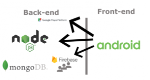
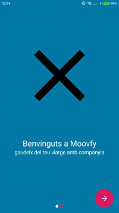
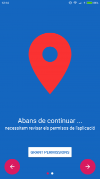
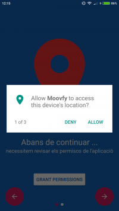
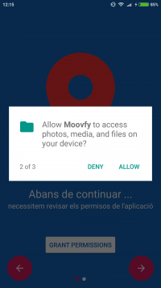
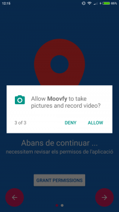
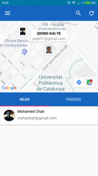
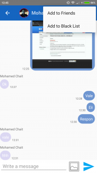
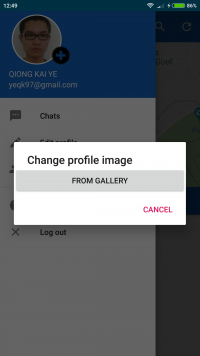
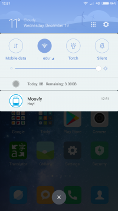

Logo Moovfy.

## Contents

* [1 Introducción](#Introducci.C3.B3n)
  + [1.1 ¿Qué es Moofvy?](#.C2.BFQu.C3.A9_es_Moofvy.3F)
* [2 Tecnologies utilitzades](#Tecnologies_utilitzades)
* [3 Captures de pantalla](#Captures_de_pantalla)
* [4 Memòria](#Mem.C3.B2ria)

# Introducción[[edit](/pti/index.php?title=Categor%C3%ADa:Moovfy&veaction=edit&section=1 "Edit section: Introducción") | [edit source](/pti/index.php?title=Categor%C3%ADa:Moovfy&action=edit&section=1 "Edit section: Introducción")]

## ¿Qué es Moofvy?[[edit](/pti/index.php?title=Categor%C3%ADa:Moovfy&veaction=edit&section=2 "Edit section: ¿Qué es Moofvy?") | [edit source](/pti/index.php?title=Categor%C3%ADa:Moovfy&action=edit&section=2 "Edit section: ¿Qué es Moofvy?")]

Moovfy pretén ser una xarxa social per interactuar amb gent a bord del transport públic utilitzant la geolocalització del smartphone. Aquesta xarxa social consta de 2 modalitats, la primera ens permetrà conèixer la gent a prop en un radi determinat i poder xatejar amb ella. I la segona permetrà conèixer si un dels nostres amics es troba en el mateix transport que nosaltres.

# Tecnologies utilitzades[[edit](/pti/index.php?title=Categor%C3%ADa:Moovfy&veaction=edit&section=3 "Edit section: Tecnologies utilitzades") | [edit source](/pti/index.php?title=Categor%C3%ADa:Moovfy&action=edit&section=3 "Edit section: Tecnologies utilitzades")]

Logo Moovfy.

|  |  |
| --- | --- |
|  | JavaScript és un llenguatge de programació interpretat, dialecte de l'estàndard ECMAScript. es defineix com orientat a objectes, basat en prototips, imperatiu i dinàmic. |
|  | Node es tracta d'un framework de JavaScript amb arquitectura orientada a esdeveniments, asíncron i basat en el motor V8 de Google. |
|  | Java és un llenguatge de programació de propòsit general, concurrent, orientat a objectes que va ser dissenyat específicament per tenir tan poques dependències d'implementació com fos possible. |
|  | JSON(l'abreviatura de JavaScript Object Notation) és un estàndard obert basat en text dissenyat per a l'intercanvi de dades llegible per humans. |
|  | Firebase és una plataforma per al desenvolupament d'aplicacions web i aplicacions móviles.Incluye serveis com l'autenticació d'usuaris, una base de dades en temps real i càrregues i descàrregues d'arxius. |
|  | MongoDB és un sistema de bases de dades no relacionals (NoSQL) orientat a documents, en lloc de guardar les dades en taules, els emmagatzema en BSON (similars als JSON). |

# Captures de pantalla[[edit](/pti/index.php?title=Categor%C3%ADa:Moovfy&veaction=edit&section=4 "Edit section: Captures de pantalla") | [edit source](/pti/index.php?title=Categor%C3%ADa:Moovfy&action=edit&section=4 "Edit section: Captures de pantalla")]

|  |  |  |  |  |
| --- | --- | --- | --- | --- |
|  Introducció-1. |  Introducció-2. |  Permissos. |  Permissos. |  Permissos. |
|  Login. |  Register. |  Pantalla principal. |  Menú principal. |  Xat. |
|  PopUp per modificar l'avatar. |  Lista de xats oberts. |  Pantalla per editar el perfil. |  Lista de bloquejats. |  Notificació. |

# Memòria[[edit](/pti/index.php?title=Categor%C3%ADa:Moovfy&veaction=edit&section=5 "Edit section: Memòria") | [edit source](/pti/index.php?title=Categor%C3%ADa:Moovfy&action=edit&section=5 "Edit section: Memòria")]

[Memòria del projecte](/pti/index.php?title=Special:Upload&wpDestFile=Memoria_moovfy.pdf "Memoria moovfy.pdf")