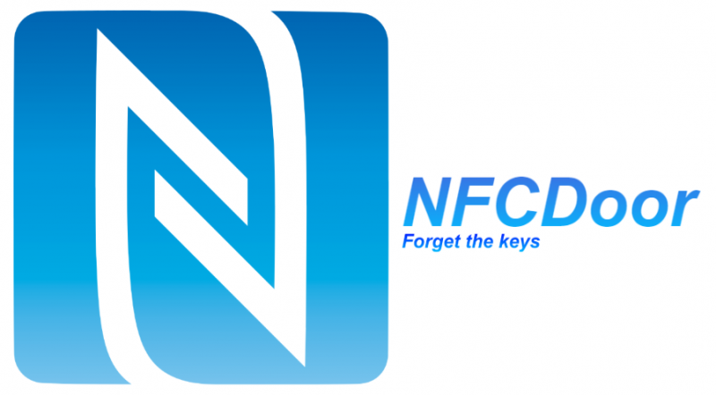
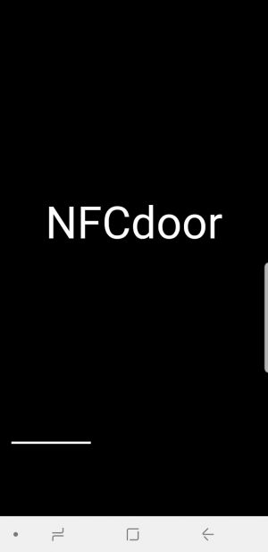
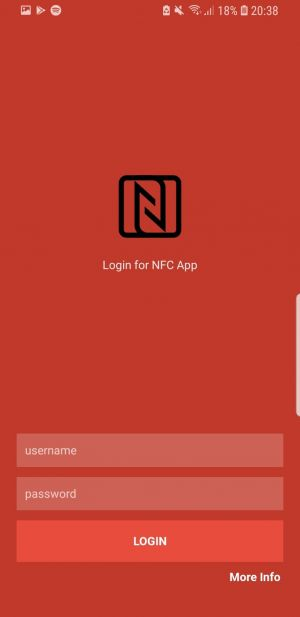
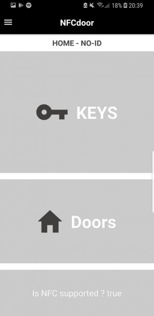
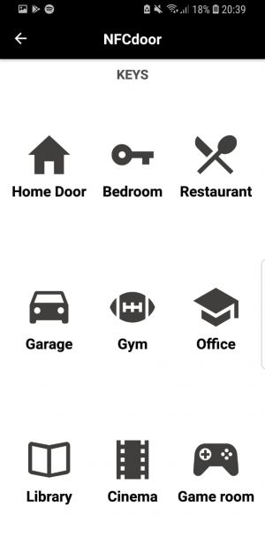
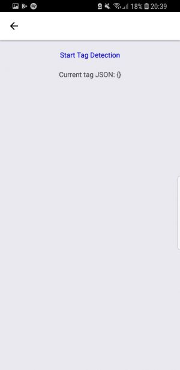

[](/pti/index.php/File:Nfcdoor.png)

Estructura del proyecto.

## Contents

* [1 Introducció](#Introducci.C3.B3)
* [2 Tecnologies](#Tecnologies)
  + [2.1 Hardware](#Hardware)
  + [2.2 Software](#Software)
* [3 Resultats](#Resultats)

# Introducció[[edit](/pti/index.php?title=Categor%C3%ADa:NFCdoor&veaction=edit&section=1 "Edit section: Introducció") | [edit source](/pti/index.php?title=Categor%C3%ADa:NFCdoor&action=edit&section=1 "Edit section: Introducció")]

El projecte consisteix en una nova manera de gestionar les portes del nostre dia a dia. La nostra intenció era poder oblidar-nos de tota targeta o clau per obrir les nostres portes ja que com més portes tenim més utensilis necessitem per obrir-les i aquest fet pot arribar a ser una molèstia per segons quina roba vestim o quins llocs anem ja que sempre són una cosa més a portar a sobre.

Es basa en una aplicació mòbil que mitjançant la tecnologia NFC és capaç d'obrir les portes que tingui disponible un determinat usuari, oblidant-nos així per sempre de les claus convencionals. És tan fàcil com sel·leccionar la porta que volem obrir i tot seguit apropar el nostre dispositiu al pany de la porta que disposarà d’un lector NFC que s’encarregarà de la resta.

# Tecnologies[[edit](/pti/index.php?title=Categor%C3%ADa:NFCdoor&veaction=edit&section=2 "Edit section: Tecnologies") | [edit source](/pti/index.php?title=Categor%C3%ADa:NFCdoor&action=edit&section=2 "Edit section: Tecnologies")]

## Hardware[[edit](/pti/index.php?title=Categor%C3%ADa:NFCdoor&veaction=edit&section=3 "Edit section: Hardware") | [edit source](/pti/index.php?title=Categor%C3%ADa:NFCdoor&action=edit&section=3 "Edit section: Hardware")]

La nostra infraestructura consta de simplement dos terminals smartphone i un ordinador. Inicialment volíem fer servir una Raspberry Pi 3 i un pany amb lector NFC però vam trobar complicacions greus i vam haver d'abstenir-nos del seu ús.

L'ordinador actua com a servidor i base de dades per a què l'usuari pugui gaudir del servei complet d'obertura de portes quan ho desitgi.

## Software[[edit](/pti/index.php?title=Categor%C3%ADa:NFCdoor&veaction=edit&section=4 "Edit section: Software") | [edit source](/pti/index.php?title=Categor%C3%ADa:NFCdoor&action=edit&section=4 "Edit section: Software")]

```
- MongoDB: Com a base de dades noSQL
- NodeJS: Com a servidor
- ReactNative: Framework en què l'aplicació ha estat disenyada
- Docker : Containers on hi ha el servidor i la BBDD

```

# Resultats[[edit](/pti/index.php?title=Categor%C3%ADa:NFCdoor&veaction=edit&section=5 "Edit section: Resultats") | [edit source](/pti/index.php?title=Categor%C3%ADa:NFCdoor&action=edit&section=5 "Edit section: Resultats")]

[](/pti/index.php/File:PortadaNFC.jpeg)

Splash

[](/pti/index.php/File:LoginNFC.jpeg)

Login

[](/pti/index.php/File:MenuNFC.jpeg)

Menu principal

[](/pti/index.php/File:KeysNFC.jpeg)

Keys

[](/pti/index.php/File:DoorsNFC.jpeg)

"Door" NFC reader